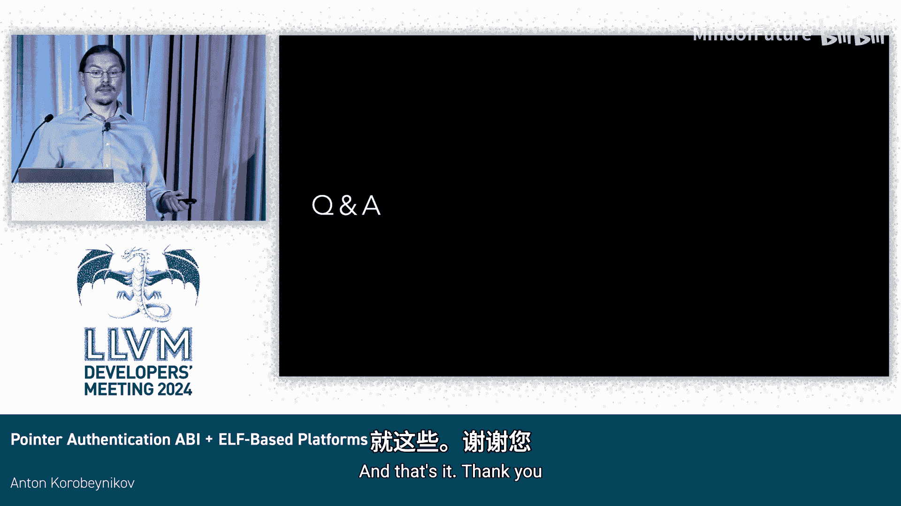

# 023：为你的 ELF 平台添加指针认证 ABI 支持

## 概述

在本节课中，我们将学习如何为基于 ELF 的平台添加指针认证 ABI 支持。我们将从理解指针认证的基本概念开始，探讨其工作原理、ABI 规范，并逐步介绍在 LLVM 中实现此功能所需的步骤和组件。

---

## 指针认证简介

指针认证是一种安全缓解技术。为了理解其作用，我们先来看看代码指针在程序中的常规流程。

通常，代码指针从只读内存中加载到寄存器或临时存储中。随后，指针可能被溢出到可读写内存，最终再被重新加载回寄存器，用于执行间接调用、间接跳转或在少数情况下进行数据访问。

现在，假设攻击者能够修改内存，即拥有内存写入权限。那么，攻击者就可以在可读写内存中替换指针值，从而导致调用链被破坏，最终执行恶意代码或从不适当的位置访问数据。

指针认证试图解决这个问题。其核心思想是，代码指针永远不会以明文形式存储在可读写内存中。相反，当指针位于寄存器中时，会为其附加一个类似密码学签名的值。我们假设攻击者无法直接修改寄存器中的内容。

之后，带有签名的指针被溢出到内存。当它被重新加载后，会执行一个特殊的验证步骤，以确认指针是否完好无损。如果验证失败，则可以推断指针被篡改，并采取必要的处理措施。

## 指针认证的工作原理

指针认证的实现依赖于几个关键组件。

首先，指令集依赖于一组不同的密钥。此外，还有一个额外的修饰符值，可用于根据某种上下文改变签名，稍后会详细说明。

指针认证指令会结合所有这些信息（指针、密钥、修饰符）来计算签名，并将其附加到指针本身。最终，我们得到一个带有附加签名的指针。

这之所以可行，是因为在许多平台（例如我们讨论的 AArch64）上，地址的高位通常未被使用。我们可以利用这些高位来存放签名。

指针认证是指令集扩展，最初出现在 Armv8.3-A 中，并在后续架构版本中有一些增补。原始版本大约包含 150 条指令，其中一些在 HINT 空间，这意味着它们是对旧指令的提示，可以以基本兼容的方式在旧款核心上使用；但大多数是全新的指令。

然而，我们现在通常不再直接使用汇编编程。因此，问题在于如何将这些底层指令与高级语言（如 C++）联系起来。

答案在于具体的实现细节。我们需要考虑代码是如何被编译和降级的。以 C++ 为例，我们需要考虑哪些代码指针值得保护。在我们的案例中，有三种不同的指针可能需要保护：虚函数表指针、指向虚函数的指针，以及 C++ 成员函数指针。

那么，我们如何知道该保护哪些指针，以及如何操作呢？

答案是 **指针认证 C++ ABI 规范**。该规范大约在五年前由 Ahmed 和 John 提出。它规定了哪些指针应该被保护。实际上，需要保护的间接跳转/调用和代码指针集合是相对有限的，通常包括：函数指针、switch 语句、符号导入（如 C++ 虚函数）、C++ 成员指针等。此外，还有一些特殊情况，例如执行静态对象构造的函数的指针、某些平台上的 `compute goto` 扩展、Objective-C 中的块扩展等。

ABI 规范还定义了签名方案，指定了应使用哪个特定密钥以及如何计算附加的修饰符。指令集允许使用最多 64 位的修饰符。

ABI 本质上提供了两种所谓的“多样性”方案。

一种方案是使用指针本身的存储地址作为修饰符。这当然会带来额外的复杂性，因为指针的复制肯定需要重新签名（即先验证，再重新签名）。这可能与许多场景不兼容，例如要求指针必须是“可平凡复制”的情况。

另一种方案是使用所谓的“语义多样性”，即利用指针类型或数据的语义作为修饰符。例如，我们可以为虚函数、C++ 成员函数指针和普通 C 风格函数指针使用不同的修饰符。这些修饰符可以源自不同的源头，从而将签名划分到不同的“命名空间”中，使得一个命名空间的指针无法被替换为另一个命名空间的指针。

另一个优点是，地址的高 16 位通常是保留的，可用于内存标记扩展或其他用途。从我们的角度来看，这意味着我们甚至可以结合地址多样性和语义多样性。我们可以将修饰符的高 16 位用于语义信息，从而尝试同时利用两种多样性。

## Arm 平台的现状

如前所述，直到最近，指针认证 C++ ABI 仅在 Apple 平台及其下游的 Clang 分支中可用。

首先，存在一份针对 Arm 平台的指针认证 ABI 规范，由 Arm 公司开发。该规范目前处于 Alpha 状态，意味着可能会发生变化，但预计不会有重大改动。该规范定义了一组 Arm 特定的重定位和重定位操作，并规定了如何标记 ELF 对象文件以确保不混合不兼容的内容。此外，它还规定了一些平台决策，例如是否对全局偏移表（GOT）和过程链接表（PLT）进行签名。

## LLVM 19 中的进展

在 LLVM 19 中，我们取得了以下进展：

首先，大部分必需的前端补丁已从 Apple 下游分支移植过来。感谢所有为此做出贡献的人。

同时，必需的代码生成支持也从 Apple 分支移植过来。我们为 LLD 提供了特定的指针认证代码生成支持，并对 Linux 内核和对象文件支持进行了修改。

我们还为 AArch64 Linux 添加了一个实验性的测试 ABI。简而言之，我们尝试了许多其他功能，它们在与指针认证一起启用时都能正常工作。

需要说明的是，我们有一个名为 `pcs-test` 的测试 ABI。之所以称为“测试”ABI，是因为我们目前无权为 Linux 或其他 ELF 平台正式定义指针认证 ABI。这个测试 ABI 主要遵循 Arm 64e（即 Apple 平台）的签名方案。可以通过 `-mabi=pcs-test` 开关和目标三元组中的环境字段来启用它，这与 Arm 上处理 `-mfloat-abi=hard` 的方式非常相似。

此外，我们添加了一个所谓的“测试”供应商以确保 ELF 标记。同样，我们无权定义新的供应商。我们没有编码版本号，而是编码了整个签名方案的位置。这样，在测试过程中，如果有任何 ABI 不匹配，就能更容易地发现差异。

当然，使用指针认证需要配套的支持指针认证的标准库。

目前还存在一些已知问题：少数边界情况仍然不能完全正常工作，通常围绕 `noexcept` 相关的问题。另外，对于 `compute goto` 中一些不支持的情况，我们缺少诊断信息。不过，代码会直接崩溃，这至少让我们知道出了问题。

此外，在混合使用弱指针时，安全性可能并不完美，跨异常边界时可能会包含一些侧信道漏洞。

如果你想为你的平台启用指针认证支持，目前这个过程仍然比较手动，我们还没有像 sanitizer 那样提供方便的钩子。

LLVM 19 版本仍然缺少一些内容：有几项关于 `compute goto` 和 TLS 支持的拉取请求正在审核中；还有一份关于特殊 `ptrauth` 限定符的开放 RFC，如果你想手动使用指针认证的指针，这个限定符会让事情变得容易得多。

在优化和松弛方面还有很多工作可以做。Apple 下游分支中存在一些补丁，应该可以移植到 LLVM 主线。代码也需要一些重构和清理，因为路径功能存在一些差异。此外，我们需要确保所有指针认证相关的安全功能能很好地协同工作。当然，文档也仍然缺失。

## 如何为新平台添加指针认证支持

如果你想为新平台添加指针认证支持，应该怎么做？

首先，最重要的是要认识到指针认证是一个 ABI。这意味着你不能安全地混合使用不同 ABI 的代码。

如果我们尝试界定所有情况，指针认证可以作为默认平台 ABI 部署在裸机平台上，也可以作为子集部署在常规平台上，用于隔离的操作系统内核或某些安全关键进程。

如果你想为平台部署指针认证，有四个组件需要实现：

1.  **内核支持**：内核必须支持这组操作，包括密钥分配（共有五组密钥，其中一些是进程相关的）、确保在上下文切换时保留密钥、处理相关寄存器的假设。关于 `fork` 操作，在某些情况下，你可能希望密钥被继承。如果你运行在 Linux 上或平台已有支持，这部分通常已经完成。

2.  **签名方案与实现**：这是核心的构建模块。当前可用的方案允许许多不同的变体和自定义选项，例如鉴别器的使用、对哪些内容进行签名等。重要的是，每一种变体实际上都定义了一个全新的、不能混合使用的 ABI。在部署时，你可以从默认集合开始，类似于 Arm 64e 或 `pcs-test` 中的设置。你需要决定是否使用函数指针鉴别器，以及是否向用户暴露所有选项，还是只坚持某个默认集合。

3.  **多样性与标记**：ELF 标准规定使用 `GNU_PROPERTY` 笔记来标记对象文件。你需要定义如何指定和编码平台版本。你可能还想在该版本中编码一些额外的元数据。请注意，静态链接和动态加载都需要检查 ABI 兼容性。静态链接器（如 LLD 或 gold）已经支持，但动态加载器需要你自己实现。

4.  **库与运行时支持**：编译器运行时（如 libc++、libc++abi、compiler-rt）应该可以直接工作。你需要在动态链接器中添加对指针认证重定位的支持，决定如何处理共享库（例如，GOT 和 PLT 是只读还是可读写），并在 C 标准库中添加一些支持（例如，调用静态构造函数的代码）。如果你有像 `jump` 或 `signal` 这样的扩展库，也需要进行相应处理。

我们有一个针对所有这些组件的概念验证实现，可以作为基础来适应你的需求。如果你有完全自定义的标准库，则需要自行实现。

最后，测试有些非平凡。仅仅匹配预期的代码模式并假设安全性足够是不够的。我们目前正在开发一个所谓的“崩溃测试套件”。该测试套件尝试在不同的上下文中执行指针替换。如果指针认证有效，替换将失败，测试会崩溃；否则，替换会成功，测试不会崩溃，从而表明某个特定组件未被指针认证保护或工作不正常。这项工作仍在进行中，我们希望很快能将其开源。此外，我们可能还需要决定是否跟进其他工具，例如用于检查整个指针认证 C++ ABI 的指针检查器和扩展。

## 总结

本节课我们一起学习了指针认证的基本原理、其在 Arm 平台的规范现状，以及在 LLVM 中实现的进展。我们还详细探讨了为一个新的 ELF 平台添加指针认证 ABI 支持所需的关键步骤和组件，包括内核支持、签名方案定义、ELF 标记以及库和运行时支持。虽然已有基础实现和测试框架，但完全集成和优化仍需努力。希望本教程能为你理解和实现指针认证提供清晰的指引。