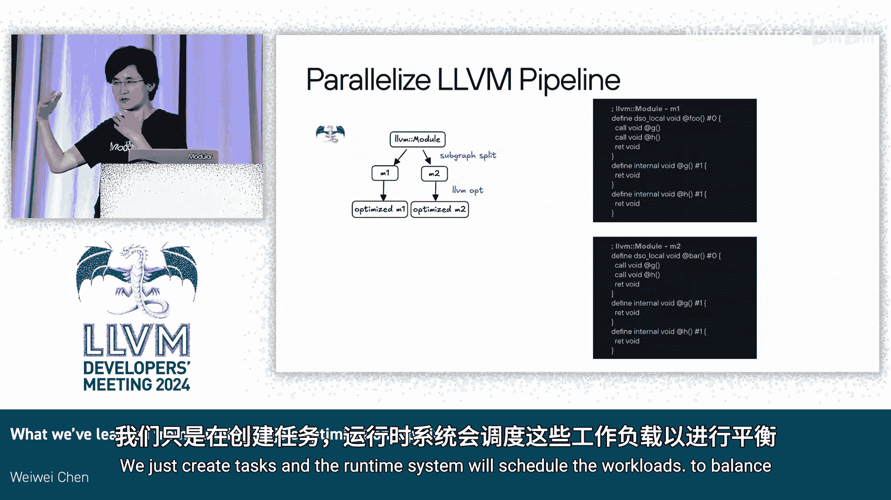

# 025：从构建Mojo优化流水线中学到的经验

## 概述

在本节课中，我们将学习Mojo编程语言编译器优化流水线的构建经验。我们将首先了解Mojo语言及其编译器架构，然后深入探讨其优化流水线的两个核心部分：MLIR部分和LLVM部分，并分享在构建这些部分过程中获得的宝贵经验。

## Mojo语言简介

Mojo是一种新的、具有Python风格的系统编程语言，于去年年初首次发布，目前仍在Modular公司积极开发中。

Mojo具有Python式的语言美学，并拥有许多与Python兼容的特性。

除了这些，Mojo还拥有一些“超能力”特性，例如广泛的泛型编程能力、管道系统、安全高效的内存模型，以及提供类似C语言级别的程序性能控制能力。

Mojo还支持异构编程模型，允许开发者使用同步编程方式同时编写CPU和GPU代码。

## Mojo编译器架构概览

上一节我们介绍了Mojo语言，本节中我们来看看Mojo编译器的整体架构。

Mojo编译器基于MLIR框架构建，并使用LLVM作为后端。

以下是编译过程的一般流程：

Mojo程序（.mojo文件）首先经过Mojo前端处理，然后进入参数化领域（IR），此时代码仍然是泛型的。

我们会将一些库代码打包成Mojo包，供其他程序后续使用，从而避免重复进行前端处理。

我们会在泛型领域进行一些优化，然后进入“具体化”阶段。

具体化是Mojo特有的一个术语，与C++模板实例化非常相似。

我们会运行一系列解释器，尝试将IR具体化。

具体化之后，我们会得到具体化的IR，并进行更多优化，然后将Mojo方言转换为LLVM方言。

最后，我们使用LLVM基础设施生成最终的二进制目标代码。

我们还会以一些非常规的方式使用LLVM，我将在后续内容中详细展开。

Mojo还采用库驱动的编译模型来支持异构平台。

对于GPU代码，开发者通常会编写一些主机（CPU）代码和GPU部分代码，可能还有其他主机代码。

在Mojo中，GPU部分是一个参数化函数，因此与GPU相关的编译发生在具体化阶段。

当我们尝试具体化GPU代码时，我们会为GPU运行一个协同编译器。

这部分与主流程非常相似，我只是简要提及，以便在幻灯片上展示。

然后，我们生成PTX代码作为具体化阶段的结果，并将其插回主机代码的具体化流程中，继续向下编译。

## 编译器目标与初始挑战

与大多数编译器一样，Mojo编译器的目标是实现快速的编译时间，并生成高性能的代码。

然而，在最初实现编译器时，我们发现LLVM部分在整体Mojo编译时间中占据了非常长的时间，大约为60%到80%。

从时间追踪数据中可以看到，O0优化级别的编译时间比O3高出一个数量级。

这有点违反直觉，因为O0运行的优化更少，理论上应该生成性能较差的代码，但编译时间却更长，生成的代码也更差。这并不理想。

## 问题根源：泛型编程与IR膨胀

我们发现问题首先在于Mojo拥有非常广泛的泛型编程支持。

这导致具体化后的IR规模变得非常大，出现了代码规模爆炸的情况。

特别是对于O0和O3，O0的IR规模实际上比O3大得多。

从提供的数据可以看出，在LLVM优化之前，O0的IR规模大约是O3的10倍。经过LLVM优化后，有些情况下差异甚至达到100倍。

对于O0，当IR规模非常大时，会给整个编译流水线带来巨大压力，包括MLIR部分和LLVM部分。

## MLIR层面的优化策略

基于以上观察，我们在MLIR层面（因为我们对这部分有完全的控制权）尝试替换一些优化，并努力在每一步都严格控制IR规模，避免将大量IR送入流水线并使其执行大量工作。

我们在MLIR层面实现了一系列优化过程，包括稀疏条件常量传播和循环展开等简化操作。

这些优化与LLVM中的类似，但我们将其提前到MLIR层面，这样我们可以在进行所有性能相关优化的同时，控制IR规模。

我们还在MLIR层面实现了一些功能特定的优化，例如针对闭包和协程的优化。

当然，我们也运行了一些基础优化过程，包括规范化、公共子表达式消除和死代码消除等。

## 在MLIR层面实现优化的优势

除了在MLIR层面控制IR规模外，在MLIR层面实现一些优化也非常有益，因为我们在MLIR层面拥有更高级的IR表示。

例如，我们有协程的IR表示，如栈分配操作和可变参数包的操作。

这些表示对程序有更多意义，可以帮助我们简化优化过程的实现。

我们还拥有基于区域的结构化控制流表示。

这与我们在LLVM IR或通用MLIR中通常见到的通用控制流图不同，后者在基本块中是直线代码，仅在基本块末尾有分支。

我们拥有这种结构化的控制流表示，可以看到其中有循环、条件判断，并且可以在区域中间进行提前退出，从而更好地匹配程序逻辑的高级表示。

这实际上在我们实现数据流分析（如稀疏条件常量传播和活跃变量分析）时，确实有助于保证一些最佳情况。

## 并行化努力

在尝试实现MLIR层面的优化过程时，我们还非常注重并行化，这主要是为了缩短编译时间。

首先，MLIR框架天然支持函数级优化过程的并行化。

我们只需要确保在创建Pass管理器时，相应地创建Pass，以便自动利用框架提供的并行化能力。

当我们实现那些过程内优化（如模块级Pass）时，我们也尝试注入过程内并行化。

例如，对于我们在MLIR层面实现的函数内联器，我们努力实现Pass内部的并行化。

当我们内联调用图时，我们希望自底向上进行，并且希望内联每个函数的调用。

我们为每个函数创建异步的并行任务，并根据函数间的调用图依赖关系设置任务间的依赖。

如果函数间存在调用路径，它们必须等待彼此完成。但如果函数间没有直接路径，它们实际上可以并行运行。

在这个非常简单的调用图示例中，F1和F2可以并行运行，而F3和F4也可以并行运行。

我们还尝试将类似的方法应用于具体化部分，真正提升所有MLIR层面优化过程中的并行化水平。

这确实帮助我们改善了编译时间，同时没有损失太多生成代码的性能，因为我们也在进行内存数据流分析等优化。

更重要的是，它有助于控制IR规模。

## LLVM流水线策略

现在，让我们来看看LLVM流水线。我们拥有MLIR部分，但我们不想重新实现一切。我们仍然希望利用LLVM流水线的强大功能。

LLVM在标量优化、加载存储优化以及目标特定代码生成方面非常出色。

我们不必重新发明轮子，我们仍然希望保留这些功能。

然而，LLVM并非完美无缺。例如，它的循环优化较弱且不可预测，包含大量启发式方法。优化可能发生，也可能不发生。从程序的角度来看，开发者对此没有太多控制权。

更重要的是，LLVM是单线程的，不支持并行化，因此很难利用现代机器中的多处理器能力。

## 简化LLVM流水线

在构建LLVM流水线时，我们尝试真正简化它，让LLVM只做重要的工作，减少工作量。

因此，我们移除了循环向量化器和循环展开器，并将这些功能上移到Mojo库层面，让开发者在编写程序时控制它们。

我们禁用了与协程相关的Pass，因为我们可以在MLIR层面实现协程等功能。

我们还尝试禁用所有过程间优化Pass，以便可以创建函数流水线并并行运行它们。

我在这里打了一个问号，因为这并不是实际发生的情况。我们尝试实现它，然后意识到内联对于生成代码的性能实际上非常关键。

## 内联的重要性

我们移除了LLVM的内联器和所有IPO Pass，然后发现对于运行的一些基准模型，在没有内联器的情况下，性能下降了约2倍。

实际上，我们可以通过在MLIR层面采用非常激进的内联策略来恢复性能。

我们确实有更高级别的内联器。如果我们变得非常激进，我们可以恢复性能。

但这是有代价的。正如这里所示，采用激进的内联策略时，CPU利用率更高，因为发生了更多的并行化。

但内存使用也增加了，因为代码规模更大，总体编译时间大致相同。

所以，认为我们可以直接摆脱LLVM内联器并用MLIR层面的工作替代它，可能有点天真。

这里的结论是，在我们能够在MLIR层面构建一个同等复杂的内联器之前，我们仍然需要LLVM内联器。

## 两级并行化拆分策略

基于以上考虑，我们仍然希望并行化流水线。

因此，我们选择了一种两级并行化拆分策略来并行化流水线。

基本上，我们尝试将模块拆分为多个子模块，并尝试在这些子模块上并行运行整个流水线。这就像将C++文件拆分为多个文件并并行编译它们。

我们进行两级拆分。第一级是将优化模块拆分为子图，每个子图将保留完整的函数调用图。这样，在运行优化时，我们仍然可以运行内联器，并且它们可以相互看到。我们在该级别保持优化。

一旦我们优化了所有内容，我们将子图进一步拆分为函数。

然后，我们为每个函数并行运行代码生成部分。这就像进一步的并行化。

最后，我们将输出合并在一起。

## 并行化示例

作为一个示例，我们输入一个LLVM模块，其中包含两个函数`foo`和`bar`，它们都调用了`gnu`。

这是一个非常简单的例子，在实际情况下，`gnu`很可能被优化掉。但作为一个示例，我将展示它会保留在那里。

第一步是将LLVM模块拆分为子图。这里我们有两个子图`foo`和`bar`，我们保留了完整的调用栈，所以这里有`gnu`。

这里有一个小问题，因为存在重复的代码，`gnu`被复制了。

然后，对于子图，我们运行优化并获得优化的模块。

接着，我们将优化的LLVM模块进一步按函数拆分。现在，我们分别有`foo`、`gnu`和`bar`在单独的模块中，我们可以用代码生成器运行这些模块。

然而，重复的代码仍然在这里。对于`foo`和`bar`调用`gnu`，我们还必须将符号链接类型从内部更改为弱链接，以便链接器能够优化掉重复的函数，否则调用会失败。

这并不理想，因为我们有重复的代码，并且必须更改符号链接类型。

## 非常规的链接方法

因此，我们实际上增加了一个额外的层，我们在这里做了一些非常规的事情。

首先，当我们运行代码生成部分（类似于`llc`）时，我们运行完整的代码生成，进行指令选择等工作，但在每个拆分的ASM打印之前停止。

然后，我们构建一个叫做“MC链接器”的东西，它将在内存中链接代码生成结果。

它将执行一系列归约工作，将所有常量池、IR和全局MC符号放入一个MC上下文中。

然后，我们只运行一次ASM打印，为链接结果生成一个输出文件，这样我们就可以消除重复的函数，并修复符号链接类型。

现在，我们有一个LLVM模块作为输入，仍然只有一个`.o`文件作为输出。

这是一种非常规的使用方式。我们很乐意将其上游化，因为我们也遇到了一些基础设施问题。

我相信，如果我们能将其上游化，社区中的其他人也可以使用它，并使这部分在代码树中更加稳定。

## 使用MC链接器的效果

使用这个特殊的MC链接器，正如你所看到的，对于生成的目标代码，我们不再有重复。

`gnu`实际上消失了，因为它们是内部函数。你现在不应该在输出目标文件的符号表中看到它。所以一切都被修复了，很好。

## 并行化LLVM时遇到的基础设施挑战

在尝试并行化LLVM时，我们确实遇到了一系列基础设施挑战。

首先，因为LLVM不是线程安全的。对于优化和代码生成所需的LLVM上下文和MC上下文，我们必须确保在并行运行编译时，每个拆分都有单独的副本。

我们还必须确保IR以高效且安全的方式移入这些上下文。

因此，我们实际上使用比特码来序列化和反序列化这些IR，以便在不同上下文之间迁移。

我们还遇到LLVM比特码的一些低效问题，例如，字符实际上被编码为64位，占用了所需空间的8倍。

字符串的复制性能也不佳，惰性加载对于函数体很好，但对于其他部分则不然。

我们还遇到了PTX的早期性能问题，因为PTX目前基本上只是作为具体化结果在IR中的一个巨大字符串。

因此，我们必须设法解决这些问题，不完全依赖基础设施来处理。

在代码生成层面的链接也存在类似问题，当我们将它们链接在一起时，必须将所有拆分放回同一个LLVM上下文中进行链接，因此又发生了一次序列化和反序列化。

我们用于代码生成的目标机器不是无状态的，因此我们现在还必须为每个拆分保留多个副本，这实际上增加了代码生成期间的内存占用。

对于特定目标的后端，我们还必须对归约进行一些小的修改，而且它们大多是私有API，因此从代码树外部更改访问权限具有挑战性。

## 总结

在构建Mojo流水线时，我们得出的结论是：

首先，编译时间是输入LLVM的IR规模的函数，而不是我们想要优化的实际工作量。

为了解决这个问题，我们将许多优化Pass移到MLIR层面，以便我们可以逐步优化IR并控制最终规模，从而控制IR大小。

我们还拥有更高级的IR表示，这有助于简化一些Pass的实现。

我们还努力利用并行化，将并行化注入到Pass中。

我们以一种非常规的方式使用LLVM，进行两级拆分，并尝试进行MC链接以确保并行化。

我们还编写了代码生成和结果链接器。

因此，如今，LLVM流水线约占Mojo编译时间的20%到30%。

总而言之，我们认为可以构建一个编译器，充分利用MLIR和LLVM两者的优势。

我们不必纯粹在LLVM中或纯粹在MLIR中构建编译器。我们可以让两者协同工作。

## 问答环节

**问：** 您没有讨论这种方法的运行时性能影响。我的意思是，您有关于运行时性能的数据吗？

**答：** 运行时性能是指代码运行时的性能吗？我没有这方面的数据，因为这主要是关于编译时间的。

**问：** 当您拆分为子图时，有时会复制函数，对吧？您拆分是为了并行化以改善编译时间，但如果您复制了函数，那么每个子图的编译时间可能会增加，对吧？您的方法是什么来解决这个问题？

**答：** 目前方法并不非常复杂。我们确实尝试根据IR规模来排序，作为优化所需时间的估计，并尝试平衡工作负载。但目前，我们只是创建并行任务，并让现有的运行时系统来调度代码。我们并不是直接创建线程，我们实际上有一个异步运行时系统。我们只是创建任务，运行时系统会调度工作负载以平衡代码。

**问：** 我很好奇，是否存在一个模块大小阈值，低于这个阈值时，进一步并行化不会带来好处？您知道吗，就像在您放弃并说“我不再费心并行化了，因为开销会超过并行化带来的加速”之前，您希望模块达到的最小粒度是多少？

**答：** 这实际上是一个非常好的问题。我认为我们还没有深入研究到那个细节。我确实看到，当我们有太多并行化时，在某种意义上会压垮系统。就像我们常说的，并行化有点像骗局，只有在有足够资源可以利用时才有益；如果没有足够资源，并行化会增加开销，可能没有好处。这绝对是我们微调工作负载平衡时应该考虑的事情，也是我们应该努力解决并弄清楚细节的事情。

**问：** 您通常是在一个编译单元中编译相对较大的程序，还是较小的程序？

**答：** 我们关注的大多数东西都是ML图（机器学习图）。所以通常至少会有100个函数。因此，每个函数都有足够级别的并行化可以利用。对于这个微小的例子，可能没有太大意义，因为只有四个函数。

**问：** 在您展示如何克隆函数的示例中，我想知道，拥有内部链接副本与使所有这些副本在外部可用，然后拥有一个包含可丢弃副本的单独模块（如果存在重复）之间的权衡是什么？就副本而言，这并不是最关键的事情。

**答：** 我们之所以在模块内保留重复副本，是因为我们希望内联器能够看到函数体，以便内联器可以对其进行操作。因此，过程间优化仍然可以做到这一点。当然，正如您所说，我们可以将它们保留为单独的外部实体，并在LTO层面进行优化，但LTO不如早期进行优化那么理想。

**问：** 我指的是特定的“available externally”链接，理论上它应该使函数体可用于内联，但仍然告诉链接器不要保留所有副本。

**答：** 哦，您是指一种叫做“available externally”的链接检查，您为IPO目的提供函数体，但它仍然不应该被代码生成。我不太了解这个，但我肯定会研究一下。非常感谢。

**问：** 出于好奇，您是否研究过Pass级别的并行化？几年前GCC中有一个项目，他们并行化了不同的优化Pass，基本上将其作为一个作业系统运行，其中优化依赖于另一个优化，构建了一个任务图，他们从中获得了相当好的加速。我认为在主题演讲中提到过，LLVM Pass管理器正在朝着这个方向发展。然而，这非常困难，因为LLVM的数据结构不是线程安全的。要使其工作，我们必须非常侵入性地修改数据结构，因为当并行运行时，如果上下文不安全并且您正在修改IR，就会出现竞争条件。因此，除了并行化Pass之外，我们还必须确保数据结构是安全的。MLIR在这方面要好得多，因为框架支持它，只要您从上层创建隔离，就可以做到。LLVM正在朝着这个方向发展，但还没有完全实现。

**答：** 是的，谢谢。再次感谢大家。谢谢。