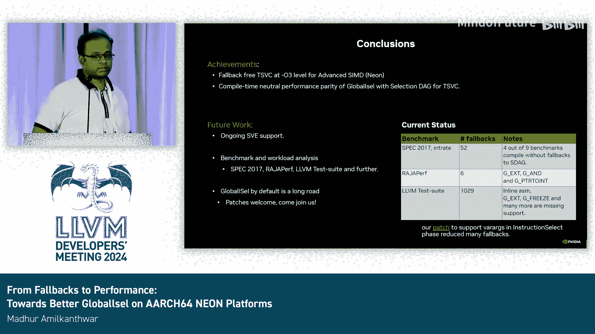

# 027：从回退到性能——迈向更好的GlobalISel性能

## 概述

在本节课中，我们将学习LLVM编译器后端中一个名为GlobalISel的指令选择器。我们将探讨如何通过分析一个名为TSVC的小型基准测试套件，来识别和修复GlobalISel的性能问题与回退现象，最终使其性能与传统的SelectionDAG指令选择器相当。

## 从后端与GlobalISel开始

上一节我们介绍了编译器后端的背景。本节中我们来看看GlobalISel的具体情况。

GlobalISel是LLVM代码库中的另一个指令选择器，已存在超过五年。它在AArch64架构的O0优化级别已是默认选项，但在其他优化级别（如O3）下，仍会回退到使用SelectionDAG。从基础设施角度看，GlobalISel不创建新的指令有向无环图（DAG），而是直接处理通用的机器指令，通过多个阶段将其降低并优化为具体的机器指令。

然而，在编译不同基准测试时，我们发现许多甚至几乎所有测试用例都会回退到SelectionDAG。从长远看，我们希望能在AArch64后端的O3级别启用GlobalISel。我们的方法是经验性的：逐个基准测试地分析问题。目前我们还没有一个完整的计划，也不完全清楚需要达成哪些具体目标。因此，我们决定从一个简单的小目标开始。

## 切入点：TSVC基准测试套件

以下是我们的切入点选择：

我们选择了名为TSVC（向量化编译器测试套件）的小型基准测试。它最初用于调优向量化器，但其规模足够小（包含152个小型计算内核），便于我们启动分析工作。在本演讲范围内，我们将聚焦于启用GlobalISel标志（`-global-isel`）且机器代码优化器等于机器代码生成器（`-mcp=MC=mir`）的情况。

在2024年2月编译时，我们发现只有一个内核会回退到SelectionDAG，其他部分都运行良好。这个内核本身并不复杂，但其生成的中间表示（IR）经过向量化器处理后，会产生交错（interleave）内部函数。通过研究SelectionDAG的实现，我们发现它是通过`shufflevector`指令来处理的。因此，我们在GlobalISel路径中模仿了这一行为，并成功修复了问题。这是我们工作的第一个里程碑。

## 性能对比与挑战

但性能究竟如何？我们最终需要让GlobalISel与SelectionDAG一较高下。

观察性能对比图：上半部分显示GlobalISel更快的案例，下半部分显示GlobalISel更慢的案例。其中三个内核的性能相比SelectionDAG要慢得多。让我们放大看第一个内核。

第一个内核的代码也很简短。但在其指令序列中，出现了`fneg`和`select`指令，随后又出现了`freeze`指令。在后续的处理阶段中，这些指令被物化（materialized）了，这并不理想，因为最终会留下不必要的指令。我们通过向规则集中添加规则，避免了这种物化，从而修复了性能差距。这个补丁贡献显著。

提交该补丁后，我们看到这个原本落后SelectionDAG超过50%的内核得到了修复。但仍有另外两个内核（`s3110`和`s3111`）存在性能问题，它们本质上是同一个内核，却阻碍了整个测试套件的性能表现。

## 深入分析：寄存器组选择问题

进一步分析这个内核，它是一个非常简单的计算二维数组最大值的函数，实现很朴素。通过GlobalISel路径观察，它有加载、浮点乘法和最大值计算指令，这符合预期。但在后续多个阶段中，我们看到循环内有一条加载指令，之后还有多条复制指令。

仔细观察，第一条加载指令发生在通用寄存器（GPR）中，而在复制指令中，数据从通用寄存器复制到浮点寄存器（FPR），然后又从FPR复制回GPR。这并不合理：如果数据的使用者都在FPR寄存器组中，为何要加载到GPR中？这是我们提出的第一个问题。

深入研究后，我们发现负责分析和分配寄存器组的`RegBankSelect`通行还不够成熟。这正是GlobalISel的优势所在：它允许我们跨越基本块进行分析。SelectionDAG仅限于单个基本块内，而GlobalISel可以超越基本块边界，触发SelectionDAG无法实现的优化选择。这个内核恰好展示了这种能力。

我们利用了这一点，增强了分析机制，使其能够更全面地审视数据流。我们增加了一项分析：如果加载的数据最终在某个不同的寄存器组中被使用，那么为何不考虑从一开始就使用相同的寄存器组进行加载和存储操作？这是针对该内核的主要实现和贡献。

## 成果总结与噪声处理

我们讨论的是为修复特定内核乃至整个基准测试而提交的一系列补丁。观察修复前后的性能对比图，通过大约11到12个补丁的组合，我们基本消除了所有性能差距。现在，整个测试套件的性能已非常接近SelectionDAG。

细心的读者会注意到，修复后图的Y轴范围缩小了，最大值是-20%，而之前是75%。这-20%主要源于测量噪声。请记住，这些都是非常小的计算内核，即使运行五次取几何平均数或最小值，仍然存在一些噪声。消除这些噪声可能不值得，因为它不一定能带来新的优化机会。

至此，我们可以宣布，除了噪声等因素，GlobalISel的性能已进入与SelectionDAG相当的范围内。

## 最终结论与未来展望

最后，我想总结一下。我们通过TSVC这个小基准测试，展示了如何提升性能、修复回退，甚至实现了超越SelectionDAG的能力——例如将信息传播到基本块之外，从而触发新的优化机会。这个基准测试为我们提供了绝佳的平台，证明GlobalISel具备足够的能力进行各种优化。

幸运的是，这一切并没有以牺牲编译时间为代价。GlobalISel的设计初衷之一就是改善编译时间。在我们应用所有补丁后收集的编译时间数据中，没有发现任何性能回退，这是一个好消息。同时，我们也赢回了运行时性能，这是重要的结论之一。

但故事并未就此结束。观察其他基准测试，仍然存在大量回退现象。有趣的是，在CPU开发者非常看重的SPEC 2017基准测试中，9个测试里有4个可以在不回退到SelectionDAG的情况下完成编译。这意味着对于SPEC 2017，GlobalISel至少是部分功能完整的。

但对于其他大型基准测试套件（如llvm-test-suite），仍需要针对性的修复。目前我们观察到的一个主要问题是内联汇编支持不足。我们需要研究SelectionDAG如何处理内联汇编，并找到在GlobalISel中实现的方法。我们在内部运行了一个小型的持续集成系统，它会在主干代码顶部构建LLVM，并使用脚本收集这些回退信息。这些数据来自上周，非常接近现状。

我们正在积极努力减少这些回退，最终目标是实现梦想：宣布AArch64后端默认全面启用GlobalISel。这绝非一人或一个团队能完成的任务，我们欢迎补丁，也欢迎大家加入我们。

谢谢大家。感谢各位的参与。特别感谢所有审阅我们补丁的同行。

谢谢，Madoric。