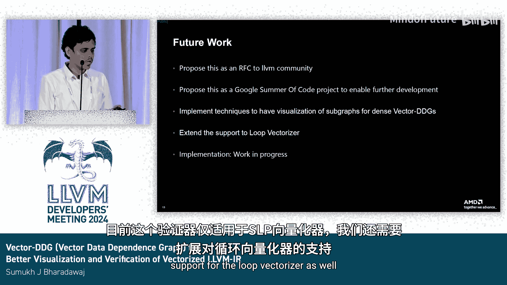

# 028：向量数据依赖图——用于更好的可视化和验证

## 概述

在本节课程中，我们将学习向量数据依赖图的概念。向量化是一种能显著提升程序性能的优化技术，但理解向量化后的数据流和依赖关系可能非常复杂。我们将介绍一个项目，该项目扩展了现有的数据依赖图，旨在为LLVM IR的向量化提供更好的可视化效果和验证机制。

## 引言

向量化是一种高效的优化技术，它通过对多个数据元素同时执行相同操作来利用硬件并行能力，从而带来巨大的性能提升。

然而，由于数据流的改变以及向量通道的存在，以数据依赖图的形式可视化向量化过程可能非常困难。向量化引入了并行性，这使得依赖关系变得更加复杂。

因此，我们的项目旨在通过扩展现有的数据依赖图来应对这一挑战。我们提供相应的可视化工具，并利用构建的图来验证已执行的向量化是否正确。

## 可视化挑战与解决方案

让我们考虑以下示例。这里有一系列指令，它们极大地改变了数据流。

如果我们查看原始的数据依赖图，我们无法获得关于混洗指令的任何信息，该指令修改了数据通道。我们也无法得知提取元素指令从哪些通道获取其值。

现在，考虑我们的项目生成的图。我们可以清晰地看到指令之间以及数据流上存在的逐通道依赖关系。这使得我们更容易理解此处发生的向量化。

除此之外，我们还计划移除像混洗指令这样的“胶水”指令，这些指令并未为程序逻辑增加实质性的依赖关系。移除它们可以使图变得更简洁，进一步降低图的复杂性。

## 验证算法

上一节我们介绍了可视化部分，本节中我们来看看验证器部分。让我们从以下示例开始，考虑两个输入值 P 和 P2。

我们在此尝试做的是比较现有的标量DDG图和向量化后的DDG图。这个过程并不简单。为了使其更简单，我们实际上将对创建的向量DDG进行“标量化”。

所谓“标量化”，是指将一个向量指令根据其拥有的通道数拆分成独立的节点。例如，考虑第一个向量加载指令 `VLoad`，它有两个通道 `VLoad0` 和 `VLoad1`。这将被拆分成各自独立的节点，如第二张图所示。依此类推，对图中所有向量指令都遵循相同的步骤，最终得到一个标量化后的DDG，可用于与原始标量DDG进行一对一比较。

除了我们表示的数据依赖关系外，我们还将确保相应地描述内存依赖关系。在原始图中，我们无法了解两个节点之间如何存在内存依赖。而在我们标量化DDG的第二张图中，我们可以观察到向量加载的第一个通道与向量存储的第0个通道之间存在清晰的内存依赖。因此，我们确保在标量化向量图时，同时保留了数据和内存流依赖。

## 核心验证算法

现在，我们来到验证算法的核心定义。给定以下假设，一个向量DDG等价于标量DDG，当且仅当对于标量化向量DDG中的每一条路径，在标量DDG中都存在一条对应的路径。

该算法旨在为我们尝试验证的两个图之间推导出一个一一映射关系。

构成我们图的元素如下：
*   **节点**：可以是标量指令或向量通道。
*   **边**：可以是数据依赖或内存依赖。

为了确保验证器产生正确结果，所需的假设是：标量DDG端和向量DDG端具有相同的指令集。我们还必须确保没有在向量DDG上执行非平凡的变换，因为这会导致消除一些我们原本用于比较图的节点，从而导致错误结果。

以下是我们遵循的算法的简要描述：我们获取两个图，并按拓扑顺序遍历它们，进行逐层比较。首先比较输入值，它们构成了我们DDG的根。一旦通过归纳法比较了这些值，我们就可以通过确保父节点也相同，来确认对应图的两个节点是等价的。

如果此比较成功完成，并且两边的指令集都已穷尽，我们可以得出结论：图是等价的。然而，如果在任何一点匹配失败，我们可以说图不等价。

## 验证示例

这里有一个示例，展示了两个图之间的差异。

在右上角的标量图中，我们有从 P0 到 P3 的输入值，接着是四个标量加载，最后是两个标量加法。

我们可以看到，标量化后的向量DDG看起来与原始标量DDG非常相似。它也将通道描绘为独立的节点，形式为第一个向量加载的 `VLoad0` 和 `VLoad1`，以及第二个向量加载的 `VLoad2` 和 `VLoad3`。

比较过程相当简单：我们首先从两个图的根开始。因此，我们比较两边的 P0 到 P3。一旦该比较完成，我们移动到相应的层级，通过检查节点的父节点来比较 `Load0` 与 `VLoad0`，依此类推，直到到达叶节点的末端。之后，我们可以得出结论：验证过程完成，向量化成立。

## 算法的可靠性

我想在此讨论我们算法的可靠性。在我们的案例中，如果验证器得出结论认为结果是等价的，那么我们实际上可以说它是等价的。但是，如果它判定为不等价，则可能有两种情况。

验证过程本质上是可靠的。然而，不等价的部分是由于向量DDG中存在某些特殊指令，例如混洗指令、提取元素、插入元素等，这些指令在标量DDG中没有对应项。尽管我们处理了这些特殊指令，但可能存在其他异常情况或难以判断的其他指令组合，这需要我们进一步推理以确保两个图实际上是等价的。因此，在这些情况下，我们实际上返回“不等价”的结果，从而使我们的验证成为一个可靠的过程。

## 未来工作

在未来工作中，我们计划将此作为一个RFC提交给LLVM社区，并提交给Google Summer of Code项目以进行进一步开发。

我们还需要确保我们拥有的可视化工具本质上是简洁的，因为对于非常密集的图，视图可能会非常混乱。因此，我们还需要以一种更简单易懂的形式来表示子图。

此外，目前的验证器仅适用于SLP向量化器，我们还需要扩展对循环向量化器的支持。

## 总结

本节课中，我们一起学习了向量数据依赖图项目。我们了解了向量化可视化面临的挑战，以及如何通过扩展DDG来清晰地展示逐通道依赖关系。我们深入探讨了验证向量化正确性的核心算法，该算法通过标量化向量图并与原始标量图进行路径匹配来实现。最后，我们讨论了算法的可靠性以及未来的改进方向。该项目旨在帮助开发者更好地理解和验证LLVM中的向量化优化。