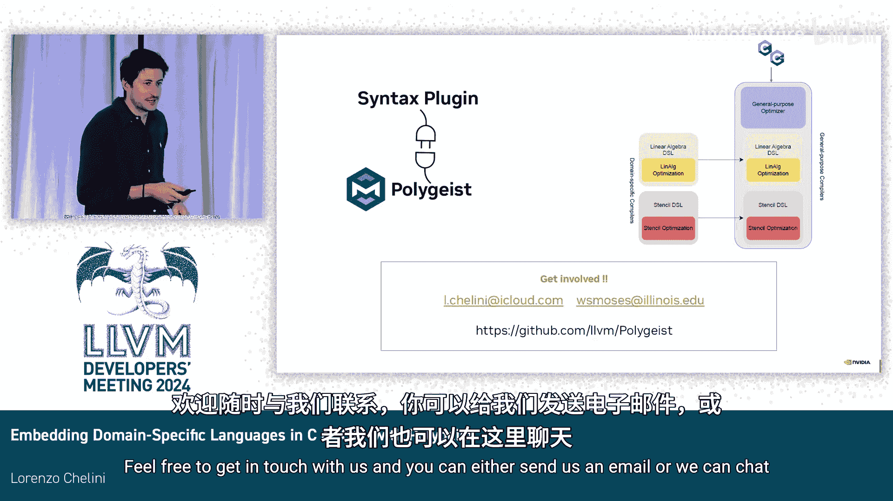

# 029：教程

## 概述
在本教程中，我们将学习如何使用 Polygeist 工具，将领域特定语言嵌入到 C++ 代码中。我们将了解其动机、核心机制，并通过一个简单的例子来演示如何实现自定义语法和优化规则。

---

## 动机：为何需要嵌入 DSL？ 🎯

当前，硬件编程变得越来越复杂。硬件本身变得更加异构和多样化。软件社区对此的典型应对方式是增加软件栈的结构化程度。实现这一点的一种方法是开发领域特定语言和编译器。

然而，这种方法并非没有代价。通常，领域特定语言与通用语言之间存在兼容性和可组合性问题，并且很难集成到现有的大型代码库中。主要原因是这些工具通常是庞大的单体软件，这源于语言与软件之间缺乏紧密集成。

因此，本项目的目标是设计一套机制，使我们能够以更简单的方式将领域特定语言引入现有的 C/C++ 项目中。我们本质上希望打破领域特定世界和通用编程世界之间的壁垒。

我们通过重用新颖的编译器技术来实现这一目标。具体来说，我们在 MLIR 的基础上，为 Polygeist 添加了一个扩展机制。这个机制允许你将领域特定语言和编译器作为一组插件引入。我们称这种扩展机制为“语法插件”。

---

## 什么是 Polygeist？ 🔧

对于那些不了解 Polygeist 的人，Polygeist 是 MLIR 的一个 C/C++ 前端。它允许你将任意的 C 或 C++ 代码片段，翻译成 MLIR 框架内不同方言所对应的中间表示。

下面的幻灯片展示了一个简单的例子。左边是一个 2D 循环的 C 代码，右边是其对应的 IR。Polygeist 的美妙之处在于，它能够保留源语言的丰富语义。例如，C 语言中的 `for` 循环对应 MLIR 标准控制流方言 `scf` 中的 `scf.for` 操作。

同时，它还能保留维度信息。在这个例子中，你有一个 2D 数组，并且可以看到内存访问也是 2D 的。

Polygeist 本质上依赖于 Clang。它构建抽象语法树，然后遍历每个 AST 节点，并发出相应的 IR。

---

## 我们的计划：如何将 DSL 引入通用流程？ 🗺️

我们计划主要在两个方面开展工作。

1.  **引入自定义语法**：例如，如果你是线性代数领域的专家，你可能希望使用自定义语法编写应用程序，而不是 C/C++。
2.  **提供引入自定义知识的机制**：这可以通过两种方式实现：一种是重写规则的形式，另一种是操作的形式。例如，你可能能够动态地向编译器注入一个操作，并赋予该操作语义。

为了本次讨论的焦点，我们将只关注语法和 IR 规则。在 Polygeist 中，我们已经对操作形式进行了一些实验。例如，你可以用 `#pragma` 标记一个函数，然后该函数会被降级到 MLIR 中的一个自定义操作，但这还不是动态的，我们需要选择一个方言并降级到它。

---

## 实现自定义语法 📝

为了实现自定义语法，我们实现了一个几年前由 Pletal 等人提出的想法。这本质上是一个 Clang 扩展，允许你从根本上改变 Clang 解析器解析的语法。

这意味着，只要遵守一些基本的解析规则（例如括号必须平衡），你现在就可以将 C 代码与 DSL 代码混合编写。

以下是一个简单的例子。你可以看到，C 函数被标记了属性 `clang::syntax`，然后在括号内是插件的名称。这个插件是一个简单的共享库，会被 Polygeist 加载，并告诉 Polygeist 如何解释函数体。

函数的参数是简单的 C 代码，但函数体是 DSL 代码。在这个特定案例中，我们使用了 Tensor Comprehensions，这是一种用于表达线性代数计算的 DSL。

实际上，这采用了一种两步法：
1.  **解析阶段**：Clang 会解析函数体。我们获取解析后的词法单元，将它们存储起来。
2.  **下一阶段**：当 Polygeist 遍历 AST 并构建 IR 结构时，我们检索存储的词法单元，并将其传递给插件。插件将负责发出函数体的 IR。

如前所述，插件是一个简单的共享库，包含解析器和 IR 发射器。在这张幻灯片上，左边是插件生成的 IR，代表一个转置操作；右边是发射出的 IR。在这个例子中，转置操作被降级为 `linalg.generic` 操作，这是 `linalg` 方言中的一个类循环操作。

在函数边界处，Polygeist 会处理 IR 的发射，并将符号表等信息传递给插件，以便插件理解参数等内容。此外，我们还会将内存引用提升为张量，以便重用 `linalg` 方言中可用的一些优化。

---

## 引入自定义优化规则 ⚙️

现在我们已经引入了语法，接下来看看如何引入优化。假设你正在编写自己的库，现在你有一种很好的方式来编写转置内核，但你还想在其中注入优化。

为了注入优化，我们提供了一种称为“策略”的机制。一个策略本质上代表了一条重写规则。模式部分告诉编译器你想要匹配什么，而替换部分则告诉编译器你希望如何替换匹配到的内容。

在这个案例中，策略非常简单：检测转置操作，并用一个简单的复制操作替换它。

实际上，这些策略会被降级到 Transform 方言。具体来说，是降级到 `linalg` 方言中一些可用于推理操作属性（如结构和访问模式）的匹配器。

例如，假设你想检测转置操作，你需要确保：
*   你的 `generic` 操作是 2D 的。
*   所有维度都是并行的。
*   输入和输出符合你对转置的预期。
*   检查访问模式：输入必须是恒等映射，输出必须是完美的排列。
*   最后，检查操作体，确保它没有做任何复杂的操作，在这个例子中应该只是一个直通操作。

一旦匹配成功，我们就可以进行替换。为此，我们再次使用 Transform 方言，具体是使用 `structured.replace` 操作。它允许你输入一组新的 SSA 操作作为要注入的操作，其有效负载就是替换内容。在这个例子中，替换内容是另一个 `generic` 操作，但它是复制操作而不是转置操作。所有这些实际上都是从策略中生成的。

---

## 总结 📚

本节课中，我们一起学习了如何使用 Polygeist 在 C++ 中嵌入领域特定语言。

我们首先了解了这样做的动机：为了应对日益复杂的异构硬件编程，并打破 DSL 与通用语言之间的壁垒。接着，我们介绍了 Polygeist 作为 MLIR 的 C/C++ 前端的基本功能。

然后，我们深入探讨了实现这一目标的两个核心方面：
1.  **自定义语法**：通过 Clang 扩展和插件机制，允许在 C/C++ 函数中直接编写 DSL 代码，并由插件负责将其转换为 MLIR IR。
2.  **自定义优化**：通过“策略”机制定义重写规则，这些规则会被降级到 MLIR 的 Transform 方言中，从而在编译时应用领域特定的优化。

总的来说，我们的目标是构建一种机制，能够轻松地将领域特定语言和编译器集成到现有的 C/C++ 项目中，充分利用 MLIR 等现代编译器技术的优势。