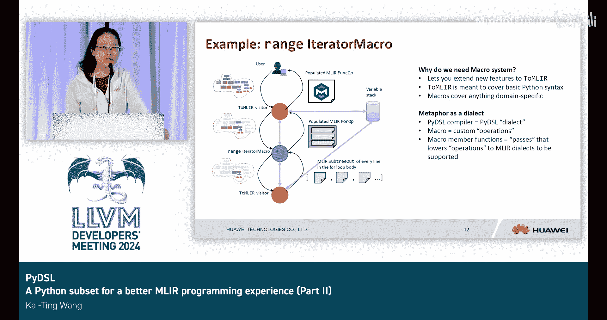

# 030：为Python开发者设计的MLIR DSL


## 概述

在本节课中，我们将学习PyDSL，这是一个为Python开发者设计的MLIR领域特定语言。我们将了解其设计动机、核心特性，特别是自去年以来新增的类型推断和宏系统功能。PyDSL旨在简化MLIR编程体验，让开发者能够使用接近原生Python的语法进行高性能计算。

---

## 动机与设计目标

上一节我们介绍了PyDSL的基本概念，本节中我们来看看其设计动机和目标。

MLIR的Python绑定通常非常冗长，并且其IR是编译器前端的输出，并非为语言用户直接编写而设计。同时，Python在AI和科学计算社区中非常流行。

因此，PyDSL的设计要求是：
*   它应该能直接从Python中使用。
*   它应尽可能遵循默认的Python语法。
*   理想情况下，用户只需对现有Python代码进行极少的修改，即可在PyDSL上运行。
*   它应促进异构代码生成。

---

## 架构与工作流程

了解了设计目标后，我们来看看PyDSL是如何工作的。

PyDSL解析程序，生成Transform Dialect IR和内核IR。这些IR经过优化器处理，最终被降低到CUDA或ROCm后端。

以下是一个对比示例，展示了手写MLIR IR的冗长程度：

```python
# PyDSL代码（简洁）
@dsl.kernel
def simple_add(A, B, C):
    for i in range(128):
        C[i] = A[i] + B[i]

# 等效的手写MLIR IR（非常冗长）
# 此处省略大量MLIR代码...
```

仅从代码行数来看，使用PyDSL能带来约3倍的生产力提升。

---

## 核心特性

现在，我们深入探讨PyDSL的核心特性。

PyDSL支持多种MLIR方言，包括`arith`、`scf`、`func`、`memref`、`affine`和`transform`。它提供了Python风格的语法，例如`a + b`会输出一个`arith.addi`操作。此外，它支持通过NumPy数组直接编译和调用函数。

以下是使用NumPy数组的示例：

```python
import numpy as np
import pydsl as dsl

@dsl.kernel
def vec_add(A, B, C):
    for i in dsl.tag(“vectorize”, dsl.range(A.shape[0])):
        C[i] = A[i] + B[i]

# 创建NumPy数组并直接传入内核
A = np.ones(128, dtype=np.float32)
B = np.ones(128, dtype=np.float32)
C = np.zeros(128, dtype=np.float32)

# 编译并执行内核
vec_add_compiled = dsl.compile(vec_add)
result = vec_add_compiled(A, B, C)
print(result)
```

---

## 类型推断

上一节我们介绍了PyDSL的基本语法，本节中我们重点看看其类型推断功能。

由于PyDSL需要生成MLIR，而MLIR要求所有类型信息都是明确的，因此它是静态类型的。但如果要求用户到处写类型提示会非常繁琐。

PyDSL能够推断类型。例如，它为常量创建了数字类型包装器。在操作`12 + argument_a`中，如果`argument_a`是`i64`类型，那么常量`12`也会被推断为`i64`类型。这为用户提供了便利。

此外，对于循环中的符号、维度和仿射映射，PyDSL现在也能进行推断，使得代码更加简洁。它还增加了对使用整数集的仿射`if`的支持。

---

## 宏系统

类型推断简化了代码编写，而宏系统则提供了强大的扩展能力。本节我们来详细了解宏系统。

宏系统因其工作方式类似宏扩展而得名。它接收AST节点的一部分，并输出相应的MLIR。该系统专为可扩展性和模块化而设计，并在最新的PyDSL中被广泛用于重构代码。

以下是其工作原理：

1.  **主访问器**：它遍历由Python `ast`模块生成的AST。对于大多数简单、基础的Python语法节点（如函数定义、常量、加法），主访问器可以直接处理并生成对应的MLIR操作（如`func.func`、`arith.constant`、`arith.addi`）。
2.  **遇到复杂操作**：当遇到更复杂的AST节点时（例如`for`循环或用于标记循环的`tag`），主访问器会将处理工作委托给相应的**宏**。
3.  **宏的处理**：例如，`for`节点会将其自身以及整个循环体子树传递给`RangeIteratorMacro`。这个宏知道如何根据范围类型（如`affine`范围或`scf`范围）生成正确的MLIR `for`操作。
4.  **委托与回调**：有趣的是，当宏需要处理循环体时，它发现循环体内的代码是常规的Python基础语法。这时，主访问器在调用宏时将自己作为参数传入，因此宏可以将处理循环体的工作“回传”给主访问器。

这个过程涉及双重委托：主访问器 -> 宏 -> 主访问器。这样设计的目的是让主访问器专注于基础Python语法，而所有领域特定的复杂功能都由宏来处理。你可以将PyDSL方言宏理解为特定的自定义操作，其扩展过程就是这些传递。

---

## 总结

本节课中，我们一起学习了PyDSL，一个旨在提升Python开发者MLIR编程体验的DSL。

我们回顾了其设计动机：解决原生MLIR Python绑定的冗长问题，并利用Python在科学计算中的流行度。我们了解了PyDSL的工作流程，从解析Python代码到生成并优化MLIR IR，最终降低到硬件后端。



我们重点探讨了两个关键新特性：
1.  **类型推断**：自动推断常量、循环变量等的类型，减少了显式类型声明的负担，使代码更简洁。
2.  **宏系统**：一个模块化的扩展机制，通过委托模式处理复杂的、领域特定的AST节点（如各种循环），使核心语法处理器保持简洁，同时支持灵活的功能扩展。

PyDSL通过提供近乎原生Python的语法、与NumPy的无缝集成以及强大的扩展机制，显著降低了使用MLIR进行高性能计算编程的门槛。