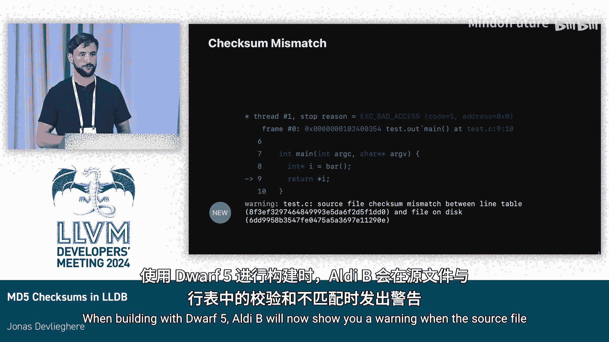

# 031：LLDB中的MD5校验和 🔍


在本节课中，我们将要学习LLDB调试器如何利用DWARF 5调试信息格式中的MD5校验和功能，来确保调试时显示的源代码与编译时使用的源代码完全一致。这对于保证调试信息的准确性至关重要。

## 调试信息与源代码映射

上一节我们介绍了调试器的基本目标。当使用调试器时，用户通常希望查看源代码，而非编译器生成的机器码。这一功能是通过调试信息实现的。

在Linux和Darwin系统上，我们使用DWARF调试信息格式。源代码与机器指令之间的映射关系被编码在**行表**中。行表包含了程序中指令与源代码行号、列号的对应关系。

以下是一个简化的行表示例，展示了机器指令地址如何映射到源文件的具体位置：

```
地址: 0x1000 -> 文件: test.c, 行: 9, 列: 10
地址: 0x1004 -> 文件: test.c, 行: 10, 列: 1
```

需要指出的是，行表中并不直接包含源代码内容，它只包含源代码文件的**路径**。因此，为了在调试器中显示源代码，用户必须在本地拥有该文件，并且该文件必须与编译时使用的文件完全一致。

## 源代码变更带来的问题

上一节我们了解了行表的工作原理，本节中我们来看看一个由此引发的实际问题：如果在编译和调试之间，源代码文件发生了改变，会发生什么？

例如，假设在示例中，函数调用从 `foo()` 被改成了 `bar()`。这可能是因为我在午餐前修改了代码，回来后忘记重新构建；或者我使用了版本控制系统，切换到了一个完全不同的文件版本。

无论原因如何，LLDB都不应该向用户显示 `bar()` 的调用。因为调试器的基本原则之一是：**它不能撒谎**。如果显示的内容与实际执行的代码不符，会严重误导开发者。

## DWARF的解决方案演进

为了解决上述问题，DWARF标准提供了几种机制来防止和检测这类错误。

以下是DWARF 4中提供的两种方法及其局限性：

*   **文件修改时间**：行表可以记录源文件的最后修改时间戳。如果当前文件的修改时间与记录不符，则发出警告。
    *   **缺点**：可能导致误报。例如，使用版本控制系统切换分支时，文件内容可能未变，但时间戳被更新了。此外，时间戳不利于实现可重复构建，因此经常被禁用。
*   **文件大小**：行表可以记录源文件的大小。如果当前文件的大小与记录不符，则发出警告。
    *   **缺点**：可能导致漏报。就像之前的例子，将 `foo` 改为 `bar`，两者都是三个字符，文件大小保持不变，因此无法检测到这种变更。

在**DWARF 5**中，上述两种方法得到了扩展，增加了第三种更可靠的机制：能够在行表中编码一个**16字节的MD5校验和**。

实际上，在继续之前需要说明，当Clang编译器以DWARF 5为目标时（这是Linux上的默认设置，从今年起也是Darwin上的默认设置），它会在行表中生成MD5校验和，而不是修改时间。

## 在LLDB中实现校验和检查

上一节我们介绍了DWARF 5提供的MD5校验和机制，本节中我们来看看LLDB调试器如何利用这一信息来检测不一致性。

为了让LLDB能够检测这种差异，我们需要在其中加入对校验和的支持。在实现时，主要有两种设计方案：

1.  **复用FileSpec类**：`FileSpec` 是LLDB中表示任意路径的类，行表中的所有文件都由它表示。最简单的办法是直接在这个类中添加一个校验和字段。
    *   **缺点**：`FileSpec` 类在LLDB中用途广泛，很多实例并不需要校验和功能。为所有实例都增加这个字段会造成内存浪费。
2.  **创建新的SupportFile类**：另一种方案是创建一个新类（我们称之为 `SupportFile`），专门用来表示来自行表的文件及其关联的校验和。
    *   **缺点**：这需要修改LLDB中所有处理行表文件的地方，使其能识别这个新类，意味着更多的工作量和代码改动。

最初，我选择了第一种方案进行原型设计，因为它更容易。但最终，我决定采用第二种方案，即实现 `SupportFile` 类。

做出这个决定还有一个重要原因：Swift宏需要依赖DWARF 6的一项新功能，该功能允许将源代码直接编码进行表。因此，我们已经有需求来区分“普通文件路径”和“带有额外信息的源文件”。我的同事Adrian在去年维也纳的LLVM开发者大会上有一个关于此主题的演讲（题为“Debug information for macros”），如果你对此感兴趣，可以查看。

## 最终效果

当使用DWARF 5进行构建时，如果本地源代码文件的MD5校验和与行表中记录的校验和不匹配，LLDB现在会显示一个警告，提示用户源代码可能已变更，从而避免了显示错误代码的风险。

---




本节课中我们一起学习了MD5校验和在LLDB调试器中的作用。我们了解了DWARF调试信息如何映射源代码，探讨了源代码变更可能带来的调试误导问题，并介绍了从DWARF 4的时间戳/文件大小检查到DWARF 5更可靠的MD5校验和的演进。最后，我们看到了LLDB如何通过实现 `SupportFile` 类来利用这一机制，确保调试器显示的源代码始终准确无误。