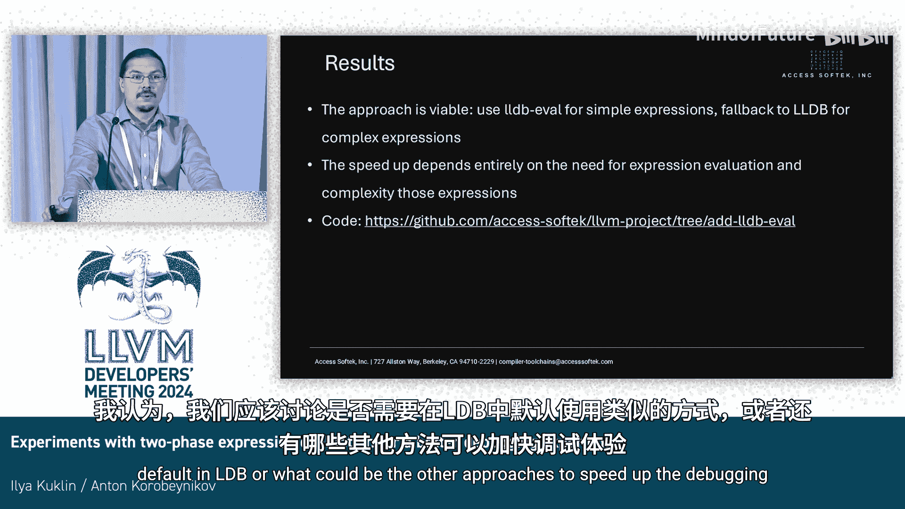

# 032：两阶段表达式求值实验

## 概述

在本节课中，我们将学习如何通过一种名为“两阶段表达式求值”的技术来优化调试体验，特别是针对大型程序的调试。我们将探讨这项技术如何显著减少调试器在显示变量值、评估条件断点时的延迟，从而提升整体调试效率。

## 调试大型程序的挑战

上一节我们介绍了调试信息精确性的问题，本节中我们来看看调试体验本身面临的挑战。

调试大型程序可能令人沮丧。现代集成开发环境功能强大，能够显示大量变量的值、自定义格式和摘要信息。然而，这也导致在单步执行（如步入、步过）时，调试器需要评估大量表达式，使得操作变得缓慢。

## 寻求解决方案：LGBW

为了解决这个问题，我们首先研究了现有的开源方案。

三年前，Google在LLVM开发者大会上介绍了LGBW。LGBW是一个针对C++语言有限子集的快速解释器。它自带C++解析器，能够处理算术运算、类型转换和有限的模板功能，基本覆盖了调试时常用的表达式类型。它通过LLDB API获取调试信息进行求值。

然而，LGBW最初为Stadia项目开发，随着该项目不再活跃，LGBW也停止了更新。此外，它被设计为一个供IDE直接调用的库，集成度不高。

## 我们的改进：集成与复兴

我们决定复兴并改进这个项目。

首先，我们基于最新的LLVM代码库重写了LGBW。接着，我们将其深度集成到LLDB调试器中，使其能够自动用于条件断点评估和表达式值显示，作为显式表达式求值的第一步。

我们的核心策略是**两阶段求值**：
1.  **第一阶段（快速求值）**：首先尝试使用快速的LGBW解释器来评估表达式。
2.  **第二阶段（完全求值）**：如果表达式过于复杂，LGBW无法处理，则自动回退到LLDB原有的、功能完整但较慢的求值器。

这种设计确保了兼容性的同时，为简单表达式提供了加速通道。

## 性能提升实例

以下是该方案带来的具体性能改进案例：

**案例一：大型游戏引擎调试**
*   **场景**：在启用自定义类型格式后，调试一款使用该引擎的游戏。
*   **改进**：单步执行（步过）时，显示所有变量所需的总时间从**2秒**减少到**约100毫秒**，提升超过**10倍**。LGBW带来的额外开销几乎可以忽略不计。

**案例二：条件断点评估**
*   **场景**：设置一个每5000次迭代才触发的条件断点。
*   **改进**：断点被触发前的等待时间减少了**超过一半**。表达式求值本身的总时间从**12秒**降至**1秒**。

## 总结与展望

本节课中我们一起学习了如何利用两阶段表达式求值来优化调试体验。

总体来看，这种方法是行之有效的。加速效果取决于调试会话中需要评估的表达式的数量和复杂程度。目前，相关代码已存在于下游分支中。

我们开放讨论：是否应该在LLDB中默认启用类似机制？或者，还有哪些其他方法可以提升调试体验？

这项实验表明，通过智能地结合快速近似求值与精确完全求值，可以显著改善开发者在调试大型复杂项目时的效率。