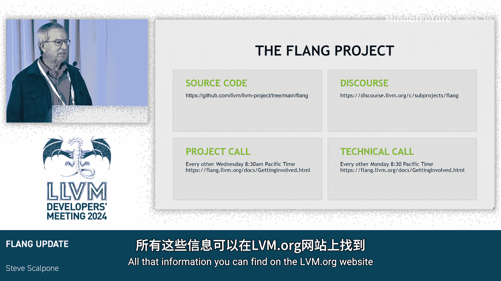

# 033：2024年 LLVM 开发者大会 Flang 进展报告 🚀

在本节课中，我们将学习 Flang 编译器项目的最新进展。Flang 是 LLVM 项目中的 Fortran 语言前端，我们将了解其发展历程、当前状态以及未来的规划。

## 项目历史与现状

上一节我们介绍了课程概述，本节中我们来看看 Flang 项目的发展背景。

Flang 项目启动已久，最初由 NSSA 和美国能源部推动。它曾是第三个或第四个 Fortran 前端实现。项目于 2019 年并入上游并成为 LLVM 的官方项目，至今已有数年。

关于编译器驱动程序的更新：该驱动程序多年未被构建，曾长期被称为“F New”，因为在其准备就绪前不希望用户使用。就在最近，它被重命名为“F”。因此，在 LLVM 20 版本中，将同时存在 `clang` 和 `flang` 命令，为 CPU 提供一个一流的 Fortran 编译器，目前运行状况良好。

## 社区贡献与测试套件

了解了项目背景后，我们来看看社区的贡献和支持。

在过去的三个月里，贡献情况如下：
*   **NVIDIA 贡献者**：提交了 262 个提交，目前仍是主要贡献者，但占比已低于一半，这是一个积极的现象。
*   **其他贡献者**：来自 AMD、IBM、Arm 等多家公司的 67 位贡献者提交了 272 个提交。

测试套件方面，非常感谢富士通和 IBM 开源了他们庞大的测试套件。这些是优秀的 Fortran 2003 测试，包含约 30,000 个测试用例。他们完成法律和工程审查以开放这些资源，对我们所有人来说都是一项巨大的贡献。

## 调试支持与性能表现

社区的支持为项目夯实了基础，本节中我们来看看在调试和性能方面的具体工作。

在调试方面，存在针对 Fortran 各种数组类型的 DWARF 调试信息扩展，目前正在更新相关支持。

在性能方面，人们使用 Fortran 并非希望程序运行缓慢。他们希望运行循环并且运行得快。以下是与 GFortran 的性能对比（数值越低越好，单位为秒），使用的是常见的基准测试套件 Polyhedron。我们使用 `flang -mlir -mlir-print-ir -O3` 命令编译到 LLVM IR，未进行大量优化。

我们进行了一系列内联内部函数的工作，并尝试进行临时变量消除，努力为向量化器提供所需信息以完成其工作。从结果看，我们已非常接近。几何平均值是值得关注的数字，两者非常接近。图中存在少数异常值，其中大部分可能是因为在传递参数时发生了重复，我们尚未进行别名分析。

在 MLIR 中间表示方面，我们有一个用于 Fortran 的大型别名分析，它已于前两周成功并入上游代码库，这对我们来说是一个重要的里程碑。

## 未来一年规划

在回顾了当前成就后，接下来我们展望一下未来一年的重点方向。

以下是未来的主要工作目标：
1.  **进一步提升 CPU 性能**：以 GFortran 为良好基准，但商业编译器表现更优。我们希望更多地利用 MLIR 和 LLVM 现有的能力，特别是在循环优化和向量化方面，同时消除现有的额外数据拷贝。
2.  **处理内部函数**：许多用于归约、正弦、余弦等操作的内部例程需要特殊处理，以追赶商业编译器的水平。
3.  **支持多核 OpenMP**：几乎每个 Fortran 程序都会进行某种形式的多核处理。这项工作主要由 Arm 及其他贡献者推进，进展非常顺利，已能运行大量程序，并致力于提升用户友好性，例如对未实现的功能显示“未实现”提示。
4.  **支持 GPU 离核计算**：利用当前上游 LLVM 中对 Flang 的标准支持，将 OpenMP 任务卸载到 GPU 执行。目前已能较好地运行程序，有时速度非常快，优化工作仍在进行中。
5.  **支持 `cudaFortran`**：类似于 CUDA，但用于 Fortran。允许编写内核并在设备上运行，相关代码正在上游化。
6.  **支持 OpenACC**：这是另一种为加速器编写程序的方式，将作为后续工作跟进。

## 社区参与方式

最后，如果您对参与 Flang 项目感兴趣，可以通过以下方式加入：
*   **Discourse 频道**：参与讨论。
*   **源代码**：您可以在 LLVM 官方仓库找到。
*   **项目例会**：每周一和周三交替举行，有时讨论项目事务，有时讨论技术问题，通常两者会有重叠。所有相关信息均可在 `llvm.org` 网站上找到。

本节课中我们一起学习了 Flang 编译器项目从历史、现状到未来规划的全面更新。我们看到它已成长为一个由多元社区驱动的成熟编译器，在性能、调试、异构计算支持等方面持续进步，并拥有清晰的未来发展路线图。