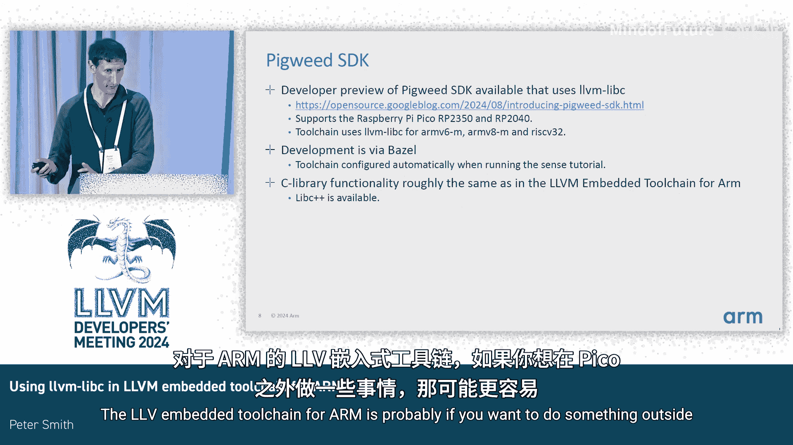

# 034：在 Arm 嵌入式工具链中使用 LLVM libc

## 概述

在本节课中，我们将学习如何在基于 Arm 架构的 LLVM 嵌入式工具链中使用 LLVM libc 库。我们将了解 LLVM libc 的基本概念、当前可用的功能、集成方法以及实际使用中需要处理的关键步骤。

---

## LLVM libc 简介

LLVM libc 是 LLVM 项目的一部分，旨在提供一个完整的 C 标准库实现。它可以通过两种模式构建：`overlay` 模式和 `full` 模式。对于嵌入式系统，通常使用 `full` 模式，因为系统上只有一个库。此外，还有一个 `bare metal` 配置，它指示 LLVM libc 使用针对不同架构（如 Arm 和 RISC-V）优化的特定函数实现。

**核心构建模式**：
*   `overlay` 模式：作为现有系统库的补充。
*   `full` 模式：作为系统唯一的 C 库。
*   `bare metal` 配置：为裸机环境提供特定实现。

---

## LLVM libc 当前功能状态

上一节我们介绍了 LLVM libc 的基本构建模式，本节中我们来看看它目前提供了哪些功能。

虽然 LLVM libc 的实现尚未完全覆盖所有 C 标准库函数，但对于大多数嵌入式系统来说已经足够。这些系统通常对 C 库的依赖较低，主要使用像 `string.h` 中的字符串操作函数（例如 `memcpy`）等基础功能。另一类嵌入式应用会密集使用数学库函数，而 LLVM libc 的数学库实现已经相当完整。

目前最大的限制在于不支持文件操作（`FILE*`）。这意味着虽然可以实现 `printf` 输出，但无法使用 `fopen`、`fclose` 等文件流函数。此外，据我所知，在 `bare metal` 构建中也不支持浮点数的 `printf` 格式化输出。

---

## 集成 LLVM libc 到工具链

我们之所以进行这次分享，是因为我们为 LLVM libc 实现了一个覆盖包。目前，在嵌入式系统中使用 LLVM libc 最困难的事情之一，就是获得一个集成了它的、真正可用的工具链。

在 Arm 的 LLVM 嵌入式工具链中，我们提供了一个可以单独构建的覆盖包。这个包会构建我们支持的所有架构变体（如 `v6-M`、`v7-M` 等），然后将其解压覆盖到主目录中。之后，你只需要修改一个配置文件来指定 C 库的路径，工具链的多库支持就会自动处理其余的事情。

目前在我们的工具链中，这仅支持 C 语言。我们尚未使用此方法构建 `libc++`，但希望未来能解决这个问题。

---

## 实际使用步骤与注意事项

接下来，我们看看在实际项目中集成 LLVM libc 需要做哪些具体工作。以下是关键步骤列表：

首先，一个比较棘手的部分是提供你自己的启动代码。如果你使用的是非常简单的微控制器，通常只需要很少的代码。我们的工具链中提供了一些示例，最好是从中借鉴。

**启动代码核心任务**：
1.  设置栈指针。
2.  执行必要的数据复制（例如，对于微控制器，通常需要将 `.data` 段复制到 RAM 中的正确位置）。
3.  如果是在 Arm 系统上，还需要处理半主机调用。

对于半主机调用，你需要实现 `_read`、`_write` 等函数。这些函数本质上会将操作转发给调试器的半主机调用。

如果你使用了 `malloc` 或堆，你需要在链接脚本中提供一块内存区域，并用符号 `end` 和 `__heap_limit` 来界定其边界。

如果你使用了 `math.h` 中的任何函数，需要提供一个能获取 `errno` 的函数。因为在 `bare metal` 构建中，库不会为你提供 `errno`。

---

## 示例与替代方案

这是一个非常简单的概念验证示例，虽然不会实际执行，但它展示了你可以做什么。如果你想在 QEMU 上运行，嵌入式工具链中有文档说明如何使用覆盖包，但提供的示例可能是最好的起点。

如果不提一下 Pigweed 就太疏忽了。谷歌提供了一个可用于树莓派 Pico 的工具链。如果你想整体上体验 Pigweed 并获得一个完整的示例，这可能是最简单的方式。而 LLVM 嵌入式工具链则更适合那些想在 Pico 之外的其他平台上进行开发的场景。

---

## 总结

本节课中，我们一起学习了在 Arm LLVM 嵌入式工具链中使用 LLVM libc 的完整流程。我们了解了它的构建模式、功能范围，并通过覆盖包的方式将其集成到工具链中。我们还探讨了实际使用时需要提供的启动代码、半主机接口、堆管理以及 `errno` 处理等关键组件。最后，我们提到了 Pigweed 作为另一个可选的实践途径。希望这些内容能帮助你开始在嵌入式项目中使用 LLVM libc。