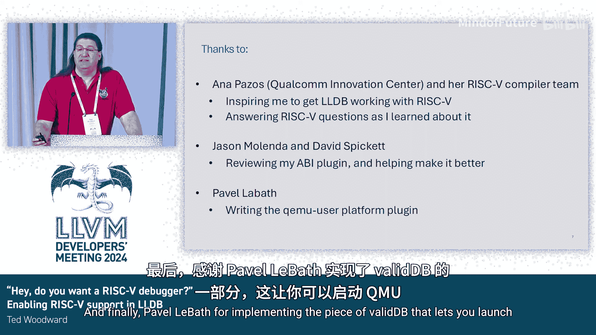

# 035：为LLDB启用RISC-V支持 🚀

在本节课中，我们将学习如何为LLVM的调试器LLDB添加RISC-V架构支持。我们将跟随一位开发者的实际经历，了解从发现问题到最终将代码贡献到上游项目的完整过程，并理解其中的关键步骤与挑战。

## 背景与动机

上一节我们介绍了LLDB调试器的基本概念。本节中我们来看看一个具体的架构支持案例。

去年四月，高通公司的LLVM团队与管理层开会讨论工作。RISC-V编译器团队的负责人介绍了相关工作。这引发了一个问题：如何运行RISC-V程序？得到的答案是使用QEMU模拟器。由于LLDB可以与QEMU通信，一个想法自然产生：为LLDB添加RISC-V调试器支持。这个想法得到了支持，从而开启了一段开发之旅。

## 初步尝试与问题发现

开发者首先为RISC-V构建了一个简单的调试目标，预期它会顺利工作。然而，现实并非如此。

加载一个RISC-V程序并在`main`函数设置断点后运行，调试器并未在预期位置停止，甚至无法正确显示程序计数器（PC）的值。核心问题在于：QEMU虽然能正确提供PC和其他寄存器的值，但LLDB无法识别哪个寄存器是PC。

## 问题分析与解决：架构插件

经过调查发现，其他架构的PC信息是通过一个“架构插件”提供的。于是开发者去查看RISC-V的架构插件，发现它根本不存在。这是第一个需要解决的问题。

遵循开源精神，开发者参考了其他架构的实现，编写了第一个RISC-V架构插件。这解决了PC识别的问题。

## 问题二：反汇编显示异常

接下来，程序成功在`main`函数处停止，但反汇编显示出现问题，约一半的指令无法正常显示。

根本原因在于原子操作、乘法与除法等扩展指令集未被启用。启用这些扩展后，反汇编功能恢复正常。

## 问题三：源代码单步执行不稳定

尝试使用“步入”功能进入被调用函数时，行为不一致，有时成功有时失败。

深入调查后发现，问题出在一条被圈出的指令：`c.jal`（压缩跳转并链接指令）。它在调试信息文件中没有被标记为“分支”指令。因此，LLDB在执行时没有将其视为控制流改变指令，直接执行了过去。

通过与编译器团队沟通，并将问题反馈至上游，最终修正了调试信息文件。此后，单步执行功能工作正常。

## 贡献代码至上游项目

在解决了基本功能问题后，下一步是将架构插件和反汇编修改贡献到LLDB上游项目。

开发者发现已有人提交过类似插件，但已一年未被审阅。于是，再次借鉴了该代码，改进自己的实现，并提交到上游。随后收到了大量的代码审查意见，这些意见极大地提升了代码质量。在逐一处理并改进后，代码最终获得批准并合并。

现在，上游的LLDB已经能够调试32位和64位的RISC-V程序了。

## 下游集成与产品发布

高通团队将上游合并的代码拉取回自己的分支，构建了完整的工具链，并基于LLVM 18将其集成到产品中发布。

## 致谢与总结

本节课中我们一起学习了为LLDB添加RISC-V支持的完整流程。这个过程始于一个实际需求，经历了识别问题、编写架构插件、修复反汇编与调试信息、应对代码审查等多个关键阶段，最终成功将贡献合并到上游并应用于产品。

以下是项目成功的关键助力：
*   **Ana Paz及其高通RISC-V编译器团队**：提供了最初的灵感和持续的RISC-V技术问题解答。
*   **Jason, Melinda和David Spickett**：在代码审查过程中提供了巨大帮助，提升了代码质量。
*   **Palo the bat**：实现了允许LLDB启动QEMU的关键组件。

通过这个案例，我们看到了开源协作如何推动工具链的完善，以及解决复杂技术问题所需的耐心和细致工作。

感谢观看，祝大会圆满成功。