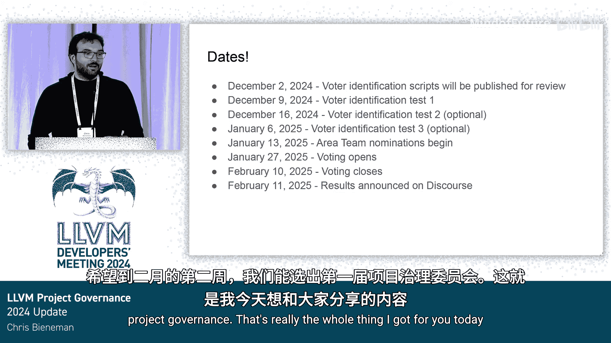

# 036：LLVM治理提案进展与实施计划 🚀

在本节课中，我们将学习LLVM治理提案的最新进展、核心架构以及即将实施的选举计划。我们将了解新设立的“领域团队”和“项目委员会”如何运作，以及它们将如何帮助社区更高效地做出决策。

---

## 治理提案的演进与批准

上一节我们介绍了治理提案的背景。本节中我们来看看该提案在过去一年中的演进与最终批准过程。

去年的大会上，我介绍了LLVM治理提案。我们希望通过本次分享，向大家通报该提案的进展和未来方向。

需要指出的一件大事是，我们收集了大量反馈。这些反馈来自去年的会议、EuroLLVM会议，以及在Discord和Github上的评审与讨论。我们获得了非常多的反馈意见。这些反馈使提案变得更好、更精简、更简化。

我们随后走完了LLVM提案流程。目的是以一种结构化和恰当的方式，为社区做出此类重大决策。上周，评审经理们召开了一次会议。这是提案流程的一部分，评审经理们批准了该提案。

因此，我们已经准备就绪，即将开始实施。

---

## 核心治理架构：领域团队与项目委员会

现在，让我们来谈谈具体内容。我们计划组建五个初始的领域团队。我们缩小了初始范围，以减少所需的初始志愿者数量。然后，我们将把如何扩展此架构以及如何随时间满足更大需求的问题，交给治理团队来解决。

这些领域团队将组成初始的项目委员会。初始的项目委员会将从此处接手处理所有其他事务。我们计划在明年一月进行首次选举。

这是一个起点，并非一个完美的解决方案。正如我们在LLVM中所做的一切，这将是一个迭代的过程。我们确实希望确保这成为LLVM迭代文化的一部分，以找到正确的解决方案。我们在提案后期添加了一项内容：项目委员会将发布年度报告，说明治理过程的进展。这将是我们用来提出改进建议的渠道。

---

## 对贡献者的影响与益处

对于贡献者而言，实际上很多事情应保持不变。目前，许多事情运转良好。我们不想改变那些有效且能让你高效工作的部分。

然而，我们确实希望确保我们有足够的维护者来覆盖代码库，以确保你的拉取请求得到评审，事务得以推进。

以下是领域团队将带来的具体益处：

*   **确保代码审查与所有权**：领域团队将帮助我们确保这一点，因为我们将指定人员负责确保所有权的落实。
*   **推动RFC决策**：领域团队将确保在Discourse上讨论的RFC得到评审和关注，并达成决策。我们社区经常面临的一个问题是，不一定能像应该的那样快速达成决策。
*   **管理提案流程**：最后，领域团队将接管运行LLVM提案流程，用于那些我们需要通过该流程来达成结果的情况。

---

## 领域团队的构成与职责

以下是关于领域团队构成与职责的详细信息：

*   **团队规模**：初始将由三名成员组成。这再次减少了我们启动该项目所需的志愿者数量。但我们将允许团队规模增长至最多九人，以便在领域需要更多视角和人员时，可以适当扩展。
*   **职责范围**：每个领域团队在项目中都有一个定义的领域或范围，他们将在该范围内提供协助和关注。但领域团队的核心使命是促进决策制定，并帮助确保决策得以达成。
*   **培养社区领导力**：我们希望领域团队也扮演帮助培养社区其他成员、帮助增长人才和扩展社区领导力的角色。因此，提案中的一项期望是，领域团队成员将帮助识别维护者，并帮助识别未来可能加入领域团队的人员，真正承担起引导者的角色。
*   **解决维护者覆盖问题**：当然，最后一点至关重要。维护者覆盖是一个大问题。这已成为社区多年来的一个难题。因此，我们确实、确实、确实需要确保有人对此负责。

---

## 项目委员会的职能

项目委员会将由每个领域团队的一名代表组成。它将充当监督机构，并且是一个“兜底”机制。任何没有领域团队负责的事务，都将提交给项目委员会。这意味着在LLVM开源项目下，不会有任何领域缺乏负责协助促进决策制定的人员。

项目委员会也将是最终的决策者。如果其他各方无法达成一致，项目委员会将能够介入并做出决定。这项工作的核心很大程度上围绕着决策制定。提案中有一行我认为非常关键：**“及时地说‘不’比说两年的‘可能’要好。”** 因此，我们真正希望的是确保决策在时间线上做出，并且每个人都知道这些决策将在何时做出。

当然，如前所述，项目委员会将发布年度报告，确保每个人都知道进展情况、社区如何成长、我们可以做哪些改进，以及社区在未来几年面临的问题。

---

## 选举流程与时间表

进入领域团队的方式是通过选举。你只需要是LLVM GitHub组织的成员。任何人都可以提名自己或他人竞选领域团队的职位。希望在未来的年份里，领域团队能积极招募，以保持人员的流动。

以下是关于选举流程的具体安排：

*   **投票资格**：运行选举时，GitHub组织中的任何人都有资格投票。我们不会根据你的贡献领域或方式限制投票权，但我们将使用GitHub组织作为衡量标准，因为这很简单。这可以随时间改变，并不完美，但真正的目标是使执行尽可能简单。
*   **投票方式**：我们将有一个自动化流程来关联电子邮件地址和GitHub ID。LLVM项目最近有政策变更，要求你的GitHub账户关联一个你监控的电子邮件地址。只要人们遵守这一点，我们的脚本就能识别你拥有电子邮件地址，并将其用于选民注册。所有投票首次将通过电子邮件进行。我们将使用一个被Python和其他一些项目使用的电子邮件投票系统。
*   **灵活调整**：我们将观察进展。如果这行不通，如果很混乱，我们下次会尝试其他方法。

以下是一些重要的日期安排：

*   我将在十二月初发布选民识别脚本。
*   我们将进行一些测试：运行脚本，生成每个人的选民信息，发送一些电子邮件，然后在Discourse上发帖通知大家。如果你收到了电子邮件，你就注册投票了；如果没有，请告诉我，以便我们找出问题所在。
*   我们将进行几轮测试，以确保良好的选民覆盖。
*   然后，我们将按照这些日期尝试进行。在我们解决了相关后勤工作后，我们将按照提案中规定的方式（包括每阶段持续多少周）进行提名和投票。
*   希望在二月的第二周，我们将选出我们的第一个项目治理机构。

---

## 总结与展望

本节课中我们一起学习了LLVM治理提案的最新进展。我们了解了新设立的**领域团队**和**项目委员会**的架构与职责，它们旨在促进决策、确保代码审查覆盖并培养社区领导力。我们还回顾了即将实施的选举流程和时间表。

这基本上就是我今天要分享的全部内容。我对我们在此方面取得的进展感到非常兴奋，希望这能解决我们社区中长期存在的一个难题。谢谢大家。😊