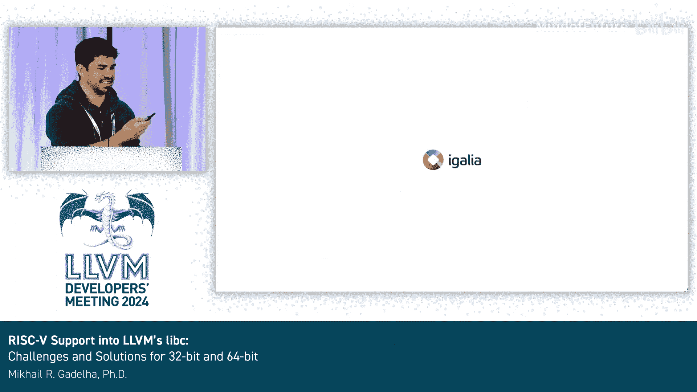

# 038：将 RISC-V 支持引入 LLVM libc - 32位与64位的挑战与解决方案 🚀

在本节课中，我们将学习如何将 LLVM 的 libc 库移植到 RISC-V 架构（包括 32 位和 64 位版本）。我们将探讨移植过程中的基本步骤、遇到的主要挑战以及相应的解决方案。

## 概述：什么是 LLVM libc 和 RISC-V？

首先，我们来了解一下 LLVM libc。它是 LLVM 项目中的一个 C 标准库实现。它支持多种架构，如 x86、ARM、ARM64，现在也支持 RISC-V 的 32 位和 64 位版本。此外，它还支持为 AMD 和 NVIDIA 的 GPU 进行构建。该库主要使用 C++ 编写。

接下来是 RISC-V。RISC-V 是一种开放的指令集架构（ISA），它本身不是一个具体的芯片（如 Cortex-A7），也不是一个 IP 核（如 ARM Cortex 或 x86）。它类似于 x86 或 ARM 的指令集架构。

那么，为什么要将 libc 移植到 RISC-V 呢？主要动机并非物质性的，而是为了更深入地了解这个项目和 RISC-V 架构本身。我一直在寻找一个能为 LLVM 做贡献的项目，而 libc 正是一个完美的选择。

巧合的是，在我开始之前的一个月，已经有一个补丁为 libc 添加了基本的 RISC-V 支持，包括一些内存函数、字符串函数和 C 类型函数。但是，仍然缺少许多组件，例如 CRT（C 运行时）、浮点环境、线程、长跳转和信号跳转等。

## 如何为 libc 添加新架构支持？

为 libc 添加一个新架构支持，实际上只需要修改三个文件。以下是为 RISC-V 64 位启用支持的提交示例。

第一个文件是 `llvm/libc/architecture/CMakeLists.txt`。它基本上是从编译器查询架构名称。例如，它会查询 `riscv64`，这个名称将被用作构建路径的一部分。

第二个是入口点文件，例如 `llvm/libc/src/__support/riscv64/entrypoint.cpp`。这个文件列出了将为该架构启用的函数。

第三个是头文件列表，例如 `llvm/libc/src/__support/riscv64/headers.txt`。它列出了将为该架构启用的头文件。

基本上，通过这三个更改，你就为新架构在 libc 中建立了基本的支持框架。之后的工作就是添加具体的函数实现、运行测试、修复错误，并不断重复这个过程。

## 支持 RISC-V 的主要挑战

在支持 RISC-V 的过程中，我遇到了几个主要挑战。

第一个挑战是硬件可用性。当我开始时，并没有现成的 RISC-V 硬件可供使用。解决方案是使用模拟器，例如 QEMU 或 Spike。我最初使用的是 QEMU 用户模式，但它有时会以奇怪的方式失败。例如，某些系统调用会返回与预期相反的结果。

一个具体的例子是 `madvise` 系统调用，它用于向系统提供内存使用建议，成功时返回 0。但是，如果你传递一个无效地址作为第一个参数，它应该返回 `ENOMEM`（错误码 12）。在 QEMU 用户模式下，即使传递 `nullptr`，它也可能返回成功。

对于 RISC-V 64 位，解决方案是使用 QEMU 系统模式，这很容易，网上有很多可用的镜像。我一开始使用了 Ubuntu 的镜像。对于 RISC-V 32 位，你需要自己构建镜像。我使用了 Yocto，因为我希望镜像中包含编译器（如 GCC），以便在 QEMU 内部进行测试。我找不到用 Buildroot 实现这一点的简单方法。唯一的限制是生成的镜像大小被限制在 1GB，原因不明，但这对于测试 libc 来说已经足够了。

我认为最大的挑战是系统调用（syscall）的差异。RISC-V 不向后兼容一些旧的系统调用，它根本不提供它们。因此，你必须更新大量代码，通过条件编译来支持这些新的系统调用。

有些情况比较简单，比如 `open` 和 `link`，它们只是将名称改为 `openat` 和 `linkat`。特别是对于 RV32，它们只是添加了后缀 `64` 或 `time64`。

在其他情况下，RISC-V 会摒弃一组旧的系统调用，只使用一个新的。例如，`wait`、`waitpid`、`wait3`、`wait4` 被合并为单一的 `waitid` 系统调用。

## 代码适配示例

接下来，我将展示一些我提交的补丁。我不期望你完全理解代码，但它们应该比较简单明了。我们从易到难来看。

**1. 简单重命名**
对于像 `fcntl` 和 `flock` 这样的系统调用，通常只需要更改调用的名称，参数保持不变，直接就能工作。

**2. 参数填充**
对于 `dup2` 和 `dup3` 这类情况，数字通常表示系统调用接受的参数数量。如果你想用 `dup3` 来实现 `dup2`，你只需要填充一个额外的参数（例如设置为 0），它会被忽略，从而表现得像 `dup2`。

**3. 参数拆分**
对于 `preadv2` 这样的调用，在 RV32 上，64 位的偏移量 `offset` 需要被拆分成两个 32 位的参数传递。你需要先传递高 32 位，再传递低 32 位。

**4. 参数转换**
对于 `sched_rr_get_interval`，你需要将一个 `kernel_timespec` 结构体传递给系统调用。内核会填充这个结构体，然后你需要将结果转换回原始调用所期望的参数格式。这稍微复杂一些。

**5. 多功能合并**
对于 `waitid`，正如前面提到的，RISC-V 没有单独的 `wait`、`waitpid`、`wait3`、`wait4`。你只有 `waitid`，因此必须处理所有不同的参数和返回值，确保每个旧调用的行为都符合预期。相关代码就是使用 `waitid` 来模拟所有这些旧调用。

## 其他棘手问题

除了系统调用，还有一些其他奇怪的问题。

**1. 结构体成员顺序**
在某些架构上，一些结构体的成员顺序是交换的。例如，`struct siginfo_t` 中的 `errno` 和 `code` 成员。由于传递参数的方式不同，x86 后端使用了 MIPS 的格式，但我们没有进行检查，导致出现了随机的错误。调试这个问题花了不少时间。

**2. 不可失败的系统调用**
一些新的 RISC-V 系统调用不会失败（例如 `epoll_create`），因此相关的测试用例需要被禁用。

**3. 随机数生成器**
在内部，我们使用 `xorshift64*` 作为伪随机数生成器，但在 32 位系统上它的随机性不够。因此，我们不得不为 RV32 使用另一种算法。

**4. 隐式类型转换**
由于 `size_t`、`long` 等类型的大小差异，存在大量的隐式转换问题。当在 libc 中启用 `-Werror`（将警告视为错误）时，很多 32 位代码会编译失败。不过，这至少让我们发现了那些需要显式处理的转换。

**5. 长双精度与128位整数**
RISC-V 有 128 位的长双精度浮点数（`long double`），但没有原生的 128 位整数类型。虽然可以强制编译器提供 128 位整数支持，但我们的代码库中有基础设施来避免依赖它。因此，一些测试用例在 RV32 上会失败，但 libc 的基础设施提供了绕过这个问题的方法。

## 当前支持状态与总结

最后，我们来看看当前的支持状态。目前，LLVM libc 共有 946 个函数，我们对其中约 86% 提供了 RISC-V 支持。剩下的部分中，有大约 30% 是几周前由一位学生添加的，我还没有时间详细检查，但它们应该可以正常工作。

目前最大的问题是 `float16`（半精度浮点数）的支持。几个月前我发现了一个问题：在 RISC-V 上，无法启用从 `long double` 到 `float16` 的转换。我已经提交了一个 issue，并且有一个修复补丁。但不幸的是，这个补丁有一个小问题：它会破坏 x86 后端。因此，要合并这个补丁可能会比较困难。

本节课中，我们一起学习了将 LLVM libc 移植到 RISC-V 架构的基本流程、核心挑战和解决方案。从建立基本的架构支持框架，到处理系统调用差异、结构体成员顺序、随机数生成等具体问题，这个过程充满了挑战，但也极大地加深了对底层系统软件和硬件架构的理解。希望本教程能为想要参与 LLVM 或系统软件移植的初学者提供一个清晰的指引。