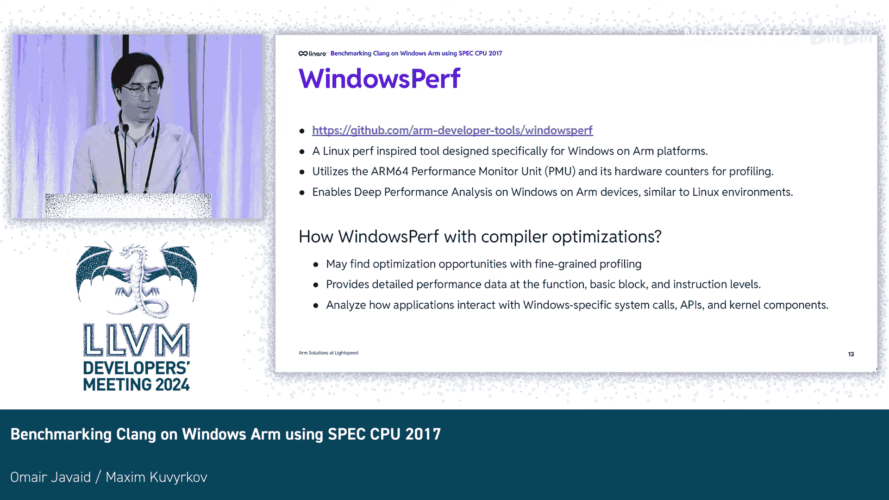

# 039：在Windows on Arm上对Clang进行基准测试 - 构建与运行SPEC 2017 📊

## 概述
在本节课中，我们将学习如何在Arm架构的Windows系统上，使用Clang编译器构建和运行SPEC 2017基准测试套件，并将其性能与微软Visual Studio编译器进行对比。

---

## 测试环境与配置 🖥️
上一节我们介绍了课程主题，本节中我们来看看具体的测试环境与配置。

测试环境是一台较新的Surface Pro笔记本电脑。它配备了32GB内存和12核处理器，运行最新的Windows系统。

本次演示主要对比两个编译器的性能：LLVM 19和Microsoft Visual Studio 2022。GCC for Windows on Arm版本正在开发中，我们希望在下次会议上展示LLVM与GCC的对比数据。

我们比较了三种配置：
*   优化体积
*   优化执行性能
*   调试模式（不优化）

请记住一个关键点：环境温度为26摄氏度。这一点稍后会很重要。

---

## SPEC基准测试套件简介 📦
上一节我们了解了测试配置，本节中我们来认识一下基准测试工具。

SPEC基准测试套件包含C、C++和Fortran语言的基准测试程序。LLVM社区正在努力启用新的Fortran前端Flang（最近已更名为F18）。F18目前应该可以编译Windows上的所有基准测试程序，但在Windows上可能仍有一个程序无法编译。

---

## 性能对比结果 📈
上一节介绍了测试工具，本节中我们来看看具体的性能对比数字。

以下是C和C++基准测试的结果。如图所示，无论是优化速度、优化体积还是调试模式，Clang编译出的程序执行时间通常比微软Visual Studio编译器快5%到15%。

在浮点性能测试中，我们看到了相似的结果。

当我们查看多线程性能时，有时会发现更大的差距，在某些情况下甚至达到40%到60%。深入分析Clang为何能获得如此大的优势会非常有趣。我的猜测是，LLVM可能能够跨几个线程并行化AArch64的解码器和编码器。

在Fortran基准测试中存在一些异常值。但请记住，LLVM中的Flang项目在过去几年一直处于启用阶段，目前可能尚未有人真正关注其性能。因此，预计其性能会变得更好，并且速度会相当快。

---

## 代码体积对比 📉
上一节我们讨论了执行性能，本节中我们来看看代码体积的对比。

结果显示，Clang生成的代码体积甚至比MSVC更小，并且提升相当显著，达到了20%、30%、40%的改进。这包括在优化体积的配置下也是如此。O1实际上是优化体积，O2是优化速度，而这是调试构建。

最后，关于调试文件，PDB是Windows的调试格式。Clang生成的PDB文件也更小。这里有一个注意事项：比较调试信息的质量并不那么容易。所以，虽然文件可能更小，但我们不一定知道Clang和MSVC生成的调试信息质量是否相同。

---

## Windows性能分析工具 🔧
上一节我们对比了编译结果，本节中我们来了解一个性能分析工具。

Windows on Arm有一个名为Windows Perf的工具，其设计灵感来源于Linux Perf，旨在与之相似。你可以使用它收集整个系统或单个进程的性能计数器数据，然后进行后续分析。该工具已在GitHub上发布。

---

## 总结与要点 🎯
本节课中我们一起学习了在Windows on Arm平台上使用Clang进行SPEC 2017基准测试的全过程。

如果你要从本次演示中记住两点，那应该是：
1.  **Windows on Arm上的Clang已达到生产就绪质量**。社区和Mike McLay投入了大量精力，确保Clang和LLVM在Arm架构上得到非常好的支持。如果你在为Windows构建应用程序时追求性能和更小的体积，请认真考虑使用Clang。
2.  **26摄氏度的环境温度**。正确地进行可靠的基准测试很困难。如果你的工作包含基准测试，那么你完全有理由为家庭办公室申请一个啤酒冰箱——用来放置你的笔记本电脑或测试机器，并在其中进行基准测试。