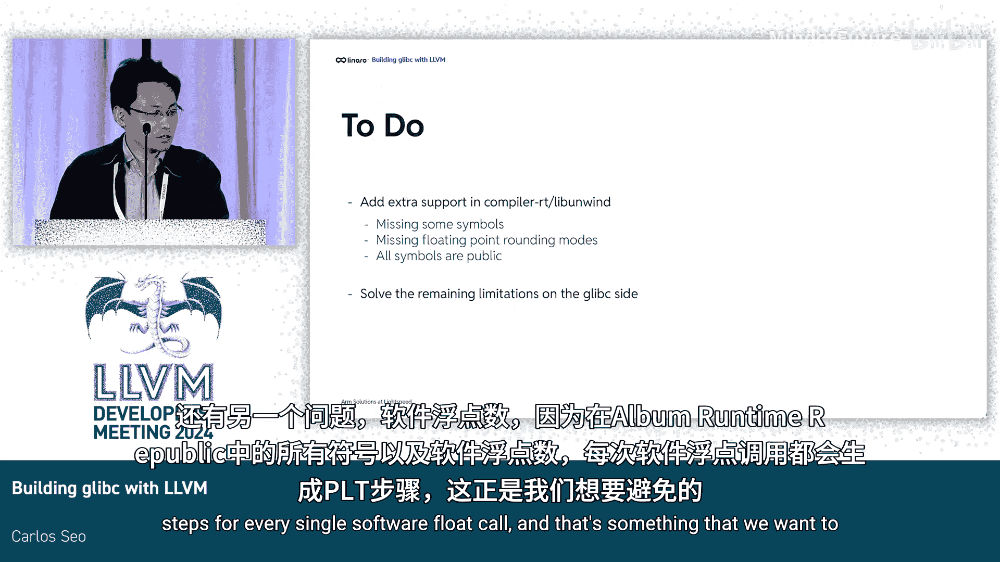

# 040：项目概述与挑战

在本节课中，我们将学习如何使用LLVM工具链来构建glibc库。这是一个概念验证项目，我们将探讨其动机、面临的挑战、当前进展以及未来的工作方向。

## 项目动机 🎯

大家好，我是来自Leardo的Caros Seo。今天我将讨论如何为LLVM工具链构建glibc库。

首先，你可能会好奇我们为何决定进行这个项目。主要动机有以下几点：

*   **编译器多样性**：我们希望允许glibc能够使用不同的编译器。
*   **代码质量提升**：我们希望通过使用Clang的编译器警告集来改进glibc的代码质量。
*   **LLVM功能增强**：我们也希望通过添加最初为GCC开发的功能来改进LLVM。
*   **性能验证**：我们希望验证glibc在两个编译器之间是否存在性能差异。
*   **生态系统构建**：由于glibc是许多Linux软件包的基础依赖，我们希望未来能够开启使用LLVM构建完整Linux发行版的可能性。

## 面临的挑战 ⚠️

上一节我们介绍了项目的动机，本节中我们来看看实现这一目标所面临的巨大挑战。

*   **C标准扩展**：glibc使用了新的C标准，并依赖GCC扩展来实现许多功能。
*   **工具链依赖**：glibc假定默认的汇编器和链接器来自GNU Binutils，这引入了另一层依赖。
*   **扩展不兼容**：一些GCC扩展已被社区讨论过，并且LLVM将永远不会实现。此外，像128位浮点数这样的扩展在两个编译器之间并不完全兼容。

## 当前工作进展 🛠️

面对这些挑战，我们目前正在进行以下工作：

*   **移除扩展**：我们移除了所有已知的、LLVM永远不会实现的GCC扩展。
*   **适配构建系统**：我们调整了构建过程，使glibc能够使用LLVM的`llg`。
*   **解耦依赖**：我们重构了部分代码，以减少glibc与Binutils之间的硬性依赖。

这个概念验证项目可在Sourceware的官方glibc Git仓库中找到，位于`Adir Vosonnel`的分支下。我们的同事Adir在glibc方面完成了大部分工作。

以下是已完成工作的量化总结：

*   **架构支持**：我们完成了约三分之一的工作，使glibc能够在x86_64和AArch64架构上构建。
*   **测试套件**：我们完成了约三分之二的工作，以构建glibc测试套件中的所有测试用例。

这项工作是在使用LLVM Clang和GCC 11运行时库的情况下完成的。到LLVM Clang发布时，我们为支持此工作所需的所有补丁都已上游合并到LLVM中。

## 现有局限性与未来工作 🔮

由于这只是一个概念验证，目前存在一些局限性：

*   **架构支持不完整**：glibc的架构支持尚未完成。
*   **AArch64 ABI问题**：AArch64由于编译器间的ABI差异而无法正常工作。
*   **代码生成问题**：在数学测试套件中存在一些代码生成问题，主要涉及`long double`和`float128`类型。
*   **缺少LLVM运行时支持**：目前完全没有LLVM运行时的支持。虽然可以使用LLVM的`libc`包装器来绕过此问题，但存在许多错误，因此实际上并不可用。

除了需要在glibc方面继续完成的工作，在LLVM侧也有很多事情需要做：

*   **尝试不同方法**：我们需要尝试多种不同的方法来编译整个Linux系统。
*   **处理GCC依赖**：glibc在许多方面依赖GCC，例如线程取消和软件浮点运算。GCC运行时和LLVM运行时在这些方面差异很大。
*   **添加必要符号**：我们需要添加glibc用于线程取消所需的一些业务符号。
*   **扩展舍入模式**：目前LLVM只支持一种舍入模式，我们需要为其添加额外的舍入模式。
*   **解决软件浮点问题**：在软件浮点运算方面存在另一个问题，因为LLVM运行时会为每一个软件浮点调用生成PLT存根，这是我们希望避免的。

## 总结与邀请 🤝

本节课中我们一起学习了使用LLVM工具链构建glibc的概念验证项目。

以上就是我今天要分享的关于这个项目状态的全部内容。这个PR/POC可以用于实验目的。正如所说，它可以在Sourceware仓库中找到，你可以下载并构建它。它也能与当前最新的LLVM协同工作。

如果你对这个项目感兴趣，请务必与我们保持联系。我们正在寻找志同道合的人一起推进这项工作。

我的分享到此结束。谢谢大家。