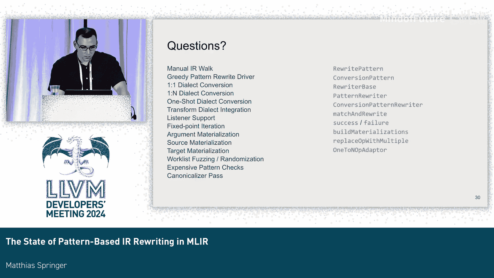

# 041：基于模式的IR重写在MLIR中的现状

在本节课程中，我们将学习MLIR中两种主要的模式重写器：贪婪模式重写器和方言转换器。我们将探讨它们近期的变化、过去几年总结出的最佳实践，以及针对方言转换器正在进行的一些重构计划。

## 🧭 概述：MLIR中的IR遍历机制

首先，我们快速回顾一下MLIR中现有的IR遍历机制。

*   **IR遍历**：这是最简单的机制，基于访问者API。它为每个操作、基本块或区域提供一个回调函数，你可以在Lambda函数内部执行操作。
*   **贪婪模式重写驱动器**：这是一个基于模式的重写引擎。它会持续应用模式，直到IR不再发生变化，即达到一个不动点。
*   **方言转换**：这也是一个基于模式的重写器，但略有不同。它不进行不动点迭代，只关注被标记为“非法”的操作，并且总是从上到下遍历IR。
*   **转换方言**：它通过句柄来匹配IR，然后转换操作决定如何处理IR。

从左到右看，这些系统的复杂性和运行时开销逐渐增加，其中方言转换已被证明是相当昂贵的。

本节课我们将重点讨论贪婪模式重写器和方言转换器。

## 🔄 贪婪模式重写器 vs. 方言转换器

如果将两者并排比较：

*   **入口点**：
    *   贪婪模式重写器：`applyPatternsAndFoldGreedily`
    *   方言转换器：`applyFullConversion` 或 `applyPartialConversion`
*   **应用对象**：
    *   贪婪模式重写器：尝试对所有操作应用模式，并尝试折叠和擦除操作。
    *   方言转换器：只对根据转换目标标记为“非法”的操作应用模式。它也会尝试折叠操作，但这实际上是不安全的。
*   **遍历顺序**：
    *   贪婪模式重写器：不保证遍历顺序，也不保证访问操作的次数。如果IR发生变化，重写器可能会回溯并重新尝试。
    *   方言转换器：只查看操作一次，只查看非法操作，并且总是从上到下查看。因此，你对其开销有一定预期。
*   **回滚机制**：
    *   方言转换器：具有回滚机制，可以撤销更改。
    *   贪婪模式重写器：没有此功能。

## 📈 近期更新

上一节我们对比了两个重写器的核心差异，本节我们来看看它们近期的具体更新。

### 贪婪模式重写器的更新

*   **监听器支持**：可以监听贪婪模式重写驱动器所做的更改。这是为了将其集成到转换方言中。
*   **转换方言集成**：新增了 `transform.apply_patterns` 操作，允许从转换方言脚本中运行贪婪模式重写。
*   **昂贵的模式检查**：新增了调试API或额外的调试检查，帮助你发现重写模式的问题。
*   **区域简化**：添加了一些区域简化的功能。
*   **入口点统一**：所有入口点现在都接受一个 `GreedyRewriteConfig` 配置。
*   **其他小改动**。

### 方言转换器的更新

*   **监听器支持**：已添加，但并非所有情况都支持。例如，当操作被移动时，监听器回调不会告知操作的原始位置。
*   **转换方言集成**：已集成到转换方言中。
*   **源/目标具体化可选**：源参数和目标具体化现在是可选的。
*   **新API支持**：添加了对新API的支持，特别是 `moveOpBefore`/`moveOpAfter`。
*   **内部修复和检查**：进行了许多内部错误修复并添加了额外检查，以增强基础设施的健壮性。

## 🛠️ 最佳实践与API规则

了解了更新内容后，我们来看看一些在社区讨论中总结出的最佳实践和API规则。

### 如何选择重写器？

首先，面对一个任务时，你该如何选择？

1.  **优先使用 `IR Walk`**：在大多数情况下，你可能只需要使用操作遍历（访问者API）。这始终是最有效的解决方案，因为没有工作列表，没有驱动器开销。如果可行，请使用它。
2.  **使用贪婪模式重写器**：如果你确实需要不动点迭代（即需要多次查看操作直到没有变化），或者想要组合来自不同组件的模式集合。
3.  **使用方言转换器**：当你需要进行类型转换时（例如，用一个具有不同类型的值替换操作），基础设施会负责插入必要的转换。

### 重写模式中的 `matchAndRewrite` 规则

在重写模式中，**仅当IR被修改时才应返回 `success`**。

违反此规则的后果：

*   **返回 `success` 但未修改IR**：告诉重写器模式已匹配并应用，导致驱动器进行另一次迭代，可能触发无限循环。
*   **返回 `failure` 但修改了IR**：告诉重写器模式未匹配，但IR已处于不一致状态，可能导致后续模式看到部分应用的更改。

对于转换模式，规则更宽松：如果模式成功（操作被擦除或就地修改为合法），则返回 `success`。实际上，允许返回 `failure`，方言转换器会自动回滚所有更改。但为了提高驱动器效率，我们正尝试移除后一点。

### IR验证与修改规则

*   **模式应用后IR应验证**：这不是严格的MLIR规则（MLIR只要求每次传递后IR有效），但在实践中非常有用，尤其是对于公开的重写模式。这有助于构建可组合的系统。但请注意，并非总是可行（例如，重写函数签名和调用操作时）。
*   **所有IR修改必须通过重写器**：这是一个硬性API规则。不要直接使用 `op->erase()` 等方式擦除IR。必须通过重写器进行。原因是方言转换和贪婪模式重写器会附加监听器来获知更改。如果直接擦除操作，它可能仍在工作列表中，导致驱动器在悬空指针上运行并崩溃。

为了捕获此类问题，我们新增了一个CMake标志：`MLIR_ENABLE_EXPENSIVE_PATTERN_API_CHECKS`。

它会检查以下情况：
*   修改了IR但返回了 `failure`。
*   每次模式应用后IR是否验证。
*   确保通过重写器进行修改（尽管不能检测所有情况）。

使用此标志时，建议同时启用地址消毒器，以便在违反规则导致程序中止时获得更清晰的错误信息（例如，访问悬空指针的位置）。

### 关于规范化器的注意事项

**不要依赖规范化器传递来保证正确性**（这里主要指在 lowering 过程中取得进展）。

*   规范化器是一个优化传递，应被视为可选的。它内部运行贪婪模式重写并有截止限制，因此不能保证结果IR是完全规范的。
*   你的所有传递流水线也应该能在没有规范化器传递的情况下工作。
*   规范化器运行所有规范化模式，数量众多，可能带来效率问题。其他人添加的新模式也可能导致你的IR发生变化。

此外，我们添加了另一个CMake标志：`MLIR_GREEDY_REWRITE_RANDOMIZER_SEED`。由于贪婪模式重写不保证操作处理顺序，此标志允许你通过手动随机化来强化你的传递，检查是否因处理顺序不同而遇到边界情况。

### 方言转换模式中的注意事项

方言转换中存在一些不允许的操作，目前并不完全清楚什么是允许的、什么是不安全的。

*   **不要遍历IR**：方言转换的问题在于，它执行的某些更改不是直接具体化的，而是延迟具体化的。例如，删除一个操作时，它只是被标记为待删除，但仍然存在。替换操作时，操作数的使用尚未更新。如果你查看IR，看到的仍然是旧的IR。只有在确保方言转换会成功时，才会执行这些更改。因此，检查IR的代码可能看到的是旧IR。所以，通常不安全查看与你匹配的操作不同的操作，无论是向前看还是向后看。
*   **注意不支持的API**：例如，不要在重写模式或转换模式中尝试附加监听器或从重写器获取监听器，因为驱动器会附加自己的监听器，覆盖它会破坏驱动器。
*   **方言转换的重写器上有些函数不受支持**：例如 `replaceAllUsesWith`，这会扰乱方言转换的内部状态。如果你需要此功能，`replaceOp` 或 `applySignatureConversion` 可能就足够了。

### 不要混合使用重写模式和转换模式

**不要尝试在方言转换中使用重写模式**。虽然从类结构看，一切继承自 `Pattern`，`RewritePattern` 继承自 `Pattern`，`ConversionPattern` 继承自 `RewritePattern`，看起来API是可组合的，但事实并非如此。因为重写模式可能使用 `replaceAllUsesWith` 或遍历IR，这在方言转换期间是不安全的。因此，通常不应混合使用两者。上游MLIR中存在一些违反此规则的情况，但在那些情况下，模式并未使用此类API，所以实际上是安全的。但请记住，混合使用通常是不安全的。

**反之亦然，不要在贪婪模式重写中使用转换模式**。转换模式会尝试将重写器向下转型为 `ConversionPatternRewriter`，这可能会失败并导致程序崩溃。

### 调试技巧：`buildMaterializations=false`

如果遇到错误信息，可以尝试使用新标志 `buildMaterializations=false`。它的作用是禁用所有具体化，改为插入 `unrealized_conversion_cast` 操作。这是一个非常有用的调试工具，因为转换会运行完成，你可以查看IR中所有的 `unrealized_conversion_cast`，并推理为什么会出现类型不匹配。

### 学习方言转换的快速提示

许多东西是可选的：
*   类型转换器是可选的。
*   源/目标具体化是可选的（近期更改后）。
*   `applySignatureConversion` 是可选的。

你可以使用 `inlineBlockBefore` 和 `replaceUsesOfBlockArgument` 来完成大部分工作。因此，学习方言转换时，可以先忽略这三样东西，单独看待方言转换，这样可以减少很多复杂性。

转换目标是必需的，因为它指定了哪些操作是非法的。

## 🔮 未来计划

最后，我们来看看方言转换器的一些未来计划。

### 添加一对多支持

方言转换器已经对块参数有初步的一对多支持（通过 `applySignatureConversion` API），但目前不支持 `replaceOp`。我们计划添加一个名为 `replaceOpWithMultiple` 的新函数，其中每个结果被一个值范围替换。这在某些场景下很有用，例如，一个内存引用（一个SSA值）可以扩展为构成内存描述符的多个值。

这需要一个转换模式的新入口点，该入口点接受一个适配器，该适配器接受一个值范围列表。我们有一个原型实现了这一点，并且它可以与自动生成的C++类（操作适配器）一起工作。

一旦实现，我们就可以移除参数具体化，只保留源和目标具体化（它们已经是可选的）。参数具体化是方言转换中的一个变通方案，用于将多个SSA值转换回单个SSA值，因为方言转换在某些地方不支持多个替换值。

然后，最终可以删除一对一方言转换（位于 `OneToNTypeConversion.h` 中），这是一个与主方言转换基础设施并行的独立方言转换基础设施，届时将不再需要它。

### 一次性方言转换

另一个正在讨论的RFC是关于一次性方言转换。其思想是提供一个更快、更高效的方言转换驱动器，它没有回滚机制。

如前所述，在当前方言转换驱动器的转换模式中，你可以开始修改IR，然后返回 `failure`，这意味着该模式无法取得进展，我们会回滚所有更改。这实际上非常昂贵，因为我们需要跟踪模式期间发生的所有事情。在EuroLLVM的主题演讲中，我们看到方言转换实际上相当昂贵：每次模式应用每个操作大约需要5000纳秒，而贪婪模式重写每个操作只需160纳秒。这对编译时间造成了相当大的负担。

当前方言转换方法的另一个问题是难以理解和调试。例如，使用 `-debug` 标志运行时，你会看到新旧IR的混合，一些SSA值被标记为无效，很难理解发生了什么。所有这些问题在新方法中都不应再是问题。

此外，这将允许我们将重写模式和转换模式组合在一起，并且可以支持像 `replaceAllUsesWith` 这样的方法，因为所有更改都会立即具体化，不再需要额外的簿记。

## 🎯 总结

本节课我们一起学习了MLIR中两种核心模式重写器（贪婪模式重写器和方言转换器）的对比、近期更新、一系列重要的最佳实践和API规则，以及方言转换器未来的发展方向。理解这些内容将帮助你更安全、更高效地使用MLIR的重写基础设施。

