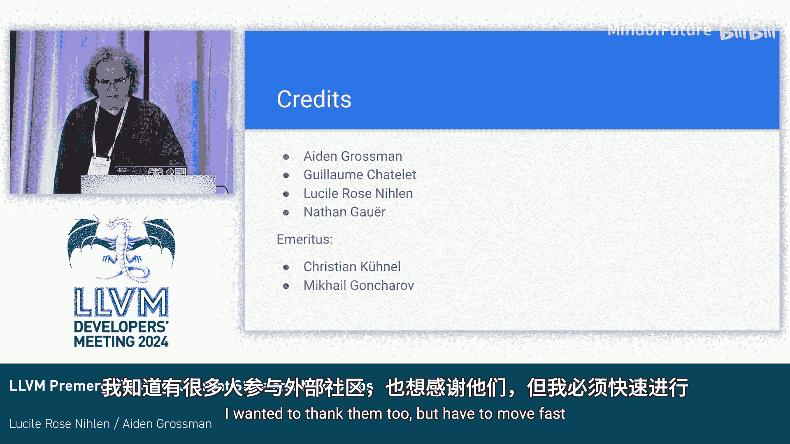

# 042：LLVM 预合并测试 - 现状与未来规划

## 概述
在本节课中，我们将学习 LLVM 项目当前的预合并测试基础设施的现状、面临的挑战，以及正在开发的新系统。我们将了解从代码提交到测试运行的完整流程，并探讨如何通过技术改进提升整个系统的效率、透明度和社区参与度。

## 当前系统：已“弃用”的架构

上一节我们概述了课程内容，本节中我们来看看 LLVM 当前正在使用的预合并测试系统。演讲者将其幽默地比作谷歌内部常说的“已弃用”的系统。

当前流程始于开发者向 GitHub 提交一个拉取请求。在 PR 页面中，会出现一个指向 **Buildkite** 的详情链接。任何用户都可以点击查看，无需特殊权限。

进入 Buildkite 页面后，你会看到测试任务的状态。例如，一个 Linux 构建任务正在队列中等待，而一个 Windows 构建任务正在执行，已运行了15分钟。

测试的核心是一个存储在 LLVM 代码库中的脚本：`docs/generate_build_pipeline_premerge`。该脚本会分析 PR 中修改的文件路径，试图判断需要运行哪些测试。脚本运行速度很快。

在这个案例中，系统判定需要在 Linux 和 Windows 上测试几乎所有组件。Windows 任务等待了9秒后开始，运行了23分钟。而 Linux 任务在等待了36分钟后，仍在队列中。

这种排队延迟在高峰期尤为严重。此前，Windows 队列延迟曾达到数小时，后来通过增加机器资源暂时缓解了问题。排队情况呈现明显的昼夜规律，与美国西海岸的工作时间高度重合。

以下是当前基础设施的工作原理：
1.  PR 提交到 GitHub。
2.  GitHub 发送 Webhook 到 Buildkite。
3.  Buildkite 执行分析脚本。
4.  Buildkite 将构建任务分派到运行在 Google Cloud Kubernetes 集群上的机器。
5.  这些机器（包括 Linux 和 Windows 节点）执行测试。

通过监控 Kubernetes 实例可以发现，这些机器在高峰期的 CPU 使用率几乎始终处于高位，资源被充分利用。

## 当前系统面临的问题

上一节我们介绍了当前系统的工作流程，本节中我们来看看这个系统存在的主要问题。演讲者列举了以下几个核心挑战：

*   **缺乏自动扩缩容**：机器始终处于运行状态。这意味着在周末等低使用期仍需支付费用，而在高峰期又因资源固定而导致排队延迟。理想情况是只在需要时才启动机器，以提高资源利用效率。
*   **缺乏分析与告警**：目前所有数据都依赖人工观察，没有系统的分析平台。我们无法定量评估平均排队时间或成功率，只能定性描述“变好”或“变差”。同时，由于没有监控告警，问题往往需要社区成员通过 Discord 等渠道手动报告才能被发现。
*   **稳定性问题**：系统需要大量人工干预来维护稳定性，例如手动重启故障机器。
*   **流程冗余**：在 LLVM 迁移到 GitHub 后，Buildkite 作为中间环节显得有些多余。直接从 GitHub 触发构建可能提高可靠性和反馈及时性。
*   **可用性与社区参与度低**：当前系统不是一个真正的社区项目。部分组件只有谷歌员工才能修改，文档陈旧且存放在独立仓库中，对社区成员不够透明和友好。

这些问题共同导致了当前基础设施的现状。

## 新系统：即将“就绪”的解决方案

上一节我们探讨了旧系统的诸多痛点，本节中我们来看看旨在解决这些问题的新系统。这套新架构由 Aden Grosman 主要开发，其核心是用 **GitHub Actions** 配合 **自托管运行器** 集群来替代 Buildkite。

新系统的工作流程如下：
1.  用户创建或更新 PR。
2.  **GitHub 工作流** 被触发。
3.  工作流任务被分派到自托管的运行器集群。
4.  集群上的 **GitHub Actions Runner Controller** 为每个工作流启动对应的运行器 Pod。
5.  这些 Pod 会被调度到已有的集群节点上，如果资源不足，**集群可以自动扩容**，增加新节点。这是相较于旧系统的一大改进。

对于 Linux 任务，系统会配置为在 Pod 中启动一个容器任务。这样做有两个关键好处：
*   允许在集群内使用 **Kaniko** 等工具构建容器镜像。
*   **允许社区任何成员修改构建环境所用的容器镜像**。而在旧系统中，镜像只能由谷歌通过 Google Cloud Build 来构建和更新。

对于 Windows 任务，由于 GitHub 目前不支持在 Windows 工作流中运行容器，因此构建直接在 Pod 内进行。未来希望实现与 Linux 类似的环境。

测试完成后，GitHub 基础设施会负责报告状态和日志。新系统的日志以分步骤的形式呈现，比 Buildkite 单一的巨型日志更易于查阅。

关于合并后测试，计划在**同一套基础设施**上运行，即也通过 GitHub Actions 和自托管运行器执行。这能确保预合并和合并后测试环境一致，避免因配置不同步导致的维护负担，并能更好地测试基础设施本身。

新系统的配置遵循 GitHub 官方推荐的最佳实践，并有详细的设计文档，这提高了项目的规范性和可维护性。

## 数据分析与可视化

上一节我们了解了新系统的架构，本节中我们来看看与之配套的数据分析平台。新系统引入了 **Grafana** 来提供强大的数据分析和可视化能力。

我们建立了一个 Grafana 实例，并创建了示例仪表盘。目前展示的指标包括：
*   **运行时与排队时间**
*   **成功率移动平均**

选择 Grafana 的原因包括：文档完善、行业标准、应用广泛。目前使用的是 Grafana 的托管服务，以确保完全遵守其开源许可。

我们计划追踪的关键指标有：
*   Linux 和 Windows 的排队延迟
*   任务运行时间（与排队延迟相关）
*   任务成功率（例如，如果95%的任务失败，则很可能是基础设施问题）
*   服务器利用率（辅助容量规划）

这个平台是开放的，社区可以提议和添加其他有用的分析维度。

## 未来规划与总结

上一节我们介绍了新系统的数据分析能力，本节中我们来看看项目的下一步计划并进行总结。

**下一步计划**：
1.  **完成初步实现**：完善分析平台和文档，确保在征求社区反馈时，大家能聚焦于未知问题而非已知缺陷。
2.  **影子发布**：计划在年底（假设存在假期代码提交放缓期）进行影子发布。届时新旧两套系统将并行运行，以验证新系统的稳定性。选择假期是希望减轻因资源加倍带来的压力。
3.  **正式切换**：当新系统被验证为“基本就绪”后，将关闭“已弃用”的旧系统。

**未来愿景**：
*   **基于数据的决策**：引入数据后，社区可以更理智地讨论资源分配问题，例如：在固定预算下，如何在排队延迟、测试覆盖范围（如是否测试 Flang）、以及 Linux 与 Windows 资源分配之间取得平衡。
*   **提升社区参与**：开放系统，让更多社区成员能够参与维护和扩展。
*   **建立清晰的告警与升级路径**：改变目前依赖非正式渠道（如 Discord @某人）报告问题的状况，实现主动告警。

**总结**：
本节课中我们一起学习了 LLVM 预合并测试的演进。我们从当前基于 Buildkite 的、面临扩容、分析和社区参与挑战的系统出发，深入探讨了新的基于 GitHub Actions 和自托管运行器的解决方案。新系统带来了自动扩缩容、强大的 Grafana 数据分析、更高的社区可参与度以及更规范的文档。项目正朝着在年底进行影子发布并最终替换旧系统的目标迈进，旨在为 LLVM 社区提供一个更可靠、透明和高效的基础设施。