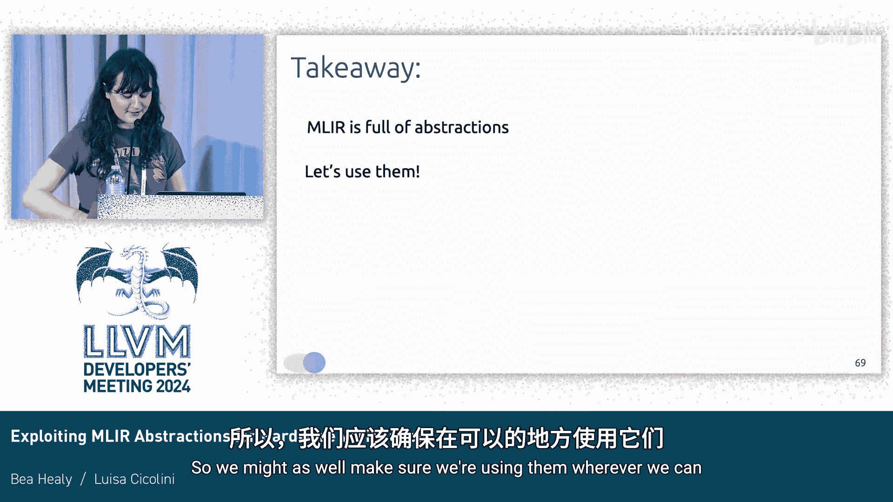

# 044：利用MLIR抽象提升硬件验证效率

在本节课中，我们将学习如何利用MLIR中的高级抽象来改进硬件验证流程。我们将从硬件设计的角度出发，探讨如何通过保留高层次结构信息，使形式化验证变得更高效、更直观。

## 硬件设计流程与挑战

大家好，我是B。这位是Louisa。我们将讨论如何利用抽象来改进硬件验证。这并非硬件领域特有的问题，只是我们从这个角度切入。

首先，我们会重点介绍Circuit项目。对于不熟悉Circuit的听众，我先做一个简要介绍。

如果你在设计硬件，通常会使用SystemVerilog或VHDL这类低级语言。很多时候你会直接使用它们，有时也会使用高级语言，但最终都需要将这些设计输入到EDA工具中。

流程大致如下：你设计了一个CPU，然后说“我觉得设计对了，但不确定”。于是你会进行仿真。将设计输入给编译器和优化器，运行仿真。之后，你可能想把它放到FPGA上，或者制成芯片。这时，通常需要一个全新的编译器和优化器来进行综合，生成实际的硬件。

你可能会想：“我还是不确定设计是否正确，我想做一些形式化验证，比如逻辑等价性检查或模型检测。”同样，你往往会看到完全独立的工具链来处理这些任务，尤其是在开源领域。显然，我们不希望这样。这意味着你需要学习大量工具，没有真正的代码复用，一切都被重复实现，存在大量冗余。我们迫切需要一个工具来改善这种状况。

## Circuit项目与MLIR

在Circuit项目中，我们使用MLIR来解决这个问题。我们有一个Circuit核心方言，它代表了寄存器传输级（RTL），包含门电路、寄存器等。所有设计在流向各种后端工具时，都会经过这个中心表示层。实际上，许多后端工具我们已经在MLIR中提供了。

实际流程看起来更复杂，包含一些导入和导出方言以及不同的表示形式。但为了便于理解，我们现在可以将其简化为这个核心概念。

## 标准验证流程：边界模型检查

接下来，我快速介绍一下Circuit中的标准验证流程。我们有一个叫`circuit-bmc`的工具，它执行RTL级别的模型检查。

假设你有一些寄存器和逻辑门，比如一个与门连接到一个寄存器。这个设计会被转换成一堆SMT公式。对于不熟悉SMT求解器的听众，简单来说，SMT求解器接收一组方程，并检查是否存在一组赋值能使这些方程成立。

我们将设计转换为SMT公式，所有MLIR值都变成SMT变量。然后，我们按时钟周期展开设计。在周期0，我们问：“当前设计状态是否违反了我希望它满足的属性？” 希望SMT求解器回答：“我找不到任何破坏该属性的情况。” 然后我们继续问周期1、周期2，依此类推，直到达到设定的边界。希望在整个过程中都找不到违反属性的情况。这被称为**边界模型检查**。

Circuit提供了`circuit-bmc`来执行此操作。此外还有很多其他工具，例如针对SystemVerilog的验证后端，以及针对硬件模型检查通用表示形式BTOR2的后端，该后端可以对接ABCT、UCLID等众多工具。如果你在验证硬件，选择非常丰富。

## 高层次抽象的挑战与机遇

问题在于，如果你有一个高级方言，比如这个**FSM方言**（有限状态机方言）。它可能来自高级综合工具或我们的Python前端。你仍然可以走上述验证流程，但问题在于，FSM方言包含了许多对验证非常有用的**结构信息**。当你将其降级到核心方言时，这些结构信息就丢失了，而这部分信息非常有价值。

我举一个直观的例子。假设我们有一个FSM，变量X初始为0。从状态A转到状态B时，X递增。从状态B转回状态A时，X递减。可以看出X在0和1之间切换，永远不会大于1。如果我们有一个状态C，其进入条件是`X > 1`，然后问“状态C是否可达？”答案显然是否定的。对于求解器来说，解决这类问题有清晰的结构。

但如果面对的是RTL表示，它就像一个混乱的大电路，问题就变得复杂得多，查询起来也不那么清晰。我相信大家都会同意，如果给我这个电路图、一支笔和一张纸，让我判断X是否能大于1，我需要花更长的时间。

## 解决方案：直接从高级抽象生成验证模型

因此，我们的做法是：目前，我们并不关心下游那些RTL的具体细节。我们将**直接从FSM生成SMT模型**。这意味着我们可以在模型中保持原有的结构。我们这样做是为了绕过从FSM到核心方言的降级步骤，直接进入SMT验证。

需要强调的是，这不一定只适用于硬件。它同样适用于从CIRCT到LLVM，或者从FIR到LLVM的流程。但在本例中，我们是从FSM到SMT。接下来，Louisa将详细介绍我们使用的模型。

## FSM方言结构与SMT建模

我们已经看到Circuit包含了一些高级方言，允许我们表示不同的硬件抽象。现在的问题是：我们能否在高级别上获取一些对验证有用的信息？特别是，是否存在一些有用的属性，可以在降级之前通过查看FSM来检查？

为了回答这个问题，我们引入了一种降级方法，将FSM转换为SMT模型。我们希望通过这种降级，创建一个描述有限状态机行为的SMT模型，然后在这个模型上检查一些属性，这些属性将保证FSM的行为符合预期。

在深入降级细节之前，我们先看看FSM方言的结构。FSM方言具有非常规整的结构：在FSM作用域内存在一些变量；有一些状态；每个状态可以产生一个或多个输出，并可以有一个或多个转移。每个转移可以由一个**守卫条件**激活，并可以引发一个**动作**，从而更新FSM作用域内的变量。

考虑一个例子：一个从状态A到状态B的转移，当满足守卫条件G时激活，并执行动作A来更新变量。

当我们想要描述一个有限状态机的状态时，首先需要引入一个**时间模型**。我们需要一个离散的时间模型，以便说明在某个特定时间，某个状态在FSM中是活跃的还是非活跃的。同样，我们需要描述FSM在某个时间步接收到的输入。

总的来说，为了完整描述FSM的状态，我们引入一个**布尔未解释函数**，它是变量和时间的函数。当这个函数返回`true`时，我们知道该状态在那个时间是活跃的；返回`false`时则不活跃。

我们对转移的**目标状态**也做同样处理，该状态将在时间`T+1`到达，并拥有另一组作为时间`T+1`函数的输入。我们引入另一个未解释布尔函数。

现在的问题是：如何连接它们以表示实际的转移？我们通过一个**蕴含关系**来连接。这个大的蕴含式表示：如果状态A在时间T是活跃的，并且守卫条件在此时得到满足，那么就意味着在时间`T+1`，转移的目标状态B将是活跃的。

在查看这个蕴含式时，有两点很重要：首先，我们只考虑用于描述输入和状态的**未解释布尔函数**。另一个重要方面是，这个蕴含式只规定了状态激活的**必要条件**。在设计我们想要在此模型上检查的属性时，牢记这一点非常重要。

## 在SMT模型上验证属性

说到属性，我们想要检查的第一类属性是**活性属性**。我们已经转换了模型中的所有转移，我们想检查在FSM的遍历过程中，最终是否会必然到达某个特定状态。我们如何编码这个属性呢？我们再次使用蕴含式。我们说：对于所有时间步和所有变量值，表示该状态的函数蕴含`false`。我们可以将这个蕴含式表示为合取形式并进一步简化表达式。如果求解器对此属性返回`unsat`，则意味着在FSM遍历的某个时间点，该状态**必然会被到达**。

考虑一个简单的有限状态机，初始状态为S0。我们想检查在任何情况下，是否总会到达状态SN。我们可以遍历这个FSM，每当我们到达状态N，并且是被迫到达的，求解器就会返回结果，从而保证SN会在执行的某个时间点被到达。

接下来是**安全性属性**。我们同样希望检查某个条件在FSM的整个遍历过程中是否始终成立。例如，某个变量在某个特定状态下是否总是具有某个特定值。

在这种情况下，我们也希望将此属性表示为蕴含式：处于某个特定状态意味着某个变量具有特定值。然而，此时我们期望得到一个`sat`结果。管理这类结果在我们的模型中仍是一项进行中的工作，因为我们仍在研究如何更好地表达这种属性，以便SMT求解器能够处理它们。

## 测试与性能评估

我们如何测试整个基础设施？我们考虑了两个主要基准测试：第一个来自硬件综合项目“Lord of the Race”的真实FSM；第二个是我们构建的线性FSM合成基准，用于评估我们模型的扩展性。

首先，我们将FSM转换为SMT方言，并以SMT-Lib格式导出。然后，我们使用Z3检查这些SMT格式文件。同时，我们将Z3的性能与`circuit-bmc`进行比较：我们将相同的有限状态机降级到核心方言，并使用`circuit-bmc`检查相同的属性。让我们看看结果如何。

这些是相当初步的结果，请谨慎看待。在左侧我们有真实FSM的结果，右侧是合成FSM的结果。红线代表1倍速基线，绿条代表加速比。事实证明，FSM的结构确实非常有价值，SMT求解器能够以更高效的方式逐步处理。值得一提的是，我们是在与边界模型检查进行比较。为了不让边界模型检查处于劣势，我们给了它一个相当低的时间边界；在实践中，你可能会设置更高的边界。但总的来说，**直接使用FSM抽象进行验证更快**。

## 确保模型等价性：翻译验证

下一个问题是如何信任我们的方法？显然，我们看起来值得信赖，但我们要声称这个SMT模型和核心方言模型是等价的。在验证硬件时，这是一个相当大的信任跨越。因此，当前进行中的验证方法是**边界展开翻译验证**。

想法相当简单：我们基本上有这个FSM的SMT模型和这个核心方言表示。我们一步一步地按周期进行，因为RTL边界模型检查是按周期进行的。在每个周期，我们会从FSM得到一个X值，从电路（核心方言）得到另一个X值。我们基本上就是问SMT求解器：这两个输出是否总是等价的？是否存在它们可能不同的例子？然后我们逐步检查时间1、时间2，依此类推，直到达到一个边界，以基本确认这两个模型在功能上是等价的，正如我们所希望的那样。

## 总结与展望

我们的工作还处于早期阶段，但基本的结论是：MLIR拥有大量抽象，但它们并不总是被充分利用。我们不妨确保在任何可能的地方使用它们。它们可能非常有用，并且可以使验证变得非常快速。

谢谢。

谢谢。请大家提问。看来大家都准备好去吃午饭了。我有一个问题。

你说你检查两者，比如高级和低级表示，在每个状态下是否等价。我假设你实际上发现它们是等价的。这正是我们所期望的，就像我说的，这是进行中的工作。我省略了一些细节，可能会有变化。但在这个特性上游之前，我们计划完成这项工作，使其值得信赖。非常酷。谢谢。谢谢Bill和Louisa。

---

**本节课总结**：
在本节课中，我们一起学习了如何利用MLIR中的高级抽象（特别是FSM方言）来提升硬件验证的效率和直观性。我们探讨了传统硬件验证流程的冗余问题，介绍了Circuit项目如何利用MLIR作为中心表示层。重点讲解了绕过RTL降级、直接从FSM生成SMT模型的方法，以及如何在该模型上编码和验证活性与安全性属性。通过性能对比，我们看到了保留高级结构信息带来的显著加速。最后，我们了解了通过翻译验证来确保不同抽象层级模型等价性的重要性。核心在于充分利用现有抽象，避免信息丢失，从而构建更高效、可信的验证流程。