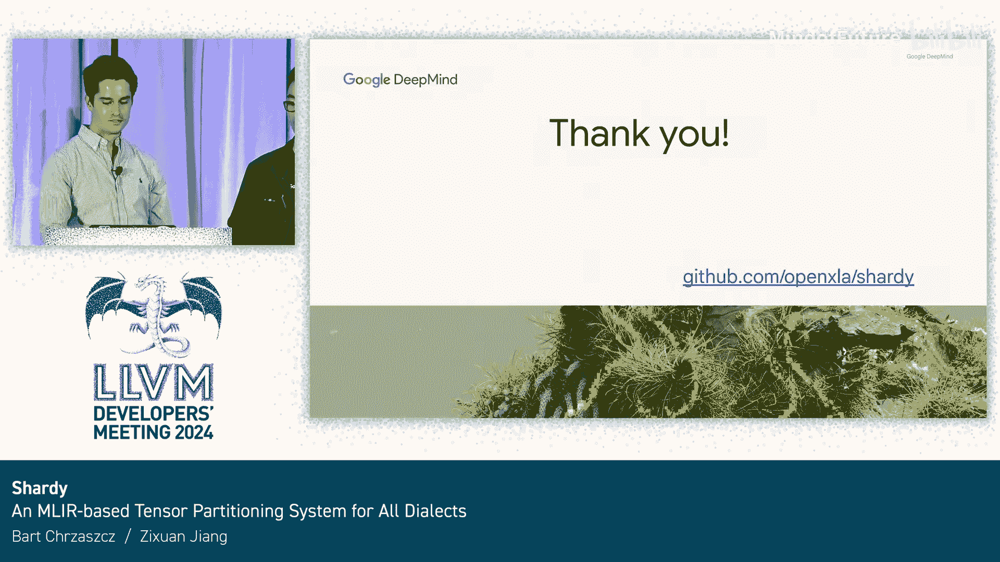

# 046：一个基于MLIR的、面向所有方言的张量分区系统


## 概述

在本教程中，我们将学习Shardy，一个由Google和Google DeepMind在过去一年中开发的开源、基于MLIR的张量传播与分区系统。我们将了解其设计背景、核心概念、工作原理以及如何应用它来高效地在大规模设备上部署大型AI模型。

---

## 背景：为何需要张量分区

上一节我们介绍了Shardy的定位，本节中我们来看看它要解决的核心问题。

像Gemini、ChatGPT这类生成文本、图像、音频和视频的大型生成式AI模型，其规模极其庞大，内部包含海量的矩阵乘法运算。单个设备无法容纳整个模型，因此公司需要将模型部署在成千上万个设备上。

为了理解如何部署，我们需要了解加速器的设置方式。虽然Google的TPU和NVIDIA的GPU存在差异，但简而言之，它们都拥有各种高速内部连接，使得加速器之间可以相互通信。

然而，这只是物理系统的设置。当研究人员将模型分布到多个芯片上时，他们操作的是一个被称为**逻辑网格**的抽象层，它隐藏了底层硬件拓扑的细节。当然，你需要考虑大型系统中可能存在的不同连接速度，因为并非所有连接速度都完全相同。

以下是两种常见的分布策略（从现在起我称之为分片策略）：
*   **批量并行**：将样本拆分到多个芯片上，以并行计算预测结果。
*   **张量并行**：将模型的参数张量拆分到多个设备上，在通信汇总之前计算部分激活值。

例如，在进行批量并行时，设备的每一行获得一个唯一的样本切片。在进行张量并行时，每一列获得参数张量的一个唯一切片。你可以将每一行视为拥有分布在这三个设备上的完整模型，而每一列则计算其所有样本上的激活子集。

---

## 现有系统概览

上一节我们了解了分区的必要性，本节中我们来看看现有的一些自动化分区系统，以便更好地理解Shardy的设计出发点。

让我们快速看一个在4x2网格上进行张量并行的程序示例。我们看一个只做两次矩阵乘法的超小程序，这里展示的是分区传播后的最终程序。每个设备将看到...我们使用一种策略，让我们在被迫对所有主机上的第二个矩阵乘法的收缩维度进行求和之前，可以并行计算这两个矩阵乘法。这里的`%p1`被分片了。为此，我们需要分片`%p1`、`%parameter1`和`%parameter2`中高亮显示的维度。

现在，在分区传播之后，你可以看到在第二个矩阵乘法的收缩维度上添加了`all_reduce`操作，因为它被分片了。这很巧妙。但我们有系统为我们完成这一切，所以我们不需要修改图中的每一个操作并手动添加集合通信。

以下是现有的一些系统，我们将重点关注分片传播部分，而非分区或SPMD化部分。

*   **GSPMD**：这是这类系统中的先驱。它是一个基于属性的传播系统，不使用网格轴名称，并按照预定义的顺序传播操作。它内置了相当广泛的分片冲突解决策略。
*   **PartIR**：它不传播分片属性，而是将程序重写为我们称为**平铺循环**的结构。它使用网格上的命名轴，拥有一个数据结构来告诉系统如何对任意操作进行分片，但没有冲突解决策略，因为它要求用户将分片策略定义为单独的传播过程。
*   **Mesh Dialect**：它正在上游化到MLIR中，是用于传播的操作和属性的组合。它不使用轴名称，只使用网格上的轴大小，并要求用户实现一个接口来告诉系统如何通过一个操作进行传播。

---

## 引入Shardy

上一节我们回顾了现有系统，本节中我们将正式介绍Shardy，看看它如何博采众长。

我们引入的Shardy借鉴了GSPMD和PartIR的许多思想：
*   我们像GSPMD一样使用带有命名轴的网格进行传播。
*   我们像PartIR一样使用基于操作和基于区域的传播。
*   我们也像Mesh Dialect一样有一个接口来告诉我们如何分片，但其数据结构更接近PartIR，我们很快就会看到具体是什么样子。

---

## Shardy的核心：新的分片表示与API

上一节我们介绍了Shardy的设计理念，本节中我们来深入了解其核心的分片表示和为用户简化标注而定义的API。

首先介绍新的分片表示。我们定义了一组运行时API，以方便用户进行标注。

**分片表示概述**
分片信息作为操作的属性存在，描述了操作的结果如何被分区。它通常绑定到一个特定的网格。例如：
```mlir
// 分片属性示例
#shard = #shardy.sharding<mesh = @mesh, partitions = [("x", 2), ("y", 4)]>
```
在这个例子中，分片绑定到`@mesh`网格。第一个维度沿着`x`轴分区，然后沿着`y`轴。第二个维度没有沿着任何轴分片，意味着这个维度是完全复制的。而`z`轴在这个分片中没有被使用，意味着对于这个张量，它在`z`轴上是隐式复制的。

**定义传播的源与目标**
*   **源端**：我们定义了**显式复制轴**（不能用于进一步分区张量）和**就地复制轴**（可以用于进一步分区张量，即在传播阶段要传播的轴）。
*   **目标端**：我们定义维度是**开放**的还是**封闭**的。开放维度可以进一步使用轴进行分片，而封闭维度则不能。源只能是就地复制轴，目标只能是开放维度。

**用户优先级**
我们为用户提供了优先级。这些优先级可用于确定传播顺序，为用户提供更多控制和更好的可调试性。例如，用户可以更容易地实现不同层次的传播：在最高优先级实现批量并行，然后是微批次分片，最后是零冗余分片。优先级可以附加到分片标注上，如右侧示例所示，`P0`表示该分片标注具有最高的传播优先级。

**分片规则**
我们定义了**分片规则**，它可视化和简化了传播算法。分片规则展示了不同张量维度之间的关系。以点积为例，其分片规则本质上就是它的爱因斯坦求和标记。我们可以使用这些标记轻松定义批次维度、非收缩维度和收缩维度。这更容易可视化，如下一节我们将展示如何沿着因子传播分片。这些策略规则提供了这种分片关系的可视化。

我们支持三个方向的传播：
1.  **前向传播**：从操作数传播到结果。
2.  **后向传播**：从结果传播到操作数。
3.  **侧向传播**：在不同操作数或不同结果之间传播。

---

## 分片传播算法详解

上一节我们定义了分片规则，本节中我们来看看如何利用这些新API进行分片传播。

下图概述了我们如何传播分片。本质上，我们沿着**因子**传播分片。为此，我们有三个关键步骤：
1.  将维度分片投影到因子分片空间。
2.  沿着因子传播分片。
3.  将因子分片投影回维度分片空间。

正如前面提到的，维度分片和因子分片之间的关系由分片规则界定。

让我们以`dot_general`操作的一个非常简化的版本为例。它有两个非收缩维度（`I`, `J`）和一个收缩维度（`K`）。其分片规则等价于爱因斯坦标记 `[I, K] * [K, J] -> [I, J]`。

**第一步：投影到因子空间**
处理传播的第一步是将分片从维度空间投影到因子空间。为此，我们使用分片规则（即 `I, K, J`）。我们投影到结果，它对应两个非收缩维度。对于每个因子，我们也有其大小，对应于原始维度的大小。利用这些分片规则，我们可以将维度分片从维度空间投影到因子空间。在这个例子中，我们有三个因子（`I`, `K`, `J`）。由于我们只在左侧输入有分片轴，我们可以用相应的轴填充这个表格。注意，几个张量并不包含所有因子。例如，左侧输入不包含右侧输入的非收缩维度，这意味着因子`J`在左侧输入中缺失。

**第二步：沿因子传播分片**
首先，我们可以沿着因子`I`传播分片，因为没有冲突，我们将直接沿着这一列传播`batch`轴。类似地，我们可以沿着因子`K`传播`tensor`轴。

**第三步：投影回维度空间**
第三步，我们将向量分片投影回维度空间，以形成原始的张量分片。由于因子分片和维度分片之间的关系由这些分片规则形成，我们可以直接映射回维度空间。在这个例子中，右侧输入将获得沿着因子`K`的`tensor`轴分片，而结果将获得沿着因子`I`的`batch`轴分片。

---

## 冲突解决策略

上一节的例子不包含任何冲突解决需求，因为表格的每一列或每一行都没有重复的轴。本节中，我们进一步开发了一个完整的层次结构来解决这些冲突。

1.  **用户优先级传播**：用户可以定义特定标注的优先级。我们首先处理最高优先级的分片，然后逐步处理较低优先级的分片。这样，用户可以轻松实现批量并行和零冗余分片等标注层次。
2.  **操作优先级传播**：这是一种启发式方法，借鉴自GSPMD。我们会先处理特定的“直通”操作，然后逐步处理更复杂的操作。例如，我们总是先传播逐元素操作，而点积操作的优先级则低于逐元素操作。
3.  **单优先级内冲突解决**：我们开发了多种不同的策略来解决同一优先级内的冲突。例如，当我们在不同因子间发生冲突，或者在同一列内发生冲突时（无法轻松地沿单列传播`batch`轴），我们会应用特定策略。
4.  **基础传播层**：这是应用特定策略并在因子分片空间中沿因子传播分片的基本层。

我们想强调的是，所有这些过程都遵循相同的接口。我们将基础传播层扩展到最高层，使得所有这些传播策略都遵循相同的接口，外层只是内层的派生类。

---

## 实现方言无关性

上一节我们讨论了传播算法，本节中我们来看看Shardy如何实现其长期目标——成为一个与方言无关的独立组件。

目前，Shardy依赖于StableHLO，但我们正在通过各种抽象和接口来解除这种依赖。

*   **分片规则**：正如之前讨论的，这个属性编码了我们如何通过特定操作进行传播。只要一个操作实现了这个接口，Shardy就能够通过它进行传播。
*   **基于区域的操作**：例如`scf.while`、`scf.for`等循环操作，情况更复杂。我们需要确保能够传入和传出这些区域进行传播。分片规则不足以处理这种情况，因为它们只描述了操作数和结果之间的对应关系，而区域操作没有这种关系。因此，我们定义了一个 **`ShardableDataflowOpInterface`** 接口，用户可以通过定义各种方法来告诉我们哪些值（操作数、区域入口块参数、区域终止符操作的操作数、操作结果）拥有分片信息。
*   **常量拆分**：在MLIR中看到的大多数张量程序中，常量只有一个实例，被所有需要该值的操作重用。当常量需求相同时，这是合理的。然而，在对程序进行分片时，我们希望每个使用处都拥有它具体需要的常量，而不受其他操作如何使用该常量的影响。换句话说，我们希望允许常量的每个使用处，如果请求的话，可以拥有一个不同的分片常量。例如，在右侧，如果加法操作被分片了，为什么计算不同部分的除法操作也要以同样的方式分片常量呢？这并不合理。我们称之为**假依赖**，因为每个常量都很廉价，而使用相同常量的操作之间存在真正的依赖关系。因此，我们要求用户告诉我们什么是他们的常量操作，以及哪些操作是常量类（如`iota`）和哪些操作是可折叠的。
*   **可配置的传播顺序**：回顾一下，GSPMD有基于操作类别的传播顺序（例如先传播逐元素操作，然后是MatMul等）。这需要最终用户进行配置，因为我们不了解他们的方言和操作。因此，我们只需要用户按他们希望分片传播的顺序传递一个操作列表。

以上就是使Shardy传播工作所需的一切。对于SPMD化或分区过程（主要是集合通信），可能需要更多工作，这将是我们明年的重点。

---

## 调试与可视化工具

上一节我们讨论了如何使Shardy工作，本节中我们来看看其另一个主要优势——改进的可调试性和可解释性。

我们已经基本完成了核心传播算法的工作，因此开始着手为用户创建调试工具，以理解传播过程。这里我们描述一个我们正在开发的工具。

**背景**：Google在5月份开源了一个名为 **Model Explorer** 的工具，它可以可视化包括MLIR在内的不同图类型，并且速度极快。你们中的一些人可能已经在刚过去的周二的MLIR研讨会上看到了这个演讲。

由于传播处理的是这些巨大的图，我们希望利用它来帮助用户理解他们的分片来自何处。回顾一下，最终用户只在他们的函数输入、输出和一些中间值上用少量分片属性标注他们的图，然后由Shardy在整个图中传播它们。

例如，这里展示了一个传播后的MLIR图。看着那个乘法操作，我们真的能确定轴`A`和`B`来自哪里吗？不能。

因此，我们希望在MLIR重写模式执行此传播期间存储额外信息，并在图之上保存元数据，让我们能够可视化每个轴的来源轨迹。在这里，我们看到轴`A`通过`dot_general`和`add`操作最终来自`input0`，而轴`B`来自图的输出。

我们实现的方式是使用 **MLIR Action Tracing框架**。当我们要更新一个操作的操作数或结果的分片时，我们创建一个Action，它计算出操作本地的轨迹信息。然后我们有一个处理器为整个程序保存这些信息。传播完成后，我们将保存这些信息供Model Explorer理解。

---

## 如何使用Shardy

上一节我们介绍了调试工具，本节中我们来看看目前如何体验Shardy。

目前，Shardy依赖于StableHLO。用户可以指定一个带有部分分片标注的StableHLO模块作为输入。用户可以使用我们上面讨论的API或特定的API来指定部分标注。特定的API用于演示用户如何希望对几个操作进行分区。

然后，我们将应用传播流水线将分片传播到整个图。你可以使用Python API或直接在模块上使用C++ pass来处理带有部分标注的模块。最终，结果将是一个分片遍布整个图的模块。

**例如**，现在你可以直接在JAX中体验分片。你只需启用相关标志，使用分片分区器，并结合原始的JAX分片相关API（例如`jax.named_sharding`、`jax.sharding.Mesh`、`jax.ShardingConstraint`等）。我们将直接将其降低到Shardy的表示形式。例如，我们将`named_sharding`降低为`#shardy.sharding`属性，将`jax.sharding.Mesh`降低为`#shardy.mesh`，将`jax.ShardingConstraint`降低为`#shardy.constraint`。然后，我们可以直接在带有部分分片的模块上应用传播流水线。

进一步，我们将应用由XLA和其他XLA passes提供的分区器，以获得在不同硬件后端上的机器码。

---

## 未来计划

上一节我们介绍了当前的使用方式，本节中我们展望一下Shardy的未来发展方向。

以下是几个我们想要探索的未来计划方向：
1.  **实现分区器**：我们希望在Shardy中使用原始的Shardy方言来实现和设计分区器，这将是我们明年的主要重点。
2.  **扩展对其他ML框架的支持**：我们希望能扩展对PyTorch等其他ML框架的支持。目前Shardy依赖于使用Bazel构建整个系统，对CMake的支持正在进行中。
3.  **完全实现方言无关**：我们希望使Shardy完全与方言无关，并将其与当前的StableHLO解耦。

---

## 总结



在本教程中，我们一起学习了Shardy，一个基于MLIR的张量分区系统。我们了解了工程师如何使用分区技术将大型AI模型扩展到成千上万的设备上，也接触了MLIR中一些有趣的工具，如Action Tracing和Model Explorer。最后，我们希望你能尝试使用Shardy。