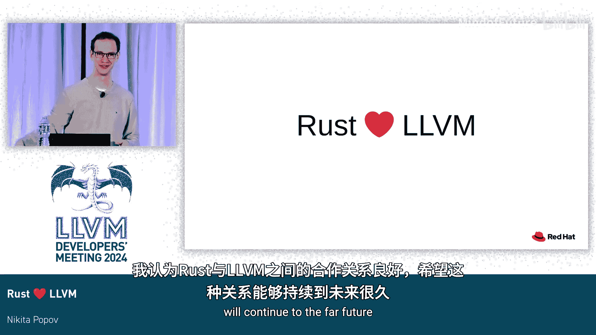

# 048：Rust与LLVM的合作与挑战

在本节课中，我们将探讨Rust编程语言与LLVM编译器基础设施项目之间的协作关系。我们将了解Rust如何利用LLVM生成高效代码，以及双方在合作过程中面临的主要挑战，包括编译时间、运行时性能和正确性等方面。

## 高层概述：治理与流程

上一节我们介绍了课程主题，本节中我们来看看Rust与LLVM在组织和流程层面的协作。

Rust项目由多个团队组成，其中两个关键团队是编译器团队和语言团队。在编译器团队之下，设有LLVM工作组，负责处理所有与LLVM相关的事务。LLVM工作组一方面与上游LLVM项目合作，另一方面主要与操作语义团队协作，因为Rust的语义建立在LLVM语义之上，需要确保两者保持一致。

从个人角度而言，我是Rust侧LLVM工作组的负责人，同时也是上游LLVM项目的首席维护者。我的工作主要涉及LLVM版本升级、解答问题，并在上游LLVM项目中处理影响Rust的问题，代表Rust社区的利益。

Rust通常积极采用新的LLVM版本，主要得益于Google维护的集成构建系统，该系统将Rust主线与LLVM主线结合，确保其持续构建和工作。官方Rust二进制文件倾向于使用最新发布的LLVM版本，目前是LLVM 19，同时也会支持一两个旧版本供Linux发行版使用。

需要强调的是，当我们提到LLVM时，指的是未经修改的上游LLVM。我们有自己的LLVM分支，但仅用于版本管理，不希望有任何Rust特定的补丁。我们希望所有对Rust的支持都集成在上游LLVM项目中。

## 编译流程：从Rust代码到机器码

上一节我们了解了组织架构，本节中我们来看看Rust代码是如何通过LLVM转换为可执行代码的。

从Rust代码到LLVM的流程非常简单。我们从左侧的Rust代码开始，然后降级到称为MIR的中级中间表示，接着转换为LLVM IR，最后由LLVM施展其“魔法”进行优化和代码生成。

如今，LLVM不再是唯一受支持的后端。它是默认后端，但存在一些替代方案。其中之一是Cranelift，它来自WebAssembly生态系统，能够更快地生成未优化的构建。另一方面，GCC后端主要用于针对LLVM本身不支持的架构。后端系统是可扩展的，因此存在更多后端，例如针对.NET CLR的后端，但上述三个是重要的。

最后值得注意的是，如今Rust不再完全依赖LLVM优化。它在MIR级别也有少量自己的优化，其原因将在后面更详细地说明。

## 挑战一：编译时间

上一节我们概述了编译流程，本节中我们来看看使用LLVM时Rust面临的首要挑战：编译时间。

编译时间可能是所有Rust开发者持续抱怨最多的问题。即使它不是最重要的问题，也可能是最紧迫的问题。

Rust编译缓慢的原因有很多。其中之一更多是社会性而非技术性问题。因为Rust有自己的包管理器Cargo，添加一个额外的依赖非常容易，但这可能会拉入20个其他依赖，所有这些代码都必须编译。这有其优点，但在构建时间方面绝对是个问题。

以下是更技术性的方面：

*   **编译单元与并行性**：在C和C++中，编译单元是单个文件。因此，对于包含许多文件的大型项目，编译基本上是一个“令人尴尬的并行”问题，可以轻松地通过并行编译所有文件来充分利用多核构建服务器。在Rust中，这并不容易，因为Rust的编译单元是crate，而crate由许多文件组成，通常可以包含大量代码。LLVM本身不支持内部并行性。因此，Rust通过将crate人工拆分为代码生成单元来并行优化它们。但这样做会损失优化效果，所以主要通过结合链接时优化来恢复这些优化。最终结果是优化质量比整体编译稍差，并且总体上做了更多工作，但在大多数情况下，并行化的好处仍然值得。
*   **泛型与代码膨胀**：Rust泛型和C++模板在这方面工作方式相同。如果你有一个泛型函数并用三种不同的类型使用它，实际上会创建该函数的三个副本。LLVM优化这些副本时，必须对每个副本应用相同的优化。改进方法是先在多态级别进行一些优化，然后再处理各个副本。任何在多态级别进行的优化都能节省单态级别的时间。这正是Rust进行MIR优化的原因。当然，在Rust中直接进行优化还有其他原因，但编译时间是目前的主要动机。
*   **LLVM自身的速度**：Rust编译缓慢的最后一个原因是LLVM本身就很慢。除了让LLVM更快之外，我们对此无能为力。LLVM 10升级对Rust来说是一个警钟，当时出现了大量10%到150%范围内的性能回归。这是LLVM启用内存SSA的版本，也是导致这些回归的原因。这促使我开始在LLVM侧跟踪编译时间，以便我们能看到每个提交的影响，而不是六个月开发工作的结果。自那以后，总体趋势是向下的。LLVM 19升级尤其显著，我们在那次升级中看到了10%到15%范围内的许多改进。

## 挑战二：运行时性能

上一节我们讨论了编译时间，本节中我们来看看第二个挑战：运行时性能。

理论上，符合Rust习惯的代码应该比符合C++习惯的代码更快。原因之一是Rust语言提供了更强的保证，特别是在指针别名方面，这对优化非常有用。当然，理论和实践并不总是一致。目前，我认为Rust的性能承诺在实践中并未完全实现。

原因如下：

*   **边界检查消除**：为了确保内存安全，部分工作可以在编译时完成，但部分必须通过运行时检查进行。在大多数情况下，这些运行时检查可以被优化掉，但这并不总是可靠发生。从程序员的角度来看，很难预测边界检查何时会被优化掉，何时不会。LLVM目前擅长优化具有常量上限和直线代码的边界检查，但不擅长优化循环内的边界检查，而这恰恰是最重要的情况，因为这些检查会被频繁执行，并且会阻碍其他优化，例如向量化。
*   **内存复制消除**：在C++中，返回值优化允许在语言级别避免许多拷贝。Rust没有这个特性，因此会发出大量内存拷贝，并依赖LLVM来优化掉它们。近年来LLVM在这方面有了很大改进，但仍有改进空间，特别是对于小型对象拷贝。
*   **特定优化问题**：Rust有两种类型的范围：不包含上界的独占范围和包含上界的包含范围。独占范围的优化效果比包含范围好得多，尽管从程序角度来看它们看起来基本相同。原因是包含范围在循环中有一个条件增量，而LLVM无法很好地处理这种情况。要解决这个问题，可能需要在LLVM中进行一些相当Rust特定的优化。

更有趣的方面是更普遍的问题：Rust语言有所有这些非常强的保证，我们希望教会LLVM这些保证，以便LLVM能利用它们进行优化。这是通过多种不同机制完成的，如指令标志、属性、元数据假设。Rust成功地使用了所有这些机制，并启用了许多优化。这个领域的一个问题是，元数据和属性在优化过程中很容易丢失。相反，假设则存在相反的问题，因为LLVM会尽力保留这些假设，即使它们不再有用。这是一个非常困难的权衡，我认为LLVM尚未达到这个权衡的最佳点。当然，我们一开始就没有足够的属性来告诉LLVM所有Rust保证的语义。不过，随着时间的推移，越来越多的属性被添加进来。

以下是几个例子：

*   **分配器属性**：允许我们告诉LLVM关于自定义分配函数的信息。
*   **范围属性**：允许我们告知函数参数的输入范围是有限的。
*   **`noundef`和`nowrite`**：用于改进内存拷贝消除。
*   **`getelementptr inbounds`**：告诉LLVM数组索引可以为负。

我想强调的一个共同点是，虽然所有这些事情的动机可能来自Rust的需求，但它们也总是有益于C++和其他语言的优化。我认为我们从未遇到过为Rust添加某些属性，而不同时帮助LLVM其他用户的情况。

## 挑战三：正确性

上一节我们探讨了性能优化，本节中我们来看看最后一个也是最重要的挑战：正确性。

如果Rust真正关心一件事，那就是正确性、安全性、可靠性、稳定性。这里需要强调的重要一点是，最终，Rust的语义必须以某种方式基于LLVM的语义。因此，我们为Rust选择的任何语义都必须得到LLVM的支持，并且不仅仅是支持，还要有良好的优化质量支持。这个领域的一个风险因素是，LLVM有相当一部分语义要么未指定，要么完全未决定。经典的例子是来源。我们知道在LLVM中我们有来源，但细节都未确定。当然，如果底层的LLVM语义未知，就很难指定明确的Rust语义。其次，Rust只能和LLVM一样正确，而LLVM有相当数量的已知错误编译案例，即LLVM生成不正确代码的情况。需要说明的是，这些情况通常是问题很难修复，并且在实践中不太可能影响任何人。所以我会说这些是理论上的错误编译。但Rust开发者很特别，他们不喜欢任何错误编译，即使它们主要是理论上的。我不想在这里给人错误的印象，这不是LLVM特有的问题。Rust肯定也有自己目前未指定和未决定的语义，Rust也有自己的健全性错误。因此，为了得到一个整体上健全的系统，必须在两个项目中都解决这个问题。

我想举几个历史例子，说明Rust的正确性如何受到LLVM侧问题的显著影响：

*   **无限循环语义**：在C和C++中，不包含副作用的无限循环是未定义行为。历史上，LLVM采用了相同的C++语义，这对Rust来说是个问题，因为Rust的无限循环是明确定义的。最终发生的情况是，LLVM语义被更改，现在默认情况下无限循环是明确定义的。相反，你可以指定`mustprogress`属性来选择加入C++的前向进展保证。这样我们两全其美：Rust获得了明确定义的无限循环，而C和C++可以保留甚至增加基于前向进展的优化。
*   **别名保证与`noalias`属性**：Rust有非常强的别名保证。这可以在LLVM中使用`noalias`属性来表示，这是一个预先存在的属性，因为相同的语义也存在于C中，使用`restrict`限定符。区别在于，在C中`restrict`很少使用，而在Rust中，基本上所有东西都是`restrict`。当Rust尝试启用`noalias`时，遇到了一长串优化错误。这些问题随着时间的推移得到了解决，如今它工作可靠。

对于这两个例子，第一个是实际语义不匹配的情况，LLVM语义与C语义紧密绑定，无法有效地支持Rust语义。在第二种情况下，更多的是纯粹的正确性问题，平均的C代码无法充分测试LLVM优化器。

对于当代问题，我只想举两个例子，带有很强的近期偏见，只是因为我最近经常讨论这些：

*   **调用约定问题**：调用约定是关于如何向函数传递值和返回值的规则。核心问题是其规则非常复杂且特定于目标。LLVM IR本身没有足够的信息来正确选择调用约定。因此，调用约定处理的大部分必须在前端实现。这意味着它由Clang、Rust以及每个支持C外部函数接口的其他编译器实现。这是非常棘手的代码，也很难测试，几乎可以保证存在一个或十个不同的错误。这不是一个理想的状态，因为至少对我个人而言，LLVM项目承诺的一个重要部分是它抽象了所有这些架构特定的细节，而调用约定是它真正没有做到这一点的地方。调用约定的第二个问题与第一个无关，是LLVM混淆了允许使用哪些指令以及它们如何影响调用约定。如果你告诉LLVM启用AVX目标特性，那告诉LLVM在函数内部可以生成AVX指令，但也告诉LLVM可以使用AVX寄存器跨调用传递值。任何时候更改调用约定都意味着使用一组目标特性的代码可能与使用不同目标特性的代码不兼容。因此，不清楚这两段代码何时可以安全组合。当然，LLVM有数百个目标特性，其中很大一部分会修改调用约定，而这些都没有文档记录。
*   **非主流路径支持**：如果你偏离主流路径，做一些在C代码中可能不常见的事情，最近的例子是Rust目前正尝试公开16位和128位浮点数，你会观察到基本上LLVM的中端非常可靠，像x86、ARM这样的主流后端也工作得很好。但如果你超越这些，你会看到到处都是各种错误，如崩溃、错误编译等。我认为部分根本原因是LLVM的后端，或者至少是SelectionDAG后端，默认情况下似乎经常做错事。你必须实现某种钩子、设置选项或调用函数才能获得正确的行为，但如果你不这样做，你默认就会得到错误的行为，而且是静默的。这也因LLVM的测试策略而加剧，该策略主要基于单元测试。我们没有某种集中测试来检查16位浮点类型在LLVM支持的所有目标上是否正常工作。如果我们这样做，这些问题会立即被注意到，而目前则不会。

## 总结与展望

本节课中我们一起学习了Rust与LLVM的协作关系及其面临的挑战。

正如开始时所说，我认为LLVM对Rust的成功绝对不可或缺。同时，我认为Rust驱动的LLVM变更也使该项目及其其他用户受益。我认为Rust和LLVM有着非常好的工作关系，我希望这种关系能够持续到遥远的未来。

总的来说，Rust与LLVM的合作是互利共赢的。Rust依靠LLVM获得高性能，而Rust的需求也推动了LLVM在语义明确性、优化能力和对新硬件特性的支持等方面的进步。尽管在编译时间、性能优化和正确性方面仍存在挑战，但双方持续的协作和努力正在不断改善这一状况。对于编译器开发者和语言设计者而言，理解这种关系及其中的权衡，对于构建更高效、更安全的系统至关重要。