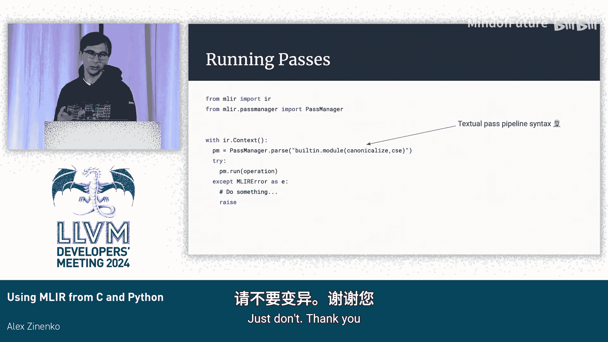

# 049：从C和Python使用MLIR


在本教程中，我们将学习如何通过C语言和Python语言使用MLIR框架。我们将探讨MLIR C API的设计理念、基本用法，以及如何基于此API构建Python绑定。内容涵盖IR遍历、IR对象创建、构建系统集成以及运行转换通道。

## MLIR C API设计目标与命名约定

上一节我们介绍了本教程的概述，本节中我们来看看MLIR C API的核心设计目标和命名约定。

MLIR C API的设计遵循几个简单目标。C语言能与几乎所有其他语言互操作，因此提供C API是自然选择。我们希望有一个统一的接口，便于MLIR开发者（主要使用C++）理解和维护。该API提供弱稳定性保证，虽然MLIR不承诺API稳定性，但我们会尽量避免破坏C API。C语言没有函数重载、类和继承，只有函数名，这有助于保持稳定。该API偏向于简单和最小化可用性，并不期望用户直接用C编写复杂应用，而是作为其他语言绑定的基础。

以下是关键的命名约定：
*   **前缀**：所有MLIR C API函数和类型均以 `mlir` 开头。
*   **类型**：类型名称首字母大写，例如 `MlirOperation`, `MlirAttribute`。
*   **函数**：函数名称首字母小写。
*   **所有权语义**：
    *   函数名包含 `create`：创建新对象并将所有权交给调用者。调用者需负责调用对应的 `destroy` 函数释放对象。
    *   函数名包含 `get`：获取一个由其他对象（如上下文Context）拥有的对象。调用者无需负责释放。
    *   函数名包含 `take` 或参数类型为 `owned`：函数将从调用者那里取得对象的所有权。

## 类型模型与IR遍历

了解了API的基本设计后，本节中我们来看看MLIR在C API中如何表示类型，以及如何遍历已有的IR。

C API采用极简的类型模型，只暴露MLIR中的顶层对象，如操作（Operation）、属性（Attribute）和类型（Type）。它不暴露任何子类信息。例如，整数类型或加法操作在C API中都使用其基类表示（`MlirType` 或 `MlirOperation`）。函数名中会暗示其期望的具体子类，例如 `mlirIntegerTypeGetWidth` 暗示其第一个参数 `MlirType` 必须是一个整数类型，否则会触发断言。所有对象在C中都是可空的指针，使用前需要检查是否为NULL。

MLIR IR具有递归结构：模块（Module）等顶层操作包含区域（Region），区域包含块（Block），块包含操作，操作本身又可以包含区域。

以下是如何遍历IR的步骤：
1.  从顶层操作（如模块）开始。
2.  查询操作拥有的区域数量：`mlirOperationGetNumRegions`。
3.  通过索引获取区域：`mlirOperationGetRegion`。
4.  获取区域中的第一个块：`mlirRegionGetFirstBlock`。
5.  由于块和操作在区域/块内是链表结构，获取下一个块或下一个操作需使用：
    *   获取下一个块：`mlirBlockGetNextInRegion`
    *   获取下一个操作：`mlirOperationGetNextInBlock`

## 创建IR对象与所有权模型

上一节我们介绍了如何遍历现有IR，本节中我们来看看如何创建新的IR对象，并明确其所有权模型。

所有权模型源自MLIR C++实现，并通过命名约定在C API中体现。默认情况下没有所有权转移，除非特别说明。
*   `create`：调用者获得返回对象的所有权。
*   `take`/`owned`：函数从调用者处取得对象所有权。
*   `get`：返回的对象通常由上下文（Context）拥有，无所有权转移。

创建操作通常涉及以下步骤：
1.  创建上下文（Context）：`mlirContextCreate`。
2.  创建操作状态（OperationState）：`mlirOperationStateCreate`。这是一个临时对象，用于收集创建操作所需的所有信息（名称、位置等）。
3.  配置操作状态：例如，为模块操作添加区域。
    1.  创建区域：`mlirRegionCreate`。
    2.  将区域添加到操作状态：`mlirOperationStateAddOwnedRegions`。此调用会将区域的所有权转移给操作状态。
4.  创建操作：`mlirOperationCreate`。此调用会消耗操作状态并返回最终的操作对象。现在，该操作对象拥有其包含的区域。
5.  清理：调用者需销毁其拥有的对象，例如 `mlirOperationDestroy` 和 `mlirContextDestroy`。

**注意**：此通用创建方法不执行操作的构建器函数（Builder）或验证（Verification）。构建逻辑（如类型推断）需调用者手动实现，验证需单独调用 `mlirOperationVerify`。

## 为自定义类型和属性提供C API

上一节我们学习了通用操作的创建，本节中我们来看看如何为特定的类型和属性提供C API绑定。

与操作不同，类型和属性没有通用的字符串创建接口。需要为每个要暴露的类型定义特定的C函数。这通常涉及三个关键函数：
1.  `mlirTypeIsA[TypeName]`：检查给定的 `MlirType` 对象是否为特定类型。
2.  `mlir[TypeName]TypeGetTypeID`：获取该类型的唯一类型ID。
3.  `mlir[TypeName]TypeGet`：创建该类型的实例。

实现这些函数通常只是对底层C++ API的简单包装。MLIR提供了 `wrap` 和 `unwrap` 辅助函数，用于在C类型 (`MlirType`) 和C++类型 (`mlir::Type`) 之间转换。

以下是为自定义类型创建C API的步骤：
1.  在头文件中声明函数和类型注册宏。
2.  在源文件中定义函数，并调用 `MLIR_DECLARE_CAPI_DIALECT_REGISTRATION` 和 `MLIR_DEFINE_CAPI_DIALECT_REGISTRATION` 宏来注册方言。
3.  使用CMake宏 `mlir_add_public_c_api` 将代码编译为库。

接口（Interfaces）的暴露方式类似，主要依赖类型ID进行查询。

## 在C中运行转换通道

现在我们已经可以创建和查询IR了，本节中我们来看看如何在C语言环境中运行通道（Pass）对IR进行转换。

运行通道管线的步骤与C++中类似：
1.  创建通道管理器（PassManager）：`mlirPassManagerCreate`。需要指定其操作的顶层操作类型。
2.  解析通道管线：`mlirParsePassPipeline`。可以传入一个描述通道序列的字符串（例如 `"canonicalize,cse"`）。
3.  运行通道管理器：`mlirPassManagerRun`。

**关键点：通道注册**。要在文本管线中使用自定义通道，必须先在上下文中注册它们。MLIR通过TableGen自动生成通道声明和描述。除了生成C++代码，还需要生成C语言的注册函数，并在创建上下文和运行通道管线**之前**调用这些注册函数。

## Python绑定设计

前面我们详细探讨了C API，本节中我们来看看基于该C API构建的Python绑定的设计。

Python绑定的主要设计目标是提供符合Python习惯（Pythonic）、易于使用的接口。用户只需 `import mlir` 即可开始使用。选择基于C API构建的主要原因是为了避免C++异常处理与LLVM/MLIR默认编译设置（无异常）的冲突。此外，C API相对稳定，也简化了二进制兼容性问题。

**一个重要警告**：目前，将所有MLIR相关组件（核心库、各方言库）链接到**单个**动态库（.so）中是使Python绑定正常工作的可靠方式。尝试加载多个独立的MLIR库可能会失败。

## 在Python中遍历IR

了解了Python绑定的设计后，本节中我们来看看如何在Python中遍历IR，其语法比C更加简洁。

Python API充分运用了Python的语言特性：
*   **迭代**：操作（Operation）的区域（`regions`）、块（`blocks`）和操作列表本身就是可迭代对象，支持 `for` 循环。
*   **属性访问**：操作的属性（`attributes`）以类字典对象形式暴露，可以通过名称或键（key）访问。
*   **属性与特性**：尽可能使用特性（property）而非方法。如果访问可能失败（返回 `None`），则使用方法。
*   **模块化**：核心IR结构位于 `mlir.ir` 包中，各个方言位于 `mlir.dialects` 子包下（如 `mlir.dialects.func`）。

以下是一个遍历IR的Python示例：
```python
with mlir.ir.Context() as ctx:
    module = mlir.ir.Module.parse(module_str)
    first_region = module.regions[0]
    first_block = first_region.blocks[0]
    for op in first_block.operations:
        visibility_attr = op.attributes.get("sym_visibility")
        if visibility_attr is not None and str(visibility_attr) == "public":
            print(f"Public function: {op.attributes.get('sym_name')}")
```

## Python中的IR创建与所有权

上一节我们看到了Python中遍历IR的便利性，本节中我们来看看如何在Python中创建IR，并理解其所有权规则。

Python中的所有权由Python运行时自动管理，但需理解其规则以避免错误：
*   **上下文（Context）和模块（Module）**：由Python直接管理其生命周期。推荐使用 `with mlir.ir.Context():` 语句块来确保上下文的作用域。
*   **分离的操作（Detached Operation）**：未插入到任何模块或区域中的操作，由Python的垃圾回收器管理。
*   **保持存活（Keep-alive）规则**：
    *   由上下文拥有的对象（如某些类型）会保持其上下文的引用。
    *   操作会保持其所有祖先节点（直至模块）的存活。持有深层操作的引用足以保持整个IR树不被销毁。
*   **重要警告**：如果通过C++代码（例如在通道中）**擦除（erase）** 了一个操作，Python端对此操作的任何后续访问都可能导致崩溃或未定义行为。因此，**不建议在Python中直接进行复杂的IR突变（Mutation）**。

创建操作在Python中更加直观。可以使用通用的 `ir.Operation.create` 方法，但更推荐使用为每个操作自动生成的特定类。

## 定义自定义操作的Python类

Python绑定支持为TableGen（ODS）定义的操作自动生成Python类，也允许用户自定义更友好的构造函数。

自动生成的构造函数严格遵循ODS中的参数顺序。为了提供更符合Python习惯的接口，可以定义自定义类来覆盖自动生成的类。

以下是如何定义自定义操作类的步骤：
1.  使用 `mlir._cext` 中的 `replace_cls` 装饰器来替换自动生成的类。
2.  在新类中定义 `__init__` 方法，实现自定义构建逻辑。
3.  在 `__init__` 内部，最终需要调用原始类的构造函数（通常命名为 `_cext` 或类似名称）。

对于类型和属性，也需要手动创建Python绑定，这通常涉及：
1.  定义一个继承自 `Ir.Type` 或 `Ir.Attribute` 的子类。
2.  实现 `typeid` 属性（对应C API中的类型ID）。
3.  实现 `get` 类方法来创建实例。

这些绑定需要集成到项目的CMake构建系统中，使用 `declare_mlir_python_extension` 等宏。

## 总结与警告

本节课中我们一起学习了如何通过C API和Python绑定与MLIR进行交互。



我们首先探讨了MLIR C API的设计理念、命名约定和所有权模型。接着，我们学习了如何遍历和创建IR对象，以及如何为自定义类型提供C API。然后，我们了解了如何在C中运行转换通道。基于稳定的C API，我们构建了Python绑定，它提供了更符合Python习惯的接口，用于IR的遍历和创建。我们看到了Python中迭代、属性访问的便利性，也了解了其所有权规则和重要的生命周期警告。

**核心警告重申**：
1.  在C中，务必管理好由 `create` 返回的对象的所有权，及时调用 `destroy`。
2.  在Python中，强烈建议将主要代码放在 `with mlir.ir.Context():` 语句块中。
3.  **避免在Python中执行可能擦除IR的操作**，因为这会导致Python对象引用悬空，引发不可预知的问题。Python绑定的主要设计目标是用于**IR的创建和只读遍历**，而非复杂的原地变换。

希望本教程能帮助你开始在C和Python中使用MLIR。对于更高级的用法，请参考官方文档和上游代码库中的示例。