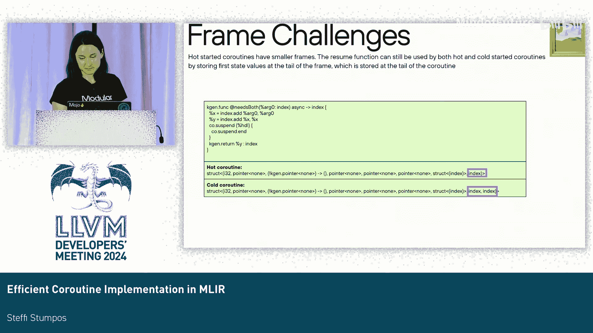

# 050：MLIR中的协程实现

## 概述
在本节课中，我们将学习如何在MLIR中高效地实现协程。我们将从异步编程的背景和问题定义开始，探讨LLVM现有的协程解决方案及其局限性，最后详细讲解我们为MLIR设计的协程降级方案。

---

## 第一部分：问题定义与背景

上一节我们介绍了课程概述，本节中我们来看看异步编程的核心问题。

假设我们需要执行一些计算并等待用户输入。给定用户输入后，我们启动一些内核并等待它们完成，同时模拟执行一些其他工作。第一个版本是同步的，流程如下：
1.  首先执行任务：收集用户输入。
2.  通过写入命令缓冲区来启动一些内核计算。
3.  花费大量周期轮询状态寄存器，直到计算完成。
4.  写入更多命令。
5.  再次花费周期轮询状态寄存器，直到完成。
6.  最后模拟一些其他工作。

这种方法效率低下，因为在轮询时会阻塞主应用程序。理想情况是能够交错执行任务，流程如下：
1.  检查状态，如果未完成，则执行一些其他工作。
2.  返回再次检查状态，再执行其他工作。

为了实现这种交错执行，我们需要进行以下转换：
*   引入一些状态。
*   将函数转换为状态机。
*   编写结构体来存储所有中间状态。

这种转换工作量大且包含大量样板代码，难以维护。幸运的是，编译器擅长处理此类任务。

2012年，C#推广了 `async`/`await` 模式，现已成为行业标准。许多语言，包括Python、Kotlin、Rust、C++、Swift以及现在的Mojo，都采用了这种模式。

从标签可以看出，许多这些语言使用LLVM作为其后端来实现协程。那么，为什么Mojo不直接使用它呢？让我们来评估一下。

---

## 第二部分：评估LLVM的协程方案

上一节我们了解了异步编程的需求，本节中我们来评估LLVM的协程解决方案。

LLVM中有三种不同的协程降级方案：
1.  **Switched-Resume 降级**：包含一个 `resume` 函数、一个 `ramp` 函数和一个 `destroy` 函数（可能还有一个 `cleanup` 函数）。帧（frame）存储在上下文中。
2.  **Return-Continuation 降级**：与Switched-Resume类似，但返回指向下一个 `resume` 函数的函数指针。每个挂起点都有一个 `resume` 函数。前端还必须指定传递给每个恢复点的固定缓冲区大小。
3.  **Async 降级**：被Swift使用。类似于Return-Continuation，每个挂起点有多个 `resume` 函数；同时也类似于Switched-Resume，帧存储在每个 `resume` 函数传递的上下文中。

Return-Continuation降级不常用，因此未经过充分测试。我们重点分析Switched-Resume降级，因为C++使用它。

回到我们的示例，使用C++ API后，代码更清晰。我们不再需要自定义协程状态机，而是使用 `co_await`、`co_yield` 等关键字。编译器会生成一个协程句柄来包装任务。

我们真正关心的是底层实现：生成的帧是什么样子？为了分析，我们简化了示例，只保留一个挂起点和一个跨越该点的值。

查看生成的IR，帧结构包含：
*   指向 `resume` 函数的指针。
*   指向 `destroy` 函数的指针。
*   承诺类型（此例中为 `i32`）。
*   其他值：前两个32位整数是帧，最后一个是状态。但为什么存储两个32位整数，而只有一个值跨越了挂起点？

查看 `ramp` 和 `resume` 函数，发现我们的操作被克隆了。有时克隆操作比加载/存储到帧中更廉价，但此例中我们执行了两次克隆和两次加载/存储，这并不合理。它只存储恢复所需的值，因为输入在第二次操作中使用。

关闭优化（`-O0`）后，帧中存储了所有值：输入、中间值和最终值。此外，每个挂起点还有一个指示是否挂起的值（这可能特定于C++）。我们不希望帧中存储这些额外信息。

关于帧分配：尽管没有值逃逸，但它仍然在堆上分配。

以下是评估记分卡：
*   **内存占用**：所有值都存储在帧中，导致帧大小臃肿和不必要的存储操作。
*   **协程分配**：堆分配未在可能时进行优化。
*   **IR占用**：不算太差，有一个 `ramp` 和一个 `resume` 函数（Mojo使用ASAP销毁，不需要 `destroy` 或 `cleanup` 函数）。
*   **热启动**：`resume` 函数的第一个状态被移入 `ramp` 函数，部分实现。

总体而言，LLVM的方案并非我们所需。但Swift使用的Async降级可能更好，让我们看看。

将示例转换为Swift后，发现即使是一个简单的函数也存储了许多整数。添加另一个不应存储在帧中的中间值后，它仍然被存储，这对帧大小不利。

IR占用方面：为每个挂起点生成一个函数（一个 `ramp` 和多个 `resume` 函数）。这并不理想，因为IR中函数过多会减慢其他函数级传递的速度，并且难以推理。

历史上，我们尝试过此方案，但观察到非活跃值被存储在帧中、分配未优化，并且由于协程传递依赖于同一模块中的多个函数而存在并行化LLVM的问题。因此我们决定放弃。

我们的新目标是：
1.  更精细地控制帧大小。
2.  控制生成的函数数量。
3.  控制降级顺序以优化分配。

---

## 第三部分：MLIR协程实现设计

上一节我们分析了LLVM方案的不足，本节中我们开始设计MLIR中的协程实现。

首先，我们定义一个方言（dialect）。我们不打算在管道早期降级这些函数，因此需要一种简洁的方式预先表示它们。

其次，我们需要确定降级时机。为此，必须识别我们希望支持的优化，以及它们是否依赖于特定传递及其发生时间。确定这些后，就可以定义实际的转换，因为我们已经确定了输入。

以下是我们设计的方言，分为两类：函数和帧。我们将专注于函数的抽象，暂不深入 `tl.` 操作（这些操作用于访问存储在生成帧中的元素，对于编写运行时库或支持错误处理很重要，但不在本次讨论范围内）。

核心操作包括：
*   `code.async`：表示对尚未生成的协程函数的调用。
*   `code.suspend`：表示函数中的挂起点。
*   `code.await`：一个隐式挂起点，也表示在生成的子协程中设置某些字段（例如，设置回调到父协程）。
*   `code.destroy`：通常不嵌入语言中，将由负责处理生命周期的其他传递发出。

接下来讨论降级顺序。我们希望支持哪些优化？
1.  支持热启动和冷启动协程。
2.  将堆分配的协程提升到栈上。
3.  考虑降级后的IR形态：控制流应是非结构化的，以便将 `resume` 函数转换为状态机。

什么是热启动和冷启动协程？
*   通常，协程被降级为 `ramp` 和 `resume` 函数。将 `resume` 函数的第一个状态放入 `ramp` 函数，就形成了热启动协程。这意味着调用协程时，不仅创建它，还立即执行它。
*   相反，冷启动协程的 `ramp` 函数仅分配内存并配置协程，然后返回，完全不启动它。

我们尽可能希望热启动，因为这意味着更小的帧大小和完成协程所需少一次函数调用。但并非总是可行。例如，如果我们创建协程后想生成一个线程并让该线程运行它，就不希望立即启动。

如何生成热启动与冷启动协程？它们有不同的 `ramp` 函数，因此需要提前知道哪些需要哪种 `ramp` 函数。我们将引入一个新的表示方式，称之为“热调用”（hot invoke）。如果我们在创建协程后立即调用其 `resume` 函数，那就是一个热调用。我们可以通过规范化模式轻松实现此转换。

以下是我们的降级计划：
1.  解析器发出 `await` 调用（范围之外，假设已有）。
2.  应用上述规范化转换。
3.  在函数内联之前降级剩余的 `code.` 方言操作。
4.  使用堆到栈提升传递将堆分配提升到栈上。
5.  降低控制流。
6.  将 `resume` 函数转换为状态机。

我们需要在函数内联之前降级协程，因为只有在内联 `ramp` 函数后，才能知道分配是否逃逸，从而进行堆到栈提升。控制流在异步函数降级阶段是嵌套的（结构化），这使得表达“继续执行”变得困难。我们可以等到控制流降级后（非结构化），再轻松地进行状态跳转。但为了内存提升，我们又需要结构化控制流。最简单的折衷方案是将降级分为两步。

现在聚焦于“如何”执行转换。状态机转换和规范化模式相对简单，我们重点看降低异步函数传递。

以下是主要步骤：
1.  **预处理**：降低隐式挂起点。
2.  **帧计算**：确定需要存储在帧中的值。
3.  **生成 `ramp` 和 `resume` 函数**。
4.  **将所有帧操作降级为指向刚生成帧的 `getelementptr` 操作。**

降低隐式挂起点（`code.await`）的原因在于它代表了设置回调和提取结果等复杂操作。

计算帧是棘手的一步。由于此时控制流是结构化的，我们必须通过创建由操作表示的虚拟块来模拟非结构化控制流。算法试图计算需要存储在帧中的值：如果从定义到使用的路径经过一个挂起点，则该值需要存储在帧上。这很棘手，因为不能只考虑唯一路径。例如，在某些循环路径中，如果不注意，可能会忽略某个值需要存储在帧上。

另一个挑战是，有时克隆廉价操作比将其放入帧中更好。例如，指针运算不应存储另一个已在帧中的值，而应克隆该偏移量。

最后，栈分配必须替换为帧分配。我们不能依赖SSA使用链来建模，因此使用生命周期标记来识别栈分配是否需要存储在帧上。

还有一个挑战是，一个协程可能同时需要热启动和冷启动 `ramp`，但我们理想情况下只希望有一个 `resume` 函数以减少IR占用。解决方案是将初始状态到第一个状态的所有特定状态存储在帧的尾部。这样，在第一个状态（仅可从冷启动协程到达）中，我们可以将其强制转换为更大的尺寸。

生成函数后，挂起点仍然完好无损。

---

## 总结与未覆盖主题

本节课我们一起学习了在MLIR中设计高效协程实现的完整过程。我们从异步编程的问题出发，评估了LLVM现有方案的优缺点，然后详细阐述了为MLIR设计的新方案，包括方言定义、降级顺序规划以及具体的转换步骤。

还有许多主题未在本次讨论中覆盖：
*   帧中值的生命周期管理（Mojo使用ASAP销毁）。
*   错误处理及如何在帧中存储相关值。
*   调试回调。
*   尾调用必须标记为 `musttail`。
*   如果没有挂起点，应避免异步调用的开销。
*   从前端角度看，为什么必须用 `async` 标记函数？

这些将是未来探索的方向。