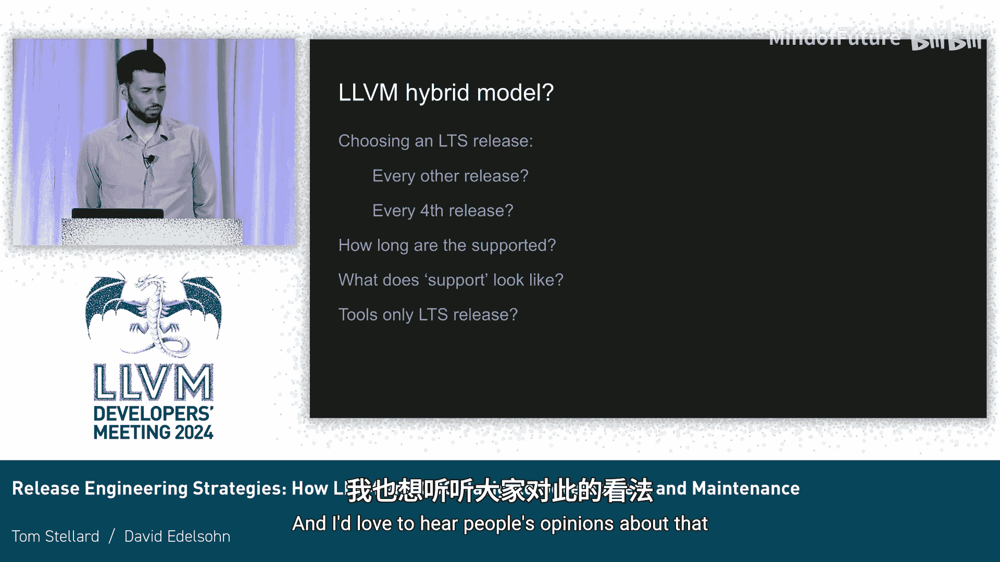

# 051：开发与发布流程对比

在本教程中，我们将学习LLVM和GCC这两大主流编译器项目的发布工程策略。我们将对比它们的历史背景、开发流程、发布模型以及各自的优缺点，帮助初学者理解不同开源项目的管理模式如何适应其生态系统的需求。

## 历史背景与开发流程

首先，我们来了解一下GCC的历史和开发流程。GCC（GNU编译器集合）拥有悠久的历史，曾是BSD和Linux系统的默认编译器。其开发流程中的一个关键转折点是EGCS（实验性GNU编译器系统）分支与主干的重新合并，这确立了由社区主导的发布模式。

GCC的开发模型围绕一个指导委员会构建，但战略目标主要由社区驱动。项目设有维护者和发布经理，他们通常来自Red Hat和SUSE等主要Linux发行版供应商。GCC的核心特点是**注重稳定性和向后兼容性**，其主干开发版本应始终保持稳定。

以下是GCC开发流程的一些关键数据点：
*   2023年，GCC编译器部分（不包括库）约有6600次提交，来自389位不同的开发者。
*   开发遵循可预测的年度节奏：7个月的功能开发，随后是2个月的错误修复和3个月的回归测试，以确保发布稳定性。
*   测试主要依赖庞大的、积累了30年的测试套件，但项目自身缺乏CI（持续集成）系统，这限制了快速反馈的能力。

GCC的发布模型提供长达三年的统一维护。所有针对已发布版本的错误修复都必须首先在主干中提交，然后才向后移植到维护中的发布分支。官方发布遵循固定的节奏，而Linux发行版则会选择特定的GCC版本进行更深入的测试和长期支持。

## LLVM的开发与发布模型

上一节我们介绍了GCC注重稳定性的开发流程，本节中我们来看看LLVM是如何在高速创新的同时保持主干稳定的。

LLVM项目的贡献流程近年来变得更加结构化，采用了更正式的决策机制和新的治理模型，包括为子项目选举区域团队。尽管变更速度极快（每月提交数和作者数约为GCC的五倍），但项目**强烈强调保持主干分支的稳定**。

这是通过以下策略实现的：
*   **“先回退，后讨论”政策**：对于造成破坏的变更，优先回退。
*   **庞大的构建机器人集群**：进行持续的提交后测试。
*   **下游用户的定期测试**：他们能运行比构建机器人更广泛的测试。

LLVM开发模型与GCC的一个显著不同是，**在发布分支为下一个版本稳定代码的同时，主干分支仍继续进行功能开发**。这是因为许多下游用户只关心主干的内容，冻结主干会导致不满。

LLVM的发布周期为六个月，非常可预测。从主干分出发布分支后，会经历约一个月的稳定期，然后进行为期数月的错误修复，期间每两周发布一个版本。目前有一个提案，计划将错误修复期从三个月延长至五个月，以确保始终有一个社区支持并修复错误的LLVM版本可用。

近年来，LLVM的发布流程已高度自动化，包括自动化的后移植、GitHub上的状态跟踪项目以及针对发布分支的CI测试，这极大地降低了发布成本。

## 生态系统差异与挑战

了解了两个项目的基本流程后，我们来看看它们如何被不同的生态系统所消费，以及由此带来的挑战。

GCC与Linux发行版共同演化，非常适合作为共享的、多用途系统（如服务器、桌面）的**系统编译器**。其优势在于长期的ABI（应用二进制接口）稳定性和向后兼容性。在Linux发行版中，升级GCC版本不会破坏之前用旧版本构建的软件包。

相比之下，LLVM面临不同的挑战。其C++库在主要版本之间**没有稳定的ABI或API**。这意味着：
*   应用程序在每次LLVM库升级后都需要重新构建。
*   通常，应用程序还需要修改源代码以适应API的变化。

这导致Linux发行版难以直接升级系统中的LLVM版本。作为解决方案，发行版（如Fedora）会**并行提供多个可安装的LLVM版本**。虽然这不是理想的支持模式，但为了确保依赖特定LLVM版本的软件包能够工作，这是必要的。

这种差异源于消费模型的不同。LLVM的模块化设计和快速迭代使其非常适合**容器化和微服务**场景，在这种场景下，应用与其工具链被打包在一起，持续交付和更新，对长期系统级ABI稳定的需求较低。

## 优势、劣势与未来思考

最后，我们对两种策略的优势和影响进行总结，并探讨未来的可能性。

GCC的主要优势在于其**长期支持、稳定性和统一的维护**。它为整个Linux生态系统提供了一个一致、可靠的基石，确保了系统级二进制兼容性。但其弱点在于相对**僵化的开发流程**，这可能抑制创新速度和贡献者快速集成变更的能力。

LLVM的主要优势在于**创新速度快、设计灵活且模块化**。然而，其**缺乏长期支持以及ABI/API的不稳定**给下游用户和希望将其作为系统编译器的发行版带来了更新上的麻烦和适配成本。目前，许多基于LLVM技术的供应商编译器都在独立提供长期支持，造成了工作的重复。

一个核心问题是：**如何让LLVM在保持创新活力的同时，也能更有效地作为替代的系统编译器，提供长期支持？**

对于LLVM项目而言，实施LTS（长期支持）版本面临一些挑战：
*   **开发带宽**：为多个活跃分支后移植和审查修复需要大量人力。
*   **日程对齐**：固定的LTS发布周期很难与所有下游用户的内部日程匹配。
*   **技术难度**：项目每年有海量提交（约4万次），长时间分支的后移植工作会变得异常复杂。

如果考虑LTS，社区需要明确其范围：支持频率、支持时长、修复何种类型的错误等。这是一个值得深入讨论的话题。

## 总结

本节课中，我们一起学习了LLVM和GCC的发布工程策略。我们看到，GCC采用了一种以稳定性和长期兼容性为核心、与Linux发行版深度集成的模型。而LLVM则采用了一种支持快速创新、更适合现代容器化部署的敏捷模型，但牺牲了系统级的ABI稳定性。两者不同的策略反映了它们所服务生态系统的不同需求。理解这些差异有助于我们根据具体的使用场景选择合适的工具，并思考开源项目如何平衡创新与稳定这一永恒的主题。

