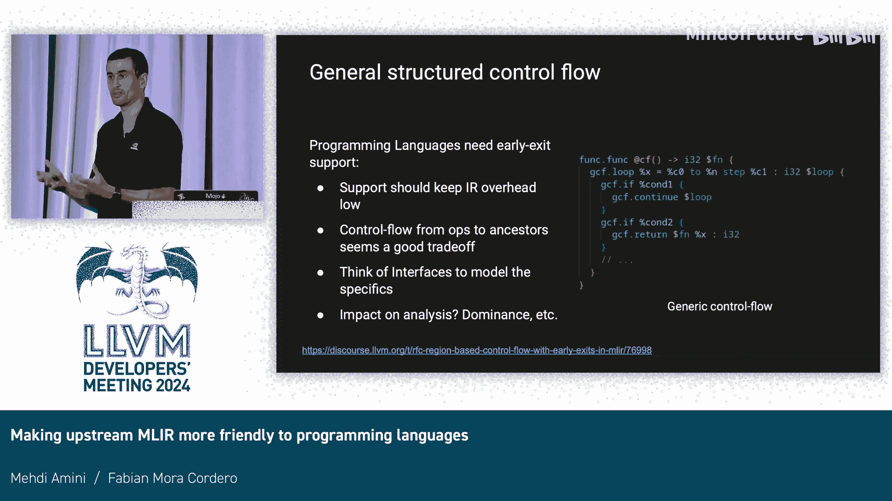

# 052：让上游MLIR对编程语言更友好

## 概述

在本节中，我们将探讨如何使上游MLIR对传统编程语言更加友好。MLIR在机器学习编译器领域取得了巨大成功，但其设计主要服务于该领域，导致在处理通用编程语言时存在一些限制。我们将分析这些限制，并介绍一些旨在改善此状况的初步工作和未来构想。

## 动机与背景

上一节我们概述了本节的主题。本节中，我们首先来看推动这项工作的动机。

MLIR在机器学习编译器（如JAX、XLA等）中取得了巨大成功，并驱动了显著的性能提升。这些成功也反映在上游MLIR中。这意味着，例如，你会看到`tosa`或`linalg`这类方言，而不是在通用编程语言中更常见的传统组件。

然而，我们现在看到更多传统前端开始出现。例如，`flang`（Fortran前端）已开发一段时间，并正接近生产就绪状态。另一方面，`Plier`（一种Python前端）也获得了上游批准。重要的是，它们持有`CIR`和`FIR`等表示形式，并尝试将其降级到LLVM IR，这是一条相当直接的路径。

作为社区，我们期望或希望未来有更多编程语言（如Julia、Rust等）进入MLIR生态系统。大量通用编程语言涌入MLIR，可能会给下游编译器带来负担，因为MLIR对表示传统编程语言的支持不足。这最终导致大量重复工作。例如，许多方言可能会实现相同的逻辑操作、相同的`if`操作，甚至相同的`load`操作，仅仅因为它们认为上游MLIR中没有可用的语义等价操作。这进而导致控制流扁平化等过程也被重复实现。我们的想法是，如何缓解这种情况。

## 上游MLIR的当前限制

了解了背景后，现在我们具体看看上游MLIR存在哪些限制。

存在一些相当基本的限制，反映了MLIR长期以来主要受到机器学习编译器社区的贡献。这意味着，例如，像结构体、数组的加载和存储等操作无法在高级方言中表示。如图所示，如果你有一个结构体操作，你不能直接将其降到`memref`、`LLVM`或`SPIR-V`，因为缺少这种高级表示。相反，这意味着如果你想处理结构体操作，你必须决定是直接降到LLVM IR、`memref`还是SPIR-V。最终，这导致许多编译器开始重新实现这些降级过程，而在许多情况下，这些过程是相当直接的。

MLIR中另一个问题是缺乏早期退出控制流。在传统编程语言中，你通常有`break`、`continue`、`goto`等。其负担在于，如果你想支持这些，你必须重新实现基础设施，例如再次扁平化控制流，或者增强数据流基础设施以处理这类表示，因为如果你现在尝试使用它们，它们并未得到真正的支持。

## 初步解决方案：指针方言模块化

认识到这些限制后，我们希望缓解其中一些情况。这是该进程的第一步，即关于模块化LLVM指针操作的提案。

其主要思想是，我们可以将指针操作从LLVM方言中提取出来，放入它们自己的方言中。在许多情况下，我们可以拥有这种在更高层次上运作的双重表示。例如，图中显示指针操作甚至可以在张量上运作，这是目前如果你使用LLVM指针无法做到的，因为LLVM会抱怨该类型不受支持。我们的想法是使其目标独立，以便它可以降到`memref`或SPIR-V。这个指针方言已经通过了RFC流程，并已开始上游化。

在具体作用方面，让我们从指针降级的影响开始看。在这种情况下，我们希望例如能够从`memref`降到指针，然后发出`memref`或SPIR-V，这将增加对这些方言的支持，而这些方言在许多情况下被忽视，因为LLVM在某些情况下具有优先权。

我们在这里开始做的最大区别是，这些指针操作不会降级到`memref`，而是直接转到LLVM IR并在那里进行翻译。因此，指针和LLVM之间的操作不会重复。

将指针操作抽象到更高层次的一个好处是，我们可以获得许多新功能。例如，我们可以引入限制操作。在这种情况下，我们可以拥有常量地址空间。例如，如果你尝试在仅具有内存空间的指针上进行存储，你将得到一个验证错误。这也可以用于别名分析等工作，因为如果内存空间是常量，我们可以假设它不会与其他任何空间冲突。

为了使其可扩展且对下游用户友好，我们决定创建一个属性接口，将一些语义包含其中并抽象到这个接口中。在这个接口中，你可以获得例如`isValidLoad`等功能，它将返回某个类型是否受地址空间支持。这就是我们如何获得例如常量地址空间的方式。

内存模型很大程度上受到LLVM的启发，例如，你拥有相同的内存排序语义。一个好处是，这促使我们清理一些上游内容。例如，我们可以拥有与`memref`之间的转换操作。这样做的想法是，它还允许我们将`bareptr`调用约定变成一个过程，从而稳定了ABI，因为如果你曾经使用它，`bareptr`调用约定在内存具有静态大小和动态大小时效果不佳，因为它也经过方言转换，然后变得棘手。

我们需要说明的一个重要事项是，我们需要衡量将指针操作从LLVM模块化出来的性能影响。在性能方面，我们在一些合成测试中进行了测试。在大多数情况下，我们看到影响小于3%。此外，这可以完全替代LLVM指针操作。例如，在实现方面，这意味着你可以在开始时从一个切换到另一个，而不会注意到差异。例如，在我的补丁实现中，`flang`代码从未出现重大中断。这也很重要。

## 扩展模式：重用与目标独立抽象

感谢Fabian展示了指针方言，这可能是我们从LLVM方言中提取某些内容以泛化其处理高级类型能力的第一个实例。这要归功于类型接口或属性接口。但相同的模式存在于LLVM方言的其他方面。

我们在下游实现的一些编译器中看到，有一系列操作和方言的语义非常接近LLVM，以至于它们可以直接翻译成LLVM IR。例如`cf`方言，如果你只有一个`if`或`br`，直接将其翻译成LLVM IR中的块是很直接的。当不在张量上操作时，`arith`方言与LLVM算术操作是一一对应的。正如Fabian刚才展示的，仅在操作LLVM类型时的指针方言，也是可以直接翻译的。这对JIT来说非常重要，因为涉及编译时间，我们节省了方言转换过程。因此，这是我们下游必须经历的事情，我们开始拥有一个直接以LLVM方言为目标的编译器，而不是使用`arith`方言，仅仅是为了编译时间。我们节省了转换过程。

我们遇到的问题是，许多规范化器和其他功能只存在于`arith`方言中。因此，我们现在必须回溯。我们在编译器中添加了`arith`，但我们的编译时间退步了。所以我们有了这个权衡。现在，我们正在添加从`arith`到LLVM的直接翻译来补偿这一切。

因此，在这一点上存在这种不幸的重复。我们为LLVM方言提出的模块化建议是，让我们不要重复操作，而是尽可能重用。我们可以停止使用`llvm`点操作，当它与`arith`点操作在LLVM类型上完全一一对应时。

我们可以开始做的另一件事是，为高级类型重用这些抽象，并开始构建目标独立且可重定向的抽象。这样做的问题是，LLVM方言不再是一一映射到LLVM IR。它是代表MLIR中LLVM IR的方言集合。这是一个需要权衡的问题，它简化了我们不重复文档、不重复大量内容，但我们必须处理一个共同代表MLIR中LLVM IR的方言集合。

这基本上是我们试图解决的一些权衡。关于`arith`和`llvm`，随着时间的推移，`arith`最初在定义方式上语义较为宽松。但随着人们开始构建生产编译器，他们希望有更好的定义语义，并希望使用`arith`来控制以定位所有LLVM语义。因此，我们最终在添加所有相同标志和相同语义方面，使`arith`方言与LLVM方言事实上趋同。

这确实减少了一些随机性。在我谈到的编译时间影响方面，我们构建了这个翻译的概念验证和合成测试。我们在这里测量的到LLVM的转换是从`arith`方言开始，必须进行方言转换和翻译。最后一行显示，通过直接从`arith`翻译，而不是进行额外的、基本上是一一对应的方言转换，我们获得了1.5倍的加速。在实践中这样做确实有真正的好处。

## 超越模块化：高级抽象与ABI

除了LLVM方言的模块化之外，还存在如何向高级类型公开这些操作以及如何抽象ABI等问题。

例如，像结构体或数组这样的东西，它们可能是相当简单的方言，不需要很多操作，但可以统一我们操作结构体和其他聚合类型的方式。并允许人们注入自己的类型和降级过程，同时仍然能够访问所有这些功能。

这只是一个可能样子的例子。我们还没有构建这些方言，我们只是在集思广益，思考前端需求以及我们如何统一它们。

那么问题是，我们是否正在走向一个为编程语言服务的方言集合？我们需要走多远？我们能在多大程度上构建对Fabian一开始想到的那种语言真正有用的可重用组件？例如，这里我们展示了一个向上作用域退出，例如，我们展示了一个`try-catch`。这是一个异常抽象的例子。目前尚不清楚我们能在多大程度上泛化这类事物并使它们普遍有用。

因此，这目前主要是集思广益，并向社区征求评论，试图了解需求是什么以及什么可能有用。

我知道有用且许多人在过去两天里一直在请求的是，在循环内和嵌套`if`中，你想要跳出循环或继续或从封闭函数返回的这种结构。这在MLIR中是不合法的。如果你不重用太多上游组件，你可以在自己的编译器中实现它，例如，`Mojo`就大量依赖这类东西。但MLIR中没有对此的一流支持，这将破坏数据流分析，破坏上游许多试图理解操作间后支配属性的组件，因为我们假设这种情况不可能发生。

所以这是最后一个要点，它确实对分析、支配性等有影响。但有很多人正在研究它。所以它即将到来。我们没有具体的日期，也没有最终设计，但希望到下一次LLVM开发者大会时，我们应该已经实现了它，这确实是我的期望。

最后，目标ABI抽象是一件大事。如你所知，LLVM是ABI特定的，意味着前端必须了解目标ABI，并在发出LLVM IR之前编码所有这些决策。在MLIR中也是如此。如果你使用LLVM方言，你必须做出所有这些决策。这使得与C的交互有点复杂。这就是为什么如果你曾经使用过`memref`并尝试在MLIR中为`memref`编写C运行时，会有一个复杂的ABI，MLIR试图实现它，只是为了不必了解各种目标之间的差异。

因此，Clang前端本身编码了关于每个目标平台的Itanium、Microsoft等调用约定的所有知识。这里有一些工作可以做，即从Clang中提取这些知识，使其独立于Clang的C类型系统，并使其可用于其他前端，包括MLIR。这将允许在MLIR中构建这样的东西：人们可以用C类型系统来表达他们的类型系统，并免费获得针对x86或其他任何平台的到LLVM调用约定以及其他ABI方面（如布局等）的降级。

LLVM最初试图成为一种数据布局独立的IR。这个目标在十多年前就被放弃了。但在MLIR中，我们现在希望朝着构建这种属性发展，即在LLVM方言和LLVM方言之上，我们应该能够以非常ABI独立的方式表达事物。

## 总结与展望

本节课中，我们一起探讨了如何使上游MLIR对传统编程语言更加友好。我们从动机和现有限制出发，介绍了模块化LLVM指针操作作为初步解决方案，并探讨了重用抽象、构建目标独立方言以及处理高级控制流和ABI抽象等更广泛的构想。

我们希望这能开启更多讨论。我们正在寻找MLIR中编程语言所需的更多想法。感谢参与。

---

**问答环节**

**问：** 对于基于区域的控制流，例如`cf`方言，您是否知道目前的主要障碍是什么？我记得有一个关于采用Mojo中使用的`cf`方言的提案。

**答：** 问题不在于方言本身，而在于MLIR的核心。首先，我们必须拥有那个长图（long graph）来允许这种结构。然后我们必须决定如何建模这些新操作，例如，当你看到`if`内部的`continue`时，你如何知道这个`continue`映射到哪个操作？我们需要某种标签来表达这一点。我们是要通过为操作类添加新字段来支持，真正修改MLIR核心以在图中构建新边，还是使用类似符号接口、更基于名称的方式？转换应该如何更新它？例如，如果你想展开这个循环，你如何找到所有的`continue`或`break`？我们必须解决一些基础设施问题和语义问题。

**问：** 我猜想，但有些部分可能争议较小，例如放宽每个终结符必须是基本块终结符的规则。

**答：** 是的，没错。这是我们必须要解决的那种问题。

**问：** 第二个问题是关于构想。我在想除了结构体和数组之外，设计是否也会考虑表示数据集合。我特别想到今年CGO论文中的设计，以SSA形式表示数据集合，这允许向编译器传授关于各种数据集合（如哈希表、映射或树）的知识。

**答：** 我还没看过这篇论文。我会去查一下。谢谢你的建议。

**问：** 在`cf`方言层面，我想你可以有`continue`和`return`（不确定`return`）。但我猜你希望在`scf`层面拥有这些，对吗？因为`cf`层面更接近LLVM IR。

**答：** 在`cf`方言层面，如果你没有区域，没有嵌套，你有一个扁平的CFG，那么一切都是分支。所以那里没有什么可添加的。问题只针对结构化控制流。但我们希望在`scf`层面有这个。那么下一层呢，比如`affine`，你不能有这个。所以我想，它出现在这里。它可以是长IR（long IR），我认为长IR可能需要这类东西，在任何像Mojo这样的编程语言中，以及任何甚至高于`scf`的语言中，如果它们不使用这个的话。但没错，那些是针对`scf`类型的。

**答：** 好的，谢谢。

**主持人：** 还有其他问题吗？好的，让我们再次感谢演讲者。

