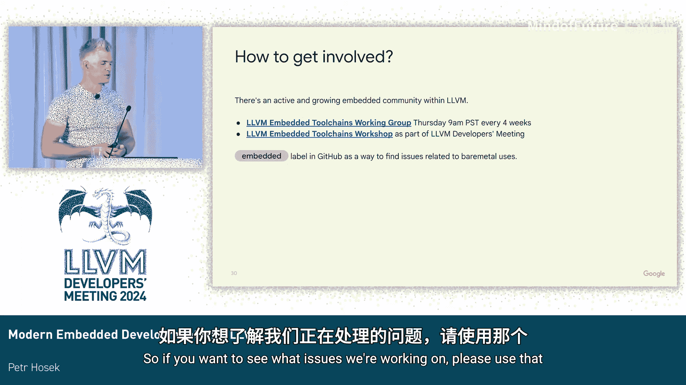

# 053：使用LLVM进行现代嵌入式开发

在本教程中，我们将学习如何利用LLVM工具链进行现代嵌入式开发。我们将探讨从传统工具链迁移到基于LLVM的解决方案的经验，深入了解LLVM运行时库在嵌入式环境中的应用，并分析当前的优势与面临的挑战。

## 背景与动机

上一节我们介绍了教程的主题。本节中，我们来看看推动我们采用LLVM进行嵌入式开发的背景和动机。

我们观察到，在谷歌内部不同的嵌入式产品项目中，大多数都使用其芯片供应商提供的工具链。这些工具链通常版本过时，很少更新。由于芯片供应商使用这些工具链来构建其SDK附带的平台库，他们常常会无意中强制客户使用这些工具链。每个工具链都带有自己的C/C++库，它们的API或ABI可能各不相同，统一它们极具挑战性。

当开始混合使用不同架构时，情况变得更加复杂。我们看到越来越多的产品结合了不同指令集的处理器核心，例如ARM和RISC-V的组合已很常见。开发者也可能在不同的主机上进行开发，如Linux、Mac、Windows。因此，要构建一套能在所有这些环境中工作的工具链，是一项艰巨的任务。

我们通常看到两种应对方式：一种是找到一组能协同工作的工具链，并在产品的整个生命周期内基本保持不变。但我们相信有另一种方式，这也是谷歌长期以来在生产负载及Chrome、Android等项目中一直采用的方式，即“前沿开发”（live at head）。这意味着始终尝试从源代码编译一切，紧跟上游最新进展，并定期更新以避免菱形依赖和合并冲突。我们认为前沿开发模式同样适用于嵌入式领域。

## 我们的目标与方法

上一节我们讨论了传统嵌入式工具链的挑战。本节中，我们来看看我们为此设定的目标和采用的方法。

我们的目标是提供一个开源的、用于裸机的交叉编译Clang工具链，其中不包含任何遗留组件。我们使用Clang和LLD等工具，使用LLVM的`libc`、`libc++`、`compiler-rt`作为运行时库。我们直接在上游进行开发，不维护下游补丁，紧密跟随上游最新进展。这使我们能够在新功能（如引入Clang和这些库的功能）出现时立即采用，也让我们能向LLVM社区提供大量即时反馈。

前沿开发的关键在于自动化和测试。你需要知道LLVM中是否有东西被破坏，是什么被破坏了，并希望能够尽快提供反馈，以便相关更改可以被回滚或修复。

## 选择测试平台：树莓派 Pico

上一节我们介绍了前沿开发模式。本节中，我们来看看为实现这一模式而选择的理想测试平台。

进行裸机开发可能相当具有挑战性。存在大量专用硬件，处理起来非常棘手，尤其是在开始与LLVM打交道时。为了使这项工作可持续，我们需要一个优秀的平台：它应该是公开可用的、成本低廉、文档完善，理想情况下应该是开源的，可以作为我们内部不易被LLVM开发者访问的产品的代理。我们认为树莓派Pico系列可能是一个绝佳选择。

树莓派Pico是树莓派推出的一系列流行的微控制器产品。目前有两代：第一代Pico 1于2020年发布；就在几个月前，树莓派基金会宣布了第二代Pico 2，它结合了ARM和RISC-V核心。这里的一个问题是，用于构建在这些开发板上运行代码的SDK并不支持官方的Clang工具链，至少直到几周前还不支持。

今年早些时候，我们与树莓派基金会、Pium和谷歌合作，共同使Pico SDK成为我们所知的第一个可以直接使用开源Clang和LLVM工具链（使用`compiler-rt`、LLVM `libc`和`libc++`）构建的树莓派项目。

## 构建与使用工具链

上一节我们介绍了测试平台。本节中，我们来看看如何为Pico SDK构建和使用基于LLVM的工具链。

以下是构建和使用工具链的基本步骤：

1.  从GitHub克隆Pico SDK。
2.  使用CMake配置正确的编译器、平台，并指向我们想要使用的工具链。

你可能会问，从哪里获取工具链？如果你参加了去年的LLVM开发者大会，我实际上做了一个关于LLVM构建和CMake的教程。现在是时候复习一下你记住了多少。让我们继续，为自己构建一个工具链。

我们将编写自己的CMake缓存文件，这是一种更可维护的方式，用于保存设置并将其输入到CMake构建中。我知道这看起来像是一堆乱码，但如果你仔细看，应该会相当清楚我们在做什么：我们选择要支持的目标（ARM和RISC-V），选择要构建的项目和运行时库，配置一些默认值以避免总是在命令行中指定，并选择要包含在工具链中的工具和组件。

接下来，我们需要为编译器内置函数设置目标。这将是Pico 2支持的两个架构。我们设置一些其他选项，最重要的是底部的CMake C标志。然后，我们对运行时库（即`libc`和`libc++`）做同样的事情。

基本上，此时我们可以从GitHub获取LLVM源代码，启动CMake并指向我们的缓存文件，然后构建一个可用于Pico SDK的工具链。如果你不想照着幻灯片上的内容重新输入，我已经将这个文件上传到GitHub，你可以稍后查看并自己尝试。

## 运行时库使用经验

上一节我们介绍了工具链的构建。本节中，我们来看看在使用各个LLVM运行时库时的具体经验。

对于`compiler-rt`，我们发现它基本上是GCC运行时的一个很好的直接替代品。我们没有遇到太多问题。虽然存在一些差异，尤其是在处理更奇特的类型（如`float16`或`float128`）时，但在Pico SDK中我们并未真正遇到这些问题。我们知道的一个限制是，LLVM目前并不知晓正在使用的编译器运行时，因此无法充分利用`compiler-rt`特有的例程。但这更多是一种优化不足，未来仍有改进空间。

在`libc`方面，`libc`已经开发了几年，我们相信它终于为更广泛的采用做好了准备，尤其是在裸机世界。它是一个采用宽松许可证的C库实现，可以从大型服务器扩展到像Pico这样的小型开发板。为了使它能用于Pico SDK，我们必须实现大量缺失的功能，如高等数学函数、`malloc`实现、基本I/O支持。`libc`仍然缺少一些部分，如启动代码、半主机I/O等。这些都是我们正在积极研究并希望在未来几个月内实现的方面。

此外，我们还开始研究低级嵌入式API。可以将其视为类似POSIX或系统调用层，但是针对嵌入式的。它是一组LLVM `libc`期望任何平台提供的符号，因为我们不希望将Pico SDK或FreeRTOS等特定平台的知识硬编码到`libc`中，而是希望这些功能存在于平台端。目前我们只有少数几个函数来处理标准输入、标准输出和终止等操作，但我们预计这个接口会随着时间的推移而增长，特别是当我们添加线程支持等功能时。

在`libc++`方面，`libc++`作者提供了许多选项来禁用不必要的功能，我们也使用了这些选项。但我们也发现，可能需要更多的配置点来更好地支持嵌入式环境，因为仍然存在一些地方，`libc++`使用了动态内存分配、线程局部存储或浮点运算等功能，这在许多裸机平台上可能是不可取的。我们还必须引入对使用`libc`构建`libc++`的支持，这在以前是不存在的。

因此，回到我最初的例子，除了之前提到的内容，我们还需要设置一些更多的选项来禁用当前不支持或不希望使用的功能。最值得注意的是本地化、Unicode宽字符支持等。这是暂时的，我们正在`libc++`上积极工作，希望随着时间的推移，所有这些都将得到实现，因此未来许多这些选项将不再需要。

## 当前挑战与改进方向

上一节我们讨论了运行时库的经验。本节中，我们来看看在嵌入式开发中使用LLVM时遇到的主要挑战和未来的改进方向。

总的来说，我认为构建工具链正变得越来越容易。直到最近，还不可能在LLVM项目内构建一个功能齐全的裸机工具链。但尽管如此，仍有很大的改进空间。例如，你在前面看到的CMake缓存文件中仍然有很多样板代码，我认为我们可以随着时间的推移减少和消除它们。

多库支持对于裸机非常重要，因为硬件差异很大。现有的多库支持相当有限，效率低下，需要大量的CMake配置，并且会显著延长构建时间。目前也没有对新的基于YAML的配置格式的支持。但除此之外，我甚至不确定从长远来看我们是否应该使用多库。我认为我们应该探索实际根据需要使用正确的标志从源代码构建库的想法。这在我们内部的PixelWatch项目中进行了实验，我们有一个最小可行原型，但目前它非常依赖于特定的构建系统。随着时间的推移，我们希望看看是否可以将此通用化并直接在Clang和LLVM中支持。

我们还发现性能方面仍存在一些差距。许多裸机项目对二进制大小和内存使用非常敏感，使它们适配通常是一项精细调整的工作。我们看到GCC通常在`-Os`级别能更好地平衡大小和性能。使用Clang的`-Oz`，我们通常会得到更小的二进制文件，但这实际上可能以性能下降为代价，这并不总是可取的。未来我们也许可以通过像机器外联器这样的其他工具恢复一些性能，但我认为我们还可以做得更多。

我们还发现LLVM中的堆栈分配存在很多不足，这可能导致堆栈使用效率低下，也经常在裸机上引起问题。实际上我们有一个跟踪错误，其中包含更多细节。这里只是我们一个项目中的例子，展示了我们为了将所有内容控制在预算下而设置的所有标志。虽然这可行，但可维护性不高，我们真的不希望将这些标志从一个项目复制到另一个项目。我希望随着时间的推移，我们能想出比这更好的方案。

调试也可能具有挑战性。我们注意到的一件事是，目前LLVM和LLDB并不支持所有的DWARF调试信息构造。这可能是个问题，尤其是在处理像中断处理程序这样的手写汇编代码时，如果你需要支持栈回溯（我们在嵌入式开发中偶尔会遇到这种情况）。LLDB对裸机的支持也存在一些不足，例如，目前对RISC-V的支持基本缺失，这是我们希望改进的。

## LLVM高级功能在嵌入式的应用前景

上一节我们探讨了当前的挑战。本节中，我们来看看如果这些问题得到解决，LLVM中哪些高级功能能为嵌入式开发带来益处。

假设所有这些问题都得到解决（我相信在未来几个月内会），我认为LLVM非常适合嵌入式开发。我相信LLVM中有很多功能可以让嵌入式开发者受益，但LLVM开发者也需要了解这些系统所面临的约束。

让我们看看其中的一些。首先是异构内存支持。这在嵌入式系统中非常普遍，嵌入式系统使用像`__attribute__`和链接器脚本这样的工具将符号放置在特定内存的特定地址上。但目前这些与LTO和PGO不兼容。LTO是一个极好的工具，我们在嵌入式领域进行了一些早期实验，看到了超过20%的二进制大小缩减。但今天的LTO与链接器脚本不兼容，这是个问题，因为链接器脚本在裸机中非常普遍。同样，PGO可以提供巨大的性能改进，通常超过20%，但它并没有真正考虑到像数字替换这样的方面，而这又是一个要求。未来我们也希望研究像Propeller或BOLT这样的后链接优化工具，这仍然是一个开放的研究领域。

接下来是消毒剂。消毒剂是发现错误的绝佳工具，但由于内存限制，在嵌入式系统上使用它们非常具有挑战性。我们实际上在一些开发中成功使用了UBSan来发现像未对齐访问这样的问题。但我们也注意到，虽然UBSan有几个针对不同环境定制的运行时实现，但没有一个完全适合裸机平台，我们可能需要另一个。ASan目前基本无法工作，主要是因为插桩开销太高，我们真的需要找到一种方法来降低开销，使其适用。还有其他消毒剂，目前我不太确定那些是否能在嵌入式设备上可行，仅仅因为高开销，但我们仍在研究。

一个更普遍的主题是，所有消毒剂运行时最初都是为类POSIX系统开发的，后来才移植到Windows等平台，它们通常假设底层平台类似于POSIX，但在嵌入式设备上情况并非如此，这使得移植非常困难。我认为需要更多的工作来清理实现，使它们更具可移植性。

最后是源代码覆盖率。这是一个非常有用的工具，可以帮助跟踪测试进度。但我们从经验中得知，现有的运行时存在很多代码质量问题，使移植复杂化，需要更多的工作。也有机会减少覆盖率功能的插桩开销，比如单字节计数器、条件计数器更新或此类计数器。所有这些实际上都是我们正在努力的方向，有一个活跃的开发者社区正在努力改进源代码覆盖率，并使其在裸机上更有用。

## 总结与社区参与

上一节我们展望了LLVM高级功能在嵌入式的应用。在本节中，我们将对教程内容进行总结，并介绍如何参与相关社区。

总而言之，我认为LLVM非常适合嵌入式开发。LLVM是一个交叉编译器，这意味着单个工具链可以用于所有不同的目标平台和不同的主机，你不需要多个工具链，这简化了维护。我们正努力使在单个LLVM构建中构建工具链变得更加容易。LLVM现在提供了模块化、宽松许可证的C和C++库实现，我们正努力使它们在裸机上真正可用。我们也在积极考虑持续测试，我们的长期目标是让LLVM CI中有一个机器人，实际使用树莓派Pico进行持续测试，以确保我们不会在像`libc`和`libc++`这样的库中对裸机的支持上出现退步。最后，有很多优秀的工具和功能可以真正帮助嵌入式开发者，如性能分析、LTO、消毒剂和覆盖率，我们真的希望将所有这些都带到裸机领域。

如果这些方面中有任何一点让你感兴趣，请务必参与进来。有多种方式可以参与。我们有一个活跃且不断壮大的社区，每四周举行一次会议，时间是太平洋时间周四上午9点，通过Zoom进行，欢迎所有人加入。我们也有一个嵌入式工具链研讨会，我们昨天刚刚举办了第二届研讨会，希望这不是最后一次，希望明年还有。最后，我们在GitHub上也有一个“embedded”标签，用于跟踪与嵌入式使用相关的问题。如果你想了解我们正在处理哪些问题，请使用该标签。

本节课中，我们一起学习了使用LLVM进行现代嵌入式开发的完整流程：从背景动机、目标方法，到具体平台选择、工具链构建、运行时库经验，再到当前挑战和未来功能展望。LLVM为嵌入式开发带来了前沿开发、统一工具链和丰富工具集等巨大潜力，虽然仍面临一些挑战，但社区正在积极推动其发展。

