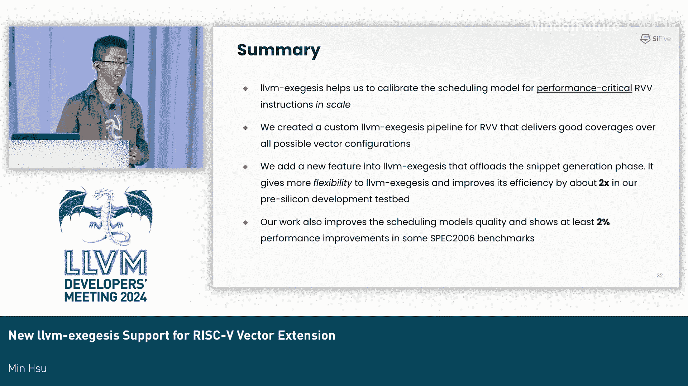

# 054：为 RISC-V 向量扩展新增 llvm-exegesis 支持 🚀


在本节课中，我们将学习如何使用 LLVM 的 `llvm-exegesis` 工具来调优 RISC-V 向量扩展的调度模型。我们将了解该工具的重要性、在支持 RISC-V 向量指令时遇到的挑战、解决方案，以及如何通过改进工具来提升其效率和实用性。

---

## 概述 📖

`llvm-exegesis` 是一个用于调优 LLVM 调度模型的工具。调度模型是一个庞大的数据库，包含了指令延迟、占用率（与吞吐量相关）以及所使用的硬件资源等信息。在引入 `exegesis` 之前，手动改进调度模型是一个耗时且难以扩展的过程。`exegesis` 通过自动化生成微基准测试、执行测量并与调度模型对比，极大地提高了效率。

---

## 什么是 llvm-exegesis？🔧

上一节我们介绍了课程概述，本节中我们来看看 `llvm-exegesis` 到底是什么。

LLVM 调度模型中的最小信息单元不是单条指令，而是一个称为“调度类”的概念。RISC-V 架构中的调度类数量远多于 LLVM 支持的其他目标平台，这意味着手动调优 RISC-V 的调度模型将花费更多时间，因此使用 `exegesis` 工具至关重要。

`exegesis` 通过自动化大部分流程来解决手动调优的问题：
1.  它为每条指令生成一个微基准测试代码片段。
2.  它在硬件上执行该代码片段并测量性能。
3.  它将测量结果与调度模型进行自动对比，并向开发者反馈不一致之处。

开发者只需根据反馈修改调度模型即可，这使得整个过程更高效、更省时，且扩展性良好。

---

## 一个示例：测量延迟与吞吐量 📊

在了解了 `exegesis` 的基本概念后，我们通过一个具体例子来看看它是如何工作的。

对于每条指令，`exegesis` 会生成类似以下的元数据和代码片段，用于描述和进行性能测量。

**测量延迟的代码片段**：
为了测量指令延迟，需要创建串行执行的代码片段，即将前一条指令的输出作为后一条指令的输入。
```asm
# 元数据
...
# 测量代码片段（重复指令多次以测量延迟）
loop:
    vadd.vv v1, v2, v3
    vadd.vv v1, v2, v3 # 输出v1作为下一条指令的输入
    ...
```
**测量吞吐量的代码片段**：
为了测量吞吐量，需要创建并行执行的代码片段，即指令间没有数据依赖。
```asm
# 测量代码片段（并行执行指令以测量吞吐量）
loop:
    vadd.vv v1, v2, v3
    vadd.vv v4, v5, v6 # 使用不同的寄存器，避免依赖
    ...
```
测量完成后，`exegesis` 会生成报告。例如，它可能发现某条指令的实际测量延迟与调度模型中记录的数据不一致，从而指导开发者进行修正。

---

## RISC-V 向量扩展的独特挑战 ⚙️

现在我们已经知道 `exegesis` 如何工作，本节我们将探讨在支持 RISC-V 向量扩展时遇到的独特挑战。

RISC-V 向量扩展指令有一个独特属性：同一条指令可以附加不同的配置，这些配置可以在运行时改变。例如，对于向量加法指令 `vadd.vv`，可以配置元素大小和同时处理的向量数量。
*   `vadd.vv v1, v2, v3, e32, m2`：使用 32 位元素，同时处理 2 个向量。
*   `vadd.vv v1, v2, v3, e64, m4`：使用 64 位元素，同时处理 4 个向量。

尽管指令助记符相同，但不同的配置会导致完全不同的性能特征。为了在 LLVM 中处理这种隐式的配置，代码生成器使用了“伪指令”，并通过操作数使这些配置显式化。同时，不同的向量长度组也对应不同的调度类，因为它们的性能通常差异很大。

---

## 在 exegesis 中支持 RISC-V 向量指令 🛠️

面对 RISC-V 向量指令的复杂性，我们来看看如何让 `exegesis` 支持它们。

LLVM 使用伪指令来显式化向量配置，这为 `exegesis` 生成代码片段提供了便利。支持流程如下：
1.  **枚举配置**：为每条伪指令枚举所有合法的配置（如元素大小、向量长度组）。
2.  **生成代码片段**：基于枚举的配置生成初始的基准测试代码片段。
3.  **过滤与处理**：由于 RISC-V 向量规范复杂，存在许多限制（如元素大小限制、寄存器组不允许重叠等），需要过滤掉非法的指令组合。此外，还需要处理伪指令中隐含的“直通”操作数，避免在创建串行片段时错误地连接依赖。
4.  **重用现有流程**：利用现有的机器函数通道进行后处理，例如插入必要的设置指令、清理虚拟寄存器等。

最终，我们为每种元素大小、向量长度组和配置都生成了合法的代码片段。

---

## 案例研究：发现并修正不一致 📈

在实现了 RISC-V 向量支持后，`exegesis` 工具帮助我们发现了调度模型中的问题。

例如，对于向量滑动指令 `vslideup` 和 `vslidedown`，调度模型原先认为它们属于同一个调度类，具有相同的性能。但通过 `exegesis` 测量发现：
*   它们的实际延迟与模型记录不符。
*   更重要的是，这两条指令本身具有不同的性能特征。

因此，我们不仅修正了调度模型中的数据，还将它们拆分到了两个不同的调度类中。这些改进已经合并到上游的 LLVM 调度模型中。

---

## 挑战与优化：提升工具效率 ⚡

虽然 `exegesis` 很强大，但在处理 RISC-V 向量指令时，我们遇到了新的挑战：规模与效率。

RISC-V 向量指令会产生海量的代码片段组合（可达数万甚至超过十万个）。传统的 `exegesis` 工作流是顺序的：生成片段 -> 汇编 -> 测量。在 FPGA 或 RTL 模拟器等预硅开发环境中，测量速度极慢，导致整个流程耗时过长。

我们的解决方案是将流程拆分为两部分：
1.  在性能强大的工作站上快速生成所有代码片段。
2.  将序列化后的基准测试发送到慢速的预硅环境进行测量。



但直接序列化所有目标文件会导致数据量巨大（可达 5 GB），在资源有限的预硅环境中无法承受。因此，我们引入了压缩。由于每个基准测试包含大量重复的指令，现代压缩算法可以获得极高的压缩率（例如 99% 的空间节省）。这使得存储和传输开销大幅降低。

结合这些优化，`exegesis` 的整体运行效率提升了近两倍。

---

## 成果与总结 🏆

通过本课程的学习，我们了解了 `llvm-exegesis` 工具及其在调优 RISC-V 向量指令调度模型中的关键作用。

**本节课我们一起学习了**：
1.  `llvm-exegesis` 如何自动化调度模型的验证和调优过程。
2.  RISC-V 向量指令的独特配置方式带来的挑战。
3.  我们如何通过伪指令、配置枚举和过滤流程，在 `exegesis` 中实现对 RISC-V 向量指令的支持。
4.  面对海量测试用例和慢速预硅环境，我们如何通过流程拆分和高效压缩来提升工具的运行效率。
5.  最终，更精确的调度模型带来了应用程序性能的提升（在我们的性能核上观测到约 2% 的提升）。

这项工作不仅提高了调度模型的准确性，也增强了 `exegesis` 工具本身的处理能力和实用性，尤其对于当今常见的 RISC-V 芯片预硅开发具有重要意义。


---