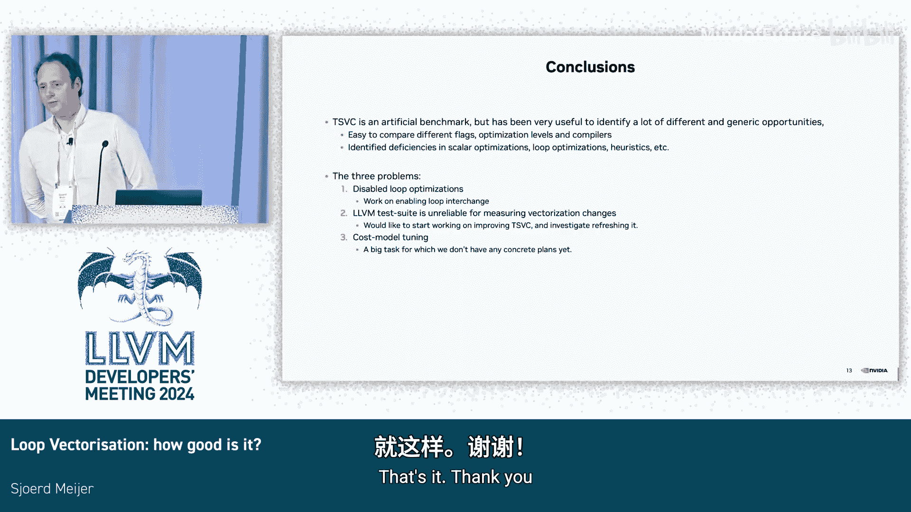

# 055：一种识别与评估向量化机会的定量方法

## 概述

在本节课中，我们将学习如何采用一种定量的方法来评估和识别循环向量化的优化机会。我们将基于LLVM开发者大会的一次演讲内容，探讨当前循环向量化器（Loop Vectorizer）的性能瓶颈、识别方法以及潜在的改进方向。课程将涵盖性能基准测试、问题根因分析、成本模型挑战以及未来优化计划。

## 动机与问题陈述

上一节我们概述了本课程的目标。本节中，我们来看看启动这项工作的具体动机。我们的目标平台是ARM64 CPU，它支持新的SVE2扩展。高效利用此类硬件的向量单元至关重要，这促使我们提出核心问题：**LLVM的循环向量化器性能如何？**

为了回答这个问题，我们选取了两个基准测试套件进行量化分析：TSVC和Rodinia。通过使用不同编译器（如GCC和Clang）和不同优化选项（如-O3、-Ofast、禁用向量化）进行测试，我们旨在发现性能异常值、识别优化机会并提出后续问题。

## 基准测试与初步发现

在完成基准测试后，下一步是识别问题的根本原因并制定解决计划。本演示主要讨论TSVC的结果。TSVC是“向量化编译器测试套件”的缩写，包含152个小型循环内核函数，用于测试向量化器处理不同模式的能力。

我们将Clang（LLVM主干版本）与GCC 13进行性能对比。结果可以归纳为三类：
1.  GCC更快的案例（左侧）。
2.  性能相似或相同的案例（中间）。
3.  Clang更快的案例（右侧）。

我们专注于改进空间最大的部分，即GCC更快的案例，并将其归类为“有趣的案例”。

## 主要性能回归问题分类

基于上述数据，我们创建了一个“异常值”短列表，即Clang性能比GCC差至少1.5倍的案例。以下是主要问题分类：

以下是识别出的主要性能回归类别及其影响：

*   **循环交换缺失**：GCC可以进行循环交换以启用向量化，而Clang不行，导致**16倍**性能回归。
*   **外层循环向量化缺失**：GCC的另一项技巧，导致**4倍**回归。
*   **控制流向量代码生成低效**：导致**3倍**回归。
*   **交织因子不足**：向量体展开不够，影响性能。
*   **SLP向量化器性能不佳**：导致**2.5倍**回归。
*   **循环剥离缺失**：一项关键的启用性优化。
*   **标量优化缺失**：例如预测化简（predictive commoning）。
*   **不必要的符号扩展**：阻碍优化。
*   **成本模型问题**：错误地决定是否进行向量化。

如果对这些问题进行聚类，我们可以发现它们主要属于以下几类：
1.  **循环优化问题**：如缺少交换、外层循环向量化、剥离。
2.  **向量化器自身调优问题**：如交织因子、Epilogue向量化。
3.  **成本建模问题**：决策逻辑有待改进。
4.  **标量优化问题**。

## 手动优化与性能潜力

与另一个编译器对比很容易，但这并不能告诉我们理论上最好的性能是什么。因此，我们进行了一项手动练习，仅通过源码修改应用两种循环优化：**循环分布**和**循环交换**。

我们发现，通过手动应用这些优化，可以实现显著的性能提升，例如36倍和22倍的改进，并且能启用更多原本无法向量化的案例。这清楚地表明，编译器自动执行这些优化存在巨大的性能提升空间。

## 已完成的改进工作

在夏季，我们已经开展了一些工作。开始时，有37个案例Clang性能较差。通过提交一系列补丁，我们将这个数字减少到了24个。同时，Clang性能更好的案例数量以及性能持平的案例数量都有所增加，这表明我们的改进是有效的。

这些改进主要属于两类，并带来了约**2倍**的性能提升：
1.  **成本模型启发式调整**。
2.  **代码生成改进**。

## 深入分析：成本模型问题

上一节我们介绍了已完成的改进。本节中，我们深入探讨识别出的第一个核心问题：**成本模型**。

当前成本模型的工作方式是识别IR代码片段并为其分配成本。它存在几个问题：
*   **模式手工编写**：大多数模式是手写的，并非基于低级IR，因此难以精确知晓正在对什么建模。
*   **基于IR，缺乏后端信息**：成本模型在IR层面运行，无法利用后端提供的延迟、吞吐量和资源描述等信息。
*   **维护困难**：对于新CPU或调优，这是一项无休止的手工练习。
*   **精度不足**：由于基于IR，缺乏精确性。

理想的解决方案是建立一个测试用例集，将IR片段映射到生成的代码，并使用工具（如LLVM-MCA）提取性能指标，从而填充一个成本表数据库。这样，当代码生成改变或针对新CPU时，只需重新生成即可更新。

## 超越2倍改进：循环优化

在解决了基本的代码生成问题后，下一步是实现超越2倍的性能提升，这主要依赖于**循环优化**。

LLVM中已有的循环优化包括：交换、分布、融合、剥离等。我们将重点关注**循环交换**，因为它是一种通用转换，有利于改善数据缓存局部性，并且当存在依赖阻碍时能启用向量化。

另一个关键优化是**循环分布**，结合SLP向量化可以实现外层循环向量化。

然而，当前的主要问题是：**这些循环优化默认都是关闭的**。为什么？因为执行这些转换的合法性检查需要进行数据依赖分析，这需要恢复多维数组的访问模式信息。而这些信息在IR中常常因为扁平化而丢失，需要依赖“delinearization”来恢复，IR简化又加剧了这一过程的难度。

尽管如此，我们认为现有机制足以识别并启用相当多的优化案例。我们计划从启用**循环交换**开始，因为其转换相对简单直接，可以作为在LLVM中推广循环优化的切入点。

## 评估挑战：测试套件的局限性

最后一个识别出的问题是**如何可靠地评估改进效果**。目前依赖LLVM测试套件（如TSVC）进行性能评估可能存在误导。

TSVC的所有内核都在同一个函数中，对某个函数的更改可能会通过代码布局等因素影响其他未更改函数的行为，引入大量噪声。我们发现，TSVC内核中20%-30%的性能变化很可能只是噪声，而非真实改进。

此外，测试套件中的程序非常古老，运行时间极短，可能测量到的I/O开销比实际计算还多。

因此，我们计划：
1.  修改TSVC，将每个内核放在独立的函数中以减少噪声。
2.  添加更具代表性的基准测试，如Rodinia。
3.  已就此启动了一项RFC（征求意见稿）。

## 总结与未来方向

本节课中，我们一起学习了评估循环向量化性能的定量方法。尽管TSVC是一个人工基准测试，但它对于发现通用的代码生成缺陷极其有用。我们识别了三大类问题：

1.  **循环优化默认禁用**：我们将致力于修复依赖分析问题，并推动**循环交换**等优化默认启用。
2.  **测试套件不可靠**：我们将着手添加更具代表性的基准测试并修复现有问题。
3.  **成本模型需要革新**：我们期望未来能探索基于实际代码生成和性能指标的成本建模方法。

通过系统性地分析、手动验证和持续改进，我们可以显著提升LLVM循环向量化器的性能，释放硬件的全部潜力。

