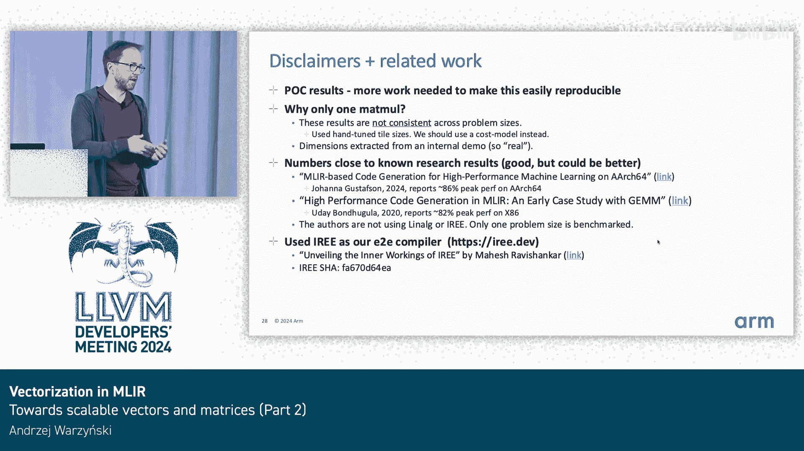

# 056：向量化在MLIR中的应用 - 迈向可扩展向量与矩阵（第二部分）🚀


## 概述
在本节课中，我们将深入探讨MLIR中的向量化技术，特别是针对可扩展向量（Scalable Vectors, SV）和可扩展矩阵扩展（Scalable Matrix Extension, SME）的支持。我们将从向量化驱动方式开始，逐步深入到动态形状处理、访问模式分析以及SME特有的优化技术，最后通过性能数据验证当前进展。

---

## 向量化驱动方式 🚗

上一节我们概述了向量化的整体流程，本节中我们来看看如何具体驱动MLIR中的向量化过程。

MLIR的`linalg`向量化器可以通过两种主要方式驱动：C++ API和Transform Dialect操作。

### C++ API驱动
C++ API提供了一个底层的`vectorize`方法钩子，允许直接对特定的`linalg`操作进行向量化。由于`linalg`方言中几乎所有操作都是`linalg.generic`或其别名（如`linalg.matmul`），因此`vectorizeLinalgGeneric`方法至关重要。

以下是使用C++ API进行向量化的示例代码框架：
```cpp
// 对linalg.generic操作进行向量化
vectorizeLinalgGeneric(op);
// 对卷积等特殊操作进行向量化
vectorizeConvolution(op);
```

### Transform Dialect驱动
为了更快速地进行原型设计和测试，可以使用Transform Dialect提供的更高级操作。

Transform Dialect提供了两个主要操作：
1.  `vectorize`：直接调用底层的C++ `vectorize`钩子，适用于精细测试。
2.  `vectorize_children_and_apply_patterns`：不仅调用向量化钩子，还会应用后续的规范化等模式，输出更清晰、用户友好的IR，并且可以应用于更大的代码块（如整个函数）。

---

## 向量化linalg.generic操作 🔧

现在，我们来看看向量化器如何处理一个具体的`linalg.generic`操作，例如一个矩阵乘法。

当向量化器遇到一个`linalg.generic`操作时，它会执行以下步骤：
1.  将操作的输入和输出参数重写为`vector.transfer_read`和`vector.transfer_write`操作。
2.  进入操作体，逐个向量化其中的标量操作。
    *   对于乘法操作，直接重写为向量的乘法（`vector.mul`）。
    *   对于沿归约维度的加法操作，识别后使用专门的`vector.multi_reduction`操作。

向量化器能够推断出应使用的向量大小。例如，在处理二维数据时，它会生成二维向量。这些向量在后续的 lowering 过程中会被分解为更小的部分。

### 动态形状的挑战
如果将上述示例中的静态形状替换为动态形状，情况会变得复杂。

向量化器此时无法直接知道应使用的向量大小。这通常源于向量化流程中的第一步——分块（tiling）。为了将问题适配到向量寄存器，分块后的尺寸可能无法被原始问题尺寸整除，从而在循环内产生动态形状和边界检查。

处理动态形状时，必须显式指定向量大小，并且向量化器必须使用掩码（masking）来保证安全性，以应对最坏情况。

---

## 掩码（Masking）机制概述 🛡️

为了理解如何处理动态形状下的向量化，我们需要了解向量方言层面的掩码机制。

掩码的基本原理是，将原本无掩码的向量操作（如`vector.outerproduct`）包装在一个`vector.mask`操作中，并为其提供掩码参数。

然而，这带来了一个关键问题：需要在每次迭代中计算掩码，在内层循环中这会带来显著开销。理想情况下，应避免这种计算。

通过分析循环（例如矩阵乘法），可以发现通常只需要在最后一次迭代时计算掩码。因此，优化目标是尽可能消除掩码计算。

---

## 循环剥离（Loop Peeling）技术 🍌

我们采用循环剥离技术来优化掩码开销。

循环剥离将循环嵌套拆分为一个主循环和一个余数循环。主循环始终在完整的向量寄存器上操作，余数循环则处理剩余部分。

这项技术虽然不能完全消除动态形状，但它创造了一种易于分析的形式。在主循环中，步长（step）是静态的，这使得分析和重写为静态形状的向量操作成为可能。

---

## 张量提取（tensor.extract）的向量化 🎯

接下来，我们改变一下主题，讨论`tensor.extract`操作的向量化，这是一个非常重要的例子。

`tensor.extract`操作从张量中读取单个元素。向量化该操作时，需要根据访问模式决定使用哪种向量操作。

以从二维矩阵读取到一维向量为例，主要存在四种访问模式场景（其中一种尚未实现）：
*   连续加载（Contiguous Load）
*   分散加载（Gather Load）

关键点在于，分散加载总是安全的（在大多数情况下正确），但通常是最慢的选项。如果实际是连续加载，则需要识别并生成更高效的连续加载操作。

向量化器通过分析用于访问张量元素的索引，来判断实际处理的是哪种访问模式。

---

## 可扩展向量（SV）与矩阵扩展（SME）更新 📈

现在，让我们跳转到向量化器中对可扩展向量扩展（SVE）和可扩展矩阵扩展（SME）支持的最新进展。

### SVE 与 SME 简介
*   **SVE**：核心思想是向量大小是某个基本长度的倍数（例如128位的倍数），称为`vscale`。这实现了向量长度无关编程，简化了用户视角，但给代码生成和编译器设计带来了独特挑战。
*   **SME**：在SVE基础上，增加了一个方形的存储阵列，可作为外积操作的累加器。这使得SME成为一个矩阵乘法加速器。该存储阵列在两个维度上都具有可扩展大小，并且被划分为多个虚拟切片（virtual tile），虚拟切片的数量取决于底层元素类型。

### 与掩码相关的新挑战
在分块（尤其是为SME进行矩阵乘积分块）的上下文中，由于向量和累加器在所有方向都是可扩展的，这导致循环步长也是可扩展的（即未知值）。因此，更难以摆脱动态形状，进而难以避免掩码，这使得分析和代码生成更加复杂。

### 优化：消除不必要的掩码
即使经过循环剥离，保守的代码生成仍可能产生包含恒定、不必要掩码的操作序列。我们扩展了值范围分析（Value Range Analysis），以理解可扩展大小中的`vscale`，从而能够在许多情况下消除这些不必要的掩码。

### SME特有的 lowering：切片类型分解与虚拟切片分配
在SME的 lowering 流水线中，有两个关键步骤：
1.  **切片类型分解**：在高层，我们假设使用整个SME存储阵列。但在硬件层面，它被划分为虚拟切片。因此，我们需要进行类型分解，例如将一个操作整个存储阵列的外积操作，分解为多个对更小向量块和存储阵列切片进行操作的相似操作。
2.  **虚拟切片分配器**：当使用SME虚拟切片时，我们通过LLVM IR intrinsics与之交互，这些intrinsics要求指定使用哪个切片。我们实现了一个虚拟切片分配器，它基于MLIR中已有的活跃性分析API，以确保无冲突地使用所有切片，从而获得良好性能。

---

## 性能评估 📊

最后，我们通过一些性能数据来评估当前的工作。需要强调的是，这些更多是概念验证，我们尚未投入大量时间进行深度性能优化。

### 矩阵乘法基准测试
我们比较了三种实现：
1.  朴素的C++实现
2.  使用IREE（我们的端到端MLIR编译器）的MLIR生成代码
3.  Arm Compute Library（Arm的性能库）

对于特定示例，我们的MLIR生成代码达到了Arm Compute Library约80%的性能，这是一个令人满意的结果。

为了评估可扩展向量化的效果，我们比较了使用128位宽向量（SVE）和512位宽向量（流式SVE，与SME核心结合）的性能。理想情况下，向量宽度增加4倍应带来接近4倍的加速。我们观察到了约2.6倍的加速，这证明了编译器正确利用了更宽的向量。

### SME代码生成评估
我们在内部构建了一个自定义卷积神经网络流程，以测试能否将复杂模型成功lowering到SME。我们取得了成功，这是一个重要的里程碑。

性能评估分为两部分：
1.  **在真实硬件（Neoverse V1芯片）上**：比较IREE（MLIR代码生成）与Android生态系统内的XNNPACK库。结果显示性能非常接近，表明IREE做得很好。
2.  **在带有SME加速器的模拟器上**：首先在模拟器的主CPU上运行，然后切换到SME加速。由于使用了方形存储阵列且向量更宽，预期应有加速。我们观察到了约3倍的加速，这再次证明代码生成是正确的，且性能具有可扩展性。

---



## 总结 🎓

本节课中我们一起学习了：
1.  MLIR中`linalg`向量化的两种驱动方式：C++ API和Transform Dialect。
2.  向量化`linalg.generic`操作的基本过程，以及处理动态形状带来的掩码挑战。
3.  利用循环剥离技术来优化动态形状下的向量化性能。
4.  `tensor.extract`操作的向量化策略，关键在于识别连续或分散访问模式。
5.  对可扩展向量（SVE）和可扩展矩阵扩展（SME）的向量化支持更新，包括掩码消除、切片分解和虚拟切片分配等关键技术。
6.  通过矩阵乘法和自定义CNN的基准测试，验证了当前向量化及SME代码生成流程的功能正确性和性能潜力。

当前工作为在MLIR中利用现代可扩展向量和矩阵加速器奠定了基础，未来的工作包括集成成本模型、更高级的融合优化以及持续的性能调优。