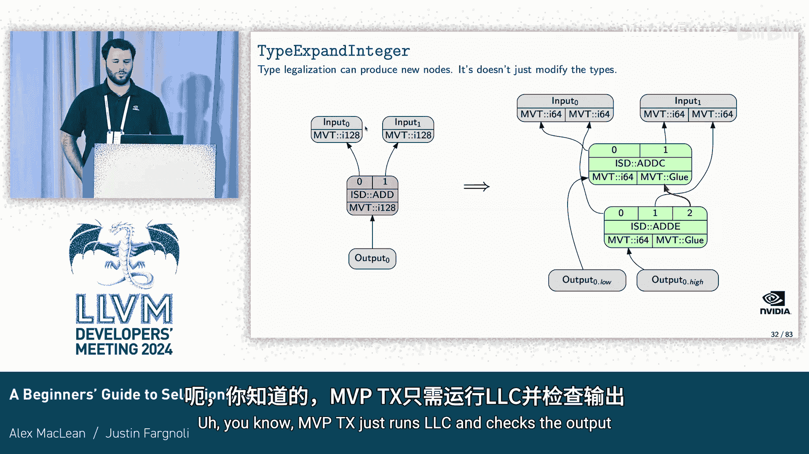

# 057：SelectionDAG 入门指南

在本教程中，我们将学习 LLVM 编译器后端中的一个核心框架：SelectionDAG。我们将了解它是什么、它在编译流程中的位置、其内部数据结构，以及它如何将高级的 LLVM IR 转换为目标机器指令。

## 编译流程中的 SelectionDAG

上一节我们介绍了本教程的目标。本节中，我们来看看 SelectionDAG 在 LLVM 整体编译流程中的位置。

标准的 LLVM 编译流程是：前端解析源代码，生成 LLVM IR；`opt` 工具对 IR 进行优化；`llc` 工具生成汇编代码。SelectionDAG 框架位于 `llc` 内部，具体来说，它介于 LLVM IR 优化阶段和机器指令（Machine IR）优化阶段之间。

SelectionDAG 主要执行以下步骤：
1.  **构建** SelectionDAG 数据结构。
2.  **合法化** 类型和操作，确保它们被目标平台支持。
3.  **指令选择**，选择将在芯片上运行的特定机器指令。
4.  **调度**，将指令的有向无环图转换为线性的机器指令序列。

在构建和合法化阶段之间，还会通过 **DAG 合并器** 执行窥孔优化，以消除在 lowering 和合法化过程中可能引入的低效代码。

## SelectionDAG 数据结构

上一节我们了解了 SelectionDAG 的流程。本节中，我们来深入看看其核心数据结构。

SelectionDAG 既是一个框架，也是一种数据结构。它是一个**有向无环图**，用于表示程序的含义，是另一种类似于 LLVM IR 或 Machine IR 的中间表示形式。需要记住的是，**每个 SelectionDAG 代表一个基本块**。在编译过程中，我们会将程序分解为基本块，在每个 DAG 上执行所有指令选择阶段，最后再将它们重新组装起来。

在讨论数据结构之前，我们先简要了解一下 SelectionDAG 中的类型。主要有两种类型需要关注：
*   **机器值类型**：这是一个类型集合，是所有架构支持类型的并集。任何特定目标平台不会支持所有 MVT，但集合中的每个元素都被某些架构支持。MVT 包括整数、浮点数、向量等。
*   **扩展值类型**：这包括所有 MVT 类型，以及 LLVM IR 支持的非标准大小整数和向量（例如 `i3` 或 `<10 x i8>`）。它不包括结构体和数组。

现在，我们通过一个简单的 LLVM IR 基本块来构建 SelectionDAG。该基本块包含三条指令：将一个外部值 `%a` 加上常量 5，再将结果乘以常量 3，然后跳转到另一个基本块。

以下是构建 SelectionDAG 的核心组件：

**SDNode**
这是 SelectionDAG 的基本构建块。每个 SDNode 有一个**操作码**，定义节点的类型。它还可能有许多其他字段。在我们的例子中，会为每条指令（`add`, `mul`, `br`）和常量值（`5`, `3`）以及目标基本块地址创建对应的 SDNode。常量和基本块节点还包含具体的**值**。

**SDValue**
这代表一个 SDNode 的**输出**。它可以表示为一个产生输出的 SDNode 和一个指向其输出列表的索引。与 LLVM IR 不同，SelectionDAG 中一个节点可以产生多个输出（本例中均为单输出）。每个 SDValue 都有一个关联的 **EVT**。

**SDUse**
这代表一个 SDNode 的**输入**。它可以定义为一个 SDValue（被使用的值）、一个使用者节点以及一个指向该节点操作数列表的索引。这些就是图中的**边**。需要注意的是，图中的箭头代表**使用关系**，而非数据流方向。

每个 SDNode 有一个或多个由 SDValue 表示的结果，以及零个或多个由 SDUse 表示的操作数。

为了表示跨越多个基本块的值（如 `%a` 和结果 `%z`），我们引入了 **CopyToReg** 和 **CopyFromReg** 节点。它们类似于加载和存储指令，但操作的是寄存器地址而非内存地址。

为了表示非数据依赖的排序关系（例如确保分支指令在计算完成后执行），我们引入了**链**。链是 SDUse 的一种，不代表实际数据流，不会变成寄存器，只表示依赖关系。在调度时，拓扑排序会遵循这些链来保证正确顺序。图中用蓝色虚线箭头表示链。

每个 SelectionDAG 都有一个 **EntryToken** 节点，代表基本块的开始。通常，终结指令（如分支）节点会成为 DAG 的 **根** 节点，某些转换会从这个节点开始。

通过以上步骤，我们就为这个基本块完整构建了 SelectionDAG。

让我们再看一个包含内存操作的例子：存储一个常量，然后加载一个值供其他块使用。这个 DAG 会更大。我们注意到：
*   **Load** 和 **Store** 节点是内存 SDNode，它们有额外的信息（如对齐方式），并且它们的第 0 个操作数是一个链。
*   **TokenFactor** 节点用于将两条链合并在一起，使得一个节点（如分支）可以依赖于多个事件完成。它本身不会生成任何指令。

## SelectionDAG 构建阶段

上一节我们深入了解了 SelectionDAG 的数据结构。本节中，我们开始探讨 SelectionDAG 处理的第一个阶段：构建。

在此阶段，我们将函数中的每个基本块表示为 SelectionDAG。大部分情况下，这基本上是**一对一**的映射，即将 LLVM IR 值转换为类似的 SelectionDAG 节点，而不进行太多目标特定的 lowering。

但有两个主要的例外情况需要处理：

1.  **结构体类型**
    SelectionDAG 不支持结构体类型。因此，需要将它们**逐元素降低**。例如，加载一个结构体并提取其字段的 IR，会被降低为对每个结构体元素的单独加载操作，并使用 `add` 节点来偏移地址以访问第二个元素。还会引入 `MergeValues` 和 `TokenFactor` 节点来方便地表示多个值或依赖关系，这些节点最终会被优化掉。

2.  **目标特定的 API**
    一些 IR 特性没有通用的 SelectionDAG 表示，需要目标平台自行实现。这包括调用约定相关的 lowering，例如 `LowerCall`、`LowerFormalArguments` 和 `LowerReturn`。每个目标都需要在 TargetLowering 接口中实现这些，并生成代表这些指令的 SDValue。

## 类型合法化

上一节我们将 LLVM IR 降低到了 SelectionDAG。本节中，我们需要确保 DAG 中的所有类型和操作都被目标平台支持。第一步是**类型合法化**。

目标平台只支持 LLVM IR 所支持类型的子集。例如，LLVM IR 支持 `i24`、`<3 x i8>`、`i128` 等类型，而 PTX 目标可能只支持 `i32`、`i64`、`float`、`double` 等。在类型合法化阶段，我们需要将非法类型降低为合法类型。

那么，什么是“合法”呢？在指令选择之前进行合法化时，我们说一个类型或操作是“合法”的，仅仅意味着**我们的指令选择代码能够处理它**。

目标平台通过调用 `addRegisterClass` 函数并传递一个特定的 MVT 来告知 SelectionDAG 该 MVT 对该目标是合法的。基于合法的类型集合，SelectionDAG 可以自动为我们合法化所有不支持的类型。它在后台构建一个表格，将每个类型映射到一个合法化该类型的操作。

以下是几种主要的合法化方法：
*   **扩展整数**：例如，将不支持的 `i128` 加法扩展为带有进位处理的 `i64` 加法序列。注意，此阶段不仅修改类型，也修改 DAG 结构。
*   **提升整数**：例如，将不支持的 `i24` 加法提升为 `i32` 加法，并通过 `and` 操作屏蔽掉可能被设置的额外高位。
*   **向量特殊处理**：目标可以覆盖 `getPreferredVectorAction` 函数，为特定向量类型指定合法化操作。例如，Hexagon 目标遇到 `<3 x i8>` 时，可以要求将其**加宽**为 `<4 x i8>`。

## 操作合法化

上一节我们处理了类型合法化。本节中，我们来处理操作的合法化。

SelectionDAG 支持超过 400 种操作码。目标平台通常不支持所有这些操作码，而且对于支持的操作码，也可能不支持所有合法类型。本阶段的目标是将所有 SelectionDAG 支持的操作降低为目标平台合法的操作。

目标平台通过调用 `setOperationAction` 函数，为特定的操作码和 MVT 指定应采取的合法化操作。SelectionDAG 在后台构建一个表格，将每个（操作码，合法 MVT）对映射到一个合法化操作。

以下是目标可以指定的几种主要合法化操作：
*   **Legal**：无需处理，指令选择代码可以直接处理。
*   **Promote**：提升到更大的类型执行。
*   **Expand**：用一系列合法的操作来模拟该操作。
*   **Custom**：需要目标实现自定义的 lowering。

**提升示例**
NVPTX 支持 `f16` 和 `f32` 类型以及 `f32` 除法，但不支持 `f16` 除法。解决方案是将 `f16` 除法**提升**到 `f32` 类型执行，并插入必要的类型扩展和舍入操作以保持原始语义。

**扩展示例**
MIPS 不支持 `i32` 的字节交换操作。解决方案是请求 SelectionDAG 用一系列合法的移位和或操作来**扩展**模拟该操作。

**自定义合法化示例**
当提升和扩展都不够时，可以使用**自定义**合法化。目标指定 `Custom` 操作后，SelectionDAG 遇到该操作码和类型时会调用目标的 `LowerOperation` 函数。
*   **NVPTX 向量洗牌**：PTX ISA 有 `permute` 指令，其语义与向量洗牌操作高度匹配。编译器工程师可以实现自定义 lowering，将通用的 `vector_shuffle` 节点转换为目标特定的 `permute` 节点。
*   **X86 绝对值**：X86 通过自定义 lowering，将绝对值操作转换为目标特定的 `sub`（设置标志位）和条件移动指令。

## DAG 合并器

上一节我们合法化了 DAG 中的操作。但在进行指令选择之前，让我们先看看 **DAG 合并器**。

你可能会问，为什么需要这个？我们不是已经在 LLVM IR 层面做了窥孔优化吗？原因有二：
1.  清理在 lowering 和合法化过程中可能引入的低效代码。
2.  生成目标 ISA 提供的、可能比默认操作序列更快的独特操作。

**DAG 合并器** 为所有使用 SelectionDAG 的目标执行窥孔优化，本质上相当于 SelectionDAG 的 InstCombine。在尝试合并前，它会调用目标降低信息接口来查询特定转换是否对该目标更高效。

如果 DAG 合并器提供的免费优化还不够，目标可以实现**自定义 DAG 合并**。通过调用 `setTargetDAGCombine` 并传递一个操作码，SelectionDAG 在遇到该操作码时会调用目标的 `PerformDAGCombine` 函数。

**自定义 DAG 合并示例**
1.  **NVPTX 的 mul-wide**：PTX 非常关注寄存器压力。`mul` 操作需要 128 位存储操作数。PTX 有 `mul.wide` 指令，它接受两个 `i32` 并产生一个 `i64`。自定义合并器可以检查 `i64` 乘法，如果发现其输入的高 32 位未被使用（通过零扩展判断），则将其转换为 `mul.wide` 并插入截断操作。DAG 合并器会迭代运行，进一步消除冗余的扩展/截断，最终得到指令更少、寄存器压力更低的 DAG。
2.  **NVPTX 的无符号取余**：在 PTX 中，无符号取余是非常昂贵的操作。自定义合并器可以将其降低为利用乘法和减法来模拟取余操作的 DAG 序列，从而提升性能。

## 指令选择

上一节我们优化了 DAG。本节中，我们进入核心阶段：**指令选择**。

在指令选择阶段，我们将把大多数通用的 SDNode 替换为**机器节点**。机器节点也是 SDNode，但其操作码是机器指令操作码，直接对应于具体的机器指令。

这个过程过于目标特定，无法由框架通用实现。因此，与之前阶段不同，每个目标都需要**重写** `Select` 方法，并实现大量的模式匹配代码来完成转换。这听起来工作量很大，但解决方案是使用 **TableGen**。TableGen 允许我们简洁地指定重写模式，然后自动生成繁琐的 C++ 代码。

要使用 TableGen 进行指令选择，我们需要定义三样东西：
1.  **SD 模式运算符**：描述我们在 DAG 中要寻找的模式。
2.  **指令**：我们想要输出的机器指令的表示。
3.  **模式**：将上述两者映射起来。

我们以 NVPTX 中降低加法指令为例：
*   **定义模式运算符**：首先定义一个类型概要，描述节点产生一个值，有两个相同整数类型的操作数。然后定义一个 `SDNode` 子类，指定其操作码为 `ISD::ADD`，使用上述类型概要，并赋予其交换律和结合律属性，以增加 TableGen 匹配的灵活性。
*   **定义机器指令**：定义一个机器指令条目，指定其操作码名称（如 `ADD_I32rr`）、输出定义和输入定义。
*   **定义模式**：编写一个模式，指定当遇到一个产生 `i32` 寄存器、并接受两个 `i32` 寄存器输入的 `ADD` 节点时，将其转换为 `ADD_I32rr` 机器指令。

TableGen 会利用这些信息，在指令选择阶段执行相应的转换。

大多数目标的 `Select` 方法实现如下：首先执行任何需要的自定义逻辑，然后调用 `SelectCode`，后者会跳转到 TableGen 生成的匹配器（一个庞大的 switch-case 语句）来执行基于 TableGen 的转换。

关于指令选择算法的一些重要说明：
*   **自底向上遍历**：DAG 从后往前遍历，确保一个节点的操作数总是在该节点本身被选择之前就被选择。这允许我们匹配一个节点时，能确保其操作数仍是通用形式。
*   **模式优先级**：当多个模式匹配同一个 DAG 时，优先选择**更复杂**的模式（匹配更大、约束更多的 DAG）。如果复杂度相同，则选择**生成指令数更少**的模式（作为成本代理）。如果仍相同，则回退到匹配模式的大小，最后选择源代码中**出现较晚**的模式。

## 调度

上一节我们完成了指令选择。本节中，我们进入最后一个阶段：**调度**。

指令选择的输入是一个机器节点的 DAG，而输出是这些机器节点的**线性序列**。最简单的做法是进行拓扑排序。对于 NVPTX 后端，由于其生成的代码是另一个编译器的输入（由该编译器负责最终调度），因此不 heavily 依赖此阶段。关于调度的更多细节，建议参考相关的博客文章和开发者会议演讲。

## 实践示例：为 NVPTX 实现 MAD 指令优化

现在，让我们通过一个完整的例子，看看如何在实际目标（NVPTX）中为 SelectionDAG 添加一个特性。

我们的目标是：通过窥孔优化，将 `mul` 后接 `add` 的模式，匹配并转换为 PTX 的 **MAD**（乘加）指令。这样做可以降低指令延迟并减少寄存器压力。

首先分析我们需要做什么：
1.  MAD 指令支持的类型在 NVPTX 中已经是合法的，因此**无需**修改类型合法化。
2.  `add` 和 `mul` 节点对于 MAD 支持的类型也已经是合法的，因此**无需**修改操作合法化。
3.  我们需要：
    *   **自定义 DAG 合并**：在合法化后的 DAG 中，将 `add(mul(x, y), z)` 模式转换为一个**目标特定的 SDNode**（例如 `NVPTXISD::IMAD`）。
    *   **指令选择逻辑**：将这个目标特定的 SDNode 降低为机器节点（`MAD_I32` 指令）。

**步骤一：实现自定义 DAG 合并**
1.  调用 `setTargetDAGCombine` 指定我们要为 `ISD::ADD` 实现自定义合并。
2.  重写 `PerformDAGCombine` 函数，并添加对 `ISD::ADD` 操作码的处理，调用我们自定义的合并函数。
3.  在合并函数中，检查操作数之一是否为 `ISD::MUL`，检查类型是否为 `i32`（或其他支持的类型），并检查该 `mul` 节点是否只有一个使用者（以避免延长其生存期增加寄存器压力）。
4.  如果所有检查通过，则创建并返回一个新的目标特定 SDNode，其操作码为 `NVPTXISD::IMAD`，操作数为 `mul` 的两个操作数和 `add` 的另一个操作数。

**步骤二：实现指令选择**
1.  在 TableGen 中，定义目标特定 SDNode `NVPTXISDIMAD` 的类型概要（一个输出，三个输入，均为整数）。
2.  定义机器指令 `MAD_I32rrr`，指定其操作码、输出和输入。
3.  编写一个模式，将 `NVPTXISDIMAD` 节点匹配并转换为 `MAD_I32rrr` 指令。

通过以上步骤，我们就成功地将 LLVM IR 中的乘加模式，通过 SelectionDAG 的 DAG 合并和指令选择，最终生成了 PTX 的 `mad` 汇编指令。

## 总结与资源

在本教程中，我们一起学习了 LLVM 中 SelectionDAG 框架的完整流程。我们从其在编译流程中的位置开始，深入探讨了其有向无环图数据结构，并逐步讲解了构建、类型合法化、操作合法化、DAG 合并优化、指令选择和调度等核心阶段。最后，我们通过一个为 NVPTX 实现 MAD 指令优化的具体例子，将理论知识应用于实践。

希望本教程能帮助你更自信、更从容地使用和贡献于 SelectionDAG 框架及各个后端。

为了帮助你快速上手，以下是一些推荐的学习资源：
*   **官方文档**：LLVM 官方关于代码生成的文档。
*   **源码**：直接阅读 `llvm/lib/CodeGen/SelectionDAG` 目录下的源代码。
*   **调试命令**：学习使用 `-debug-only=isel` 等选项来输出 SelectionDAG 各阶段的调试信息，这对理解内部过程非常有帮助。

祝你学习顺利！