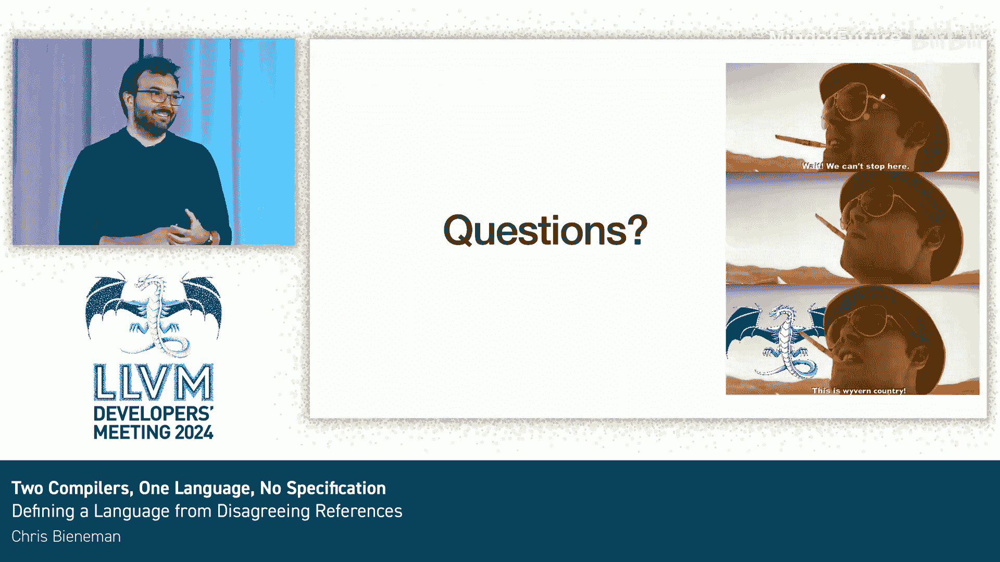

# 058：两个编译器，一门语言，无规范

在本节课程中，我们将探讨HLSL（高级着色器语言）的现状、其编译器生态面临的挑战，以及团队如何通过开发新编译器并制定语言规范来解决这些问题。我们将重点关注HLSL与C/C++的差异、并行架构带来的独特设计考量，以及向现代化工具链迁移的策略。

## 概述：什么是HLSL？ 🤔

HLSL是一种图形编程语言，主要用于实时渲染、DirectX和视频游戏开发。它自2002年开始使用，由Nvidia的Cg语言演变而来，现已成为Windows平台上GPU编程的主要语言，不仅用于图形处理，也用于通用GPU计算应用。

## 编译器现状与挑战 ⚙️

目前HLSL有两个参考编译器，这带来了维护和兼容性上的挑战。

以下是两个主要编译器的概况：

*   **FXC**：这是一个完全专有的定制编译器，已停止主动支持，但仍在被使用，因为它是唯一能支持DirectX 9到11目标的编译器，而许多低端设备仍依赖DirectX 11。它支持的HLSL语言版本大约从2002年到2015年。
*   **DXC**：这是基于LLVM 3.7的一个分支，是当前DirectX 12的主要编译器。它支持2016年至今的HLSL语言版本，目前仅针对“202X”这个开发中的语言版本进行功能开发。

我们面临的核心问题是需要一个现代化的编译器。我们拥有庞大的现有用户群，但不想做一个完全复刻旧bug的编译器。GPU代码的可移植性是一个大问题，而我们**缺乏一份成文的语言规范**。

## 为什么需要规范？ 📜

你可能会问，为什么需要规范？很多编程语言也没有规范。这里有一个例子：对于一段包含`inout`关键字的代码，C++程序员可能会认为它类似于引用，但在HLSL中并非如此。更糟的是，DXC编译器在针对Vulkan和DirectX不同目标时，会对同一段代码给出不同的编译结果。这清楚地表明我们需要一个标准来消除歧义和实现一致性。

## HLSL为什么不是C/C++？ 🔄

HLSL不直接采用C或C++有几个原因。简而言之，历史原因和GPU的独特性是关键。GPU的能力组合历来非常奇特，其架构也天生差异巨大，不存在像x86那样的通用GPU架构。此外，GPU本质上是并行的，而C/C++在本质上并行的架构上表现不佳。

## 语言相似性与差异性 ⚖️

在基础层面，HLSL在很多方面与C++相似，代码看起来也类似，并且工作方式也符合预期——直到出现不符合预期的情况。部分原因是编译器实现不一致，部分原因是语言本身确实不同。

我们一直在努力与用户沟通，让他们理解HLSL工具链需要做出的改变，以及我们过去可能做错的一些事情。我们将会改变这些，但这可能会破坏一些现有代码。

以下是一些来自“HLSL恐怖故事”系列的代码片段，它们看起来你知道其作用，但实际上可能并非如此：

*   `func(1, 2);`：这是一个模糊的函数调用，按照预期不应编译。
*   `func(1.0, 2);`：同样模糊，不应编译。
*   `int a = 1.0;`：为什么这能将`double`转换为`float`？
*   `bool b = 1.0;`：为什么这能将`double`转换为`bool`？
*   `bool b = 1;`：考虑到前面的例子都转成了`float`，为什么这个却转成了`bool`？

答案在于我们因缺乏规范、未明确记录规则以及测试不够充分而产生了这些不一致性。

## 内置函数的现代化处理 🛠️

我们在Clang中做的一项改进是处理所有内置函数。我们不再让它们在编译器中成为特例，而是通过一个隐式包含的头文件来实现，它们现在就是普通的函数。这带来了诸多好处，例如在Clangd中可以获得“转到定义”功能。但这也会破坏现有代码。因此，我们正在与用户沟通，解释我们过去做的这些奇怪事情，并说明现在是时候做出更好的改进了。

## GPU并行模型与向量化 🧵

HLSL的一个重大区别源于GPU的并行性。由于GPU常用于图形编程，向量无处不在。在HLSL中，一切都是向量，甚至一个`int`在底层也是一个向量。

HLSL采用SIMT编程模型。你编写的源代码看起来像是在操作单个变量，但在硬件层面，有多个并行线程同时执行。它们共享一个程序计数器，一起按指令执行。

例如，对于一个四元素输入数组，实际上你有四个四元素数组和四个大小值。当执行遇到控制流时，会有一个掩码决定当前线程是否执行该控制流。所有线程会一直执行控制流，直到所有线程都完成，然后才能退出循环并返回。

这带来了一些有趣的复杂性和隐藏成本，因为每个操作都发生了N次，每个变量都是N个变量（N是4到128之间的2的幂次）。动态控制流总是最坏情况。这些考量深刻影响了HLSL的使用方式和语言自身的表现形式。

## 类型转换的挑战与解决方案 🔢

一个在C语言中备受争议的特性是“通常算术转换”。它们非常有用，例如`int + int`得到`int`。但是`short + short`呢？在C语言中，`short`会先提升为`int`，进行运算，然后再转换回来。在GPU这样的并行架构上，这种转换的数量会严重影响性能。

为了解决这个问题，我们调整了C语言的做法，移除了较小类型提升的概念，但同时也必须添加新的转换规则来处理向量等C语言中不存在的数据类型。

我们还需要为许多其他操作（不仅仅是通常算术转换，还包括函数调用）进行隐式维度转换。因此，我们在隐式转换序列中增加了第四级：向量维度转换，用于将标量扩展为向量，或将向量/矩阵截断为更小的尺寸。

这当然也影响到了我们正在编写的语言规范。左边的表格是C++11的隐式转换序列，右边是HLSL的。我们从3个等级增加到了9个等级。

积极的一面是，与C++保持一致并使用C++的表述方式，使我们能够拥有比参考编译器简单得多的实现。我们的参考编译器使用评分系统进行参数依赖的重载解析，这个系统有缺点，例如当你有128个函数参数时（虽然没人会这么写），计数器会溢出，导致无法解析重载，除非是完全匹配的重载。采用更贴近C++、设计更稳健的方法对我们有很大优势。

但这同样会破坏代码。因此，在我们寻找语言演进方式时，优先考虑的是不将技术债务带到新编译器中。让旧编译器中有效的代码在新编译器中因明确的错误信息而失败，总比让它执行不同操作要好得多。当然，我们也需要平衡，确保用户最终能从旧编译器迁移到新编译器。

## 指针的缺失与`inout/out`关键字 🚫

GPU语言的另一个很大区别是，许多语言过去没有指针，HLSL至今也没有指针。这部分是因为GPU以不同方式和不同语义在不同位置存储内存，在基于C的语言中表示所有这些会变得复杂和奇怪。

但这导致了一个大问题：如果一个函数有多个返回值，在没有指针和引用的情况下如何实现？HLSL的答案是`inout`或`out`关键字。它们本质上仍然是按值传递的参数，但会在本地线程地址空间中创建为临时变量，以避免地址空间问题。

这又导致了另一个问题：因为这些是临时变量，你可以在调用函数时将参数强制转换为不同类型。函数可以改变该参数的值，然后再转换回来。这是一团乱麻，但它是HLSL语言的基础部分，用户依赖于此，因此在迁移时打破这一点对我们来说不是一个选项。

然而，这给我们带来的一个挑战是，我从未见过有其他语言这样做。我们甚至没有词汇来描述这种行为。因此，我开始创造新词，我称它们为“转换即将消亡的值”。它们有点像C++中的xvalue，但涉及转换，而且很怪异，会消失，然后在被销毁时通过另一个转换写回其值。希望优化器能清理这一切，但也许不能。

我们在Clang中通过一个新的AST节点来表示这一点。我们利用了Objective-C对写回参数的支持，在调用后执行某些操作以将值写回参数。我们有一个AST表示，代表了转换到参数和转换回值的过程。这确保了所有转换都被表示出来，语义检查会介入并警告所有转换。这对我们的用户来说是一个巨大的改进，因为以前所有这些转换都没有在AST中表示，用户的隐式转换从未被报告。

## 字面量类型与HLSL 202X 🔮

HLSL另一个有趣的差异是“字面量类型”。其起源是GPU经常以奇怪的精度进行计算（如10位、16位浮点值）。如果进行数学运算时只有10位精度，可能会出现严重的舍入错误。因此，HLSL的想法是在编译器中将其视为64位类型，然后在编译期间清理并给出更高精度、更小尺寸的表示。

问题是C++没有多表达式类型推断。因此，当尝试推断应将这个较大的未确定大小的类型解析为什么时，如果遇到像三元运算符这样的表达式，我们不知道该将其转换为什么。最终我们只能生成一个64位值，然后希望IR优化器能清理它。但这并不总是有效，会导致问题。

我们为此提出的解决方案是“HLSL 202X”，这是我们正在开发的语言版本。在Clang中，我们将不支持字面量类型，而是采用更接近C/C++的做法。我们将提供一条路径，通过在旧编译器中实现这些新特性，帮助用户迁移到新的语言版本。然后，一旦新编译器准备就绪，他们再将其作为第二步迁移到新编译器。

## 模板与概念支持 📐

我们遇到的另一个很酷的问题是，HLSL内置类型的模板在语言拥有模板功能之前就已存在。因此，我们对模板有要求，但当时没有在语言中表达这些约束的方式，例如向量需要是4个或更少的元素。

我们在Clang中决定的做法非常巧妙。由于Clang对C++概念的支持仅在解析层作为版本检查存在，因此我们可以通过编程方式在编译器中生成概念AST节点，从而在一个没有概念的语言中拥有概念。这对我们来说非常有用，因为模板在GPU代码中超级有用（所有内容都会被完全特化）。这是一个非常巧妙的想法，实施起来也很酷。

## 总结与核心建议 🎯

本节课中，我们一起学习了HLSL的现状、其编译器面临的挑战，以及向现代化迁移的策略。我们探讨了HLSL与C/C++的关键差异，特别是并行架构和向量化带来的独特设计，以及处理类型转换、指针缺失等问题的方案。

最后，我想强调，如果你在设计一门编程语言，**请务必将其文档化**。请编写规范、编写文档，拥有优秀的文档。因为在某个时间点，你将需要编写第二个或第三个编译器。如果没有描述其预期行为的文档，在不直接复制旧代码的情况下，在新编译器中匹配参考编译器的行为几乎是不可能的。

我们采取了创造性的方法来实现源代码兼容性，而不需要行为完全一致，这对我们非常有用。我们也在努力向前看，例如概念可能对HLSL用户非常有用，因此在当前实现中利用它是很好的。最后，如果你在制作一门编程语言，你的用户是技术人员。请与他们互动，告诉他们你在做什么。他们会理解，并且如果你真正与社区互动和沟通，你可能会收到更少的错误报告和抱怨。

