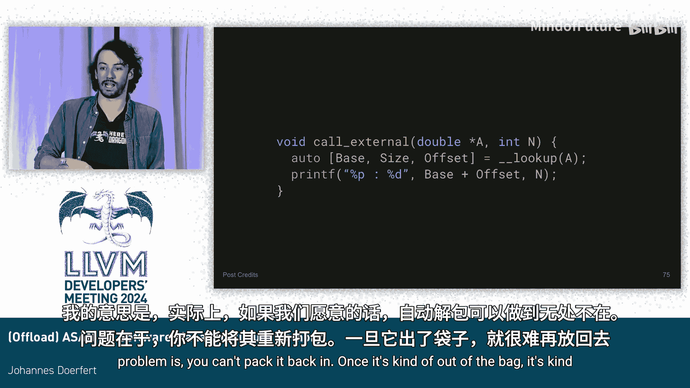

# 059：通过软件管理虚拟内存实现 Offload ASAN


## 概述

在本节课中，我们将学习一种为 GPU 等异构计算设备实现地址消毒器的新方法。传统方法在 GPU 上运行时存在显著的性能开销和内存开销。我们将探讨一种基于软件管理虚拟内存的新方案，它通过修改指针表示和引入间接层来高效地检测内存错误，同时大幅降低开销。

## 背景：现有 ASAN 的挑战

上一节我们介绍了地址消毒器的基本需求。本节中我们来看看为什么在 GPU 上直接使用传统 ASAN 会遇到困难。

CPU 和 GPU 环境存在根本差异。CPU 环境相对封闭，内存资源丰富；而 GPU 拥有多种显存类型，编程时需要显式管理，且内存容量通常有限。

传统 ASAN 存在固定开销。它为程序中的每次内存访问引入了额外的访问。它至少有 12.5% 的内存开销，如果存在大量小内存分配，开销会更高。它还可能产生漏报。当我们在 GPU 上实际运行这些工具时，会观察到一到两个数量级的性能下降。

## 核心方案：软件管理的虚拟内存

既然传统方法存在瓶颈，本节我们将深入探讨提出的新方案。其核心思想是引入一个软件层面的间接层。

首先，将内存想象为一个指针。一个指针在技术上包含两部分信息：一部分标识所指向的对象，另一部分给出对象内的偏移量。这是一种简化，但有助于理解。

方案的关键是引入一个软件管理的“内存管理单元”。每次进行内存分配时，我们在这个表中添加一个条目，记录该分配的基础指针和大小。每次释放内存时，我们将对应条目的大小标记为无效。

那么，我们的指针现在如何表示？它不再直接指向真实内存，而是指向这个 MMU 表中的一个条目。它包含一个**对象ID**和一个**偏移量**。通过这个 MMU 条目，我们可以找到对象实际应该指向的基础指针和大小。偏移量保持不变，因为我们需要允许指针运算和 `getelementptr` 等操作。

以下是该方案的简化表示：

```cpp
// 伪代码表示
struct PackedPointer {
    uint32_t object_id;  // 指向 MMU 表中的条目
    uint32_t offset;     // 在对象内的偏移
};

struct MMUEntry {
    void* base_ptr;      // 实际内存的基础地址
    size_t size;         // 分配的大小
};
```

现在，如果你有一段代码，例如一个循环递增数组中的每个元素，会发生以下情况：
1.  首先进行一次查找。指针 `a` 包含对象ID和偏移量。通过查找 MMU 表，我们可以获得基础指针和大小。
2.  在循环内部访问时，我们进行实际检查。检查公式为：`offset + i >= 0 && offset + i < size`。

这样，除了实际的内存访问外，没有额外的内存访问。这很有效。

## 处理不同内存类型

上一节我们介绍了核心方案，本节我们来看看如何将其适配到 GPU 上不同的内存类型。

显然，我们需要重写所有的内存访问，因为指针不再是真实的指针。但这是可行的。偏移量保持不变。但如果有人越界访问，覆盖了偏移量，就会破坏对象ID，导致 ASAN 检测崩溃。这并不理想。因此我们引入一个“魔术值”来确保如果偏移量被覆盖，我们可以检测到。

在设备上，每次分配时，我们将其记录到表中。一次查找需要 16 字节的加载。每次访问检查只需要位比较和位操作。这对于 64 位堆指针（分配数量较少）非常有效。

但是，对于共享内存和栈内存，存在大量分配（每个线程都有栈分配），并且这些是 32 位指针。上述方案效果不佳。我们初始实现了该方案，它有效，但对栈指针不够理想。

那么，我们该怎么做呢？首先，我们在“伪指针”中引入一个地址空间标识符，用于指示指针指向哪种内存。它必须始终位于相同的位置，因为如果你获得一个指针但不知道其来源，首先需要检查它以推测这是什么指针。

整个“伪指针”是 64 位。如果我们最初有一个 32 位指针，我们仍然将地址空间标识符放在最前面，将魔术值和偏移量放在最后。然后，我们将对象的大小嵌入到指针中。因为我们是从一个 32 位指针开始，并将其嵌入到一个 64 位指针中。我们把大小放进去，然后把真实的指针放进去。

现在，我们所有的元数据都随着传递的指针一起存在，没有额外存储任何东西。它随指针携带。

对于 32 位指针（共享内存和栈内存），我们没有内存开销。我们只对堆分配进行注册。32 位指针在 everywhere 被替换为 64 位指针。如果某人将 32 位指针存储为 32 位，这会失效，但事实证明几乎没有人这样做，因为这样做很困难且没有好的理由。我们可以检测到这种情况。

## 方案优势与效果

了解了技术细节后，本节我们通过数据来看看新方案的实际效果。

我们首先在核反应堆科学的代理应用 XBch 上进行了测试。该应用有约 5.5GB 数据移动到 GPU，是一个非平凡的量。我们比较了不同方案：

*   使用 NVIDIA 计算消毒器工具（非基于插桩），在 V100 上观察到 25 到 130 倍的减速。
*   使用 AMD 移植到其 GPU 架构的地址消毒器，观察到约 10-11 倍的减速。
*   使用我们的新方案，仅观察到约 2 倍的减速。这是一个 5 倍的改进，并且我们没有内存开销。

这只是一个代理应用。我们接着运行了完整的 OpenMC 应用程序，并查看了所有内核的时间。基准运行是蓝色的。红色是我们消毒了除共享内存（如 `__shared__` 变量）之外的一切。黄色是我们消毒了一切。

我们看到所有内核的开销普遍在 2 倍左右，这很好。如果我们消毒所有内容，端到端有 2.3 倍的减速。如果我们不消毒共享变量，可以收回一些开销。如果只进行堆和全局变量消毒，只有约 80% 的开销。仅插桩本身（按我们目前的方式）就占用了这 80% 中的 30%。我们添加了一些优化，将端到端开销从 2.3 倍降低到了 1.7 倍。

## 扩展至 CPU 及其他

之前我们主要关注 GPU，但本方案的核心思想并不依赖于 GPU。本节我们将其扩展到 CPU 环境进行验证。

我昨天早上做了一些实验。我采用了一个朴素的矩阵乘法（1024的三次方）。我在一台 AMD 处理器上运行。我运行了这个从 GPU 实现移植并拼凑起来的版本，与基准版本和常规 Clang ASAN 进行比较。

我的拼凑解决方案在该示例上快了约 6%。这大致在正确的范围内，还不错。但有趣的部分是，它实际上有 0% 的内存开销（与 ASAN 的 30% 相比，只有 0.0001 的页被实际触及）。我认为这很巧妙。

我相信还有很多事情可以做，有很大的改进空间。我们已经做了两三个小的优化，其他一些（包括将检查提升出循环等）目前正在研究中。关键是，我们已经去除了原始设计中一直存在的内存开销。现在，如果我们能从热点循环中去除更多一些的加载和检查，我们很可能将两个维度的开销都降低到一个非常理想的水平。

## 总结



本节课中我们一起学习了一种为异构计算设备实现地址消毒器的新方法。让我们总结一下关键点：

我们能够报告各种错误：
*   分配过大（受指针配置的自然限制）。
*   坏指针（例如覆盖了魔术位）。
*   越界访问（负偏移或偏移大于大小）。
*   释放后使用（对于 MMU 表中的一切，我们可以在释放后更新大小）。
*   地址空间不匹配（代码假设了错误的地址空间）。

该方案的设计充分考虑了 GPU 的特性：
*   GPU 内存非常有限，因此应避免内存开销。
*   我们通常受内存限制，应避免额外的内存访问，尤其是在循环中。
*   我们有不同的内存类型，因此需要有适用于快速内存的方案、适用于栈内存的方案。对于慢速堆内存，我们可以承受一些开销。

这种方法通过软件管理的虚拟内存和修改的指针表示，在保持强大错误检测能力的同时，显著降低了运行时和内存开销，为在资源受限的加速器上进行高效调试提供了新的可能性。