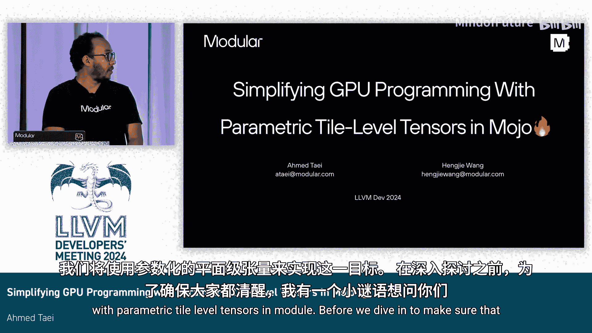
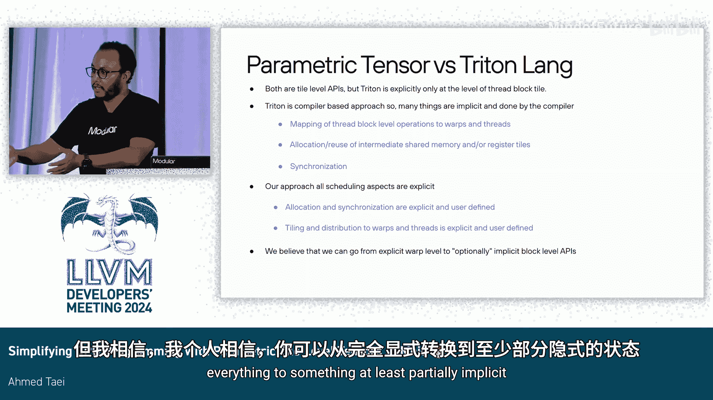

# 060：利用参数化分片张量简化GPU编程

在本节课中，我们将学习如何利用Mojo语言中的参数化分片级张量来简化GPU编程。我们将从现代GPU架构的特点出发，探讨传统编程模型的挑战，并介绍一种新的、更高层次的抽象方法。

## 现代GPU架构概述

上一节我们介绍了课程目标，本节中我们来看看现代GPU的架构特点。GPU是海量并行计算机器。例如，NVIDIA H800 GPU拥有128个流式多处理器，每个SM都配备了大量共享内存和寄存器文件。这种架构可以提供约2048个并行线程来执行任务。

GPU的并行性来源于异构的处理单元集合。并非所有核心都执行相同的指令。例如：

*   **CUDA核心**：执行加载/存储、浮点运算、分支等操作，可提供高达40 TFLOPs的算力。
*   **张量核心**：专门用于执行矩阵乘法这一种指令，可提供约300 TFLOPs的算力。

GPU通过高带宽内存与外部系统交互。随着技术迭代，新一代GPU（如H100）拥有更多SM（144个）、更大的共享内存和寄存器文件，核心速度也更快（CUDA核心快约3倍，张量核心算力相近），总计可达约1 PetaFLOP的算力。此外，还增加了更多专用加速器（如用于在全局内存和共享内存间移动数据的张量内存加速器）以及更高的外部内存带宽。

这听起来都是好消息，但性能却难以移植。如果一个内核在旧架构上达到了峰值性能，你需要做大量工作才能让它在新的架构上达到峰值。原因在于新的指令集和需要应用的新优化技巧。因此，不仅内核，后端编译器也必须努力追赶硬件快速发展的步伐。

## GPU编程模型与抽象鸿沟

上一节我们了解了GPU的强大算力，本节中我们来看看如何为它们编程。GPU采用单指令多线程编程模型，所有线程并行执行相同的指令。但硬件会将这32个连续线程分组为一个线程束，并（在理想情况下）让它们同时执行。一个线程束内的所有线程是同时执行的。

然而，由于多种原因，这种情况并不总是发生。此外，还有一部分指令是在线程束级别定义的，例如我们之前提到的矩阵乘累加指令，或者进行规约、线程束内洗牌等操作。在更新一代的架构中，这个概念被拓宽了，出现了需要多个线程束共同执行的指令，例如Hopper架构中的线程束组MMA指令。

因此，虽然单指令多线程模型在表达并行性方面很强大，我们都在使用它来编写快速的内核，但硬件并非真正单独执行每个线程，而是将线程分组为线程束。另一方面，编写内核的程序员也从不关心每个独立线程要做什么，他们总是编写描述一组线程行为的程序。

以密集计算内核（如矩阵乘法）为例，这些内核最终会归结为对分片的数据并行操作。当你分解矩阵乘法或任何类似风格的密集内核时，最终会得到一个分配给线程块的分片操作。然后，在线程块内部，你再次对这个分片进行划分，并将其分配给一个线程束。现在你有了一个线程束，需要分配和组织该线程束内的通道（即线程）来处理你的数据。

在将数据映射到计算层次结构时，你希望在分片上定义操作，例如分配、加载、复制、移动数据等。因此，程序员的思维模型始终处于“有多个线程”和“有不同类型的数据需要移动”的层次。此外，回顾本课开头，我们看到张量核心能提供300 TFLOPs的算力，而CUDA核心只能提供40 TFLOPs。程序员希望使用这些专用的固定功能核心来加速他们的内核，而这些核心的指令是以数据分片的形式定义的。

以下是一个MMA同步指令的例子，它有许多形状和数据类型的变体。我们看的是8x8x16（fp16累加到fp32）这个变体。一个线程束有32个线程。这条指令期望数据以特定布局排列：
*   对于操作数A：采用行主序布局，线程0按特定顺序访问4个元素。
*   对于操作数B：采用列主序布局，线程访问一个2x1的列向量。
*   对于操作数C和D：布局实际上与操作数A相似。

由此可见，即使是指令本身也期望数据以分片和子分片的形式表示。我们认为，这听起来像是一个抽象鸿沟：你作为开发者想要编写的内容，与必须处理的底层细节之间存在差距。单指令多线程只是一种表达并行性的方式，但你表达并行性的方式并不意味着你必须深入底层，将所有内容都写成每个线程应该做什么。否则，你将花费大部分时间仅仅计算索引、进行索引算术和索引簿记，以分解这些层次结构。

## Mojo的解决方案：参数化分片张量

上一节我们指出了传统模型的抽象鸿沟，本节中我们来看看Mojo提供的解决方案。我们希望能有一个高级的**分片张量**，它能自然地契合问题。你可以在这个张量上进行操作：分片、在特定内存区域分配、复制、进行数学运算等。当你将张量分配到计算层次结构时，一旦你有了一个线程束，你可以说：“好的，我有一个线程束，我可以使用这个特定的线程布局。” 这样做之后，你的问题就被**参数化**了，这非常有利于通过自动调优来优化你的内核，因为现在你有几个可以改变的决策点，例如我的分片大小是多少、我的寄存器分片大小是多少等等。你可以调整你的内核，甚至用于实验。

这实际上不是一个新问题。软件领域一直存在提供高级抽象的库，它们没有额外开销，并允许你表达算法（在我们这里是指内核），而无需担心如何映射到单指令多线程模型的实现细节。但因为它是库，挑战始终在于语言本身。你受限于语言能为你提供多少功能。更具体地说，在这个问题中，你受限于可以进行多少编译时转换，或者该语言的元编程对于编写这个库有多强大。

此外，回到编译器总是在追赶硬件这一点，你并不总是拥有对你所做事情的后端支持。如果你想访问新指令（比如新的张量核心功能），你可能只剩下内联汇编这一种解决方案，而你会尽量避免这样做。幸运的是，Mojo拥有更强大的元编程方法，并且可以直接访问MLIR操作，因此你并非只能依赖内联汇编。

我们的方法就是为了填补这个抽象鸿沟，定义一个张量类型。这个张量类型可以被分片、分配到计算层次结构，并支持更强大的类型转换（例如可以显式地进行向量化）。这个张量类型由一个布局元类型进行参数化，因此你可以指定数据在该张量中如何存储和访问。为了实现这些，你并不一定需要一个编译器或DSL，只要你的语言足够强大来进行这种元编程即可。

## Mojo中的元编程

由于元编程是该方法的核心，我们将从Mojo中的元编程是什么样子开始看起。

以下是一个Mojo和C++中几乎相同代码的示例。在右侧，你有Mojo代码，定义了一个由数据类型和秩参数化的张量类型。在C++中，你有一个由类型和一个整型参数化的模板。在Mojo中，我们有参数，它们都是元类型。我们希望在元类型和运行时值之间进行区分。这些参数类似于模板，但它们不是基于替换的元编程方法；它们是编译时常量，Mojo编译器会为你实例化并给出具体的类型、属性或值。

Mojo元编程的另一个强大之处在于，你使用同一种语言进行编程和元编程。例如，在Mojo程序中，有一个函数计算张量中的元素数量。这个函数接收一个列表（可以是堆分配对象或其他任何东西）。你只需要使用 `alias` 关键字调用 `size` 函数，该表达式将在编译时被解释和求值。你得到的是一个编译时整数列表属性。但在C++中，元编程几乎是另一种语言，你必须学习所有不同的语言结构来表示相同的东西，这是一个障碍。如果你严重依赖元编程来实现库，这会使事情变得复杂。

在Mojo中，元类型也不仅限于用户定义的类型。你可以有参数化的闭包（即函数），以特定方式定义。例如，你可以有一个参数化多级流水线的MMA，并传递一个函数来实现融合等操作，这对代码生成很有用。

## 张量类型与布局转换

我们有一个由布局元类型参数化的张量。这些元类型是数据布局，用于指定密集维度如何被访问，以及一个元素布局。当你将张量元素从标量提升为向量时，你转换的是元素布局。布局只是一个将坐标映射到坐标的函数，这就是你获取元素访问方式的方法。如果你熟悉MLIR，我们使用了非常相似的定义来描述布局。

以下是一个行主序和列主序布局的示例。使用元组而不是整数列表的原因是我们需要表示分片布局，如果你熟悉MLIR的`memref` 4D平铺布局，这很相似，但这是一个非扁平化的、结构化的版本。

让我们看看如何转换这个张量类型。我们有一个像 `tile` 这样的操作：你有一个张量、一个分片大小参数和坐标，然后你得到另一个张量类型，通过求值这个参数化函数（平铺布局）并进行布局转换来得到。向量化也是如此，你将标量元素提升为向量，然后更新向量化后的元素布局。或者进行布局分发，在这种情况下，分发操作由线程布局参数化。分发操作就是分片并分发：它对数据进行分片，然后根据这个分片将线程分发出去。

现在，你可以在张量上定义操作：分配内存、进行数据移动（将分片从一个地方复制到另一个地方）、进行数学运算。

## 整合应用：简化张量核心的使用

让我们看看如何将这些整合起来，以简化如何使用张量核心来获得最大性能。

你可以构建一个张量，然后在共享内存中分配分片，在寄存器中分配分片，设置一个规约循环，移动数据并显式同步，然后进行规约。你使用张量核心指令将数据加载到寄存器，然后计算并累加。

GPU原语是作为MLIR操作实现的，这使我们免于仅仅编写内联汇编。当把所有东西放在一起时，你得到的Matmul实现看起来与我们之前看到的数学描述相似。

这个实现使我们获得的性能几乎与cuBLAS相当，在某些情况下甚至更快。需要明确的是，这些形状是动态的，没有静态形状特化。

## 与Triton的比较及总结

关于与Triton的比较，Triton是一个优秀的编译器基础设施，你可以在高级的线程块级别编写程序，然后编译器会出色地生成高性能代码。我们的方法非常不同，它是一个库。你仍然需要编写内核，但我们让你能够显式控制所有你想要的调度决策，例如分配寄存器分片和同步所有操作，因为我们的首要目标是性能。但我个人相信，你可以从“完全显式，声明并控制一切”过渡到至少“部分隐式”的某种状态。

本节课中，我们一起学习了如何利用Mojo中的参数化分片张量来简化GPU编程。我们从现代GPU架构和传统单指令多线程模型的局限性出发，探讨了存在的抽象鸿沟。接着，我们介绍了Mojo如何通过强大的元编程能力和参数化布局，提供一种高级的张量抽象，让开发者能够更直观地表达并行计算，特别是高效利用张量核心等专用硬件单元。这种方法在提供高性能的同时，也增强了代码的可移植性和可调优性。