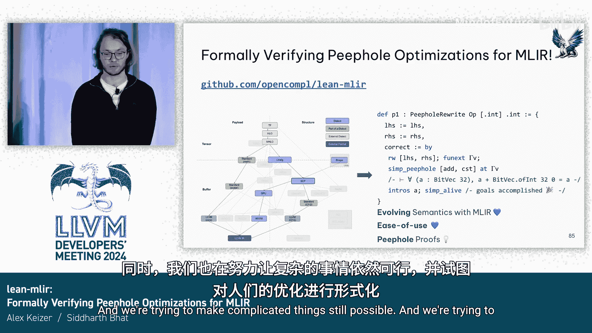

# 061： 一个用于形式化验证MLIR窥孔优化的工具


## 概述
在本教程中，我们将学习如何使用Lean MLIR，这是一个基于定理证明器Lean的工具，用于形式化验证MLIR（多级中间表示）中的窥孔优化。我们将了解其工作原理、与现有工具（如Alive）的关系，以及如何将其应用于不同复杂度的MLIR方言。

---

## 第1章： 背景与动机

### 1.1: 什么是窥孔优化及其验证？
编译器中的窥孔优化是一种将一小段代码（源程序）替换为另一段功能等价但更高效的代码（目标程序）的转换。验证此类优化的正确性至关重要，即需要证明对于所有可能的输入，目标程序的语义都与源程序的语义完全一致。

### 1.2: 现有工具：Alive
在深入Lean MLIR之前，我们需要了解一个名为Alive的现有工具，它用于验证LLVM IR中的窥孔优化。

以下是Alive的工作原理：
1.  **输入**： 用户提供源程序片段和目标程序片段。
2.  **转换**： Alive将这些片段编译成一种名为SMT-Lib的严格规范的中间表示。
3.  **求解**： 然后，Alive使用一个名为Z3的SMT求解器来回答一个关键问题：对于所有输入，函数`source`是否等于函数`target`？
4.  **输出**： Z3会返回验证结果。如果优化正确，则通过；如果错误，Z3会提供一个反例，展示导致输出不一致的特定输入值。

Alive的核心挑战在于，它需要定义一个从LLVM IR到SMT-Lib的、能够保持语义的转换。由于LLVM的语义（涉及未定义行为和毒值等概念）非常复杂，这项工作本身极具挑战性。

### 1.3: 从LLVM到MLIR的挑战
既然Alive对LLVM如此有效，一个自然的想法是将其应用于MLIR。然而，这并非易事。

主要困难在于，MLIR支持定义各种领域特定方言，其中一些方言操作的数学对象（例如，同态加密编译器Hair中使用的多项式环元素）过于复杂，无法直接编码到SMT-Lib中。这意味着像Z3这样的自动化求解器遇到了能力边界。

---

## 第2章： 引入定理证明器与Lean MLIR

### 2.1: 什么是定理证明器？
为了解决上述挑战，Lean MLIR选择基于定理证明器Lean进行构建。定理证明器与传统的编程语言或自动化求解器不同。

定理证明器允许你做两件事：
1.  **定义和计算**： 像普通编程语言一样定义函数并进行求值。
    ```lean
    def maximum (a b : Nat) : Nat :=
      if a ≤ b then b else a

    #eval maximum 3 4 -- 输出: 4
    ```
2.  **陈述和证明定理**： 你可以陈述一个逻辑命题（定理），并编写一个机器可检查的证明来证实它。
    ```lean
    theorem maximum_commutative (a b : Nat) : maximum a b = maximum b a := by
      -- 这里会包含一个基于情况分析的证明步骤
      ...
    ```
    Lean会严格检查你提供的证明是否正确。如果证明有效，它就认可这个定理成立。

### 2.2: Lean MLIR的设计理念
Lean MLIR采用了Alive团队曾探索过的思路：在定理证明器内部重新实现优化验证工具。

其核心思想是：
*   **语义形式化**： 使用Lean作为语言，来精确描述各种MLIR方言的语义。
*   **灵活验证**： 对于语义简单、可被SMT求解器处理的方言（如类LLVM的算术操作），Lean MLIR会利用Lean中已验证的求解器来自动构建证明，实现“一键式”验证。
*   **复杂对象处理**： 对于涉及复杂数学对象的方言（如多项式方言），则直接利用Lean强大的数学库（Mathlib）来编码这些对象的数学定义，然后手动或半自动地编写证明。

这使得Lean MLIR占据了一个理想的位置：在拥有高度自动化的同时，也保持了完备性，确保用户永远不会因为方言太复杂而无法进行形式化推理。

---

## 第3章： Lean MLIR实战体验

上一节我们介绍了Lean MLIR的设计理念，本节中我们来看看它的具体使用体验。Lean MLIR主要关注三个目标：形式化MLIR语义、验证窥孔优化，以及为不同复杂度的方言提供相应级别的自动化支持。

### 3.1: 自动化验证示例（类LLVM方言）
对于语义类似于LLVM的方言，Lean MLIR提供了高度自动化的验证体验。

以下是使用其内嵌DSL定义优化规则并验证的流程：
1.  **定义优化模式**： 使用类似MLIR的语法定义要匹配的源模式（左值）和要转换成的目标模式（右值）。
    ```lean
    -- 定义源程序: x + 0
    def lhs : LHS := [mlir| %x = arith.addi %y, 0 : i32 |]
    -- 定义目标程序: x
    def rhs : RHS := [mlir| %x = arith.addi %y, 0 : i32? No, 这里应为 `%x = %y`， 但为展示DSL语法保留原表述，实际验证会处理恒等变换]
    ```
    （*注：为忠实原文，此处保留可能的描述性笔误，实际右值应为`%x = %y`*）
2.  **陈述优化规则**： 声明这是一个从`lhs`到`rhs`的重写。
3.  **生成正确性证明**：
    *   框架首先运行自动化程序，消除SSA形式的样板代码。
    *   将正确性条件简化为纯数学表达式（例如，对于32位整数`x`，`x + 0 == x`）。
    *   调用一系列自动化证明策略（“证明锤”），该策略可以自动完成证明。

用户甚至不需要本地安装Lean，可以通过在线Playground进行体验。当自动化成功时，Lean会显示“No goals”（无待证目标），表示证明已完成。

### 3.2: 处理错误优化与推广证明
如果优化规则是错误的，自动化程序会像Alive一样提供一个反例。

更强大的是，Lean MLIR可以证明优化对于**所有位宽**都成立，而不仅仅是具体的位宽（如32位）。这对于确保优化在特殊架构（如使用512位整数）上依然正确至关重要。

### 3.3: 复杂方言验证示例（多项式方言）
对于多项式方言这类复杂对象，验证无法完全自动化，但仍然是可能的。

Lean MLIR利用Lean庞大的数学库Mathlib，该库包含了定义多项式环等复杂对象所需的基础数学。开发者可以：
1.  在Lean中形式化多项式方言的精确语义。
2.  基于这些形式化定义，手动或借助一些辅助工具来构造优化正确性的证明。

虽然这需要更多人力，但它突破了自动化求解器的限制，使得验证复杂方言的优化成为可能。



---

## 第4章： Lean MLIR框架剖析

前面我们看到了Lean MLIR的应用，本节我们来深入了解其内部框架是如何构建的。该框架的核心是提供一种模块化的方式来定义任何MLIR方言的语义。

### 4.1: 方言语义的定义
一个方言的语义主要由两部分构成：
1.  **类型宇宙**： 方言中所有类型的集合。需要为每种类型提供其在Lean中的语义。例如，可以将`i32`类型映射为Lean中的`BitVec 32`（32位位向量）。
2.  **操作语义**： 方言中所有操作的集合。对于每个操作，需要定义：
    *   **类型签名**： 它接受什么类型的参数，返回什么类型。
    *   **语义函数**： 一个Lean函数，精确描述该操作如何根据输入值计算输出值。

例如，对于一个极简的整数方言：
*   `Constant`操作：接受一个整数值，返回一个`i32`。其语义函数返回对应的位向量。
*   `Add`操作：接受两个`i32`，返回一个`i32`。其语义函数是位向量的加法。

### 4.2: 框架的工作流程
定义了方言的语义后，Lean MLIR框架会：
1.  将用户用DSL编写的源程序和目标程序片段，根据操作的类型签名，解析成语法树。
2.  利用之前定义的语义函数，将这些语法节点“解释”或“编译”成等价的纯Lean数学表达式。
3.  最终，要证明的优化正确性命题就转化为一个关于这些Lean数学表达式的等式，可以在Lean中加以证明。

### 4.3: 当前范围与开放问题
目前，Lean MLIR主要专注于基本块级别的、语法驱动的窥孔优化验证。它能够处理许多常见的优化，并已验证了大量来自Hacker‘s Delight、Alive测试用例和LLVM `InstCombine`的优化。

然而，也存在一些开放挑战：
*   **副作用**： 框架虽然支持对副作用建模，但如何自动化地推理MLIR中复杂的副作用交互仍是一个难题。
*   **非组合语义**： 如果某个操作的语义依赖于其上下文（例如，某些量化方言中，区域内操作的语义受外部操作影响），则当前的组合语义模型将难以处理。
*   **大规模转换**： 目前主要验证局部优化。对于像内联这样更全局的、过程间的转换，验证起来更为复杂。

---

## 总结
在本教程中，我们一起学习了Lean MLIR这个工具。我们从窥孔优化验证的需求出发，回顾了现有工具Alive的能力与限制。为了克服MLIR方言多样性带来的挑战，Lean MLIR基于定理证明器Lean构建，它既能对简单方言提供高度自动化的“一键验证”，也能通过形式化复杂数学对象来验证极具挑战性的方言。通过其模块化框架，开发者可以为自己的MLIR方言定义形式化语义，并在此基础上验证优化的正确性，从而在编译器开发的早期就能保证转换的可靠性，让简单的事情变容易，让复杂的事情成为可能。