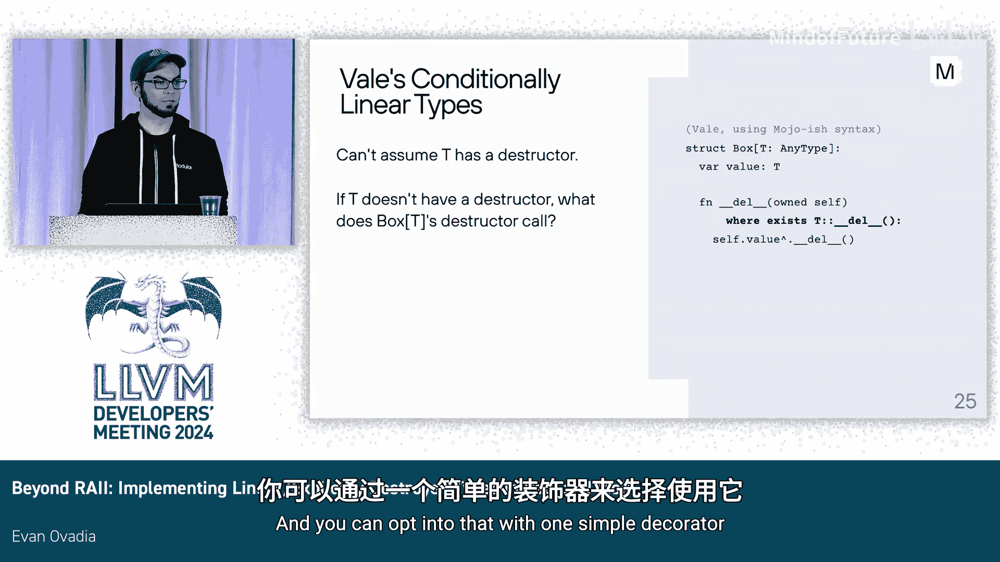

# 062：在Vale和Mojo中实现线性与不可破坏类型 🧵


## 概述
在本教程中，我们将学习什么是线性类型，以及如何在编程语言Vale和Mojo中实现它们。线性类型是一种强大的类型系统特性，它要求程序员必须显式地、以特定方式销毁对象，而不是让对象简单地离开作用域。这有助于编译器在编译时捕获许多常见的编程错误，例如忘记释放资源或处理重要操作。

---

## 什么是线性类型？ 🤔

上一节我们概述了线性类型的概念，本节中我们来看看它的具体定义。

线性类型的常见定义是：一个线性对象最终必须被恰好“消费”一次。但这个定义可能不够直观。一个更实用的定义是：**线性对象不能仅仅离开作用域，你必须最终以特定的方式显式地销毁它**。

为了理解这个定义，让我们看一个基本示例。

### 线性类型示例：线程处理 🧵

如果你使用过C++的`std::thread`，可能会遇到这样的问题：如果你不小心让线程对象离开作用域而没有调用`join()`或`detach()`，它的析构函数会因不知道该做什么而调用`std::terminate`，导致程序崩溃。

线性类型可以解决这个问题。在Mojo中，我们可以定义一个`Thread`结构体：

```mojo
struct Thread:
    explicit_destroy("must call join or detach")
    # ... 其他字段 ...

    fn join(self: owned Self):
        # ... 执行连接操作 ...
        destroy self

    fn detach(self: owned Self):
        # ... 执行分离操作 ...
        destroy self
```

这里的关键是`explicit_destroy`注解，它表示这个类型没有析构函数，其对象不能仅仅离开作用域。`destroy`是一个特殊的关键字，用于最终销毁对象。类型的使用者（如函数`foo`）不应直接使用`destroy`关键字，而应调用像`join`或`detach`这样的方法，这些方法在内部使用`destroy`来结束对象的生命周期。

如果用户尝试让一个`Thread`对象离开作用域，编译器会报错：“不能删除T，必须调用join或detach”。

以下是用户修复错误的几种方法：

1.  **调用一个接收所有权并销毁它的方法**：例如 `t^.detach()`（`^`是移动语义的语法，表示将所有权转移给方法的`owned`参数）。
2.  **推迟销毁**：将线程对象移动到某个更长寿的数据结构中，如一个线程列表。由于`Thread`是线性的，`List[Thread]`也是线性的，编译器会确保最终有人处理这个列表中的所有线程。
3.  **返回它**：将线程对象作为返回值移交给调用者，让调用者负责决定如何处理（调用`join`、`detach`或继续传递）。

通过这个例子，我们可以看到线性类型的第一个核心作用：**编译器确保你最终必须决定对象何时以及如何消失**。

---

## 线性类型的其他应用场景 🔧

上一节我们通过线程的例子了解了线性类型的基本原理，本节中我们来看看线性类型在其他场景下的应用。

线性类型不仅能确保你做出决定，还能确保特定的操作最终会发生。

### 确保计算并提供一个值：Promise示例 🤝

在多线程编程中，`Promise`用于向另一个线程传递值。如果你忘记调用`set_value`，等待的线程就永远得不到值。

使用线性类型的`Promise`可以解决这个问题：

```mojo
struct Promise[T]:
    explicit_destroy("must call set_value")
    # ... 其他字段 ...

    fn set_value(self: owned Self, value: T):
        # ... 设置值并通知等待者 ...
        destroy self
```

如果用户创建了一个`Promise`但没有调用`set_value`就让它离开作用域，编译器会报错。这确保了用户最终会计算出一个结果并调用`set_value`。

### 确保获取一个值：Future示例 📬

`Future`代表一个将来会包含重要值的对象。这个值可能是一个需要处理的待处理请求的响应，或者是飞机需要正确着陆的当前航班信息。用户绝对不能让它无声无息地消失。

线性类型的`Future`可以这样定义：

```mojo
struct Future[T]:
    explicit_destroy("must call get")
    # ... 其他字段 ...

    fn get(self: owned Self) -> T:
        # ... 等待并获取结果 ...
        let result = ...
        destroy self
        return result
```

用户必须调用`fut^.get()`来获取结果。编译器不仅确保我们最终调用了`get`，还确保我们最终取得了这个结果值的所有权。

---

## 线性类型的隐藏超能力 🦸

从前面的例子中，我们可以看出一个模式。线性类型不仅仅是关于销毁，它拥有一个隐藏的超能力：**通过线性类型，你可以控制未来**。

你可以设计你的线性类型及其方法，以确保在未来某个时间点，以某种顺序，特定的事情**最终一定会发生**。你虽然不知道它们具体何时发生，但从你创建那个线性对象的那一刻起，你就可以确信：
*   某些决定**将会**被做出（例如，如何处理线程）。
*   某些数据**将会**被计算、提供或获取（例如，Promise的值，Future的结果）。
*   数据**将会**以正确的方式被销毁。

你可以将这些保证以有趣的方式组合起来，帮助你的用户更正确地使用你的类型。

---

## 一个强大的例子：解决缓存不一致性问题 💡

线性类型的组合能力非常强大。下面是一个来自Vale游戏开发中的例子，展示了单个线性类型如何一举解决了三个缓存不一致性错误。

我们有两个主要结构体：

```mojo
struct LiveEntityList:
    fn add(...) -> LiveEntityHandle:
        # ... 添加实体到列表 ...
        return LiveEntityHandle(index)

    fn remove(self: &mut Self, handle: owned LiveEntityHandle):
        # ... 根据句柄的索引从列表中移除实体 ...
        destroy handle

struct LiveEntityHandle:
    explicit_destroy("must give back to LiveEntityList.remove")
    index: Int
    # ... 其他字段 ...
```

`LiveEntityList`是关卡中实体的中央列表。`add`方法返回一个`LiveEntityHandle`。注意，这个句柄本身是线性类型（有`explicit_destroy`注解），唯一销毁它的方式就是把它交还给`LiveEntityList`的`remove`方法。

这些句柄在实体存在于列表期间，被存放在其他地方，比如：
*   一个“位置 -> 实体句柄”的缓存映射，用于快速查找某个位置上有谁。
*   一个“队伍 -> 该队伍中实体列表”的映射。

**这带来了两个重要的推论：**

1.  **活的实体句柄即证明**：如果你持有一个`LiveEntityHandle`，你就**知道**对应的实体仍然在中央列表中。这类似于弱指针，但更通用，它证明了关于一个远端对象的任意属性（在这里是它在“真相源”列表中的成员身份）。
2.  **悬垂句柄成为不可能**：因为你必须先从所有缓存映射中取出句柄，才能用它来从中央列表中移除实体。所以，映射（缓存）永远不可能与列表（真相源）不同步。

通过巧妙地设计线性类型，我们自动解决了多个集合之间的不一致性问题。这就像一种“线性纠缠”或“编译时线性引用计数”。

---

## 在Mojo中的实现 🛠️

上一节我们看到了线性类型强大的应用，本节中我们来看看它在Mojo编译器中的实现机制。

首先，需要了解Mojo中普通（非线性）类型的工作方式。Mojo采用一种称为 **ASAP（尽快）销毁** 的策略。编译器不会在作用域末尾插入析构函数调用，而是在变量的最后一次使用之后立即插入。这可以提高内存使用效率。

处理普通类型生命周期和插入析构函数调用的逻辑，位于 **`CheckLifetimes` MLIR Pass** 中。这个Pass会找出生命周期的开始和结束位置。

它的工作流程大致如下（以逆向扫描代码为例）：
1.  从函数末尾开始逆向扫描。
2.  遇到一个使用变量的操作（例如`print(x)`），如果这是逆向扫描中第一次遇到该变量，则标记此处为该变量的**生命周期结束点**。
3.  对于非线性类型，如果不是移动操作，就在此处插入析构函数调用。
4.  继续扫描，直到遇到初始化该变量的操作，标记此处为**生命周期开始点**。

### 线性类型的错误检查 ✅

对于线性类型，`CheckLifetimes` Pass 的工作流程在“生命周期结束点”有所不同：
1.  当Pass扫描到线性类型变量的最后一次使用（即生命周期结束点）时，它发现这不是一个移动操作（即所有权没有被转移给一个接收`owned`参数的方法）。
2.  于是，Pass检查该类型是否有`explicit_destroy`注解。
3.  如果有，Pass不会插入析构函数调用，而是**向用户报告一个编译错误**，提示用户必须显式销毁该对象（例如，“必须调用join或detach”）。

这种实现方式巧妙地融入了Mojo现有的编译器架构中。

---

## 待解决的问题与未来方向 🚀

上一节我们介绍了线性类型在当前Mojo中的基本实现，本节中我们来看看尚未解决的问题和未来的计划。

### 条件线性类型与泛型容器 📦

一个主要的未决问题是：如何让线性类型与泛型容器（如`List`、`Optional`、`Dict`、`Box`等）协同工作？这些容器本身有析构函数，但它们包含的元素类型`T`可能是未知的。如果`T`是线性类型（没有析构函数），容器的析构函数就无法调用`T`的析构函数。

**解决方案是使用条件一致性（Conditional Conformance）**。例如，`Box[T]`的`del`析构方法，应该只在`T`也有`del`方法时才存在。在Vale中，这类似于：
```mojo
struct Box[T]:
    fn del(self: owned Self) where T has del:
        self.value.del() # 只有T有del方法时，这行代码才有效
        # ... 释放Box自身内存 ...
```
在Mojo中，可能会使用特质（Trait）来实现，例如`where T: ImplicitlyDestructible`。这确保了泛型代码能够同时处理线性类型和非线性类型。

### 路线图 🗺️

未来的工作主要包括：
1.  **完成条件线性类型的实现**：这是支持泛型容器的关键。
2.  **更新标准库**：让标准库中的容器和工具支持线性类型。
3.  **逐步发布**：最初可能通过一个默认关闭的编译器标志来启用线性类型功能，供社区试用和反馈。
4.  **收集反馈**：评估线性类型在实际项目中的效果、易用性以及修复问题的成本。
5.  **最终决策**：根据社区反馈，决定是否将线性类型作为默认开启的功能。

---

## 总结

在本教程中，我们一起学习了线性类型的核心概念。我们了解到：

1.  **线性类型**要求对象必须被显式、以特定方式销毁，不能仅仅离开作用域。
2.  它通过编译器强制保证，帮助避免了忘记释放资源（如线程）、忘记提供结果（如Promise）、忘记处理重要值（如Future）等常见错误。
3.  线性类型的**隐藏超能力**在于允许类型设计者“控制未来”，确保一系列特定操作最终必定以正确的顺序发生。
4.  我们通过一个游戏开发的例子，看到了线性类型如何巧妙地**解决多个缓存之间的不一致性**问题。
5.  在Mojo中，线性类型的错误检查是通过扩展现有的`CheckLifetimes` MLIR Pass来实现的，当发现线性对象未被正确处理时报告编译错误。
6.  未来的挑战在于实现**条件线性类型**，以使其与泛型容器完美配合，这项工作正在进行中。



线性类型是一种强大的工具，它将部分运行时责任转移到了编译时，能够显著提升代码的可靠性和可维护性。