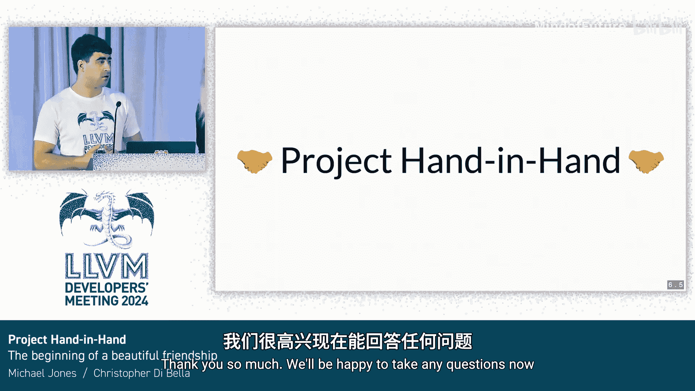

# 063：手拉手 - LLVM libc 与 libc++ 的代码共享


在本节课程中，我们将探讨一个在 LLVM libc 和 libc++ 之间共享代码的项目。我们将了解其动机、实现方式、面临的挑战以及未来的可能性。

## 为什么 LLVM 需要 libc？

首先，我们可能会问，为什么 LLVM 需要一个 libc 库？毕竟 LLVM 本身是用 C++ 编写的。答案在于，libc 已经成为许多编程语言的基础库。例如，Lua 和 Python 的解释器是用 C 写的，它们大量调用 libc 的功能。Mojo 和 Rust 等编译型语言的标准库也会调用 libc，因为没有人愿意重新实现复杂的数学函数或字符串到浮点数的转换。C++ 则是最极端的例子，因为 libc++ 标准上包含了 libc 的所有功能。

libc++ 为许多 libc 函数提供了更友好的接口。例如 `sin` 函数，如果你直接想调用 `sinf`，它确保在全局命名空间中定义；但如果你只想调用 `sin` 并传入浮点数，它提供了函数重载，无需指定具体类型。当包含 `<cmath>` 时，它也会包含 libc 版本的 `math.h`。许多 libc++ 函数在内部最终会调用 libc 函数来完成核心功能。

LLVM libc 本身是用 C++ 实现的，这使我们能够利用模板等特性来优化内部函数。例如，字符串转整数有 `atoi`、`strtol`、`strtoll`、`strtoul`、`strtoull` 等多个函数，它们功能相似但略有不同。如果用纯 C 实现，可能需要使用宏和代码复制来获得良好的接口。而 C++ 的模板让我们可以在内部获得更清晰的语法抽象和函数接口，尽管对外仍然提供相同的 C 函数接口。

我们将其设计为模块化，部分原因在于这些内部函数需要完全保持内部性，不能暴露给外部。我们希望在内部使用更符合 C++ 习惯的接口，因为这样更方便。

## libc++ 的挑战与机遇

libc++ 的接口表面比 libc 大得多。libc++ 长期以来缺少一些 C++17 的功能，部分原因在于浮点数处理非常复杂，需要投入大量精力确保正确性。

C++17 特别增加了一个名为 `from_chars` 的功能，位于 `<charconv>` 头文件中，用于将字符串转换为浮点数。标准明确指出，`from_chars` 的功能与 C 库函数 `strtod` **几乎相同**，只有少数例外。

然而，对比两个接口，我们发现它们差异很大：
*   C++ 的 `from_chars` 接受由两个指针界定的字符范围。
*   C 的 `strtod` 接受以空字符结尾的字符串。
*   返回值方式不同：C++ 通过引用返回浮点数，C 通过返回值返回。
*   `from_chars` 的返回值结构包含更多信息。
*   C 有格式说明符。
*   错误返回机制不同：C++ 错误信息是 `from_chars` 结果的一部分，而 `strtod` 通过 `errno` 返回。

因此，虽然功能相同，但接口完全不同。这就引出一个问题：为什么 libc++ 不能自己实现一套？同样，因为浮点数处理极其困难。既然 LLVM libc 已经实现了相关功能，为什么还要重写超过 2300 行代码呢？如果 libc 能提供一个不同的内部接口就好了。

好消息是，LLVM libc 确实已经这样做了。它使用函数模板来处理字符串到浮点数的转换，因此无需为 `strtof`、`strtod`、`strtold` 等分别编写代码。这些函数模板必须在头文件中实现，这很好。而且由于只是字符串到浮点数的转换，没有操作系统特定的依赖，这使得合作变得容易。

那么，核心问题就变成了：**libc++ 能否使用 LLVM libc 已经提供的代码，以便用共同的核心来实现 `from_chars`？**

## 合作路径与要求

如果我们想走这条路，就需要分别考虑 libc++ 和 libc 各自需要做什么。

**从 libc++ 的角度看：**
1.  **对用户透明**：这意味着我们需要一个严格的接口来限制“海拉姆定律”。海拉姆定律指出，任何用户可能接触到的东西，无论你是否声明它不稳定，随着用户群增长，最终都会有人依赖它。因此，接口必须设计得让用户甚至不知道底层是不同的。只要行为完全相同，就是可以接受的。
2.  **不稳定的 API**：我们需要一个非常明确和狭窄的接口，以避免限制这个库的演化。同时，我们需要为 API 变更制定计划，因为事物总会随时间变化，没有计划会限制我们的发展。
3.  **扩展到 Clang**：未来可能考虑在 Clang 中也使用这些共享代码，但必须谨慎和明确。不能随意包含 libc 的内部头文件，否则会造成混乱。

**从 LLVM libc 的角度看：**
1.  **代码基础**：代码已经是独立且用 C++ 编写的，我们有一个与 libc++ 需求相似的 API，只需要进行一些小的调整。
2.  **优化实现**：该实现已经是经过良好优化的。
3.  **明确的接口**：通过仅头文件（header-only）的实现方式，我们可以使用间接头文件，在特定的命名空间中重新导出我们想要暴露的部分。这样就能明确区分哪些部分可以接触，哪些是 libc 内部更深层的实现细节。

以下是一个示例头文件的片段，展示了如何提供 `strto_integer`，但不提供像将十六进制字符转换为整数这样的底层辅助函数：
```cpp
namespace __llvm_libc { // 内部命名空间
// 只暴露给 libc++ 的接口
int strto_integer(const char* __restrict str, char** __restrict str_end, int base);
// 不暴露底层辅助函数
// char to_digit(char c, int base);
}
```

## 潜在的陷阱与解决方案

在合作过程中，我们需要避免一些潜在的陷阱：

1.  **耦合公共 API 会严重限制演化**：过去 Glibc 和 libstdc++ 曾尝试共享代码（如 `io vtable`，允许将 C++ 流用作 C 的 `FILE*`），但最终失败了，因为 API 的紧密耦合使得双方无法独立更新，最终不得不破坏 API。



2.  **如果接口发生分歧怎么办？**：如果发生分歧，我们需要做的是回退到共同祖先。我们从现有 API 开始，找出两个新 API 之间的共同功能，将分歧部分移入各自的库中，保持公共接口对两者通用。这只需要一些代码重组，以确保满足各自库的规范。

3.  **如果完全分歧怎么办？**：如果某个功能完全分歧，我们只需将该函数完全拆分出来，使其不再属于公共代码。其余部分保持不变。除非我们坚持之前设定的严格、狭窄的接口准则，否则这可能会有些困难。

幸运的是，由于 libc 和 libc++ 位于同一个单体仓库（monorepo）中，我们无需担心 API 版本化问题。如果我们想更改 API，可以在一个原子提交中完成。只要用户从同一个提交构建他们的 libc 和 libc++，就不会有任何问题。API 版本就是那个单一的提交。

## 项目成果与致谢

基于上述分析和设计，这个项目成功了。LLVM 20 将发布基于 LLVM libc 代码实现的 `from_chars` 浮点数转换功能。相关的拉取请求已经合并，没有造成严重破坏（除了 PowerPC 上的一些小问题）。这对于 libc++ 和 libc 来说都是一个成功。现在我们有了一个可以共同维护的共享核心。

在此，我们要特别感谢为此项目做出贡献的人们：
*   **Louis Dionn**：libc++ 的主要维护者，帮助组织了 libc++ 方面的工作并进行了大量代码审查。
*   **Mark de Wever**：编写了 libc++ 部分的字符串解析代码。
*   所有参与 RFC 讨论和拉取请求评审的贡献者。

## 未来展望

对于未来，我们考虑在以下方面进行探索：

1.  **扩展共享范围**：我们怀疑 libc++ 可能从其他领域（如数学函数）的代码共享中受益。
2.  **扩展到 LLVM 其他部分**：例如，今天主题演讲中提到的数学概念，可能是与其他 LLVM 组件共享的潜在途径。但再次强调，不要随意在其他地方包含这些代码，请先与相关维护者沟通。
3.  **构建统一的运行时库**：未来或许可以考虑构建一个统一的库，包含 LLVM libc、libc++、libunwind 等，这样在构建程序时只需链接一个东西，而无需记住需要组合哪些 LLVM 运行时组件。

## 问答环节摘要

在演讲后的问答环节，讨论了一些关键问题：

*   **关于 C 和 C++ 标准协调**：有建议提出，如果 C 标准社区能增加一个具有新功能的公共标准化 C 函数（类似 `from_chars`），或许可以简化工作。虽然存在错误处理机制（`errno` 与异常/返回结构）和解析规则（如区域设置）的差异，但这无疑是一个值得探索的未来方向。
*   **测试策略**：libc++ 方面像测试其他单元测试一样测试公共功能。libc 方面有自己的单元测试来测试内部代码和公共接口。libc++ 不测试“手拉手”项目的具体细节，只将其视为普通的 libc++ 函数进行测试。
*   **libc 内部改动**：为实现共享，libc 侧只需要一个微小的改动（在字符串到浮点数解析的某个性能优化环节增加了长度限制器），没有重大变更，目前也未发现会对未来 libc 发展方向造成限制。
*   **版本混合与依赖**：共享代码是内部的。如果用户混合使用不同版本的 libc（如 musl）和 LLVM libc++，可能会缺少某些函数。但本质上，共享的 libc 代码是 libc++ 内部的，musl 不需要提供它。
*   **会创建新的中间库吗？**：曾考虑过创建一个介于 libc 和 libc++ 之间的公共库，但短期内不会实现。目前代码由 libc 开发者维护，放在 libc 中更合适，且所有共享都是通过头文件完成的，没有独立的运行时库。
*   **对供应商的影响**：对于像 Apple 这样的 libc++ 供应商，如果使用 CMake 构建则无需任何更改。如果使用自己的构建系统（如 GN），则需要配置包含路径并在构建 `charconv` 时定义一个宏，之后即可正常工作。未来类似更改的影响范围取决于具体功能，可能是几十个函数，如果涉及常量表达式数学函数，则可能多达数百个，但这对用户应该是透明的。

---

本节课中，我们一起学习了 LLVM libc 与 libc++ 之间“手拉手”代码共享项目的背景、设计、实现与未来。核心在于利用 C++ 模板和头文件实现了一个狭窄而明确的内部接口，使得 libc++ 能够复用 libc 中复杂的浮点数解析代码，成功实现了 C++17 的 `from_chars` 功能，同时避免了紧密耦合带来的维护负担，为两个库的未来合作奠定了良好的基础。