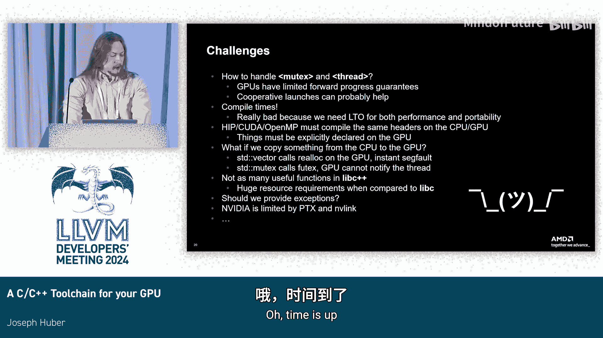

# 064：为你的GPU构建一个C++工具链 🚀


## 概述
在本节课中，我们将学习如何构建一个能够直接在GPU上运行的标准C++工具链。我们将探讨其动机、实现方法、现有方案的对比，以及如何通过交叉编译的方式将LLVM的C/C++运行时库移植到GPU上。

## 从固定功能到通用计算：GPU的演变
GPU已经从最初的固定功能图形硬件发展至今，现在它们承担了大量的通用计算任务。然而，与最简单的嵌入式处理器相比，GPU通常缺乏完整的工具链支持。这引发了一个问题：如果GPU真的是通用处理器，我们能否直接在它们上面运行任意的C/C++代码？这正是本项目的核心动机。尽管其中一些工作可能并不完全实用，但探索过程本身比结果更有意义。更重要的是，这允许你将现有库轻松移植到GPU上，并得益于LLVM和libc++团队的工作，获得许多通用功能的实现。

## 现有GPU编程方案对比
上一节我们介绍了项目的动机，本节中我们来看看现有的将C/C++库移植到GPU的方案。以下是几种主流方法：

### CUDA / HIP
CUDA或其替代品HIP是目前在GPU上编写代码的普遍方案。但当我们审视其本质时，CUDA是一种“卸载语言”。它将主机编译和设备编译（甚至可能是多架构）的异构编译任务合并到一个庞大的Clang作业中，这给构建系统带来了巨大的复杂性。此外，它要求程序员手动为每个函数添加 `__global__` 和 `__device__` 等修饰符。

让我们剖析一个简单的AXPY示例（这似乎是所有GPU相关幻灯片的标配）：
```cpp
// CUDA 示例
__global__ void saxpy(float a, float *x, float *y) {
    int i = blockIdx.x * blockDim.x + threadIdx.x;
    y[i] = a * x[i] + y[i];
}
```
你使用一些“神奇”的Clang选项编译此代码。编译器实际上是在设置了一些特定语言选项后，将代码传递给Clang前端。运行时则将这些 `blockIdx` 调用转换为Clang支持的内建函数。虽然我们了解了其内部机制，但目前我们并不想使用CUDA。

### OpenMP
OpenMP提供了一种更接近标准C++风格的解决方案，它主要通过编译指导语句实现。它与CUDA存在相同的问题，主要与构建系统相关，并且也需要手动使用 `#pragma` 来区分主机和GPU代码，因为它是异构的，不能假设所有内容都是共享的。

再次查看相同的SAXPY示例：
```cpp
// OpenMP 示例
void saxpy(float a, float *x, float *y, int n) {
    #pragma omp target teams distribute parallel for
    for (int i = 0; i < n; ++i) {
        y[i] = a * x[i] + y[i];
    }
}
```
我们使用 `-fopenmp` 标志进行编译，本质上也是启动了一个设置了 `-mtriple` 和一些OpenMP语言选项的Clang前端作业。OpenMP的运行时也使用了相同的Clang内建函数来实现GPU的“魔法”。

### OpenCL
OpenCL采用更传统的编译方式，这解决了我对卸载语言在此类应用中的许多顾虑。但OpenCL的问题在于，为了尽可能兼容更多硬件，它有意限制了所提供的功能类型。而我更感兴趣的是利用当今大多数人都能接触到的高端硬件的特性。例如，函数指针或递归在OpenCL标准中是被明确禁止的，但它们存在于许多现有程序中，因此无法直接移植。

## 直接使用C/C++：交叉编译的视角
综合以上方案，我们发现几乎每一种卸载语言都只是Clang前端的某种封装。那么，为什么我们不能直接使用C/C++呢？事实证明，Clang已经有一个选项可以直接针对不同的架构进行编译，它叫做 `-target`。

如果我们针对AMD GPU，只需执行：
```
clang -target=amdgcn-amdhsa your_code.cpp
```
这样，我们就可以直接使用标准的ISO C++代码。由于CUDA等语言本身就基于C++，我们可以轻松地将其通过Clang编译，得到能在设备上运行的功能性代码。

但显然，这样做的问题是性能极差，因为你是在单个线程上运行代码，这无异于将价值1000美元的硬件当作100美元的树莓派来使用。因此，要想真正在GPU上使用C++，你需要打破标准委员会的束缚，进入编译器扩展的奇妙世界。

以下是一个使用编译器扩展的阻塞矩阵乘法示例：
```cpp
// 使用编译器扩展的GPU代码示例
[[clang::kernel]] void matmul(...) {
    [[clang::address_space(3)]] float *shared_A;
    int tid = __builtin_amdgcn_workitem_id_x();
    int bid = __builtin_amdgcn_workgroup_id_x();
    // ... 计算逻辑
    __builtin_amdgcn_barrier();
}
```
这段代码看起来与CUDA非常相似：函数上有特殊修饰符使其使用内核调用约定；有地址空间属性（与CUDA的 `__shared__` 关键字几乎一一对应）；有获取网格ID或线程ID的内建函数；还有与 `__syncthreads()` 相同的屏障内建函数。

你可能会觉得这看起来很糟糕。但首先，我提交了一份RFC，试图提供一个资源目录头文件，至少为这些东西提供更规范的名称，使其更接近OpenCL的风格。其次，更重要的是，如果我们转变对GPU语言编译方式的看法，我们可以用它做很多有趣的事情。因为，这本质上就是**交叉编译**，而人们进行交叉编译已经很久了。

## 构建完整的GPU工具链
上一节我们提到了交叉编译的概念，本节中我们来看看如何构建一个完整的GPU工具链。一个完整的编译器工具链通常包括：
1.  **编译器前端**：我们已经有了，就是Clang。
2.  **汇编器**：我们也有了，是LLVM的机器码。
3.  **链接器**：我们也有，比如LD。
4.  **运行时库**：这是我们真正缺乏的部分。

因此，我们的计划就是将现有的LLVM C/C++运行时库移植到GPU上。LLVM已经为交叉编译提供了大量支持。许多项目（如刚刚讨论过的libc++）都使用LLVM的运行时构建系统。

这个构建系统的有趣之处在于：
*   它允许你使用刚刚构建的Clang，这对GPU至关重要，因为前面提到的所有编译器扩展都依赖于Clang。
*   它可以为多个目标编译运行时。通过使用 `LLVM_RUNTIME_TARGETS` CMake选项，你可以启用所有想要的目标。然后，你可以通过类似 `-D<runtime>_<triple>_VAR` 的语法为每个独立的工具链传递参数。这种语法虽然看起来有些复杂，但一旦习惯就会非常强大。

这种机制利用了**multi-libs**的处理方式。每个运行时目标在设置 `LLVM_ENABLE_PER_TARGET_RUNTIME_DIR`（在Linux上默认开启）后，都会获得自己的目录结构。这允许你将所有库命名为相同的东西（如 `libc.a`, `libm.a`），而不会与你可能正在使用的主机构建冲突。当你使用 `-target=` 和 `-lm` 或 `-lc` 时，只要这些库在你的工具链路径中，编译器就能自动找到它们。

## 移植运行时库
有了构建系统的支持，让我们开始实际移植运行时库。

### LLVM libc
C库是所有其他有趣应用程序的基础，因此它是一个很好的起点。LLVM libc的一个优点是高度可配置。你可以先启用一个在GPU上实际能工作的函数子集，然后逐步添加更多。系统调用通过远程过程调用处理，简而言之，这是一种客户端-服务器协议，CPU线程和GPU线程通过某种互斥机制进行通信。

一个很酷的地方是，就像普通的libc构建会有启动对象来处理应用程序启动和 `_start` 函数一样，我们也可以为GPU生成相同的东西。这让我们可以思考在GPU上直接调用 `main` 函数。显然，对于追求性能的代码你不会这么做，但这对于单元测试非常有帮助，因为它允许你直接复制粘贴现有的单元测试并在GPU上运行。

为了实际运行这些测试，我们可以借鉴交叉编译中常用的**模拟器**概念。我编写了一个类似的工具，称为“加载器”，它负责在GPU上启动你的可执行文件。

### Compiler-RT
接下来是Compiler-RT，因为Clang在某些情况下需要能够发出内建函数。移植它相对直接，因为它本身就是C语言，并且已经支持交叉编译到无数目标。一旦剥离了所有卸载相关的复杂性，GPU目标并没有什么特别之处。我只需要添加几个案例来设置一两个标志，然后它就工作了。现在我有了一个用于libc和所有相关功能的静态库。

### libc++
libc++构建在libc之上。一旦我们有了一个基本可用的libc，我们就可以在其上构建libc++。libc++团队已经做了一些工作来在LLVM libc和LLVM之上构建libc++，我直接利用了这些工作，并将其目标定为GPU。因为这些编译任务看起来与任何其他嵌入式工具链所需的任务相同，所以我几乎不需要做任何更改，只是使用了libc++现有的配置文件，并将它们放入一个大的缓存文件中。我只需要在少数几个地方添加 `#ifdef` 来做一些不同的事情。除此之外，移植绝大部分libc++几乎是自动完成的。我关闭了线程和文件系统等功能，因为目前还没有支持它们的明确计划。

这允许我们做一些非常有趣的事情，例如在GPU上运行libc++的测试套件。因为libc++已经支持自定义测试执行器（嵌入式系统测试常用模拟器），我只需将其与我的AMD加载器结合，就能运行大部分测试套件。

## 与卸载语言集成
前面我们构建了一个独立的工具链，本节中我们来看看如何将其与用户实际关心的语言（如CUDA或OpenMP）集成。

卸载语言对于典型用户来说非常方便。我们可以将在这里构建的静态库应用到像CUDA或OpenMP这样的程序中，因为我们所做的就是构建一个静态库，而我们的卸载目标有一个能处理静态库的链接器。

你只需要将这些库传递给设备链接阶段，可以通过 `-Xoffload-linker` 选项实现。这允许你直接用纯C/C++编写代码，然后将其链接到卸载程序中。

例如，你可以从一个OpenMP目标区域调用 `std::cout`：
```cpp
// 在OpenMP目标区域使用标准库
#pragma omp declare target
#include <iostream>
#pragma omp end declare target

void some_function() {
    #pragma omp target
    {
        std::cout << "Hello from GPU!" << std::endl;
    }
}
```
这种方式编程非常接近我习惯的方式，并且如果我想要回到卸载语言，也可以轻松集成，因为我仍然可以使用常规的CMake。

## 总结与展望
本节课中，我们一起学习了如何构建一个面向GPU的功能性C++工具链。

**主要成果**：
*   构建了一个功能性的C++工具链，可以直接面向GPU。
*   虽然对许多应用来说并不超级实用，但它包含了一些可能有用的部分，例如在GPU上使用 `std::mdspan` 或 `std::span`。
*   支持在GPU上进行测试（例如，编写 `int main()` 并在GPU上运行）。
*   这主要是一系列编译器和CMake技巧的集合。



**面临的挑战与未来方向**：
1.  **并发原语**：如何处理互斥锁和线程？GPU的向前进度保证非常有限，其多线程方式与Pthreads的期望完全不同。实现完整的 `std::thread` 需要不同的模型。
2.  **编译时间**：当你开始做这些事情时，编译时间会变得非常糟糕。libc++非常庞大，生成大量LLVM IR，GPU后端需要很长时间处理，因为它们通常针对高度优化的内核进行设计。
3.  **与卸载语言的集成**：需要声明哪些libc++函数可用，目前基本上是全部可用，但这需要一些头文件魔法来处理。
4.  **数据拷贝**：在卸载语言中，当数据在CPU和GPU之间拷贝时，如果GPU上发生了重新分配，需要仔细处理内存管理。

最终目标是希望有朝一日，发行版能够在其工具链中支持这种每目标运行时的特性，这样用户就不需要自己构建，可以直接使用发行版提供的包。

---
**演示**：作为演示，我成功地将《毁灭战士》游戏移植并在此工具链上编译运行。（演示画面略）

---
**问答环节要点**：
*   **自动向量化/生成内核**：目前，像GCC那样从SIMT模型转向自动生成GPU内核的方式在LLVM中可能不支持，需要更多后端工作，或许可以将其视为向量内部函数。
*   **供应商无关的C++源码**：可以通过预处理器宏包装不同厂商的内建函数来实现，因为大多数GPU在99%的情况下功能是相似的。
*   **编译到本地镜像与动态链接**：可以编译到本地IR，但在AMD上存在一些关于数据包启动的元数据分析问题。使用LTO的主要原因是便于像SPIR-V那样重定向目标，但存在一些注意事项。
*   **性能考量**：目前该方案更侧重于功能性和探索，而非高性能计算。