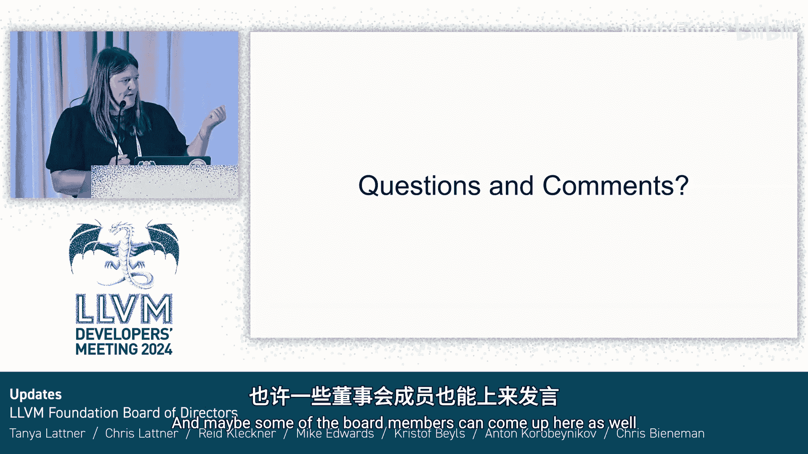

# 065：LLVM基金会动态与展望

## 概述
在本节中，我们将了解LLVM基金会的最新动态、核心项目、面临的挑战以及未来的发展规划。LLVM基金会是一个致力于支持编译器与工具领域发展的非营利性公共慈善组织。

## LLVM基金会简介
LLVM基金会成立于2014年，是一个501(c)(3)公共慈善组织。这意味着其宗旨是服务公共利益，专注于其使命，而非特定利益。

基金会的使命是：通过教育活动、资助和奖学金支持编译器与工具领域的教育与进步；提升编译器与工具领域的多样性；并直接支持LLVM项目社区及其基础设施。

简而言之，LLVM基金会通过帮助社区成长、促进社区互动、通过基础设施保持LLVM开发的高效性，并努力确保这个已有20多年历史的项目的长期健康发展，来支持LLVM社区。

## 基金会项目与结构
非营利组织通常将工作划分为不同的“项目”。LLVM基金会目前有四个主要项目。

以下是这些项目的简要介绍：
*   **教育推广**：组织如LLVM开发者大会等活动。
*   **社区拓展**：旨在提高LLVM及编译器与工具领域多样性和包容性的倡议。
*   **奖学金与资助**：目前主要面向学生提供支持。
*   **社区健康与成长**：通过项目基础设施、法律事务（如近期接近完成的许可证重新授权工作）及其他跨领域工作来支持社区。

## 董事会成员更新
LLVM基金会由一个董事会管理。董事会每两年选举一次。目前董事会已从9人扩充至11人。

以下是当前董事会成员名单：
*   Chris Lattner
*   Wei Wu
*   Reed Kleiner
*   Mike Edwards
*   Kristof Beyls
*   Anton Korobeynikov
*   Tanya Lattner

此外，我们很高兴地宣布三位新加入的董事会成员：
*   Anna Zaks
*   Ankita Gupta
*   Allison Randal

这三位新成员在LLVM及其他开源项目方面拥有独特的经验，我们期待在未来两年内借助他们的知识与经验。

## 各项目进展与挑战
接下来，我们将快速回顾各项目的更新情况。

### 教育推广项目
我们持续每年组织两次开发者大会。我们正计划在2025年6月于东京举办首届亚洲会议。对于美国的活动，我们看到需求增长，这非常棒。

所有演讲均被录制并发布，这为LLVM构建了宝贵的知识库。我们在YouTube频道上看到了极高的关注度。我们还尽可能为本地社交活动提供支持，Chris在组织在线研讨会和办公时间方面做得非常出色。

**面临的挑战**：活动成本非常高，即使有赞助补贴，门票价格仍在上涨。我们需要评估如何控制成本，使活动更易于参与。同时，我们也在思考活动的规模问题：是继续扩大规模，还是保持较小规模以维持有效的协作与交流。此外，基金会迫切需要增加人手。

### 社区拓展项目
去年我们引入了特邀演讲者，并将其与新成员培训相结合，试图触及新受众。然而，这个项目未能获得足够关注，因为我们需要更多人参与其中，无论是付费员工还是志愿者。保持该项目的势头一直很困难。

### 奖学金与资助项目
该项目非常成功。今年我们向学生提供了约7万美元的资助，帮助他们参加活动。我们不断收到反馈，称参加LLVM开发者大会是一次非常有价值的经历。这有助于培养下一代LLVM开发者。

**面临的挑战**：申请资助的学生人数超出了我们的资助能力。我们希望与大学教授合作，触及更多从事LLVM研究的学生，并鼓励他们来展示自己的工作。

### 社区健康与成长项目
这是基金会工作的核心领域。我们保持了基础设施的稳定运行，并完成了向新技术的多年过渡，这离不开众多志愿者的时间和努力。基础设施帮助超过5000名贡献者有效协作。我们在重新授权许可证方面取得了进展，并拥有一个出色的行为准则委员会。

**面临的挑战**：对基础设施支持的需求依然强烈。基金会需要找到更好的方式来资助这项工作，并雇佣更多员工来支持项目不断增长的基础设施需求。

## 基金会发展规划
正如您可能听出的主题，我们正在努力扩展LLVM基金会。我们目前正在面试一位项目总监，以专门协助我们的活动和差旅资助项目。我们有更大的目标，即雇佣专门负责基础设施支持和社区管理的员工。

这将有助于平衡工作负载，帮助我们摆脱困境，开始以最佳方式支持项目。

**挑战在于找到适合这些职位的人选**。因此，我们需要借助大家的力量。如果您认识任何对这些职位感兴趣且合适的人选，请与我们联系。我们正在寻找对活动、非营利组织、开源或基础设施充满热情的人才。

随着基金会的发展，我们将重新评估收入来源，以确保能够合理配备人员并支付薪酬，同时也要平衡，避免过度提高门票价格而影响活动的可及性。

## 寻求赞助支持
我们明确在寻找更多赞助商。如果您有兴趣赞助LLVM基金会，您的支持将有助于确保5000名贡献者能够继续有效协作，帮助每个人在安全的环境中贡献和协作，帮助我们培养下一代，并最终帮助基金会和项目，使更多公司能够更轻松地做出贡献。

我们相信，赞助LLVM基金会是一项回报丰厚的投资。如果您有兴趣，请联系我或前面幻灯片中提到的任何董事会成员。

## 总结
本节课中，我们一起学习了LLVM基金会的最新情况。我们了解了基金会的使命、四个核心项目、董事会更新、各项目取得的进展与面临的挑战，以及基金会未来的发展规划，包括扩大团队和寻求赞助支持。LLVM基金会致力于支持LLVM社区的健康与持续发展，确保这个重要的开源项目在未来几十年内继续繁荣。