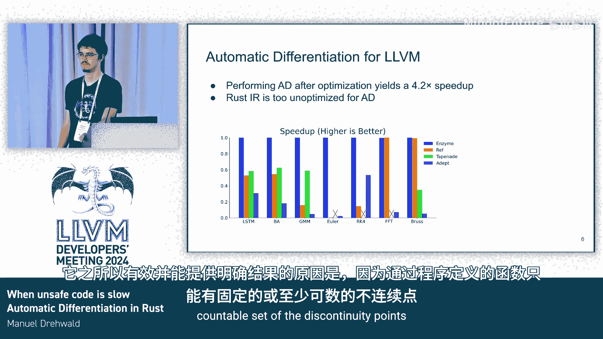

# 066：引言与概述

在本节课中，我们将要学习Rust语言中的自动微分技术，并探讨为何安全的Rust代码在性能上可能优于不安全的代码。我们将从基本概念入手，逐步深入到技术细节和性能对比。

## 概述

Rust是一门现代系统编程语言，以其内存安全和零成本抽象而闻名。然而，关于Rust性能的一个常见误解是，为了获得最佳性能，开发者必须使用不安全的代码。本次课程将分析这一观点，特别是在高性能计算和科学计算领域，通过自动微分的案例来展示安全Rust代码的潜力。

自动微分是计算函数导数的技术，在机器学习、物理模拟和优化问题中至关重要。我们将看到，Rust的类型系统和安全保证不仅不会阻碍性能，反而可能通过为编译器提供更多信息来提升性能。

---

# 自动微分与Rust性能：第2章：理解Rust中的`unsafe`关键字

上一节我们介绍了课程的整体目标，本节中我们来看看Rust中`unsafe`关键字的具体含义和作用。

`unsafe`关键字并不改变Rust代码的编译方式，它只是一个非常表面的检查，用于标记代码区域或函数为不安全。在`unsafe`块中，开发者获得了五种“超能力”。

以下是`unsafe`允许的五种操作：

1.  **解引用裸指针**：这类似于C语言风格的指针操作。通常我们不会直接使用裸指针，它更多用于与其他语言进行FFI交互。
2.  **调用不安全的函数或方法**：Rust标准库提供了一些不安全函数，开发者也可以编写自己的不安全函数，通常是在无法证明前置条件一定会被满足时，将正确使用的责任转移给调用者。
3.  **访问或修改可变的静态变量**：全局变量通常不建议使用，除非开发者清楚自己在做什么。
4.  **实现不安全的trait**。
5.  **访问联合体中的字段**：联合体类似于枚举，但其类型不是标记的，使用者在某种程度上需要对自己如何使用它们负责。

需要强调的是，一旦编译器检查了代码是否在`unsafe`块中执行了这五种操作，之后就会丢弃这些信息。从Rust的MIR中间表示开始，所有代码无论安全与否，其编译模型都是一致的。

---

# 自动微分与Rust性能：第3章：自动微分简介与性能背景

上一节我们介绍了`unsafe`在Rust中的角色，本节中我们来看看本课程的核心应用场景——自动微分。

自动微分是一个基础概念，源于微积分。例如，对于函数 `f(x) = x²`，其导数是 `f'(x) = 2x`。这个概念衡量了函数在特定点的变化率。

在计算机科学中，我们处理的函数通常有多个输入和输出。一个常见的例子是机器学习中的神经网络，它有巨大的张量输入（如图像和权重）和一个标量输出（如损失函数）。在这种情况下，计算导数变得非常重要，这也是性能基准测试的关键点。

传统的自动微分工具在源代码级别进行转换。流程如下：
1.  输入源代码。
2.  应用自动微分工具，生成新的、能计算导数的源代码。
3.  对新代码进行优化。

然而，基于LLVM的自动微分工具采用了不同的顺序：
1.  将输入代码（如C++）降低到LLVM中间表示。
2.  对LLVM IR进行优化。
3.  在LLVM IR级别进行微分。
4.  再次优化。

这种改变操作顺序的方法带来了显著的性能提升，平均加速比达到 **4.2倍**。由于Rust编译器主要在LLVM IR级别进行优化，因此利用基于LLVM的自动微分对Rust社区具有很大吸引力。

除了神经网络，自动微分在科学计算和高性能计算领域也有广泛应用。

---

# 自动微分与Rust性能：第4章：安全代码 vs 不安全代码的性能对比

上一节我们了解了自动微分及其性能背景，本节中我们通过具体的基准测试来比较安全与不安全Rust代码的性能。

我们使用了五个基准测试，对比C++和Rust。C++代码来自先前的研究论文，并经过了良好优化。我们测试了多种变体：
*   C++（使用`restrict`关键字）
*   C++（不使用`restrict`）
*   Rust（安全、符合语言习惯的高级代码）
*   Rust（使用原始指针的类C风格代码）

所有代码都通过自动微分工具处理。如果不考虑微分，它们的原始性能差异很小（在1-2%以内）。性能差异主要体现在计算导数时。

以下是关键发现：

1.  **FFT基准测试**：两个Rust版本（安全和原始指针）性能相同（0.54秒），而C++版本稍慢（0.64秒）。
2.  **需要边界检查的案例**：在某些情况下，Rust的安全版本会进行边界检查。通过调用不安全的 `swap_unchecked` 函数来绕过检查，可以获得约 **40%** 的性能提升。这反映了LLVM目前在某些情况下还无法成功消除边界检查。未来LLVM的改进有望解决这个问题。
3.  **最显著的差异**：在一个基准测试中，安全的、符合习惯的Rust代码性能最佳。其次是使用了所有`restrict`限定符的C++代码。而将Rust写成类C风格（使用原始指针）会导致 **10倍** 的性能下降。同样，C++如果移除所有`restrict`限定符，也会有 **4倍** 的性能惩罚。

---

# 自动微分与Rust性能：第5章：为何`unsafe`可能导致性能下降

上一节我们看到了性能对比数据，本节中我们来深入探讨为什么在自动微分场景下，不安全的代码反而可能更慢。

自动微分的工作原理是“镜像”原函数。它首先运行一遍原始代码（前向传播），然后以相反顺序再次运行（反向传播），从而使函数长度大约翻倍。

在这个过程中，工具需要缓存那些在后续计算导数时需要的、会被覆盖的变量。以经典的矩阵乘法`C = A * B`为例，矩阵`C`是会被覆盖的。

问题的核心在于**指针别名分析**。如果没有信息表明指针`A`、`B`、`C`指向不同的内存区域，自动微分工具就必须做最坏的假设：每次写入`C`时，也可能写入`A`和`B`（例如，当三个指针指向同一地址时）。这导致工具需要缓存几乎所有变量，造成巨大的性能开销。

Rust的所有权系统和借用规则在编译时提供了强大的别名保证。安全的、符合习惯的Rust代码天然地向编译器（以及基于LLVM的自动微分工具）传达了“这些引用不会别名”的信息。而使用原始指针的Rust代码或未使用`restrict`的C++代码则丢失了这些信息，导致性能大幅下降。

C++的`restrict`关键字和Rust的安全引用都是向工具传递“无别名”信息的方式。因此，**安全的Rust代码通过其类型系统，为优化和自动微分提供了宝贵信息，从而可能获得更好的性能**。

---

# 自动微分与Rust性能：第6章：挑战与正确性考量

上一节我们解释了安全代码的性能优势原理，本节中我们来看看在Rust中实现自动微分面临的一些挑战和正确性问题。

首先，编译时间是一个重要考量。自动微分需要精确的类型信息。例如，复制64字节的内容和复制8个`double`类型（也是64字节）在微分意义上是不同的。如果工具不知道具体类型，就可能计算出错误的导数。

C++有TBAA（基于类型的别名分析）来提供部分信息。Rust目前没有等效的TBAA，因此我们需要通过其他方式（如分析Rust的MIR中间表示）来获取和传递类型信息。

关于正确性，由于自动微分工具直接在LLVM IR级别操作，需要特别注意Rust的一些运行时特性：
*   **动态大小类型**：如`Vec`。自动微分工具生成的代码需要正确处理其长度信息，否则可能导致内存越界。解决方案通常是在函数入口处添加边界检查。
*   **可变性**：LLVM级别的工具不总是清楚哪些内存是可变的。Rust的`&mut`和`&`引用在LLVM IR中布局相同，但含义不同。我们需要确保不会向只读内存写入梯度值。
*   **枚举**：枚举的类型在运行时决定。不当的类型转换或处理可能导致未定义行为。

这些挑战正在被积极解决，目标是确保自动微分在Rust中既高效又安全。

---

# 自动微分与Rust性能：第7章：总结

本节课中我们一起学习了Rust中自动微分与性能的关系。

我们首先澄清了关于`unsafe`代码的误解，指出它并不改变编译模型。接着，我们介绍了自动微分的基本概念及其在高性能计算中的重要性。

通过具体的基准测试，我们发现**安全的、符合习惯的Rust代码在自动微分场景下通常优于或不逊于使用`unsafe`或类C风格的代码**。这主要归功于Rust类型系统提供的丰富别名信息和保证，使得基于LLVM的优化工具能够进行更有效的分析。

我们探讨了性能差异背后的原因，即指针别名分析在自动微分缓存机制中的关键作用。最后，我们也审视了当前实现中在类型信息、编译时间和运行正确性方面面临的挑战。

核心结论是：**充分利用Rust的安全抽象和类型系统，不仅能保证内存安全，还能为编译器优化（包括自动微分）提供关键信息，从而在默认情况下获得出色的性能**。开发者应优先编写安全、符合习惯的Rust代码，仅在必要时，并有充分理由时，才谨慎地使用`unsafe`。