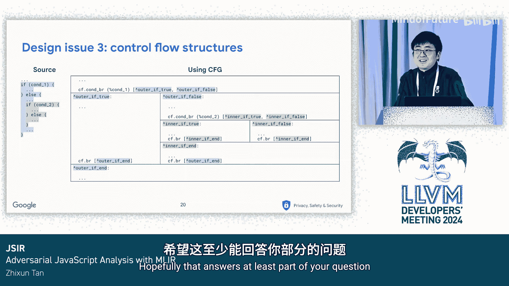

# 067：基于MLIR的对抗性JavaScript检测

## 概述

在本节课中，我们将学习JSIR，一个基于MLIR的JavaScript中间表示，专门用于检测对抗性代码。我们将探讨其设计目标、核心概念以及如何实现从源代码到IR再完整返回源代码的“往返”过程。

---

## 背景：无处不在的JavaScript与恶意代码检测

JavaScript无处不在。它出现在网页的HTML中，出现在使用React Native等跨平台框架构建的移动应用中，也出现在浏览器扩展里。谷歌在这些领域都有业务，因此投入了大量工程精力来检测各种平台上的恶意代码。

例如，面向Android的Google Play商店有一个名为“Play Protect”的功能，它会在你下载应用前对其进行扫描。这些检测系统的很大一部分工作在于分析代码，以发现恶意或可疑行为。这些行为信号随后会被输入到其他系统中，以做出整体决策，例如禁止该应用或显示警告标志。

因此，我们的目标是分析JavaScript代码以发现恶意行为。

---

## 恶意行为示例

那么，这些恶意行为具体是什么样的呢？让我们来看两个例子。

### 示例一：隐写术

隐写术，又称隐蔽书写，意味着将信息隐藏在别的东西里。这里的“别的东西”可以是任何形式，如消息、图像甚至视频。

我们展示的这段代码首先从图像中加载数据。这些数据实际上只是一个代表每个像素颜色的数字数组。代码随后通过多个步骤操作这个数组。我们大致可以看出，它正在逐步构建一个名为`message`的字符串变量。最后，这个字符串被传递给`eval`函数，该函数将字符串视为一段代码并执行它。

我们现在明白了，这里展示的代码实际上是一个解码器，用于解码隐藏在图像中的某些恶意代码。攻击者这样做是为了试图规避检测系统。

隐写术实现起来并不难，GitHub上也有工具可以帮你完成。你只需上传一段文本和一张图片，该工具就会生成一张看起来与你上传的图片几乎相同的新图片，但文本就隐藏在其中。该工具还会提供一个库，用于从生成的图像中提取和解码文本。

我们对隐写术的解决方案是**污点分析**，这是一种数据流分析，旨在发现恶意的信息流。在这个例子中，确实存在从`getImageData`到`eval`的信息流。

污点分析的工作原理如下：我们从**源**开始（在本例中是名为`getImageData`的函数），然后逐步找出代码中所有被“污染”（即受源影响）的变量。最终，我们发现一个被污染的变量被传入了`eval`函数。

污点分析是一种数据流分析，通常在**中间表示**上进行。我们在**控制流图**上运行迭代算法，直到结果收敛。理想情况下，IR应基于**SSA**，这能使算法更优化。

### 示例二：代码混淆

混淆是故意使代码变得更复杂的行为。这个例子使用了一种特定的混淆技术，称为**字符串分割**。

我们可以想象，如果攻击者想将用户重定向到恶意网站，他们可以将URL分割成几部分，使其更难被发现。同样，混淆也不难实现，因为也有现成的工具可以做到。

显然，我们的目标是**反混淆**代码。在这个特定例子中，我们需要执行**常量传播**来合并这些字符串片段，以恢复原始字符串。

常量传播也是一种数据流分析，在编译器优化中非常常见。然而，与典型编译器在IR上执行这些优化然后将IR转换为机器码等低级表示不同，在我们的用例中，我们实际上希望输出简化后的JavaScript代码。换句话说，我们需要**源到源的转换**。这是因为混淆很大程度上被逆向工程师使用，他们需要手动阅读代码来识别恶意行为。

---

## 设计挑战与JSIR的引入

现在我们看到了一些相互冲突的需求。一方面，我们需要进行分析以提取信号，以便分析结果可用于基于规则的决策引擎和机器学习分类器等。另一方面，我们需要执行源到源转换来简化代码，以协助逆向工程师、分析师和人工审查员。这两种用例都涉及数据流分析，因此我们需要一个IR和一个CFG来执行这些分析。

但源到源转换似乎又表明我们不需要低级表示，也许我们只需要将自己限制在**抽象语法树**上，因为我们当然可以从AST生成JavaScript代码。

这就引出了**JSIR**，一个精心设计的JavaScript IR，可以完全提升回AST。JSIR的目标是，我们不仅能执行数据流分析，还能实现从JavaScript源代码到AST，再到IR，然后回到AST，最终回到源代码的完整往返过程。这样，在IR上进行一些转换后，我们可以生成反映这些转换的JavaScript源代码。而对于IR中未更改的部分，我们可以生成原始源代码。

---

## JSIR设计之旅：实现往返的三个关键点

带着这个目标，现在让我们来了解JSIR，特别是讨论我们为实现往返而遇到的三个设计问题。

### 设计问题一：从线性IR恢复表达式结构

让我们从一个相当简单的例子开始。在左侧，我们有一个表达式：`1 + 2 + 3`。在中间部分，我们有IR，它以线性方式列出计算，并将每个中间结果分配给一个SSA值。

我们如何将这个IR提升回源代码呢？如果我们将每个SSA值映射到一个变量，那肯定会生成与原始源代码不同的东西。更重要的是，它的可读性更差，这违背了代码简化的目的。

那么，我们在这里怎么做呢？让我们看看IR中的最后一个操作：`expression statement`。它并没有真正捕获原始代码的语义，但我们在从AST生成IR时仍然保留了它。

这个操作的有趣之处在于，如果我们递归地追踪IR中的使用链，我们会发现它开始看起来像一个AST。我甚至可以更进一步：实际上，每个IR操作与一个AST节点之间存在一一映射关系。

通过以这种方式设计JSIR来保留AST的所有信息，往返过程听起来就合理多了。但有些问题我们无法完全绕过。要让这种递归遍历工作，我们需要确定开始遍历的**根操作**。在这个例子中，根操作是`expression statement`。

我们设计JSIR时，让这些根操作变得明确且易于查找。例如，我们知道一个JavaScript代码块由一系列语句组成，每个语句包含表达式。因此，在JSIR中，我们定义了一个**特质**来标记某些操作为语句（例如本例中的`expression statement`操作），这样它们就成为递归遍历的根操作。

### 设计问题二：显式表示变量

在之前的例子中，我们展示了IR中的SSA值不会在源代码中被提升为变量。这意味着，如果我们确实想在IR中表示变量，就需要显式地去做。

在这个例子中，我们有 `a = a + 1`。在IR中，我们使用专用的操作来表示它们：左值用 `identifier_ref` 表示，右值用 `identifier` 表示。其余部分与前面的例子相同。现在我们基本上仍然有从IR到AST的一一映射。

不过有一个注意事项。从技术上讲，如果我们只关心往返过程，我们实际上不需要区分 `identifier` 和 `identifier_ref`。我们引入这种区分是为了在IR中更准确地捕获语义，这将使数据流分析更容易进行。

### 设计问题三：处理控制流结构

当我们有控制流结构时，事情开始变得棘手。在这个例子中，我们有两层`if`语句。MLIR为我们提供了两种表示控制流结构的方式：要么使用**区域**，要么使用**控制流图**。

区域准确地捕获了嵌套结构，就像AST一样，所以如果我们使用区域，可以将IR提升回AST，这并不奇怪。另一方面，CFG明确表示了较低层次的分支行为，更适合运行数据流分析算法。但我们似乎丢失了原始的嵌套结构。

然而，CFG的结构确实保留了原始结构的一些痕迹。在这个例子中，为了表示一个`if`语句，我们从一个条件分支开始，它分裂成两条代码路径，两条路径都以无条件分支合并在一起。内部的`if`语句以相同的方式表示，我们只是用一个具有相同结构的子图替换了那个块。

通过以这种二维格式布置块，我们可以看到每个块映射到原始代码中控制流结构的一部分。我们实际上可以指向一个块说：“嘿，这个块映射到外部`if`语句的`true`分支”，或者“那个块映射到内部`if`语句的`false`分支”。

那么，如果我们只是在IR上添加**注解**，使这种映射变得明确呢？更具体地说，在每个块的开头，我们添加一个描述该块代表什么的注解操作。此外，我们可以用一个**令牌**将同一控制流结构的注解分组。

在这个例子中，我们有两个令牌：一个用于外部的`if`语句，一个用于内部的`if`语句。这些令牌和注解使我们能够递归地遍历CFG，就像遍历AST一样。当我们遇到令牌`F1`的创建时，我们可以追踪它的使用-定义链，以定位所有将此令牌作为参数的注解操作。从那里，我们定位到映射到`if`语句各个部分的所有块。

这个设计有效吗？是的，我们已经测试了超过50亿个JavaScript样本，其中绝大多数都成功实现了从源代码到AST到IR，再回到仅有格式差异的相同源代码的往返过程。

另一个证明此设计有效的证据是，我们还有一个JSIR的内部用例，它将React Native字节码反编译为JSIR，然后一路反编译为JavaScript源代码。根据我们上次在字节码文件数据集上的检查，大约70%的文件可以反编译为源代码，失败大多是由于内存不足崩溃。

---

## 关于控制流表示的说明

很明显，基于区域的表示更具可读性和直观性。那么，是否有可能直接在这种表示上进行数据流分析，而不是基于CFG的表示呢？

MLIR数据流框架确实能识别区域之间的分支行为，所以我们实际上已经很接近了。唯一剩下的问题是找到一种方法来建模`break`和`continue`语句，这些是不寻常的分支行为，例如跳出两层区域。

我们看到Mojo已经在一定程度上实现了这一点，并且有一个RF（请求）旨在将这种解决方案的一个版本上游化。我们非常期待这一点，因为这样我们实际上可以完全摆脱基于CFG的表示。

---

## 总结与要点

本节课我们一起学习了JSIR的设计与应用。让我们总结一下本次讨论的要点：

1.  **恶意JavaScript是一个普遍存在的问题**。谷歌关心这个问题，我们开发了系统并投入人力来解决这个领域的问题。总的来说，编译器与安全的结合是一个非常有趣的领域，我们可以产生很大的影响。

2.  **我们的经验进一步证明，MLIR足够强大，可以表示像JavaScript这样的通用语言**。我们希望我们的项目以及类似的项目（如Kang IR）能给大家更多信心，让人们能够发现MLIR的新用例。

3.  **正如我们在本次讨论中描述的，设计一个可以完全转换回AST的IR实际上是可能的**。

---

## 开放性问题

最后，我想以一些开放性问题结束本次讨论。

1.  **我们能看到一个行业趋势，即构建特定于高级语言的IR**。那么，未来我们是否真的不再需要AST了？我们可能仍然想在解析期间构建某种解析树，但我们不需要在AST上做任何分析或转换，而只会在高级IR上进行所有这些操作。我们看到一些项目正朝着这个方向发展，例如，Mojo编译器似乎会尽快进入MLIR领域，然后所有分析都在不同的IR上进行。Carbon编译器也尽快将代码转换为高级IR。

2.  **实际上已经存在一些基于AST的JavaScript工具框架，例如Babel和ESLint**。它们将AST作为公共API公开，使用户可以相当容易地遍历和转换AST。那么，JSIR是否有可能成为基于IR的JavaScript工具框架的基础？这样，人们编写数据流分析会更容易。

3.  **你可能不知道，JavaScript实际上有一个标准的AST规范，叫做ESTree**。流行的JavaScript工具框架基本上都基于ESTree，只有一些微小的变化。那么，是否也有可能提出一个JavaScript IR标准呢？

这些都是我们正在思考的问题。同时，欢迎大家查看我们今天刚刚发布的GitHub仓库，我们仍在向仓库中发布更多组件，敬请关注。

---

## 问答环节

**问**：感谢精彩的演讲。我想知道，你们如何处理像循环这样的结构？因为它们不像`if`语句那样有统一控制流，对吧？因为还有`break`和`continue`。

**答**：是的，实际上，当我们使用基于CFG的表示时，循环的表示方式与`if`语句类似，我们只是有更多的注解，并且它在代码库中确实有效，你可以实际查看一下。我确实认为带有注解的CFG表示不是很直观，而且相当难用，因为当你在这种表示上进行一些分析后，你希望将分析结果导出到其他表示。所以，如果我们统一到基于区域的表示上，那么所有事情都发生在一个表示上会更容易。至于如何使用基于区域的表示来表示`break`和`continue`语句，就像我说的，有一个RF（请求）实际上在做这件事，这需要修改MLIR上游，你还需要修改数据流框架来实际捕获这种分支行为。我认为有一个关于Mojo的演讲，其中详细介绍了他们是如何做到的。希望这至少回答了你的部分问题。