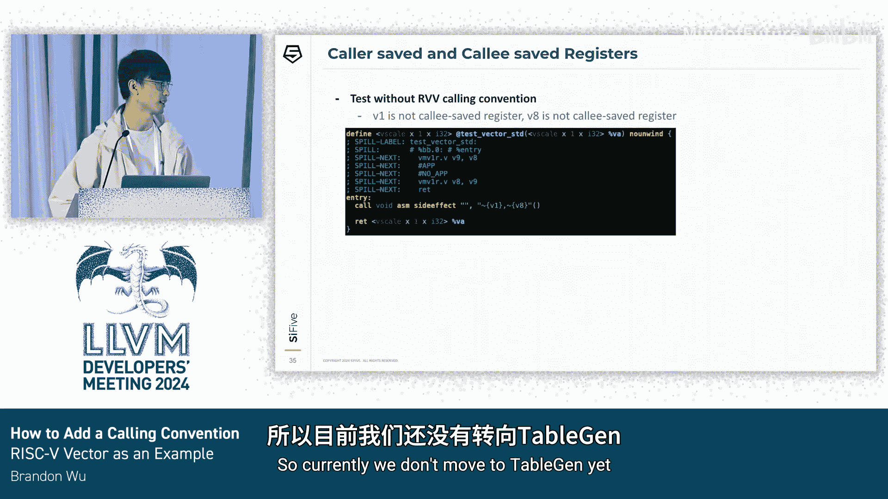

# 068：在 LLVM 中支持新的调用约定 🚀

在本节课中，我们将学习如何在 LLVM 中添加一个新的调用约定。我们将以 RISC-V 向量扩展为例，详细介绍其概念、栈布局以及在 LLVM 后端中的具体实现步骤。

## 什么是调用约定？ 🤔

调用约定是调用者与被调用者之间的一种协议。它定义了一系列规则，使两者能够顺畅地通信。在物理机器中，没有一条核心指令直接包含参数。两个子例程之间传递参数的方式是通过寄存器或内存，而传递参数的规则正是由调用约定定义的。

例如，假设我们有一个执行乘法和加法的函数。在调用乘法子例程时，我们需要将参数 A 和 B 放置在寄存器或内存中的某些位置。然后，乘法子例程从相同的寄存器或内存中读取这些输入以执行计算。这些规则都由调用约定定义。调用加法函数时也是如此。

调用约定还定义了用于返回值的寄存器集合。当返回到调用者时，双方都需要知道使用哪个寄存器或内存来传递返回值。

在过程调用期间，某些寄存器可能会被覆盖。在使用寄存器后，我们需要确保数据的一致性。因此，调用约定还定义了一组需要由调用者或被调用者保存的寄存器。

## RISC-V ABI 与栈布局 📚

RISC-V 有三种不同类型的数据寄存器：整数寄存器、浮点寄存器和向量寄存器。

首先，有 32 个整数寄存器，命名为 x0 到 x31。每个寄存器都有一个别名，以便用户更容易识别其用途。我们今天重点关注的寄存器是参数寄存器和调用者保存寄存器。

还有 32 个浮点寄存器，其中 12 个是调用者保存寄存器，8 个是参数寄存器。

在深入栈布局之前，让我们先了解一些关于 RISC-V 向量的背景知识。

RISC-V 向量是一种可伸缩向量，其长度由具体硬件定义。RISC-V 有 32 个向量寄存器，这与 Intel 的 AVX 和 Arm 的 SVE 相同。每个寄存器的宽度是 `vlen` 位。RISC-V 向量还有一个名为 `vlenb` 的 CSR，用于保存以字节为单位的向量长度。例如，如果向量长度为 128 位，那么 `vlenb` 就是 128 除以 8，等于 16 字节。RISC-V 还有一个向量 `vtype` CSR，用于记录配置信息，如计算策略和向量寄存器组乘数等。

下图说明了标准调用约定和向量调用约定在向量寄存器安排上的差异。

我们需要为向量定义另一个调用约定的原因是，在某些应用程序或库中，它们并不大量使用向量寄存器。另一方面，向量加载和存储指令的延迟很高。因此，最好为其他用途提供另一种选择。

上图是标准调用约定，下图是向量调用约定。这两种调用约定的主要区别在于调用者保存的寄存器。在标准调用约定中，所有向量寄存器都是调用者保存的，这意味着调用者有责任在过程调用期间保持寄存器状态。然而，在向量调用约定中，V1 到 V7 以及 V24 到 V31 是被调用者保存的。只有在需要占用其中任何一个寄存器时，它们才会被保存。

每个函数在调用期间维护自己的内存空间，这被称为调用栈。

以下是 RISC-V 的栈布局。可以看到，总共有五个部分。从上到下，分别是：为可变参数完全分配的区域、可伸缩的被调用者保存寄存器、可伸缩的局部变量、RVV 对象和可变大小对象。我们将在接下来的幻灯片中详细描述它们。

首先，我们有标量被调用者保存寄存器和标量局部变量。假设我们有一个声明了局部变量的简单函数。代码的汇编位于中间块。块中的第一行向下调整栈以保存所有寄存器。然后，我们从 `sp-16` 开始保存标量被调用者保存寄存器，从 `sp-20` 开始保存标量局部变量。相对位置显示在最右侧的图片中。

接下来，我们添加 RVV 局部变量。其大小通过读取 `vlenb` CSR 并乘以 2 来计算。它被放置在标量局部变量正下方。需要提及的一点是，RVV 对象部分不仅包含向量局部变量，还包含向量被调用者保存寄存器。被调用者保存寄存器被放置在向量局部变量的正下方。

然后，我们有可变参数。在这里，无论是否使用，我们都会将所有参数保存在预分配的区域中。这不仅是为了访问简单，也是为了释放这些寄存器供寄存器分配器使用，以降低压力。

下一部分是可变大小对象。某些局部变量的大小在编译时是未知的，例如，大小在其他对象中定义的数组。我们需要从符号表中获取变量来计算确切的大小，并且该大小需要按 128 字节对齐，这在规范中有规定。因此，这里是紫色框中的代码片段。为了在运行时计算确切的大小，首先从符号表中读取变量，然后左移 2 位，因为它是整数类型，即 4 字节。然后加上 15，接着使用 `and` 指令确保偏移量正确对齐。

以上就是 RISC-V 调用栈布局的五个部分。

## 实现细节 🔧

要启用调用约定，我们需要一个属性来将信息从前端传递到后端。需要修改一些文件才能使其工作。

第一个文件是 `Attributes.td`。该文件收集了 RISC-V 向量调用的所有不同方面的属性。我们需要为声明和函数类型定义一个属性。C 或 C++ 中的关键字以及其他前端信息也在此部分描述。

我们还需要在 `Specifiers.h` 中定义一个枚举。这用于在客户端站点为后端之前的所有后续函数保存信息。

我们还需要一种方法将调用约定属性从前端映射到后端。在 Clang 代码生成中，我们有一个名为 `clangCallConvToLLVMCallConv` 的函数来执行映射工作。

我们还需要在 `CallingConv.h` 中定义一个枚举。这用于将信息从 LLVM IR 一直保存到机器代码。

`LLToken.h` 文件定义了 LLVM IR 中的向量调用约定关键字。该标记将通过属性传递，并在 LLVM 中转换为相应的调用约定枚举。

相反，`AsmWriter.cpp` 为每个调用约定枚举在 LLVM IR 中生成相应的关键字。

现在，我们知道了如何在 Clang 和 LLVM 中添加调用约定的属性关键字。我们也能够让解析器识别 LLVM IR 中的调用约定关键字。让我们看一个测试用例，看看我们在之前的幻灯片中已经完成了什么。

在上图中，我们有一个带有 `riscv-vector-call` 的 `bar` 函数声明。然后我们在 `test` 函数中调用 `bar` 函数。通过运行命令 `clang -target riscv64 -S -emit-llvm`，生成的 LLVM IR 显示在下图中。你会看到 `riscv-vector-call` 属性已正确地从前端降级到 LLVM IR，稍后将被选择 DAG 用来确定降低调用约定的机制和寄存器集合。

接下来，我们将讨论向量寄存器的 RVV 特定概念。

第一个概念是 `LMUL`，代表向量组乘数。例如，最左侧的图像说明了 `LMUL` 等于 1，这意味着数据只占用一个向量寄存器。然而，在中间的图像中，`LMUL` 等于 2，这意味着数据占用两个向量寄存器。这是 RISC-V 的灵活性之一，用户可以完全控制向量寄存器资源。

第二个概念是 `NF`，是段中字段数量的缩写。这基本上用于需要多个寄存器组连续的段加载/存储指令中。

在接下来的幻灯片中，我们将使用 `RVV` 类型来表示仅包含 `LMUL` 的向量类型，并使用 `vector tuple` 类型来表示同时包含 `LMUL` 和 `NF` 概念的向量类型。

对于上一张幻灯片中的这两种向量类型，也存在约束。对于 `RVV` 类型，我们有一组寄存器。第一个约束是起始寄存器应该是 `LMUL` 的倍数。第二个约束是组中的所有寄存器应该是连续的。在示例 1 中，我们有 `LMUL` 等于 2，并且我们有 V2 和 V3 用于此类型。这是有效的，因为起始寄存器 V2 是 2 的倍数，并且 V2 和 V3 也是连续的。然而，在示例 2 中，尽管 V1 和 V2 是连续的，但起始寄存器不是 2 的倍数。相反，示例 3 是无效的，因为组中的寄存器应该是连续的。

`vector tuple` 类型的约束基于 `RVV` 类型，并附加了一个约束，即所有组都必须是连续的。换句话说，所有 `NF` 乘以 `LMUL` 个寄存器都应该是连续的。在示例 4 中，该类型的 `LMUL` 等于 2，`NF` 等于 2，因此起始寄存器应该是 2 的倍数，并且所有四个寄存器都应该是连续的。然而，在示例 5 中，它是无效的，因为它打破了所有组的连续规则。

一个重要的问题是，我们如何建模 `RVV` 类型和 `tuple` 类型？对于 `RVV` 类型，我们已经在 LLVM 中使用 `vscale` 来建模它。例如，假设我们有 `<vscale x 1 x i64>` 来表示 `LMUL` 等于 1 的 `i64` `RVV` 类型。它被建模为 `vscale * 1 * i64`。由于 RISC-V 中每个块是 64 位，这与我们如何建模 SVE 相同。

然而，目前没有现有的机制来建模 `vector tuple` 类型。假设我们有一个类型 `<vscale x 2 x i64> x 4`，其 `LMUL` 等于 2，`NF` 等于 4。一种可能的方法是通过与 `RVV` 相同的方式来建模它，可能类似于 `vscale * 8 * i64`。然而，这种方法在类型 `<vscale x 2 x i64> x 4` 和 `<vscale x 4 x i64> x 2` 之间会产生歧义，因为向量寄存器的总数是相同的。所以我们无法识别它是 `LMUL=2, NF=4` 还是 `LMUL=4, NF=2`。SVE 也有 `NF` 概念，但它没有 `LMUL`。所以当前的机制对 SVE 来说已经足够了。

最初，我们使用结构体类型来表示 `vector tuple` 类型，其中 `NF` 映射到结构体中的元素数量，每个元素是具有指定 `LMUL` 的可伸缩向量类型。例如，一个 `LMUL=2` 且 `NF=4` 的 `vector tuple` 类型被表示为一个具有四个元素的结构体，每个元素是一个 `LMUL=2` 的可伸缩向量。然而，这种方法在选择 DAG 中存在潜在问题，结构体类型被扁平化为其元素类型，其中组信息丢失。因此，不可能推断出我们需要的确切类型。我们需要一种新的类型来处理 RISC-V 中的 `vector tuple`。

幸运的是，LLVM 有一个内置类型称为目标扩展类型，它具有类型参数和整数参数。在 `vector tuple` 类型中，我们使用类型参数来编码 `LMUL` 信息，使用整数类型来编码 `NF` 信息。`LMUL` 信息由可伸缩向量类型表示，其基本元素是整数类型。`NF` 直接由其值表示。

很明显，`RVV` 类型可以直接降级为 SVE 引入的可伸缩向量 `MVT`。然而，在 RISC-V 中，我们为 `vector tuple` 类型引入了新的 `MVT`。

在指令选择期间，目标扩展类型被转换为其对应的 `MVT` 类型，其中包含 `LMUL` 和 `NF` 信息，但消除了对后端来说无关紧要的元素类型信息。每个 `MVT` 也有其寄存器类，每个寄存器类映射到一组由我们刚刚讨论的规则构造的寄存器。

在接下来的几张幻灯片中，我将向您展示如何在后端处理向量 RISC-V 向量调用约定。

在我们继续之前需要提及的一点是，除了与调用约定相关的寄存器外，所有寄存器都由通用寄存器分配器分配。我们必须在每个后端中实现规则，为输入参数和返回值指定物理寄存器。

因此，我们首先需要定义由被调用者管理的寄存器集合，也称为被调用者保存寄存器。在 RISC-V 向量调用约定中，我们有 V1 到 V7 以及 V24 到 V31 在被调用者寄存器集合中。我们还需要添加超级寄存器，例如 `V2M2`、`V4M4`、`V24M8` 等。因为不同的寄存器组使用不同的指令进行加载/存储。例如，要仅存储单个 V2 寄存器，我们使用 `vs1r`，这意味着存储 1 个寄存器。然而，要存储 `V2M2`（即 `LMUL` 等于 2 的 V2），我们需要 `vs2r` 来处理它。如果我们不将 `V2M2` 添加到寄存器集合中，后端会将 `V2M2` 分解为 2 个 `LMUL` 等于 1 的向量寄存器，并使用 2 个 `vs1r` 来存储它，这不是预期的，也不优化。

然后，我们需要实现目标钩子 `getCalleeSavedRegs`，以确定函数中的 `live-in` 和 `live-out` 寄存器，告诉调用者是否存储这些寄存器。在这种情况下，我们不需要调用者保存和恢复这些寄存器。只有被调用者在使用其中任何一个寄存器时才需要保存和恢复它们。

这是一个实用函数，用于收集需要在调用中保存的所有被调用者保存信息。在溢出和重加载之前，我们需要为需要在调用栈中保存的所有寄存器分配一个偏移量。我们还需要对齐每个帧。在我们的例子中，对于 RVV 寄存器的字节对齐，它具有分数 `LMUL`，这意味着数据将只占用向量寄存器的一部分。然而，为了简单起见，我们总是希望对象大小至少为一个向量寄存器，在 RV 建模中是一个字节。需要提及的一点是，我也在致力于一项优化，尝试使向量寄存器溢出只存储有效数据。换句话说，如果它只占用寄存器的一部分，我们不一定需要使用完整的寄存器存储指令，我们可以使用其他开销较低的指令代替。另一个好处是，如果它不使用剩余的空间，我们不需要在调用栈中为这些对象分配完整的向量寄存器大小。

这是发出实际指令以溢出寄存器的目标钩子。同样，我们也有一个用于从栈槽恢复寄存器的重加载/恢复目标钩子。

让我们看看我们做了哪些更改。这是一个简单的测试用例，其中有一个内联汇编调用，带有两个被调用者保存寄存器 V1 和 V8。在标准调用约定中，调用者负责在过程调用期间保持向量寄存器状态，因此 `%v` 最初放置在 V8 中。当它进入函数 `test_vector_standard` 后，在内联汇编之后，它需要确保数据一致，所以我们可以看到在调用前后有一个寄存器移动指令，充当溢出和重加载的角色。

如果我们对函数应用调用约定关键字 `riscv-vector-call`，V1 就变成了一个被调用者保存寄存器，需要由 `test_vector_callee` 在调用子例程时保存。因此，在红色框中有另外几行代码处理向量寄存器的溢出。

一旦为每个类定义了寄存器集合，我们需要定义另外三个目标钩子：`lowerFormalArguments`、`lowerReturn` 和 `lowerCall`。基本上，我们只需要使用 `CCState` 来帮助完成这些工作。我将在接下来的幻灯片中向您展示寄存器集合。

这是 RVV 寄存器集合。我们需要定义所有包含从 V0 到 V23 的每个 `LMUL` 的寄存器。所以我们有 `LMUL` 1、2、4 和 8。对于 `vector tuple` 类型，`NF` 信息使用下划线分隔，并且也在同一个文件中定义。

有时，参数数量大于寄存器数量，这意味着有些参数没有被分配到物理寄存器。对于那些尚未处理的参数，我们需要通过引用来传递它们，这基本上是将数据存储到栈中，并使用通用寄存器传递栈地址。

因此，在第一个测试用例中，我们可以看到 `%x` 和 `%y` 分别通过 `V8M8` 和 `V16M8` 传递，正如我们所期望的。然而，在第二种情况下，它用完了寄存器，所以 `%x1` 和 `%y1` 通过寄存器传递，而 `%x2` 和 `%y2` 应该通过引用传递。红色框中的四条寄存器加载指令用于从栈中读回它们。

相同的机制适用于 `vector tuple` 类型。寄存器的定义已经建模了约束，因此我们可以以相同的方式处理它们。对于 `vector tuple` 类型用完寄存器的情况也是如此。

## 总结 📝

今天，我们简要回顾了调用约定，并介绍了 RISC-V 向量 ABI。我们学习了 RISC-V 栈布局，最后深入探讨了实现的细节，包括添加函数属性、处理函数参数以及处理调用者保存和被调用者保存寄存器。

