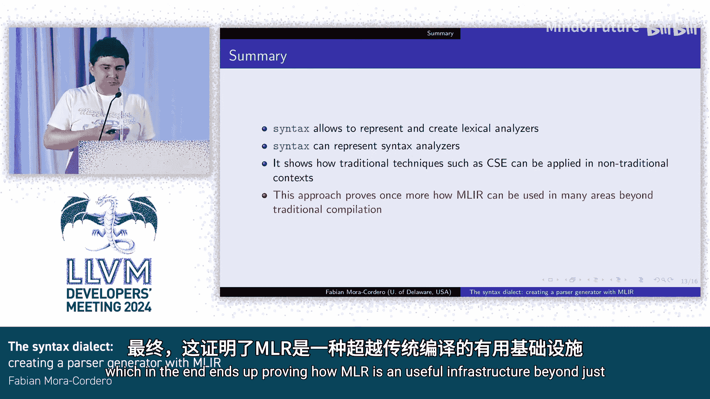

# 069：使用MLIR创建解析器生成器 🛠️

在本教程中，我们将学习MLIR中的语法方言。我们将探讨其设计动机、核心概念、如何用于词法和语法分析，以及它如何利用传统编译器技术来优化形式文法。本教程旨在让初学者能够理解这一高级主题。

## 动机：为什么需要语法方言？🤔

上一节我们介绍了本教程的主题。本节中，我们来看看创建语法方言的动机。

在我的论文中，我希望探索更模块化的编译器和语言。这引导我去研究动态解析组合子。

例如，在右侧的代码中，主编译器无需了解代码中的OMP、GPU或MLIR是什么。我需要一种方式，在遇到特定关键字时，能够调用相应的解析组合子。

基本上，这就是我需要此工具的主要动机，因为现有工具无法提供这种灵活性。因此，我最终构建了一个。

## 语法方言：形式文法的高级描述 📝

上一节我们了解了动机，本节中我们来看看语法方言本身。

语法方言是对形式文法的一种高级描述。如果你看右侧的图表，你会看到传统的元素，如终结符、或运算、与运算等。它能够表示所有传统的表达式。

但它也包含一些高级语法特性，例如语法上的函数。你可以创建类似宏的东西来交织语法。例如，如果你使用LLVM核心库，你会遇到`interleave comma`或`interleave`。这实现了相同的功能，你可以定义一个通用函数并用它来创建新的表达式。

该方言本身也包含专用于词法和语法分析的运算，我们稍后会看到。

在右侧的列表中，我们还展示了它们在MLIR内联后的变化，这只是简单地实例化了宏函数。这对于实现像`interleave`这样常见的功能非常有帮助。这意味着你只需定义一个`interleave`函数就可以开始使用。

## 设计：纯运算与常量式运算 ⚙️

上一节我们介绍了语法方言的能力，本节中我们深入其设计原则。

在设计方面，大多数运算要么是纯的，要么是常量式的。在MLIR术语中，这意味着它们没有副作用或行为类似常量。这使得我们可以使用CSE（公共子表达式消除）来优化冗余。

例如，在右侧列表的顶部，有一个包含冗余的规则：`A B | A B C`，这意味着你计算了两次`A B`。在底部，通过CSE消除了这种冗余。

因此，我们可以使用传统的优化技术来优化形式文法。

## 词法分析：从高级描述到DFA 🔤

上一节我们讨论了设计优化，本节中我们看看如何实现词法分析。

在词法分析方面，我创建了一个TableGen后端来生成语法分析器。这意味着该项目完全依赖于LLVM和MLIR。

它从一个相当高级的TableGen描述开始，例如定义一个标识符的规则，然后生成完整的MLIR代码。接着，这些MLIR代码被分析和优化，并最终翻译成C++。

在实现上，它们只是实现了传统的确定性有限自动机算法。

以下是词法转换的步骤：

1.  我们首先进行内联和规范化，并应用CSE，因为我们也进行了一些规范化来消除冗余。
2.  然后，我们开始将IR转换为DFA。此时的DFA并非最小化，但已包含创建词法分析器所需的所有元素，包括状态和转换。
3.  接着，我们执行传统的DFA最小化。
4.  最后，我们用它来生成C++代码。

这个过程虽然直接，但好处在于你可以修改这些降级过程，从而根据需求进一步定制，这也是创建这一切的主要目的。

## 语法分析：动态解析组合子与灵活性 🔄

上一节我们完成了词法分析，本节我们转向语法分析。

对于语法分析，我们同样创建了一个TableGen后端。右侧列表展示了一个我们编译器需要或想要的功能：动态解析组合子。这在第4行显示，`#parse`是一个宏，意味着`#parse`表达式内部的表达式将通过解析宏处理。`#parse`表达式本质上是调用动态解析组合子，这允许在语法中实现可扩展的语法。

总的来说，在解析方面引入新想法没有限制。这意味着所有这些都非常灵活，可以开始融入新的思想。

从图中也可以看到，它支持指定在某段代码后执行特定代码块。这对于处理传统语法分析器不支持的功能非常有用。

就我而言，我对生成解析表达式文法感兴趣，而不是传统的LR或LALR分析器。如前所述，它原生支持动态解析组合子，因此用它来创建新代码的解析器相当直接。

## 语法转换：优化与性能提升 🚀

上一节我们介绍了语法分析的灵活性，本节我们看看其转换和优化过程。

在语法转换方面，我们从TableGen代码开始。这是一个相当标准的解析表达式文法，例如`A | B | A C | C D`。我们首先执行内联、规范化和应用CSE，以消除冗余、摆脱所有宏，并形成一个连贯的语法。

之后，我们分析文法并开始优化。如果你了解解析表达式文法，它们本质上是递归下降解析器。如果使用Packrat解析，它们可能是线性时间，但意味着更大的内存占用。我们发现实际上可以进一步优化，因为在许多情况下，你可以做出局部决策，判断何时不需要回溯到先前状态。

例如，这在IR中通过`switch`和`any`表达式实现。初始解析规则是`A | B | A C`和`C D`。分析确定，你可以根据第一个标记完全决定走哪个分支。`switch`可能转到第15行的`any`（表示需要回溯），也可能转到第14行的`and`运算。

这意味着我们可以做出局部决策，移除一些可能不需要的回溯，从而最终提高性能。

## 未来工作：即时编译与自扩展语言 🔮

上一节我们探讨了性能优化，本节我们展望未来的可能性。

未来工作中，我最感兴趣的部分是能够即时编译这个方言。这意味着我们有一个文法，可以直接将其转换为LLVM IR，然后使用执行引擎立即执行。

在这种情况下，我们可以让LLVM即时优化正则识别器。如果你有一个需要多次执行识别查询的系统，这可能会节省时间。

我特别感兴趣的另一点是自扩展编程语言的可能性。如果你能将语法方言即时编译，那么你只需要在顶部放置一个用于创建新语法的模块，然后就可以在以后重用该函数来解析新的语法，并且语法是在同一语言中描述的。

目前，即时编译的最大障碍是，为此创建的所有运行时都严重依赖C++，例如`std::optional`。需要将其转换为更友好的C代码，才能真正实现即时编译。

## 总结 📚

本节课中，我们一起学习了MLIR语法方言。

总结来说，通过语法方言，我们可以创建和分析词法分析器及语法分析器。我们发现，这意味着我们可以应用传统的编译器技术来优化形式文法，这最终证明了MLIR作为基础设施在广义编译中的实用性。