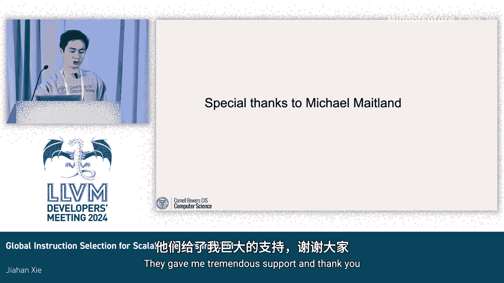

# 071：面向可伸缩向量的 GISel —— 拓展视野


在本教程中，我们将学习如何在 LLVM 的全局指令选择框架中支持可伸缩向量。我们将介绍相关核心概念、实现步骤，并通过一个演示来对比 GISel 与 SelectionDAG 的差异。

## 🧠 核心概念介绍

上一节我们概述了本课程的目标，本节中我们来看看两个核心概念：全局指令选择和可伸缩向量。

### 全局指令选择

全局指令选择，简称 GISel，是一个为指令选择提供一系列可重用 Pass 和实用程序的框架。它之所以被称为“全局”，是因为它在整个函数上操作，而不是像 SelectionDAG 那样仅针对单个基本块。GISel 旨在替代 SelectionDAG。

GISel 包含四个主要 Pass：
*   **IR 转换器**：将 LLVM IR 转换为通用机器 IR。
*   **合法化器**：将不支持的通用机器 IR 操作替换为支持的。
*   **寄存器组选择器**：将通用虚拟寄存器绑定到寄存器组。
*   **指令选择器**：将受约束的通用机器 IR 转换为目标特定的指令。

此外，还有一些可选 Pass，如组合器，可以插入在某些主要 Pass 之间。

### 可伸缩向量

可伸缩向量在固定大小向量的基础上增加了一个称为 `vscale` 的常量倍数。`vscale` 在编译时未知，是硬件无关的，但在整个程序中，所有可伸缩向量的 `vscale` 值是固定的。

以下是一个可伸缩向量的代码示例，其元素数量为 3，元素类型为 i32，`vscale` 可以为 1, 2, 3 等：
```cpp
// 例如：<vscale x 3 x i32>
```

## ⚙️ 实现工作详解

上一节我们介绍了 GISel 和可伸缩向量的基本概念，本节中我们将深入探讨支持可伸缩向量的具体实现工作。

实现工作始于一些前期准备，包括对机器 IR 解析器和验证器的支持，以及调用约定的处理。

### 前期准备

首先，需要支持机器 IR 解析器以解析包含可伸缩向量的机器 IR 文件。其次，更新机器验证器，使其允许从固定大小向量复制到可伸缩向量，只要目标可伸缩寄存器的最小尺寸能容纳源固定大小向量即可。这可以用以下逻辑表达：
```cpp
if (SrcReg.isFixedVector() && DstReg.isScalableVector()) {
    // 检查 DstReg 的最小尺寸 >= SrcReg 的尺寸
}
```

完成这些支持后，机器 IR 文件仍然是完全通用的，可以在物理寄存器和虚拟寄存器之间相互复制。

### 调用约定处理

如果目标希望在 GISel 中支持可伸缩向量，也必须支持调用约定。具体来说，需要：
*   支持将可伸缩向量作为函数参数传递。
*   支持从函数调用返回可伸缩向量。
*   根据目标特定的 ABI 启用调用指令。

### GISel 四阶段实现

接下来，我们将按照 GISel 的四个主要阶段来介绍实现细节。

#### 1. IR 转换阶段

此阶段主要关注算术逻辑单元操作以及加载/存储操作。由于操作在目标无关的通用机器 IR 上进行，这些转换通常适用于所有目标。如果需要支持更多操作码，可以在 `GlobalISel/IRTranslator.cpp` 文件中实现相应的 `translateOpcode` 函数。

对于 IR 转换器，所需的改动可能不大。一个例子是将代码从使用 `unsigned` 类型显式地迁移到使用 `TypeSize` 类型，这在转换加载操作码时已经完成。

#### 2. 合法化阶段

合法化可能具有挑战性。与使用机器值类型和扩展值类型的 SelectionDAG 不同，GISel 使用称为低层级类型的概念，它无法区分整数类型和浮点类型。

如果目标希望支持可伸缩向量类型作为合法类型，需要使用标量类型作为构建块，将低层级类型映射到目标特定的向量类型。

以下是构建可伸缩向量的方法：
```cpp
// 构建可伸缩向量
LLT::scalar(ElSize)            // 标量元素
LLT::pointer(AddressSpace, PtrSize) // 指针
LLT::scalable_vector(NumElts, EltTy) // 可伸缩向量
```

可以使用 `LegalizerInfo` 配合合法性谓词和查询来实现合法化逻辑。对于 ALU 操作，逻辑相对简单：如果目标支持向量指令，并且满足一些目标特定的谓词，则操作是合法的。

对于加载和存储操作，则有一些细微差别。例如，需要使用 `custom()` 方法为特殊情况实现自定义逻辑，比如非标准对齐的加载/存储。如果 `custom()` 评估为真，最终将调用需要你放置自定义函数实现的 `legalizeLoadStore` 函数。

在我们的实现中，选择合法化 RISC-V 向量扩展能支持的指令和类型。合法化计算严重依赖于 RVV 中的一些概念和参数，如向量寄存器长度 `VLEN`、元素长度 `ELEN`、`SEW` 和 `LMUL`。

#### 3. 寄存器组选择阶段

直观上，我们将可伸缩向量映射到向量寄存器组。同时，需要一些目标特定的函数，根据操作值的大小，使用 `ValueMapping` 类将操作值映射到寄存器组。

在我们的案例中，选择根据 RVV 中不同的 `LMUL` 大小，将单个向量寄存器组划分为四个部分。

#### 4. 指令选择阶段

对于 ALU 指令，指令选择非常直接，现有的表格驱动机制可以直接工作。

对于加载/存储指针向量，情况可能不那么简单。因为在 SelectionDAG 中，指针类型通常在合法化之前被转换为整数机器值类型或扩展值类型。但在 GISel 中，需要定义一些自定义逻辑来将指针转换为 `SXLen` 类型。

目前还有一些关于是否以及何时引入目标特定的“通用”操作码的有趣讨论，但这些讨论仍在进行中。

## 🖥️ 演示与对比

上一节我们详细讲解了实现步骤，本节中我们通过一个具体演示来对比 GISel 和 SelectionDAG。

演示使用一个简单的 SAXPY 示例：`a * X + Y`，其中涉及可伸缩向量。

在 LLVM IR 中，代码首先设置可伸缩向量的动态长度，并计算剩余的标量迭代次数。接着，将标量 `a` 拆分为一个可伸缩向量。然后是执行实际计算 `a * X + Y` 的向量循环体。最后，处理剩余的标量迭代并进行清理工作。

以下是使用 GISel 框架在 RISC-V 上生成的汇编代码与使用 SelectionDAG 生成代码的对比，我们将聚焦于一些有趣的差异点。

**主要差异在于向量化部分：**
*   在 SelectionDAG 中，它没有显式地进行标量 `a` 的拆分操作，而是通过一条向量累加指令直接完成了乘加操作。
*   在 GISel 中，代码被逐字翻译：它使用 RISC-V 的 `VFMV.S.F` 操作将标量 `a` 拆分到向量中，然后分别进行向量乘法和向量加法。

**另一个与向量无关但值得注意的点是：**
*   SelectionDAG 在计算余数时进行了一些优化。
*   GISel 再次逐字翻译了计算过程。

目前看来，GISel 的优化程度较低，但这主要是因为 GISel 框架仍在开发完善中。至少，我们已经实现了基本功能。

GISel 的一个显著优势是支持渐进式降低测试，你可以创建一个最小示例，并逐步观察每个阶段的 lowering 结果，这在使用 SelectionDAG 时相对困难。

## 💡 对其他目标的建议与总结

如果您在其他目标后端也希望支持可伸缩向量，这里有一些建议，特别是关于处理类型信息：

以下是处理类型信息的关键点：
*   尽可能使用低层级类型。
*   在目标寄存器信息中，从使用 `unsigned` 迁移到使用 `TypeSize`。
*   如果需要与零比较，使用 `.isZero()` 方法。
*   如果需要大于比较，使用 `TypeSize::isKnownGT`。
*   如果需要与某些固定大小值比较，使用 `getKnownMinValue()`。
*   如果需要获取向量中的元素数量，应从 `getNumElements()` 切换到 `getElementCount()`。

我们的未来工作包括改进 GISel 框架以利用更多的块间优化，当然，还包括支持更多的操作码。

本节课中我们一起学习了在 LLVM GISel 框架中支持可伸缩向量的基本概念、实现路径和注意事项。通过对比演示，我们看到了 GISel 当前的特点和潜力。随着框架的成熟，它有望为向量化代码生成提供更灵活和强大的支持。




