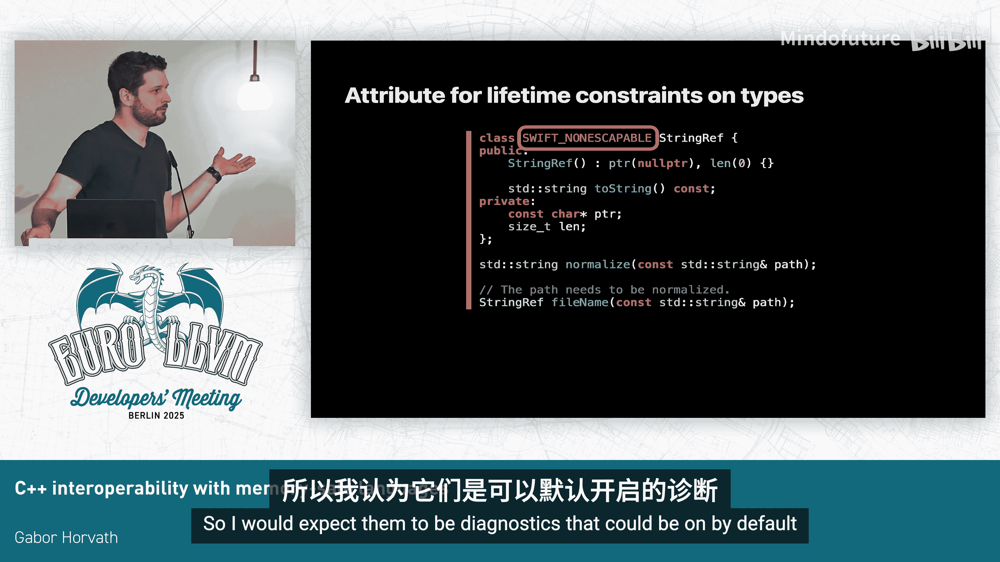

# 001：构建安全的桥梁 🌉


在本课程中，我们将探讨如何通过添加注解来提升C++代码的内存安全性，特别是生命周期安全性，并实现C++与内存安全语言（如Swift）之间更安全、更高效的互操作。我们将了解现有工具、新增的注解及其设计理念，以及如何以渐进式的方式在现有代码库中应用这些改进。

## 概述

内存安全至关重要，因为历史上大部分严重的安全漏洞都源于内存安全问题。我们的目标是提升应用程序的整体安全性。由于存在大量用非内存安全语言编写的遗留代码，完全重写通常不现实。最具性价比的策略是开始在新的模块中使用内存安全语言编写代码，从而在“不安全的海洋”中创建“安全的小岛”，并逐步扩大这些安全区域。为了实现这一目标，我们需要在两种语言之间构建更好的“桥梁”。

上一节我们介绍了构建安全桥梁的必要性，本节中我们来看看实现这一目标的具体挑战和设计考量。

## 生命周期安全的挑战 ⚠️

生命周期安全是指我们只在对象的生命周期内访问它。在C++中，确保生命周期安全颇具挑战。

*   **临时对象规则复杂**：C++中临时对象的生命周期规则有时会延长，有时不会，这些规则并不总是直观的。
*   **内存管理技术多样**：C++使用了大量内存管理技术（如手动释放、引用计数、内存池、静态内存等）。仅从API上，我们通常无法得知某个指针所指对象应采用何种管理方式。
*   **存在非平凡不变式**：例如，向`vector`添加元素可能导致其缓冲区重新分配，从而使之前获取的迭代器失效。如果相关代码分散在大型代码库的不同模块中，这类错误将很难发现。

当我们开始在不同语言间进行互操作时，会引入新的生命周期错误可能性。例如，在Swift中使用C++的`vector`和迭代器时，由于两种语言对对象生命周期的管理方式不同（Swift可能在最后一次使用对象时就结束其生命周期），且API中未包含生命周期依赖信息，Swift编译器可能无法得知`vector`和迭代器之间的关联，从而导致悬垂迭代器。

## 设计目标与权衡 ⚖️

那么，如何改善这种状况？一个直接的思路是为API添加缺失的生命周期信息。但问题在于，这里存在一个广阔的设计空间，涉及不同的权衡。根据我们的目标和优先级，最终方案可能位于这个设计空间的不同位置。

我们的主要目标是**尽可能降低采用门槛**，鼓励用户尽快开始利用内存安全语言的优势。以下是设计时考虑的一些关键方面：

*   **渐进式注解**：用户可能使用无法修改的第三方代码。我们希望用户能够从仅注解重要的API或语言边界开始，而不是要求先为整个代码库添加注解才能获得收益。
*   **可选的病毒式传播**：病毒式传播（即要求相关类型都必须注解）有助于推广注解以获得更多安全性，但会提高初始门槛。最佳方式是提供**可选的病毒式传播**，让用户可以根据诊断信息，按照自己的节奏逐步采用注解，并立即看到价值。
*   **避免过度推断**：过度推断会使API更难理解。更重要的是，我们希望添加注解能带来回报，而不是惩罚。
*   **寻找“甜点”**：C++可以表达任何内存管理技术，但不太可能有一种注解语言或类型系统能表达所有这些。我们的目标是找到一个易于采用、易于理解、对C++开发者来说不显突兀的“甜点”，能够表达我们关心的常见模式即可。

## 现有的Clang注解 🛠️

目前，Clang编译器已经通过一些注解来帮助诊断生命周期问题。请看以下两段非常相似的代码：

```cpp
// 代码段 1: 存在问题
const char *p = std::string("hello").c_str();
// 代码段 2: 安全的
std::string s = "hello";
const char *p = s.c_str();
```

如果编译它们，Clang会对第一段代码发出警告，但不会对第二段发出警告。Clang能判断第一段代码有问题，是因为`std::string::c_str()`方法上使用了名为 **`[[clang::lifetimebound]]`** 的注解。这个注解指明，返回指针的生命周期与隐式的`this`对象（即调用`c_str()`的字符串对象）的生命周期绑定。因此，Clang可以推断出临时`std::string`对象在完整表达式结束时生命周期结束，那么指针`p`所指向的缓冲区生命周期也随之结束，从而生成诊断信息。这个属性在Clang中已存在七到八年。

此外，近期由Google的贡献者添加的一个新注解有助于诊断另一种情况：当我们尝试将一个临时字符串添加到`set`中时。这个新注解可以描述一个值的生命周期被另一个值所“捕获”。

这些注解和诊断功能已经包含在最新发布的Clang版本中。

## 为互操作新增的注解 🌉

上一节我们了解了现有的工具，现在来看看为了改善与内存安全语言的互操作性，以及让C++自身受益，我们新增了哪些注解。

设想一段C++代码，其中`string_view`是一个引用类型。我们有一个返回`string_view`的API，但从其签名中，我们无法得知这个返回的`string_view`对象的生命周期。如果能有一个注解，强制编译器检查该类型的所有使用，并警告“我们正在返回一个引用类型，因此应该添加生命周期注解”，那就太好了。这正是我们所说的**可选的病毒式传播**，可以用来驱动这些注解的采用。

事实上，我们确实添加了这样一个注解。这个注解的动机源于互操作性需求，但正如你所见，即使不考虑互操作性，它对C++也相当有用。

这个注解在我们（演讲者团队）的Clang分支中是新的。让我们看看在尝试从Swift使用C++代码时，这个注解如何发挥作用。

我们引入了Swift中新的可选语言模式：**严格内存安全模式**。在此模式下，当使用像`string_view`这样的外部类型时，Swift编译器会给出诊断，指出我们正在使用不安全的代码。Swift编译器认为该代码不安全，是因为它无法得知这是一个可能具有生命周期依赖的引用类型，还是一个自包含的值类型。

另一方面，如果我们想安全地从Swift使用这个类型，我们可以指定它是一个引用类型（在Swift术语中称为“non-escapable”）。但如果我们添加了这个注解，在C++端编译时，就会收到之前提到的警告：该API缺少生命周期注解。

如果我们补上这个缺失的注解，然后重新编译那段Swift代码，Swift编译器现在将能够诊断出一个实际的**生命周期错误**。在这个例子中，`normalized_path`是一个局部变量，其生命周期在函数返回时结束。而我们返回的`string_view`依赖于这个局部变量，因此会导致“释放后使用”错误。在C++端添加这个注解，使得Swift能够进行完整的借用检查，这是在编译时、零开销就能获得的好处。

对于像`vector`这样的模板类型，`vector<string_view>`应该被视为引用类型，因为它具有生命周期依赖；而`vector<string>`则是值类型，因为它是完全自包含的。为了注解这些泛型类型，我们引入了**条件注解**，使得一个类型是否为引用类型取决于其模板参数。

此外，现在我们将`string_view`注解为引用类型后，当编译器看到一个函数返回`string_view`时，它会要求我们添加生命周期注解。但有些情况下，我们并不需要生命周期注解，例如返回的`string_view`具有静态生命周期，或者传入的`string_view`不会逃逸出当前函数。为此，我们**泛化了`[[clang::noescape]]`注解**（以前它只能应用于指针，现在可以应用于任意类型），并添加了另一个注解来标记返回值具有静态生命周期。这些也是我们分支中的新功能。

## 渐进式采用的优势 📈

这些注解对于渐进式采用特别有用，原因如下：

*   **非病毒式传播**：可以选择只注解重要的API或语言边界处的API，而不必强制将其传播到整个代码库。无需在获得收益之前进行大量的采用工作。
*   **无需完备性**：注解可以是部分的。例如，一个函数可能返回对两个参数之一的引用，但只注解了其中一个依赖关系。这仍然会被视为不安全（因为存在未注解生命周期的引用），但至少有了部分注解。允许部分注解非常重要，因为有些API的生命周期约定可能无法用这些渐进式注解来表达。

当然，目前的方案也有局限性。例如，我们无法表达“返回指针的生命周期与某个`pair`的第一个元素相同”这样的约定，这可能未来需要像“命名生命周期”这样的功能。我们的目标不是表达一切，而是找到一个对用户有效且实用的“甜点”。同时，我们希望保持相对简单，因为C++可能需要与多种语言互操作，我们可能需要在C++中采用一种“最小公分母”的方法。

非常重要的一点是，目前在C++端，我们**并未获得全部益处**。即使C++编译器拥有了检测生命周期问题所需的所有信息，它目前也没有进行完整的数据流分析来做到这一点。我们希望未来能够实现。但当前，如果使用内存安全语言的门槛足够低，当人们需要这种完整的契约检查时，他们可以直接使用内存安全语言来编写代码，因此C++端可能不需要完整的分析。

## 总结与问答环节 💎

本节课中我们一起学习了如何通过注解来构建C++与内存安全语言之间的安全桥梁。

总结来说，通过这些注解，我们可以表达一些C++类型系统中原本缺失的信息。利用Clang的现有功能，我们发现只需添加很少的扩展，就能让互操作运行得出奇的好，尤其是在语言边界的API往往比内部API更简单的情况下。C++和内存安全语言都能从这些渐进式注解中受益。**易于采用**是这一切背后的主要目标和驱动力，因为我们希望人们能够尽快、尽可能轻松地开始扩大那些“安全的小岛”。我们鼓励用户在需要生命周期契约强制执行时，依赖内存安全语言。

---

**Q&A 摘要**



*   **问**：能否自动为现有代码中可轻松推断的部分添加注解？
    *   **答**：目前没有，但技术上对于大部分代码是可行的，未来可能实现自动化推断简单情况。
*   **问**：如何知道还需要添加哪些注解？如何确保安全？
    *   **答**：要获得完全的安全保证，需要进行完整的契约检查，这可能会增加采用难度。目前这是一个固有的权衡：要么易于渐进式采用，要么获得完整安全保证。最佳位置可能是提供渐进式版本，并允许需要时选择加入完整契约检查。
*   **问**：是否考虑过使用“命名生命周期”而非属性？这些属性是仅用于边界，还是也能为C++代码库带来更多安全性？
    *   **答**：有团队正在积极研究“命名生命周期”。这些注解对C++本身也非常有用，在Google内部的应用已经发现了C++代码中的错误。
*   **问**：对于`vector<static指针>`和`vector<局部生命周期指针>`这种相同类型但不同生命周期需求的场景，如何注解？
    *   **答**：在这种情况下，注解可能不属于类型层面。`vector<string_view>`始终是引用类型。描述“返回的是静态生命周期”的注解应属于API层面。对于更复杂的用例，需要进一步讨论。
*   **问**：是否有将这些注解纳入C++标准的努力？
    *   **答**：目前没有，我们尚处于早期内部推广阶段，希望积累更多经验后再向标准委员会提案。
*   **问**：处理这些注解的编译时代价如何？
    *   **答**：Clang中现有的诊断功能开销很低，默认开启。新增的标记类型为引用/值类型的注解开销也很低。本课程展示的所有内容在C++端的编译时成本都应该很低，预计可以作为默认诊断开启。