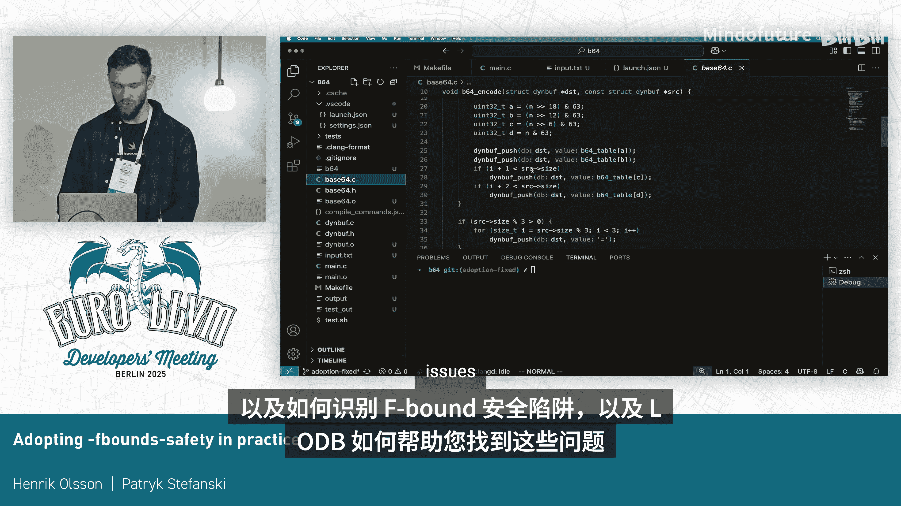
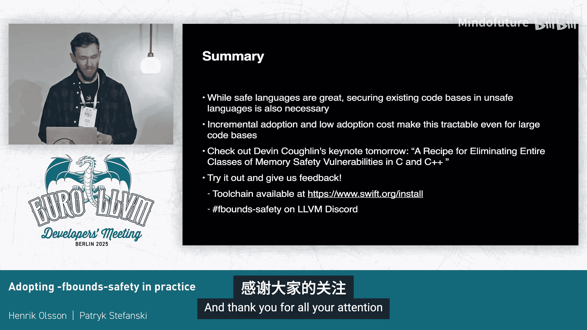

# 002：在实践中采用 Fbound Safety


## 概述

在本教程中，我们将学习 Apple 的 C 语言扩展 **Fbound Safety**。这是一种旨在检测和防止内存越界访问的技术，能够在不重写现有大型 C 代码库的前提下，显著提升其安全性。我们将了解其核心概念、工作原理、如何在实际项目中逐步采用它，以及如何调试运行时错误。

---

## 第一部分：Fbound Safety 简介

### 1.1 背景与目标

我的名字是 Henrik，这是 Patrick，我们是 Apple 的 Se 语言扩展团队的编译工程师。我们主要致力于 **Fbound Safety**，这是我们为 C 语言设计的边界安全扩展。

我们于 2023 年的 URLLLVM 大会上宣布了此扩展并发布了 RFC。去年我们开始了上游化工作，目前仍在进行中。我们的最终目标是完全标准化其语法和语义，以实现跨工具链的兼容性。

由于完整的上游化是一个漫长的过程，今年我们已在 Swift 的 Kang 分支中完全开源了我们的实现，作为一个起点。你可以克隆该仓库并自行构建 Kleline，或者访问 Sw.org 下载适用于 Mac、Windows 和 Linux 的快照版开发工具链。

目前，此扩展仅支持 C 语言，我们未来希望增加对 Objective-C 和 C++ 的支持。

### 1.2 为什么需要 Fbound Safety？

内存安全漏洞是整个行业安全漏洞的主要来源，约占所有安全漏洞的三分之二。历史上，它们被用于许多高调的攻击中，以远程控制受害者的设备。我们日常依赖的许多大型、关键的安全代码库都是用 C 语言编写的，而 C 语言提供的内存安全性非常有限。

当然，最安全的选择是使用提供完全内存安全的语言，但如此大规模的代码重写是一项艰巨的任务，并且我们需要的是当下的安全，而不是十年后的安全。这就是 **Fbound Safety** 的用武之地。

与 C 语言的其他边界安全缓解措施（如 45 source）不同，Fbound Safety 提供了一个全面的模型，用于防止攻击者利用越界访问。它通过迫使攻击者寻找其他更难利用的漏洞类型来提升安全性。

需要明确的是，虽然 Fbound Safety 可以帮助你发现漏洞，但这并非其主要目的。它旨在用于生产环境，以防止正在发生的攻击。

---

## 第二部分：Fbound Safety 的工作原理

上一节我们介绍了 Fbound Safety 的目标，本节中我们来看看它是如何实现这些目标的。

### 2.1 核心策略

Fbound Safety 在语言层面强制执行边界安全规则。以下是实现此目标的策略：

1.  **自动边界检查**：编译器通过自动边界检查在运行时防止越界内存访问。启用 Fbound Safety 后，这不是可选项。
2.  **编译时错误**：如果编译器没有足够的信息来发出运行时检查，或者它明确知道访问是不安全的，它将在编译时通过错误告知你。
3.  **边界信息可靠性**：编译器还会拒绝那些不能保证边界注释正确性的表达式，以确保在遇到边界检查时，这些信息是可靠的。

### 2.2 边界注释与运行时检查

Fbound Safety 扩展为程序员提供了用于函数类型、结构体字段和全局变量的边界注释。例如，`counted_by`。

以下是使用 `counted_by` 注释的示例：

```c
void process_buffer(int *buffer counted_by(count), int count) {
    for (int i = 0; i <= count; i++) { // Bug: 循环条件错误，将越界
        buffer[i] = 0;
    }
}
```

利用 `counted_by` 注释提供的边界信息，编译器可以插入边界检查。如你所见，这个有缺陷的循环条件最终会越过缓冲区的末尾，但插入的边界检查将使程序陷入陷阱，而不是访问越界内存。

程序员必须提供足够的边界信息，否则编译器将拒绝代码并要求程序员添加边界注释。如果我们再次使用相同的例子，但没有 `counted_by` 注释，缓冲区就没有必要的边界信息，因此当我们尝试进行数组索引时，编译器会报告错误。为了使代码正常工作，程序员需要添加边界注释以消除错误。

### 2.3 边界信息的同步与正确性

这种方式有效地默认保护了所有指针，但仅仅添加所需的边界信息是不够的，它还必须是准确的。例如，程序员还必须确保每当指针更新时，计数也相应更新，反之亦然。否则，一个最初具有正确边界信息的指针，在其中一项更新后，可能会得到过时的边界信息，从而导致边界检查失败。

在这个例子中，`buff` 和 `count` 暂时不同步，因为计数在指针递增之前被递减，但 Fbound Safety 要求它们始终保持同步。因此，编译器将此报告为错误。为了使代码正常工作，程序员必须移动赋值语句，使它们彼此相邻。这样，扩展就能始终保持边界注释的正确性。

幸运的是，并非所有指针都需要边界注释。对于局部变量，编译器可以自动跟踪边界，这加快了采用速度，因为它不需要手动添加注释，同时也因为更灵活的语义不需要像刚才展示的那样移动赋值语句。由于没有外部边界会失去同步，让我们再次使用相同的例子，但这次我们将重命名参数，并引入具有原始参数名称的局部变量。

现在，`buff` 的类型不再依赖于 `count`，因此它们不必再保持同步，并且内存访问实际上并没有越界，所以代码现在没问题。仍然会有一个边界检查，但边界信息保存在 `buff` 指针内部，因此我们不必移动赋值语句。这种方式扩展性更好，因为我们只需要在函数开头进行一次更改，而不管函数中有多少次重新赋值。如果你正在对开源项目进行下游采用，这也减少了与上游的差异。

---

## 第三部分：Fbound Safety 的采用与优势

上一节我们探讨了 Fbound Safety 如何工作，本节我们来看看采用它的实际影响和好处。

### 3.1 采用难度与兼容性

Fbound Safety 确实对指针的使用方式施加了严格的规则，但尽管如此，采用起来仍然相当容易。大多数指针根本不需要注释，因此需要手动编辑的地方数量很少。根据我们的经验，完全采用 Fbound Safety 大约需要每 2000 行代码花费 1 个工程师小时。作为参考，对于一百万行代码，这大约是 12.5 个工程师周。

因为它保持了 API 兼容性，你仍然可以使用不使用 Fbound Safety 的库，或者如果你的代码是一个库，你可以在不破坏用户构建的情况下采用 Fbound Safety。这也支持增量采用，因此你不需要打开一个单独的分支来进行完全采用，然后再一次性合并回来。你可以在几个版本的过程中逐步保护代码，这对于保护大型代码库至关重要。

### 3.2 生产环境应用与性能

这是 Apple 已经在做的事情。尽管实现最近才开源，但它已经在 Apple 内部的生产环境中使用了多年。Fbound Safety 已在数百万行关键软件中被采用，运行在所有 Apple 平台上的消费者设备中。虽然其中大部分代码不是开源的，但 XNU 内核中的采用是开源的，如果你想看看的话。开发仍在进行中，但 Fbound Safety 的当前状态是有效的，并且有助于保护我们的设备安全。

所有这些都是在我们认为合理的开销下实现的。我不想过多关注性能，但如果不展示数字，就很难提及它。让我们看几个基准测试。在展示这些数字之前，我想提一下这些数字来自 2023 年，所以如果你今天尝试重复它们，可能会略有不同，但它们应该在大致范围内。

我们发现平均代码大小增加了 9.1%，运行时开销增加了 5.1%。但从范围可以看出，开销因应用程序而异。通常，在已经具有手动边界检查的应用程序中，影响往往更小，因为优化器可以移除冗余的边界检查。然而，在优化器中仍有一些工作可以改进，以移除更多冗余的边界检查。

但在实际的采用者中，端到端的开销比这些数字要小。例如，我们测量了音频编解码器中的运行时开销大约为 1%，我们很乐意为了安全而付出这个代价。二进制大小开销也比这些数字小，因为这也只测量了二进制文件的文本部分。

---

## 第四部分：边界注释类型详解

上一节我们了解了采用 Fbound Safety 的宏观情况，本节我们将深入探讨具体的边界注释类型。

我们有一系列具有不同优缺点、适用于不同场景的边界注释。以下是主要的几种：

### 4.1 counted_by 系列

`counted_by` 允许你指定一个表达式，表示缓冲区中可以容纳的元素数量。通常这只是一个参数或结构体字段，但它也可以包含常量或简单的算术表达式。该表达式在每次边界检查时被求值，这就是为什么它需要与指针保持同步。

`counted_by` 非常适合在局部上下文中传递信息，因为它使用已经存在的信息并保持 ABI 兼容性。结构体字段、函数参数、返回值是它大放异彩的地方。

它不仅仅是一个单一的注释，`counted_by` 是一个包含其他三个类似注释的家族的一部分，每个都有细微的语义差异。

以下是 `counted_by` 家族的成员：

*   **`counted_by`**：用于指定元素数量。
*   **`sized_by`**：当缓冲区类型为 `void*` 或谈论元素数量没有意义时，用于以字节数表示缓冲区大小。
*   **`counted_by_nullable` / `sized_by_nullable`**：用于指针可能为 `NULL` 的情况（如 `malloc` 失败时）。边界检查首先检查指针是否为 `NULL`，如果是，则忽略大小参数。

经验法则是：尽可能使用 `counted_by`，在需要时使用其他变体。

`counted_by` 家族的指针在每次内存访问和每次赋值时都会进行边界检查。对于函数参数，这意味着调用者将在调用前检查边界。这意味着函数可以完全信任计数是正确的，而无需知道指针来自哪里。

### 4.2 single

`single` 表示指向单个元素或空指针的指针。因此，如果我们尝试对其进行指针运算，总是会得到编译错误，所以我们不能索引到该指针，除非索引是 `0`。我们可以为动态索引发出运行时检查，但我们不允许这样做，因为大多数时候，如果你尝试对 `single` 指针执行动态索引，实际上只是缺少边界信息，我们希望在编译时捕获该错误，而不是在运行时。如果你确实想用索引 `0` 进行索引，只需使用常量值而不是动态值。

### 4.3 bidirectional_indexable

与 `counted_by` 不同，`bidirectional_indexable` 允许你在正向和负向进行索引，因此得名。这是通过将指针的表示形式更改为“宽指针”来实现的，该指针携带上下界以及指针本身。

在这个例子中，编译器会将指针转换为宽指针，并在指针被解引用时在运行时发出边界检查。然而，它不会在重新赋值期间发出边界检查，因为如果指针越界，该信息仍然可以存储在指针中，以便在你稍后访问指针时，错误将在那时被捕获。这与 `counted_by` 不同，在 `counted_by` 中，仅仅构造一个越界的指针就是未定义行为，但在这里这完全没问题。

因此，`bidirectional_indexable` 非常灵活，编译器将允许几乎任何操作，因为它有大量信息可用于运行时检查。然而，由于它改变了指针表示形式，它与普通指针的 ABI 不兼容，因此调用者必须知道函数期望一个宽指针。这对于向后兼容性和增量采用来说是一个问题，因为即使调用者和被调用者在同一个头文件中共享相同的定义，如果调用者是在未启用 Fbound Safety 的情况下编译的翻译单元中，它甚至不知道 `bidirectional_indexable` 是什么，从而导致 ABI 不匹配。

因此，在公共头文件中使用 `bidirectional_indexable` 注释函数至少是一个问题，但其灵活性使得 `bidirectional_indexable` 非常适合 ABI 不是真正因素的局部变量。

### 4.4 unsafe_indexable

我们有一个称为 `unsafe_indexable` 的逃生舱口。这只是一个普通的 C 指针，你可以用它做任何通常用 C 指针做的事情，没有编译时限制，也没有边界检查。这对于与不使用 Fbound Safety 的库交互很有帮助，因为尽管它们没有边界安全注释，我们仍然可以调用它们的函数。当然，库可以用我们的指针做不安全的事情，但我们已经尽力保护了我们控制的代码。

---

## 第五部分：指针转换与默认规则

上一节我们介绍了各种注释类型，本节我们来看看它们之间如何转换以及默认的注释规则。

### 5.1 指针转换模型

这个过程相当顺利，因为指针可以在不同的指针种类之间隐式转换。让我们看看这是如何工作的，以及何时需要显式转换。

以下是 Fbound Safety 指针转换的核心模型：

`Bidirectional_indexable` 作为最灵活的类别，充当其他类别之间的公共中间地带。转换为 `bidirectional_indexable` 只是转移边界的问题，因此不需要边界检查。

另一方面，安全地转换为 `counted_by` 指针需要在索引处插入边界检查，以确保传入指针中的元素数量等于或大于计数表达式。

类似地，安全地转换 `single` 需要检查指针是否实际指向某个东西，因为 `bidirectional_indexable` 指针可能越界。

最后，转换为 `unsafe_indexable` 只是移除边界注释的问题。

这些转换都是自动发生的，因此你不需要插入任何显式强制转换，因为编译器知道该做什么。但是，没有从 `unsafe_indexable` 的隐式转换。要从 `unsafe_indexable` 伪造一个安全指针，你需要使用一个不安全的伪造内置函数。这告知编译器边界信息，但也有助于审计，因为你是明确地不安全地伪造一个安全指针。

### 5.2 默认注释规则

函数参数、结构体和局部变量中的很大一部分指针不需要任何显式注释，因为默认值已经是正确的。这些默认值使采用过程更容易。

以下是默认规则：

*   **函数签名、结构体和全局变量中的指针**：隐式为 `single`。
*   **外部系统头文件中的指针**：隐式为 `unsafe_indexable`，以便你仍然可以调用你无法控制的库中的函数。
*   **局部变量中的指针**：全部隐式为 `bidirectional_indexable`。

因此，我们建议将所有外部头文件包含为系统头文件，除非你手动注释这些头文件，否则当你启用 Fbound Safety 时，编译器可能会发出源自这些头文件的边界错误。

如果需要，也可以使用编译指示更改 ABI 可见指针的默认值。编译器通常能够优化掉不必要的边界，如果你不使用 `bidirectional_indexable` 的全部功能，那么开销就不会像在 ABI 表面上那么大。当然，你总是可以用显式注释覆盖这些默认值，但如果没有任何注释，这些就是默认值。

以上就是对 Fbound Safety 的简要概述。还有一些额外的边界注释和语义边缘情况我没有涵盖，所以如果你有兴趣深入了解，我建议观看 2023 年 URLLVM 上的初始公告，当然也要阅读可用的文档。上游 K 文档反映了我们上游化工作的目标，而不是当前的实现。

---

## 第六部分：实践采用指南

现在，我将把讲解交给 Patrick，他将展示如何在实践中采用 Fbound Safety。

大家好，我是 Patrick，我在 Apple 的 Se 语言扩展团队与 Hendrich 一起工作，今天我将向大家展示如何在实践中采用 Fbound Safety。

### 6.1 增量采用流程

Fbound Safety 允许我们进行增量采用。我们的建议是在单个文件中启用 Fbound Safety。

这样做可能会导致编译器发出一堆编译错误和其他诊断信息。这些诊断信息将指导你如何注释代码。

当你修复了编译错误后，你应该运行测试以检查是否存在任何运行时问题。在这里，拥有良好的运行时测试覆盖率极其重要。

当测试成功且代码编译通过后，你可以重复第一步，直到在所有地方都启用了 Fbound Safety。

当你在所有地方都启用了 Fbound Safety 后，你可以对性能（如运行时和代码大小）进行基准测试。

如果你对性能不满意，你可以优化代码。我们专门为 Fbound Safety 提供了优化备注，这些备注将指导你如何优化代码，并显示边界检查在何处发出。

### 6.2 在库中采用

你也可以在库中采用 Fbound Safety，但对于公共头文件有一个注意事项。

对于系统头文件，默认属性是 `unsafe_indexable`。然而，对于非系统头文件，ABI 可见指针的默认属性是 `single`。如果你将已采用 Fbound Safety 的库的头文件作为系统头文件包含，这可能会导致不匹配，因为默认属性将是 `unsafe_indexable`，但如果你已经采用了，属性应该是 `single`。

为了解决这个问题，我们有一个名为 `#pragma pointer_check assume_safe` 的编译指示，你可以将其添加到文件的开头，这将把整个文件的默认 ABI 属性更改为 `single`。这将改变该属性，无论该文件是否作为系统头文件包含。

因此，你的库中的公共头文件应始终使用此编译指示，以避免这种不匹配，并表明它们已采用 Fbound Safety。

此外，库还有另一个更轻量级的选项，而不是完全采用，我们称之为“仅头文件采用”。这对于那些不想承担完全采用成本（无论是时间投入还是运行时开销）的库很有用。你可以通过仅注释公共头文件或公共接口来实现这一点，但不在你的实现中注释和启用 Fbound Safety。因此，实现并未受到 Fbound Safety 的保护。然而，正在采用 Fbound Safety 的客户端将看到这些注释并获得安全的接口。未采用 Fbound Safety 的其他客户端将看不到这些注释，也不会支付任何成本。

一个很好的例子是 `memcpy`。例如，你可以用 `sized_by` 注释来注释 `memcpy`，这将确保在调用端发出边界检查，以验证你传递了具有正确大小的缓冲区。但你不必注释，也不必在 `memcpy` 的实现中启用 Fbound Safety。这对于其他语言中更安全的互操作也很有用，因为这些边界注释为编译器提供了更多信息。

但如果你想进行仅头文件采用，请记住添加一个测试用例，创建一个包含所有头文件的单个 C 文件，这将检查该头文件中的那些注释是否编译。

---

## 第七部分：现场演示与调试

上一节我们介绍了采用流程，现在我将通过一个简单的演示项目来展示如何实际操作。

### 7.1 演示项目介绍

为了说明 Fbound Safety 的采用，我们开发了一个简单的程序。这个程序叫做 `B64`，是一个简单的命令行工具，可以让你编码和解码 base64。这个程序使用 makefile 来构建项目。

这个项目包含三个 C 文件。你可以构建 `B64` 实用程序，并使用它来编码和解码 base64。我们还有一个测试脚本，可以让我们运行一些测试并检查一切是否正常。

我们将以增量方式进行采用，这意味着我们将在一个文件中启用 Fbound Safety，然后为每个文件重复此过程。我们将启用它，可能会得到一些编译错误，我们将解决它们，并在每次为单个文件启用 Fbound Safety 后运行测试。我们将重复此过程，直到整个项目都被采用。

### 7.2 逐步采用示例

让我们从 `dbuf.c` 开始。这是一个动态缓冲区的简单实现，可以随时间增长。我们有一个结构体和几个允许我们操作动态缓冲区的函数。

要启用 Fbound Safety，我们必须传递 `-fbounds-safety` 标志作为编译标志。现在，编译器将使用 Fbound Safety 标志编译此项目或此文件。我们将得到一些编译错误。

以下是解决错误的示例步骤：



1.  **错误：无法索引到 single 指针**。函数参数 `data` 默认是 `single`。我们需要用 `counted_by(size)` 注释它，以告知编译器该指针必须指向至少 `size` 个元素。
2.  **错误：结构体字段的索引问题**。结构体中的 `data` 指针默认也是 `single`。我们使用 `counted_by(capacity)` 注释它，因为 `capacity` 表示 `data` 指针中分配的字节数。
3.  **错误：赋值同步问题**。`counted_by` 要求指针和其计数必须一起赋值。在代码中，`data` 和 `capacity` 的赋值被 `memset` 调用隔开。我们引入一个局部变量来保存新数据，然后在最后一起赋值给 `data` 和 `capacity`。
4.  **错误：静态函数中的指针**。静态函数不在 ABI 层，我们可以将其指针表示更改为宽指针，使用 `bidirectional_indexable` 注释，或者如果大小可用，也可以使用 `counted_by`。推荐使用 `counted_by`，因为它与普通 C 指针 ABI 兼容且通常优化得更好。
5.  **错误：系统头文件指针**。`stdin` 和 `stdout` 定义在系统头文件 `stdio.h` 中，默认是 `unsafe_indexable`。我们需要使用 `__unsafe_forge_single` 内置函数来告知编译器这些指针指向单个文件指针。

修复所有错误后，编译项目并运行测试。所有测试都成功，说明我们成功地在文件中采用了 Fbound Safety。对其他文件重复此过程。

---



## 第八部分：调试运行时错误

现在编译器满意了，测试也通过了，但这并不意味着程序没有错误，因为我们只有六个测试用例，测试覆盖率不高。我们将调试此代码中的运行时陷阱。你可以想象这发生在一个具有更广泛覆盖率的更好的测试套件中，或者这是对某个被阻止的攻击的重放。

### 8.1 触发并分析陷阱

我们创建一个精心设计的输入文件来触发越界访问。运行程序后，我们遇到了一个陷阱，并收到一条很好的错误消息：“边界检查失败，解引用越界”。

这是使用去年新增的 Kang 中的详细陷阱功能，它也存在于上游 Kang 和 LDB 中。它通过将消息编码在一个伪造的内联堆栈帧中来工作。在正常的 LDB 中，它会知道跳过这个堆栈帧并直接转到真实的堆栈帧，但 BS 代码扩展知道这一点，所以让我们手动转到那里，然后我们可以看到陷阱实际发生的位置。

我们正在索引到 `b64_table`，这个索引实际上是越界的。对于这个指针，我们可以看到边界信息（在下游 LDB 版本中会显示）。它显示 `data` 是 `counted_by(capacity)`，`capacity` 是 8，而索引 `j` 是 9，所以我们越界了，这就是陷阱的原因。

### 8.2 问题根源与修复

这里的问题是，我们有一个动态缓冲区，当我们向其中添加内容时它会增长，但这个函数实际上只是直接访问内部数据指针，而不是使用公共 API。

修复方法是：不直接访问值，而是使用官方的 `dbuf_push` API，这样当我们添加新元素时，它实际上会增长缓冲区。

这是一个快速演示，展示了 Fbound Safety 如何防止越界访问，如何识别 Fbound Safety 陷阱，以及 LDB 如何帮助你找到这些问题。

### 8.3 关于优化构建的说明

在这个函数中，我们可以看到许多不同的 `brk` 指令，每条都有自己独立的消息。但如果这是在优化构建中（这只是一个完全未优化的调试构建），它们都会被合并到一个 `brk` 指令中，分支都指向同一条指令。这样我们会丢失源代码信息。因此，如果你想查看陷阱实际发生的位置和原因，你需要进行未优化的构建，或者如果那不可行，你可以使用 `-funique-traps` 作为编译器标志，然后它将阻止这些陷阱的合并。

---

## 第九部分：总结与资源

让我们回到演示文稿。

### 9.1 总结

这只是我们为适应本次演示时间而创建的一个小演示项目，但如果你想要一个更大的项目，我们已经在开源项目 GIFlib 中采用了 Fbound Safety，这是一个用于处理 Gi 图像的成熟 C 代码库，可以在我们的 GitHub 上找到。如前所述，我们在 XNU 中也有采用。

总之，Fbound Safety 支持大型和小型代码库的增量采用，并帮助你在生产环境中捕获边界安全问题，在攻击者能够利用它们之前。如果你对此感兴趣，明天我们同事的 Dev 主题演讲中会有更多类似的内容，以及一个关于在 C++ 中消除整个内存安全漏洞类的方案，所以一定要去看看。是的，去尝试一下，给我们反馈。你可以在这里的会议上或随时在 Discord 的 Fbound Safety 频道与我们交谈。感谢大家的关注。

### 9.2 问答环节摘要

*   **`counted_by` 表达式的限制**：不能调用任意函数，只能调用被注释为 `pure` 的函数，且表达式必须在编译时可求值。可以进行一些算术运算。全局变量如果是编译时常量可以使用，但如果是可变变量，则很难检查与指针的同步。
*   **可变长度数组和灵活数组成员**：`counted_by` 支持灵活数组成员，只要结构体中有关于其长度的信息，就可以用 `counted_by` 注释。
*   **设计是否基于现实攻击修改**：演讲者未意识到因现实攻击而修改设计的情况，但发现过未覆盖某些情况的问题，不过未同时发现这些情况被用于攻击。
*   **`__unsafe_forge_single` 为何需要显式指定类型**：因为该内置函数也可用于从整型伪造指针，所以源类型和目标类型不一定相同。
*   **性能优化建议**：使用优化备注查看边界检查发出位置。可以重构代码（如改变循环条件、循环顺序）以优化边界检查。对于复杂表达式（如除法），可以尝试找到解决方法。也可以在循环前手动进行边界检查，使循环内的检查变得冗余。
*   **C++ 支持的挑战**：C++ 的构造要多得多。最大的挑战是覆盖整个语言需要时间。最近增加了对 C++ 模板函数中语法上使用表达式的支持，但运行时还不支持。可以只为 C++ 的 C 子集提供支持，但需要决定如何处理模板等情况。

