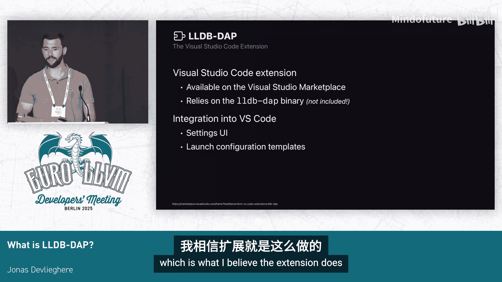

# 003：什么是LLDB DAP？


在本节课中，我们将要学习LLDB DAP。这是一个连接开发工具与调试器的协议，旨在为不同编程语言提供统一的调试体验。

## 什么是DAP？🤔

DAP代表**调试适配器协议**。它是一个由微软开发的开源标准，用于在IDE、编辑器等开发工具与调试器之间进行通信。其目标是实现跨语言的统一调试体验，避免各种工具和调试器之间需要为彼此实现定制化支持。

该协议基于JSON格式，定义了三种类型的消息：**请求**、**事件**和**响应**。

*   **请求**：从客户端发送到调试适配器的消息。
*   **事件**：从调试适配器主动发送到客户端的非请求消息。
*   **响应**：对请求的回复。

## 深入一个协议请求示例 🔍

上一节我们介绍了DAP的基本概念，本节中我们来看看一个具体的协议消息示例。我们以`breakpointsLocations`请求为例，因为它相对简单。

这个请求的目的是获取一个源代码断点的所有可能位置。以下是请求和响应的结构：

**请求示例**：
```json
{
  "seq": 3,
  "type": "request",
  "command": "breakpointsLocations",
  "arguments": {
    "source": {
      "path": "/path/to/driver.cpp"
    },
    "breakpoints": [
      {
        "line": 780
      }
    ]
  }
}
```
协议定义了此请求的参数是固定的。在这个例子中，我们提供了文件路径和行号。客户端将此请求发送给调试适配器，适配器会将其传递给底层的调试器实现。

**响应示例**：
```json
{
  "seq": 3,
  "type": "response",
  "command": "breakpointsLocations",
  "success": true,
  "body": {
    "breakpoints": [
      {
        "line": 780,
        "column": 19
      }
    ]
  }
}
```
如你所见，响应只包含了一个断点位置（第780行，第19列）。需要注意的是，响应省略了请求中的许多信息（如文件路径），因为它是对特定请求（序列号3）的回复，这种方式更加高效。

## LLDB中的DAP实现 🛠️

了解了协议本身后，我们来看看它在LLDB中的具体实现。需要强调的是，LLDB DAP是一个社区共同努力的成果，目前是LLDB中最活跃的部分之一，得到了来自不同个人和公司的贡献。

首先，我们需要区分两个概念：

1.  **`lldb-dap`** (全小写)：这是**调试适配器服务器**本身。
2.  **`LLDB`** (全大写)：这是Visual Studio Code的**扩展插件**。

接下来，我们将分别详细介绍它们。

### 调试适配器服务器：`lldb-dap`

`lldb-dap`是一个独立的二进制程序，它实现了调试适配器协议。它的作用是接收DAP请求，将其翻译成LLDB的稳定API调用，然后利用这些调用将响应返回给客户端。

本质上，`lldb-dap`充当了DAP协议与LLDB之间的适配器，因此得名。

*   该二进制程序从LLVM 19版本开始，成为LLVM发行版的一部分。
*   从Xcode 16.0开始，它也随Xcode命令行工具一同提供。
*   一个值得注意的特点是，`lldb-dap`构建在LLDB稳定API之上。这意味着你可以更换底层的LLDB版本，这对于拥有自定义语言支持的下游分支非常有用。

任何需要与LLDB通信的工具，都可以通过这个服务器来进行。

### Visual Studio Code扩展：`LLDB`

如果你使用Visual Studio Code，则需要下载`LLDB`扩展（全大写）。这个扩展使用TypeScript编写，它主要告诉VS Code如何使用`lldb-dap`服务器，并提供了一些额外的便利功能：

以下是该扩展提供的主要功能：
*   **设置UI**：你可以在其中指定`lldb-dap`二进制文件的路径。
*   **启用选项**：可以配置一些调试选项。
*   **启动配置模板**：指导VS Code如何启动或附加到调试目标。

需要说明的是，该扩展**不包含**`lldb-dap`二进制文件。如果`lldb-dap`在你的系统路径中，扩展会自动找到它；否则，你需要手动指定路径。未来可能的解决方案是从最新的LLVM版本中自动下载该二进制文件。

## 实际演示 🎬

最后，让我们看看实际效果。下图展示了在Visual Studio Code中使用LLDB调试LLVM项目的情景。



所有你看到的UI元素（如变量查看、调用栈、断点）都是标准的。这一切的背后都是由`lldb-dap`驱动的。你还可以在底部的调试控制台中直接输入LLDB命令，获得对调试器的完全访问权限。

如果你还没有尝试过，请务必试试看。


## 总结 📝

本节课中我们一起学习了LLDB DAP。我们了解了DAP协议的目标和基本消息类型，通过一个示例观察了请求与响应的交互过程。接着，我们区分了`lldb-dap`调试适配器服务器和VS Code的`LLDB`扩展，并了解了它们各自的作用和获取方式。最后，我们看到了它在实际开发环境中的强大应用。LLDB DAP为开发者提供了一个标准化、跨平台的强大调试界面。