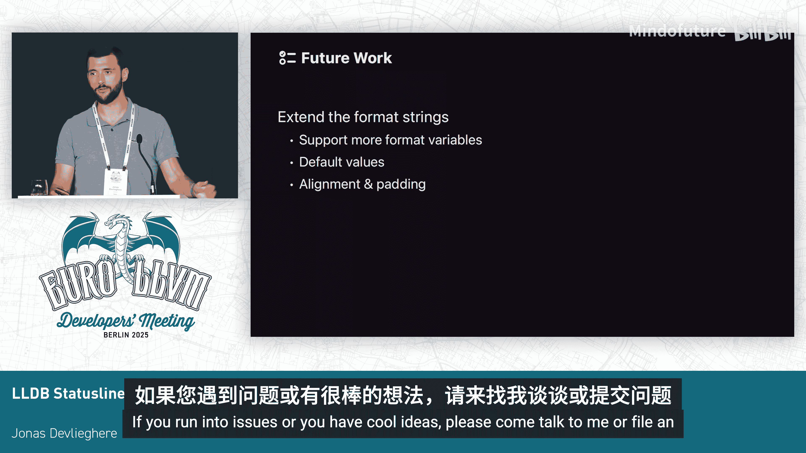

# 004：全新状态行功能详解


在本节课中，我们将学习LLDB调试器引入的全新状态行功能。我们将了解它的外观、配置方法、设计动机以及背后的实现原理。这个功能旨在提升调试体验，提供更清晰、更可定制的信息展示。

---

## 🎨 状态行外观与默认配置

上一节我们介绍了课程概述，本节中我们来看看状态行的具体外观。

状态行是位于终端屏幕底部的一个专用区域。它使用LLDB现有的格式字符串进行完全配置，这是一个你可能已经用来自定义帧或线程显示格式的概念。

以下是状态行默认包含的几个核心组件：

*   **反色显示区域**：状态行整体使用反色（或称负片）效果，即前景色与背景色互换。这利用了终端配色方案中已有的颜色，能确保在任何配色下都有良好的视觉效果。
*   **目标名称**：显示当前正在调试的目标程序名称。默认显示完整路径，但为了节省空间，可以配置为仅显示基础名称。
*   **源代码位置**：显示当前程序停止处的源代码文件和行号，格式为 `{文件}:{行号}`。
*   **停止原因**：显示程序停止的原因，例如遇到断点。
*   **进度报告**：当LLDB执行耗时操作（如加载符号）时，会在此处显示进度信息。如果当前没有进行中的操作，则该部分不显示。

状态行各组件之间使用竖线 `|` 分隔。一个重要的概念是**作用域**，它由花括号 `{}` 表示。作用域内的所有格式变量都必须能成功解析，该作用域（包括其分隔符）才会被打印出来。这避免了在信息缺失时显示多余的分隔符。

## ⚙️ 如何自定义状态行

了解了默认配置后，我们来看看如何根据个人喜好定制状态行。

自定义通过修改LLDB的 `status-format` 配置实现。格式字符串中可以使用变量来引用不同信息，例如 `%T` 代表目标，`%S` 代表源代码位置。

以下是一个自定义示例，它将状态行背景改为黑色，并添加了一个表情符号：

```
settings set status-format "🐛 \033[48;5;0m %T | %S | %B \033[0m"
```

在这个例子中：
*   `\033[48;5;0m` 是设置背景色为黑色的ANSI转义码。
*   `%T` 是目标变量。
*   `%S` 是源代码位置变量。
*   `%B` 是停止原因变量。
*   `\033[0m` 用于重置颜色。
*   作用域规则依然适用，确保信息缺失时布局整洁。

LLDB官网提供了完整的格式变量列表及其说明，你可以根据需要组合它们。

## 💡 功能设计动机

在深入技术实现之前，让我们探讨一下引入状态行功能的两大主要动机。

首先是为了改进**进度事件**的显示。此前，进度信息以内联方式显示在输出中，这种方式很脆弱。需要复杂的簿记来跟踪屏幕上显示的是哪个进度事件，以便在操作完成后清除它。当调试器自身和被测程序同时产生输出时，这变得非常棘手，有时甚至导致进度事件无法显示，给用户造成困惑。

其次是为了满足用户的**个性化定制**需求。许多用户一直希望能在LLDB提示符中使用格式字符串进行定制。而状态行提供了一个更合适、更强大的区域来实现个性化信息展示，不会干扰主要的命令和输出区域。

## 🛠️ 技术实现简介

状态行的实现没有使用成熟的终端UI库（如Ncurses），因为这类库通常会接管并清空整个屏幕，这与LLDB当前的工作方式差异太大。

相反，该功能直接使用了**ANSI转义码**，这与LLDB为多行编辑等功能所做的类似。其核心依赖于一个特定的转义序列：`\033[?1049h` 和 `\033[?1049l`（此处原文描述为“减少终端滚动窗口”，实质是使用替代屏幕缓冲区或类似技术来保留主屏幕内容）。通过将终端滚动区域减少一行，可以将最底部的一行“固定”下来，专供状态行使用。而其他所有输出则正常显示在上方的滚动区域内，互不干扰。

## 🚀 未来展望与总结

本节课中我们一起学习了LLDB状态行功能。目前该功能已在LLDB的主干代码中可用。

展望未来，主要工作将围绕**格式字符串**的扩展展开。随着用户开始使用和定制状态行，预计会出现暴露更多LLDB内部信息作为格式变量的需求。此外，计划支持**默认值**功能，以便在未加载目标时显示“无目标”等友好提示，而非空白。在功能设计征求反馈期间，许多用户也提出了对**对齐和填充**功能的支持需求，这将允许创建更复杂、更精美的状态行布局。

我们鼓励你尝试这个新功能。如果你遇到任何问题，或者有很酷的定制想法，请向LLDB项目提交问题报告或直接与开发者交流。




**总结**：LLDB的新状态行是一个可高度定制的信息显示区域，它通过格式字符串进行配置，利用作用域规则保持布局整洁，并直接使用ANSI转义码实现，以兼容LLDB现有的交互模式。它解决了进度显示不稳定的问题，并为用户提供了强大的个性化界面能力。