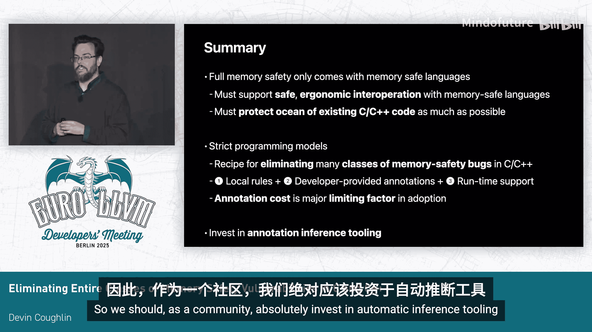

# 005：消除C/C++中整类内存安全漏洞的配方


在本教程中，我们将学习如何通过一系列技术和编程模型，来消除或大幅缓解C和C++语言中整类别的内存安全漏洞。我们将从内存安全的重要性谈起，逐步深入到具体的技术方案，包括初始化保证、边界安全、生命周期安全、类型安全和线程安全，并探讨如何将这些技术整合到异构代码库中。

## 概述：内存安全的挑战与策略

如今，个人计算设备无处不在，它们承载着我们生活中大量私密且关键的信息。这些设备互联互通，使得其中的安全漏洞可能被恶意攻击者利用，造成严重后果。内存安全问题处于这些安全挑战的最前沿。

世界上存在大量用内存不安全语言（如C/C++）编写的安全敏感代码。我们的内存安全策略是：**完全的内存安全需要使用内存安全的语言**，例如Swift。然而，有太多的C/C++/Objective-C代码无法全部重写。

因此，我们采取的策略是：在新代码中采用内存安全语言，并将高价值代码库重写为内存安全语言。这个策略很有效，但也带来了挑战。我们将其比喻为“内存安全岛屿”：绿色的安全代码岛屿，分布在广阔的、蓝色的不安全C/C++代码海洋中。

我们正在努力扩大这些岛屿，但也需要保护那片广阔的海洋。我们坚信无法使C/C++变得完全内存安全，但可以**致力于消除整类别的漏洞**。如果无法完全消除，也应尝试强力缓解，确保攻击者难以利用。

## 内存安全的五个维度

我们通常将内存安全视为五个不同的维度：**初始化保证**、**边界安全**、**生命周期安全**、**类型安全**（主要指转换安全）和**线程安全**。接下来，我们将逐一探讨这些方面，介绍我们为消除相关漏洞所做的工作，以及我们认为需要进一步努力的领域。

## 初始化保证：确保内存在使用前被初始化

初始化保证是指所有内存在被读取之前都已被初始化。我们开发了Clang编译器扩展 `-ftrivial-auto-var-init` 来保护栈内存，它保证将内存初始化为0，从而防止信息泄露攻击和许多栈修饰攻击。

我们也可以使用 `-fzero-initialize-in-poniter` 来保护堆内存。这种方法已在数亿行代码上部署，非常成功。然而，它并非完美。需要指出的是，0并不总是程序员的预期值。在我们的研究中，大约有20%的情况，零初始化不是正确的值，这代表了一个逻辑错误。尽管如此，它在防止因使用未初始化内存而导致的一些最严重安全问题上非常有效。

关于零初始化的更多信息，可以参考我们六年前在LLVM论坛上发布的RFC。

## 边界安全：确保访问不越界

边界安全确保程序员在访问内存区域时，只在该区域内操作，不会越界。我们为C和C++分别采取了两种不同的边界安全方法。

### C语言的边界安全：`-fbounds-safety` 扩展

我们为C语言开发了 `-fbounds-safety` 语言扩展。用户通过代码注解为缓冲区和它们的边界建立关系。这些注解足以让编译器插入运行时边界检查，在越界内存访问时触发陷阱。

这不是纯粹的静态分析，而是确保编译器在编译时有足够的信息，以便在运行时生成适当的检查。为了降低采用成本，我们做了一些关键设计选择，使得采用该扩展的时间大约为每2000行代码一小时。苹果公司已在数百万行代码上采用了此扩展，包括我们操作系统内核中的数十万行代码。

以下是一个简单的C函数示例，它存在一个差一错误（off-by-one）溢出：

```c
void fill_buffer(int *buffer, size_t count) {
    for (size_t i = 0; i <= count; ++i) {
        buffer[i] = 0;
    }
}
```

程序员可以通过修改代码来告知编译器，`count` 参数表示 `buffer` 拥有的元素数量：

```c
void fill_buffer(int *buffer __counted_by(count), size_t count) {
    for (size_t i = 0; i <= count; ++i) {
        buffer[i] = 0;
    }
}
```

这就在 `buffer` 参数和 `count` 参数之间建立了关系。编译器会据此添加边界检查，确保访问不会越界。这种方法的好处是，注解的使用保留了函数的二进制接口和签名，允许增量采用。

为了减少注解负担，我们还开发了**隐式宽指针**技术。对于局部变量，编译器会隐式地将其转换为包含指针及其边界的“宽指针”。这意味着程序员只需要在ABI接口上注解边界，从而减少了代码修改和工作量。

关于此方法的更多信息，请参阅我们发布的Clang RFC。我的同事Yoll Na在EuroLLVM 2023的主题演讲中介绍了此方法，我的同事Herik和Patrick昨天也做了一个相关教程。

### C++语言的边界安全：安全缓冲区编程模型

C++是一种比C更丰富的语言，拥有更丰富的库生态系统和语言特性。因此，我们为C++的边界安全采取了不同的方法。

我们构建了 `-Wunsafe-buffer-usage` 编译器警告和**强化版Libc++库**，并将这两者的组合称为 **C++安全缓冲区编程模型**。它保证了C++的边界安全。在这种方法中，编译器拒绝原始的指针运算。如果C++代码开启了此警告，编译器会发出警告。大多数用户将此警告视为错误，从而避免使用任何原始指针运算。

相反，程序员使用经过边界检查的标准库抽象，如 `std::span` 和 `std::vector`。这种方法已在数千万行代码上采用。就采用速度而言，我们发现它是双峰的。对于大量使用原始指针和 `malloc` 的“C风格C++”代码，采用成本大约是C语言 `-fbounds-safety` 扩展的两倍（即每小时约1000行代码）。但对于已经使用大量库抽象而非原始指针的现代C++代码库，采用速度非常快。

让我们看看它是如何工作的。这是之前同样的函数：

```cpp
void fill_buffer(int *buffer, size_t count) {
    for (size_t i = 0; i <= count; ++i) {
        buffer[i] = 0;
    }
}
```

为了使其边界安全，程序员会开启拒绝原始指针运算的警告。编译器会报错，指出在原始缓冲区上进行数组访问（本质是指针运算）。然后，程序员将 `buffer` 的类型改为 `span`，以表明它是一个连续的整数范围：

```cpp
void fill_buffer(std::span<int> buffer) {
    for (size_t i = 0; i <= buffer.size(); ++i) {
        buffer[i] = 0;
    }
}
```

在底层，通过使用强化版Libc++，`span` 的实现通过运算符重载来检查数组索引操作的边界。这就是为什么我们为C和C++选择不同方法的原因：在C++中，我们可以利用运算符重载和丰富的标准库，而不需要一个完整的语言扩展。

关于此方法的更多信息，请参阅Clang RFC，我们在LLVM 2023会议上也分别就强化版Libc++和不安全缓冲区使用警告做了演讲。

## 生命周期安全：防止释放后使用

生命周期安全是一个更棘手的问题。我将描述我们采取的两种不同技术，一种基于静态分析，另一种基于语言扩展。

### 基于静态分析的引用计数智能指针模型

过去几年，我们在Clang静态分析器中开发了一组检查器，用于围绕引用计数智能指针强制执行严格的编程模型。这不是传统的漏洞查找，而是试图强制执行编程模型，如果程序员遵守该模型，就能保证不会出现这类错误。这种方法已在数百万行代码上采用，相当成功。

以下是一个可能有错误的代码示例：

```cpp
class Container {
    std::shared_ptr<Resource> resource;
public:
    Resource* getResource() { return resource.get(); }
    void someMethod();
};

void example(Container& c) {
    Resource* rawPtr = c.getResource(); // 获取原始指针
    c.someMethod(); // 可能释放资源
    rawPtr->use(); // 潜在的释放后使用
}
```

静态分析器会报错，指出在 `rawPtr` 的使用和可能释放资源的调用之间，无法保证资源不会被释放。程序员可以通过将 `rawPtr` 的类型改为 `RefPtr`（一种保证底层资源在作用域结束前存活的智能指针类）来修复此问题。

此实现在LLVM上游。我们已将其用于WebKit的智能指针，但我们认为它可以推广到各种其他引用计数的共享指针规范。

### 通过类型化分配器缓解释放后使用

对于不使用引用计数规范（如使用 `malloc`/`free` 的C代码）的情况，我们需要不同的方法。我们为C和C++开发了一个语言扩展，通过限制数据指针的类型混淆来**缓解**（而非消除）释放后使用漏洞。这意味着即使发生释放后使用，攻击者也很难利用它。

这种方法已部署在数亿行用户空间代码上，我们在XNU内核中也采用了类似的方法。

编译器部分的工作原理如下：它由一个新的**类型化内存分配属性**驱动，提供分配API的库供应商可以将此属性放在其分配函数上。该属性表明这是一个分配函数，并且分配大小通过第一个参数传递。库供应商还会提供另一个分配入口点（如 `malloc_typed`），它包含一个用于传递类型信息的第二个参数。

当编译器看到对标准分配函数（如 `malloc`）的调用时，它会透明地将其重写为对类型化配对函数（如 `malloc_typed`）的调用，并尝试推断被分配对象的类型，将类型描述符传递给分配器。

对于C++，我们有一个提案P2719，它扩展了语言，允许程序员提供模板化的 `operator new` 和 `operator delete`。该提案改变了查找规则，如果存在模板化的 `operator new`/`delete`，编译器将优先选择它们。由于它是模板化的，其实现可以使用模板参数将类型信息传递给分配器。

我们为此提交了Clang RFC，我的同事Oliver Hunt在LLVM 2024上就此做了演讲。我们正在与C++标准委员会合作将其标准化，预计它将成为C++26的一部分。

## 类型安全：安全的类型转换

这里所说的类型安全主要指类型转换安全。我们认为在这方面还没有非常完善的解决方案，尽管我们有一些进展。

我们开发了另一种静态分析来强制执行编程模型，它与WebKit的API配合，拒绝未经检查的转换，除非编译器能证明它们是安全的。这对于拥有运行时类型信息表示的C++代码库非常有效。然而，对于C代码库，或者没有运行时类型信息可供依赖的C++代码库，我们还没有可行的方案。这是一个需要社区进一步研究的领域。

## 线程安全：尚未解决的挑战

线程安全是最令人担忧的一个方面。我们目前对于如何处理线程安全还没有强有力的想法。我们知道它在许多情况下非常重要，线程安全问题可能导致释放后使用和内存泄漏，攻击者绝对可以利用这些漏洞。

这是一个需要更多研究的领域。Clang有 `-Wthread-safety` 警告，这很有用，但它并不能消除整类别的线程安全数据竞争错误。因此，我们的一般建议是：如果需要线程安全，就应该使用线程安全的语言，例如Swift并发性的Actor模型可以提供数据竞争自由。

但我们认为对于C和C++还可以做更多工作，只是目前还不确定具体是什么。随着我们在边界安全和生命周期安全方面堵住漏洞，攻击者将越来越多地转向关注线程安全，这将变得越来越重要。

## 异构代码库中的内存安全

让我们回到“内存安全岛屿”的比喻。我们的代码库越来越多地混合了用内存安全语言编写的代码和部分安全的C/C++代码。我们希望，当C/C++与内存安全语言交互时，这种互操作是安全的，并能保留我们在C/C++中辛苦提供的部分内存安全性。

为了使用这个比喻，我们需要**保护海滩**。仅仅建造绿色岛屿和部分保护海洋是不够的，我们还需要在海滩上采取强有力的措施。

在苹果，我们混合使用多种内存安全技术，代码库通常包含所有这些技术。我们需要确保这些技术之间的互操作是安全的。例如，我们可以将带有边界安全注解的C类型作为Swift的 `Span` 类型导入到Swift中。当Swift调用C++时，我们可以利用生命周期注解使其更安全。我们还需要保护边界安全的C和强化版C++之间的接口。

我们已经在这方面做了很多工作，例如开发了一系列注解，以使C/C++与Swift等内存安全语言的接口更安全。

## 严格编程模型的配方



回顾以上方法，其底层是一个我们开发的“配方”：**强制执行严格的编程模型**。一个编程模型通常包含三个要素，以消除整类漏洞：

1.  **编译器可检查的局部规则**：这些规则通常将程序员限制在语言的一个子集内，通过限制可以做出强有力的保证。我们应该将其视为一种编程语言特性，而非漏洞查找工具。
2.  **开发者提供的注解**：编译器通常需要更多信息，这些是程序员头脑中期望成立的关键不变量。注解使编译器能够对程序进行推理，实现模块化推理。
3.  **运行时支持**：编译时检查通常不够，因为工具无法精确推理程序行为。我们需要设计运行时抽象来处理困难情况，并在运行时进行检查。

让我们看看几个方法如何符合这个配方：

*   **C边界安全扩展**：
    *   **局部规则**：程序员只能解引用已知边界的指针。
    *   **开发者注解**：以边界属性的形式提供。
    *   **运行时支持**：编译器生成解引用时的越界陷阱。
*   **C++安全缓冲区模型**：
    *   **局部规则**：禁止原始指针运算。
    *   **开发者注解**：采用 `span` 工具类来表示缓冲区。
    *   **运行时支持**：强化标准库中 `span` 实现的边界检查。
*   **WebKit智能指针分析**：
    *   **局部规则**：原始指针不得在未知调用期间保留在栈上。
    *   **开发者注解**：采用 `RefPtr` 工具类。
    *   **运行时支持**：`RefPtr` 实现本身处理保持原始指针存活的簿记工作。

这是一个相当通用的配方。我向社区提出的一个挑战是：思考是否还有其他安全问题可以应用这种配方。我的直觉是，我们还可以做更多，这或许能启发许多不同的方法来消除整类安全漏洞。

## 采用成本与自动化推断工具

我们发现，采用这些严格编程模型的最大限制因素是**程序员的工作量**。例如，零初始化或类型化分配器需要采用者做的工作相对较少，因此容易部署到数亿行代码。而边界安全方法虽然功能强大，但需要程序员做更多的采用工作，因此目前的采用范围是数百万到数千万行代码。

这表明，为了让这些编程模型在工业界广泛采用，我们必须投资于**工具链以降低采用成本**。社区需要在这方面共同努力。最终，我们需要构建**注解推断工具**。

主要瓶颈在于让程序员实际写下表达其不变量的注解。构建此类工具的问题在于，尽管注解可以局部检查，但它们通常必须全局推断。一个函数的适当注解可能取决于调用者的情况，反之亦然。

我的一个建议是，在LLVM/Clang中扩展基础设施，实现**基于摘要的推断工具**。这类似于应用于前端的“瘦LTO”思想。编译器在编译每个文件时，可以发出一个关于每个函数从安全角度所做之事的摘要。然后，在构建的一个阶段合并这些摘要，迭代至固定点以推断注解，并自动将这些注解应用到每个文件。

这种基础设施具有广泛的适用性。它可以用于Clang静态分析器，以实现跨翻译单元分析，从而扩展到更大的代码库并降低维护成本，同时减少误报和漏报。它对于与Swift等内存安全语言的安全互操作也极为有用。

## 总结

本节课我们一起学习了如何应对C/C++中的内存安全挑战。

内存安全对我们社区来说是一个非常重要的问题。我坚信，完全的内存安全只能通过像Swift、Rust这样的内存安全语言来实现。然而，我们拥有大量现有的C/C++代码，因此需要尽最大努力保护它们。同时，我们还需要确保现有C/C++代码与用安全语言编写的新代码之间具有安全、符合人体工程学的互操作性。

实现这一目标的最佳方法之一是使用**严格的编程模型**。这为消除C/C++中整类内存安全漏洞提供了一个配方。同样，它不会使这些语言完全内存安全，但可以迫使攻击者寻找完全不同类型的漏洞来利用。

一个典型的编程模型包含三个组成部分：一组局部规则、开发者提供的注解和运行时支持。根据我们的经验，开发者的注解成本是采用的主要限制因素。因此，我们作为社区，绝对应该投资于**自动推断工具**。

通过结合使用内存安全语言、对遗留代码应用严格编程模型，以及投资于降低采用成本的工具，我们可以显著提高攻击者的攻击成本，从而更好地保护我们的系统和用户。


