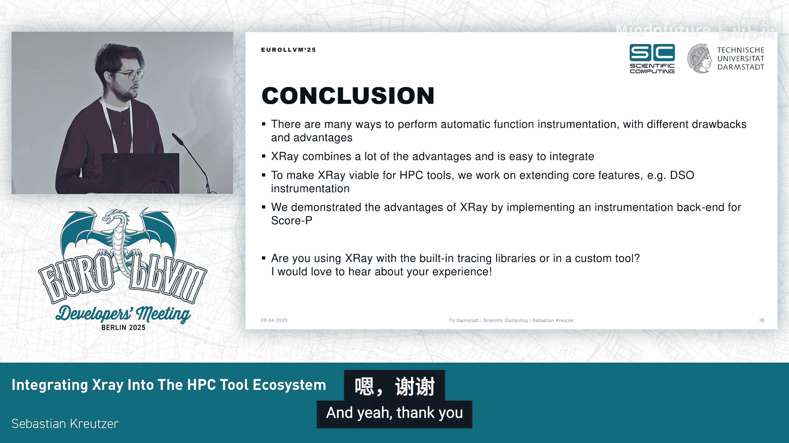

# 006：将 XRay 集成到 HPC 工具生态系统中


## 概述

在本教程中，我们将学习 LLVM XRay 的基本概念、它在高性能计算（HPC）性能分析工具中的应用，以及如何将其作为第三方工具进行集成。我们将探讨 XRay 的混合插桩技术、其优势、当前工具的局限性，以及未来的改进方向。

---

## XRay 简介 🧐

XRay 是 LLVM 编译器工具链中的一个集成追踪器。它采用了一种混合插桩方法，在编译时插入静态的、可运行时修补的探针点，从而实现选择性追踪。

XRay 包含几个核心组件：插桩机制本身、一个带有内置追踪器的运行时库，以及用于转换和分析收集数据的工具。它最初由 Google 开发，用于生产环境中的性能调试。

## 插桩机制详解 ⚙️

上一节我们介绍了 XRay 的基本概念，本节中我们来看看其核心的插桩机制是如何工作的。

XRay 采用了一种有趣的混合静态-动态方法。它在编译时插入称为“雪橇”的指令序列，这些序列由空操作组成。在运行时，可以通过将这些“雪橇”替换为对性能分析处理器的调用来动态激活追踪。

以下是一个代码示例，展示了 `main` 函数入口处被插入的“雪橇”：

```assembly
main:
    nop
    nop
    nop
    ... ; 其他指令
```

当运行时进行修补后，XRay 运行时会插入一个调用，传递唯一的函数标识符给追踪函数，从而调用运行时库。

这种机制带来了几个关键优势：
*   **近乎零开销**：当“雪橇”未被激活时，对性能几乎没有影响。
*   **非侵入性**：与完全动态的二进制插桩相比，它不需要重新排序或重新编译二进制文件。
*   **线程安全与快速**：修补操作是线程安全的且速度很快，可以在程序运行的任何时刻进行。

## HPC 性能分析工具的现状 🛠️

了解了 XRay 的原理后，我们来看看当前 HPC 领域主流性能分析工具是如何处理插桩的。

以下是几个代表性工具及其特点：
*   **Score-P 和 TAU**：广泛使用的性能分析和追踪工具。
*   **HPCToolkit**：用于收集高层级性能指标的自然工具。
*   这些工具都支持 MPI、OpenMP 等并行编程模型。

对于 MPI 和 OpenMP，存在 PMPI 和 OMPT 等标准化或半标准化的插桩接口。然而，对于通用区域的插桩，情况则更为复杂。

许多工具历史上（甚至现在）依赖于编译器的 `-finstrument-functions` 标志。该标志会在每个函数的入口和出口点插入性能分析探针。虽然被大多数编译器支持，但它存在显著缺点：
*   **控制有限**：通常会插桩所有函数。
*   **高开销**：即使进行动态过滤，调用处理器本身的开销依然存在。

## 现有解决方案与 XRay 的潜力 💡

面对 `-finstrument-functions` 的局限性，不同工具提出了自己的解决方案。

例如，Score-P 为 GCC 和 LLVM 开发了自定义编译器插件，在调用点进行快速动态过滤，显著降低了开销。也有一些工具使用完全的动态二进制插桩，但这可能有些“杀鸡用牛刀”，且容易出错。

此外，这些工具通常也提供手动插桩 API。

那么，编译器能否提供更好的基础设施呢？LLVM 已经为内部工具提供了 XRay，并且它也可以被第三方工具使用。因此，我们可以思考：**能否用 XRay 作为 `-finstrument-functions` 的更强大替代品？**

重申 XRay 的优势：快速的动态调整、未激活时的低开销，以及无需巨大集成努力即可获得这些好处。本质上，**XRay 可以看作是“`-finstrument-functions` 的增强版”**。

## XRay 的挑战与改进方向 🚀

既然 XRay 如此优秀，为何目前几乎没有工具使用它呢？

原因主要有两方面：
1.  许多工具在 XRay 出现之前就已开发，依赖于基础接口或自建方案。
2.  XRay 作为第三方工具存在一些需要解决的缺陷和限制。

我个人认为 XRay 潜力巨大，并正在从两个方面推动改进：
1.  **增强核心能力**：例如，最近我们实现了对共享库的 XRay 插桩支持。
2.  **促进集成应用**：通过将其集成到现有工具中，展示其益处。

接下来，我们将更详细地探讨共享库支持和 Score-P 集成这两个具体方面。

## 共享库插桩支持 📚

我们最近将共享库插桩支持功能合并到了上游 LLVM，并在 LLVM 20 中可用。只需传递 `-fxray-instrument-shared` 标志即可。

其技术细节如下：在可执行文件中，XRay 运行时维护一个关于可修补函数的列表。在共享库中，一个小的运行时组件会在库加载时向主运行时注册，告知其可用的“雪橇”和地址。

基于加载顺序，每个动态库对象获得一个动态 ID。我们使用这个动态对象 ID 和静态函数 ID 组合成一个“打包 ID”，以唯一标识整个应用程序中的每个函数。

修补过程类似，主要区别在于主运行时会遍历所有已注册的对象并进行修补。目前该功能支持 X86 和 RISC-V 架构。

## Score-P 中的 XRay 后端集成 🔌

我们已将 XRay 后端集成到 Score-P 中，代码已在 GitHub 上可用。使用起来很简单，只需传递一个标志即可自动启用。

我们通过评估来回答一个问题：**这个 XRay 后端与高度优化的、工具特定的静态解决方案相比如何？**

我们将其与 Score-P 的 Clang/GCC 插件进行了比较。这些插件是经过打磨的解决方案，嵌入了区域信息，并在调用点进行快速动态过滤。

我们观察了 SPEC 和 LULESH 等多个基准测试。在一个动态过滤的配置中，XRay 至少与静态插件性能相当，有时更优。在完全过滤（即无任何追踪）的配置下，XRay 没有可测量的开销，而静态插件仍有高达 6% 的开销。**这 0% 的开销允许使用同一个二进制文件进行性能分析和生产运行，极大地简化了工作流程。**

## 未来工作：提升插桩灵活性 🔮

为了使 XRay 成为第三方工具的通用后端，需要提升其灵活性。目前，XRay 仅支持在函数级别插入调用点。

可能的扩展方向包括：
*   允许通用区域插桩，例如通过 `-fxray-instrument-loops` 标志支持循环插桩。
*   建立一个更好的系统，允许通过内部函数在 LLVM IR 中放置测量点，然后将其转换为工具可以测量的区域。

## 总结

本节课中，我们一起学习了 LLVM XRay 的核心概念及其混合插桩机制。我们探讨了当前 HPC 性能分析工具在插桩方面面临的挑战，以及 XRay 如何作为一个高性能、低开销的替代方案。我们详细介绍了新加入的共享库插桩支持，以及 XRay 在 Score-P 工具中的集成效果和性能表现。最后，我们展望了未来通过提升插桩灵活性，使 XRay 成为更强大通用后端的可能性。





