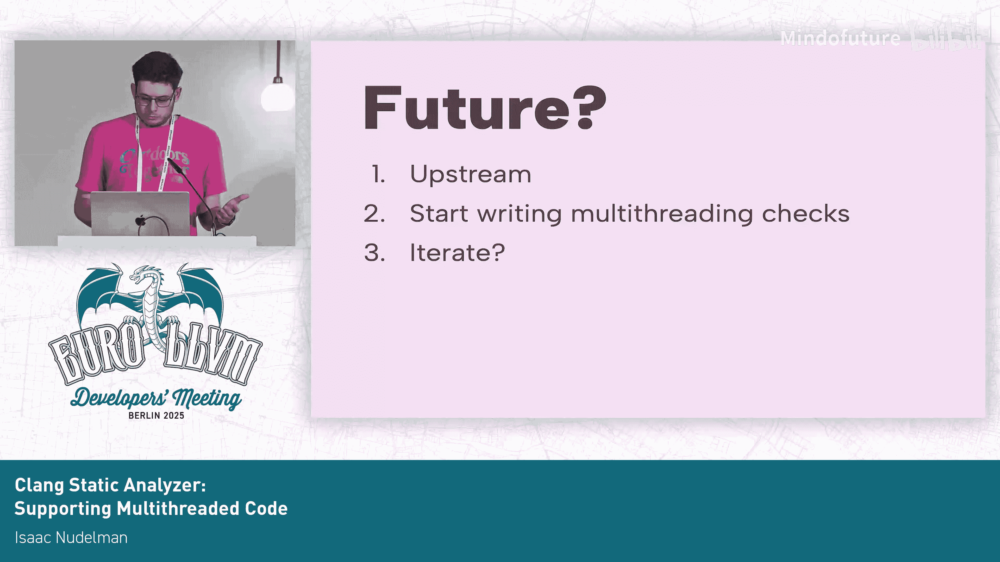

# 007：支持多线程代码 🧵


## 概述
在本节课中，我们将要学习如何扩展Clang静态分析器，使其能够分析多线程代码。我们将探讨当前分析器在处理多线程代码时的局限性，并介绍一种通过内联线程函数来合并程序状态图的方法，从而让现有的检查器能够跨线程边界发现错误。

---

## 当前面临的挑战 🚧

上一节我们概述了目标，本节中我们来看看当前静态分析器在处理多线程代码时遇到的主要障碍。

静态分析器会遍历代码，并为程序的所有可能状态（包括变量和内存）构建一个状态图。当遇到多线程代码时，分析器会分别访问父线程和子线程的代码。但问题在于，它会为每个线程创建独立的状态图。每个线程的状态被隔离在自己的图中。如果我们只有完全分离的线程图且无法连接它们，就无法开始进行跨线程分析。

---

## 我们的解决方案：合并状态图 🔗

既然我们知道了问题所在，本节中我们将探讨如何连接这些分离的线程状态图。

我们的目标很简单：合并两个独立的图。我们有一个强大的工具：我们可以将线程执行的函数内联到调用点。这样，我们就合并了状态图，现在所有的程序状态都统一了，所有现有的检查器无需修改就能正常工作。

以下是实现这一目标的核心思路：
```cpp
// 伪代码：在线程创建点，内联线程函数
inlineThreadFunction(thread_func, user_data) {
    // 创建代表内联函数调用的表达式
    CallExpr *CE = createCallExpr(thread_func, user_data);
    // 在分析器中执行内联，合并控制流图
    analyzer.inlineCall(CE);
}
```

---

## 实现尝试与演进 🛠️

上一节我们提出了解决方案，本节中我们来看看具体的实现尝试和遇到的挑战。

我们的第一次尝试是将其实现为一个“建模检查器”。我们尝试封装所有平台特定的状态并对其进行建模。这适用于像Pthreads这样的常见线程库。我们提取所有参数，然后尝试内联函数。但我们遇到了障碍：内联功能并不真正对检查器可用，它被限制在分析器核心部分。更重要的是，检查器的设计初衷并不是用来影响符号执行的控制流的。

因此，我们需要重新思考。我们的第二次尝试是直接将代码放入分析器核心。我们添加了一个配置标志让用户选择启用，然后基本上复制了之前的代码。问题在于代码应该放在哪里？我们将其放在了检查器原本会进行评估的地方。我们有一个默认的函数调用评估步骤，在那里进行内联，然后尝试分派给各个检查器。我们就把代码放在那里。

---

## 测试与结果 📊

在实现了核心机制之后，我们需要验证它是否有效。以下是我们的测试方法：

我们使用LLVM的集成测试框架来检查分析器的内部状态。我们可以通过一个简单的例子来展示我们确实内联了代码。

在初步测试之后，我们开始尝试更复杂的例子。我们添加了一些小错误，并展示我们能够使现有的检查器跨线程边界检测到这些错误。

我们测试了以下类型的检查器：
*   释放后使用
*   空指针解引用
*   污点分析
*   大多数核心的未初始化值检查

完成了这些小规模测试后，我们需要在真实代码上进行测试。首先，我们尝试在MC上测试，它导致了一次崩溃，但不幸的是，崩溃发生在我们的代码中，而不是MC中。修复了这个bug之后，在真实世界代码的测试中，我们没有发现更多错误。

---

## 发现与未来方向 🧭

经过测试，我们得到了以下发现：

我们没有看到显著的差异。这是一个好迹象，意味着我们没有丢失分析结果。我们也没有看到有意义的性能开销，尽管这里有一个重要的警告：我没有时间对此进行适当的性能分析，所以在某些极端情况下可能会遇到性能瓶颈，但在常见情况下，差异可以忽略不计。



我们确实证明了我们可以发现真实的错误。例如，我们以LZ4为例，在其线程池代码中，我们移除了一个空指针检查，并在线程初始化时插入了一个空指针，分析器成功发现了它。

但总的来说，在开源代码中，这不会发现太多有趣的错误，因为现实情况下，你主要看到的是初始化代码，而这部分通常很容易测试，问题也容易被发现。不过，这是一个很好的起点，在某些特定情况和平台上，你肯定能够发现很多有趣的问题。

从这里出发，我们的目标是将此功能上游化到主代码库，以此作为进行多线程分析工作的起点。之后，我们可以实现更好的分析和更复杂的检查。一旦上游化完成，我们希望开始编写更多的多线程检查，建模更多内容，并以此驱动未来的发展方向，而不是一开始就试图实现所有高级功能。

---

## 总结

本节课中我们一起学习了如何扩展Clang静态分析器以支持多线程代码分析。我们了解了当前分析器因线程状态图分离而无法进行跨线程分析的局限性。我们提出的解决方案是在线程创建点内联线程函数，从而合并父线程和子线程的状态图。我们探讨了将该功能实现为检查器或集成到分析器核心的尝试，并展示了该方法能够使现有检查器跨线程检测错误。虽然在实际代码中发现的重大错误有限，但这为未来更强大的多线程静态分析奠定了坚实的基础。