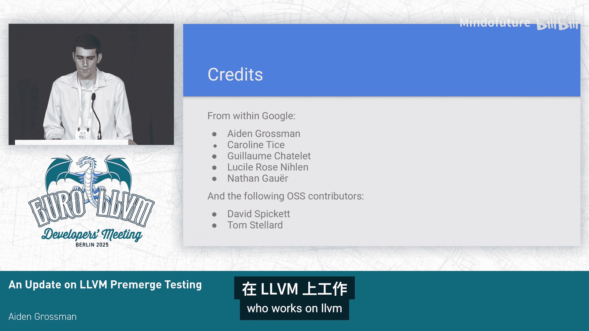
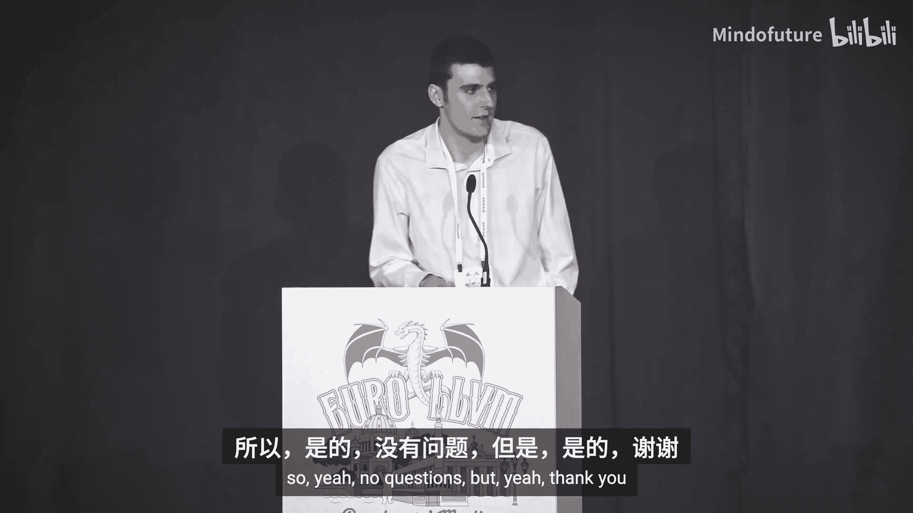

# 010：新预合并系统详解

在本节课程中，我们将详细介绍LLVM项目正在开发的新预合并（pre-merge）系统。该系统旨在解决现有系统在队列时间、资源利用率和稳定性方面的问题，并引入一系列改进措施。

## 🏗️ 系统现状与并行测试

目前，新系统正处于测试阶段。为了确保稳定性，新旧两套系统正在并行运行。

*   **旧系统**：基于 Buildkite 平台运行。
*   **新系统**：基于 GitHub Actions 平台运行，目前处于测试状态。

如果你最近提交过拉取请求（PR），可能会看到 Buildkite 的检查项，其下方还会有标记为“测试专用，请忽略结果”的 GitHub Actions 检查项。这种并行运行模式主要用于测试新基础设施的稳定性。目前，新系统将所有任务标记为“通过”，以避免在系统尚不稳定时因基础设施故障向开发者发送大量失败通知邮件。

## 🎯 新系统的核心特性与改进

上一节我们介绍了新系统的测试现状，本节中我们来看看新系统旨在实现的核心特性和改进。

新版本基础设施有几个我们认为特别重要的特性：

1.  **自动扩缩容**：这是最重要的改进。新系统可以根据需求动态调整可用机器数量。在固定预算内，我们可以将资源集中在高峰时段（通常是欧洲和太平洋工作日的开始时间以及太平洋时间的大部分工作时间）使用。这能显著降低任务延迟，并更有效地利用资源。相比之下，当前的预合并系统全天候运行大量机器，资源利用率不高。
2.  **组织架构支持**：新系统在组织层面也有两大改进。
    *   **建立待命轮值制度**：设立待命（on-call）轮值，在工作时间提供支持。
    *   **配备专职工程人员**：安排专职工程人员进行系统维护和改进。这是当前系统所缺乏的，过去一两年基本处于无人维护状态，导致了一些问题。专职的维护流程将有助于未来系统的平稳运行。

## 📊 监控、告警与脚本优化

为了保障新系统的运行，我们建立了监控体系并对核心脚本进行了优化。

我们有一个公开的 Grafana 仪表板，用于展示关键指标。你可以在 LLVM 的 `pre-merge` 目录下找到链接。这些指标包括过去社区非常关心的队列时间、运行时间，未来还可能包括失败率（高失败率通常意味着基础设施问题）以及主线构建失败情况。这些指标与告警系统联动，如果队列时间激增或出现其他基础设施问题，告警会触发并在工作时间内通知相关人员进行调查。

此外，大部分改进同时影响了新旧系统，因为它们运行着相同的 Shell 脚本。以下是已完成的一项主要改进：

*   **任务计算脚本重构**：预合并系统有一个复杂的任务计算脚本，用于根据更改的文件决定需要测试哪些项目（基本上是测试被改动的项目及其依赖项）。该脚本原是一个难以理解的 Shell 脚本，近期已被重写，现在它经过了单元测试，可读性和可维护性都更好了。围绕它还进行了许多其他杂项改进。

## 🔮 未来探索方向

除了已实现的改进，团队还在探索以下几个方向以进一步提升系统性能：

1.  **优化节点与容器启动时间**：在使用自动扩缩容时，如果需要启动新的 Windows 节点来运行工作流，可能会有大约15分钟的延迟。我们正在研究如何改善这一点，这在非高峰时段需要启动新节点时尤为重要。
2.  **提供复现指南**：过去的一个痛点是难以在本地复现预合并检查的失败以进行调试。由于所有任务都在容器中运行，我们可以编写非常精确的指南，指导如何在大多数机器上复现这些问题。
3.  **加速 Windows 工具链**：旨在降低 Windows 预合并检查的延迟，特别是在编译器缓存未充分预热的情况下。

## 🚀 正式启动计划与社区决策

关于新系统的正式启动，其含义是使新系统具有权威性。具体来说，我们将不再忽略新系统的失败结果，而是会将其作为真正的失败状态报告给 GitHub，并同时关闭旧的预合并基础设施。

此外，近期出现了一个关于预合并延迟与测试覆盖率的讨论。随着项目增加，需要在两者之间做出权衡。更多的测试覆盖率固然好，但会导致预合并任务延迟增加。谷歌的目标是提供一个高可靠性、高性能的系统，但关于延迟与测试彻底性之间的权衡，我们希望最终由社区决定。目前的处理方式是，通常通过 PR 讨论达成共识。如果出现争议，我们将把覆盖范围的决策权交给 LLVM 治理机构，即基础设施领域的负责人。

## 🤝 贡献者致谢

这个项目的推进离不开许多贡献者的努力。在谷歌内部，Caroline、Lucil 和 Nathan 都做出了重要贡献。在开源社区方面，David Biot 和 Tom Stard 在评审大量补丁等方面提供了极大帮助。当然，还有许多其他社区成员也参与了贡献。我们希望继续推进这项工作，使其成为对所有 LLVM 贡献者都高效可用的系统。

本节课中我们一起学习了LLVM新预合并系统的设计目标、当前状态、核心改进、监控手段、未来规划以及启动策略。新系统通过自动扩缩容、强化组织支持和改进工具链，致力于为开发者提供更快速、更稳定的代码合并前检查体验。